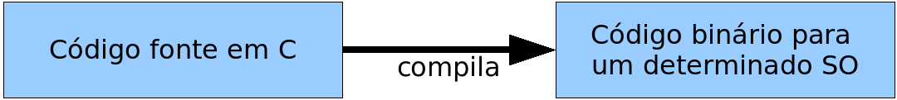
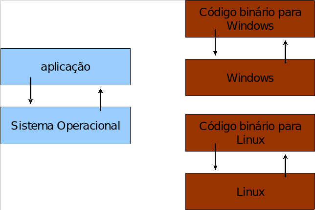
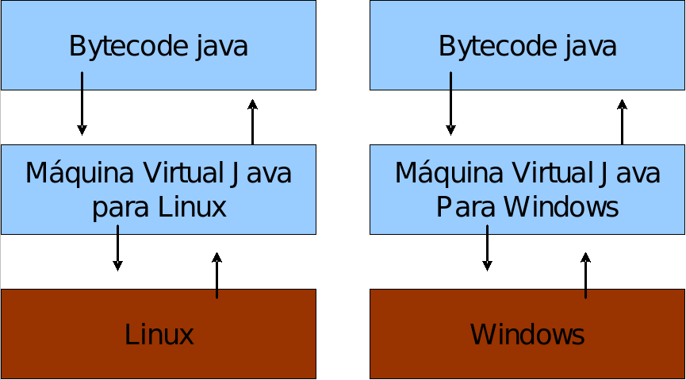
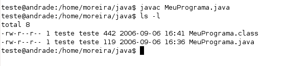
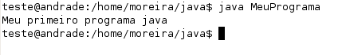

# O que é Java

_"Computadores são inúteis, eles apenas dão respostas." -- Picasso_

Chegou a hora de responder às perguntas mais básicas sobre Java. Ao término deste capítulo, você
será capaz de:

- Responder o que é Java;
- Mostrar as vantagens e desvantagens do Java;
- Entender bem o conceito de máquina virtual;
- Compilar e executar um programa simples.

<!--@todo Melhorar isso aqui e deixar mais próximo ao capítulo 1 do FJ-91 -->

<!--@note
* Diferente dos cursos comuns, o nosso capítulo de introdução é fundamental e deve gerar uma discussão
sadia entre os alunos.

* Ponto fundamental: JVM é uma especificação. Existem várias

* versões do Java, compatibilidade dos .class entre diferentes JVMs.

* Java não serve para todo tipo de tarefa. Algumas linguagens podem ser melhores em alguns casos.

* Java é produtivo para uma aplicação que não é minúscula e, em especial, se envolve
mais de um programador, porque programar OO vai-lhe dar menos custo de manutenção. Isso
definitivamente não quer dizer que é mais rápido programar uma telinha de cadastro em Java
do que em outras linguagens. Muito pelo contrário, você terá mais trabalho para economizar *depois*.

* Vamos utilizar editor simples de texto para se acostumar com erros de sintaxe.

------------------

Responder basicamente às seguintes perguntas:
- O que é Java?
- Quais as vantagens em relação às linguagens que já existem?

Nesse ponto, o lado técnico é levemente deixado de lado, pois troca-se pelo lado marketeiro. Lembrar de frases
clássicas como Write Once, Run Everywhere.

Contar a história básica do Java e a evolução da linguagem. A tabela abaixo ajuda a relembrar:

1995 – Java 1.0
1997 – Java 1.1
1998 – Java2 1.2 (HotSpot)
1999 – Java2 1.3
2001 – Java2 1.4
2004 – Java2 5.0
2006 – Java 6
2011 – Java 7
2014 – Java 8
2016 – Java 9 (Previsão)

* Explicar JIT (Just In Time) e Hotspot (pontos quentes das classes), além da diferença entre
compilação estática (GCC e VB) e a compilação dinâmica.

* Antes de apresentar o que é a JVM, esclarecer o conceito de máquina virtual. Bons exemplos podem
ser dados explicando programas feitos para videocassetes. O que acontece com o assembly quando mudamos o hardware?

Explicar o que é:

* JVM: uma especificação (.Net passou a sê-lo também), e não um programa. Como a Sun ganha dinheiro com Java? Comentar as implementações da Bea (JRocket) e da IBM (J9);
* JRE: Runtime.
* JDK: Runtime + compilador e outras ferramentas de desenvolvimento (Javadoc, javap, etc.).
* Java EE: apenas comentar o que é e deixar claro que está fora do escopo desse curso.


Acabar o capítulo por volta das 10h40 da manhã (para cursos noturnos, no intervalo).
-->

## Java

Entender um pouco da história da plataforma Java é essencial para enxergar os motivos que
a levaram ao sucesso.

Quais eram os seus maiores problemas quando se programava na década de 1990?

*Ponteiros?
*Gerenciamento de memória?
*Organização?
*Falta de bibliotecas?
*Ter de reescrever parte do código ao mudar de sistema operacional?
*Custo financeiro de usar a tecnologia?

A linguagem Java resolve bem esses problemas que, até então, apareciam com frequência nas outras
linguagens. Alguns desses problemas foram particularmente atacados, porque uma das grandes motivações
para a criação da plataforma Java era de que essa linguagem fosse usada em pequenos dispositivos,
como TVs, videocassetes, aspiradores, liquidificadores e outros. Apesar disso, a linguagem teve seu lançamento
focado no uso em clientes web (browsers) para rodar pequenas aplicações (**applets**). Hoje em
dia, esse não é o grande mercado do Java, embora tenha sido idealizado com um propósito e lançado com outro,
o Java ganhou destaque no lado do servidor.

O Java foi criado pela antiga Sun Microsystems e mantido por meio de um comitê (http://www.jcp.org).
Seu site principal era o
java.sun.com, e o java.com era um site mais institucional voltado ao consumidor de produtos e
usuários leigos não desenvolvedores. Com a compra da Sun pela Oracle em 2009, muitas URLs e nomes
têm sido trocados para refletir a marca da Oracle. A página principal do Java é:
http://www.oracle.com/technetwork/java/

No Brasil, diversos grupos de usuários se formaram para tentar disseminar o conhecimento da
linguagem. Um deles é o **GUJ** (http://www.guj.com.br), uma comunidade virtual com artigos, tutoriais
e fórum para tirar dúvidas, este sendo o maior em língua portuguesa, com mais de cem mil usuários e um milhão
de mensagens.

Encorajamos todos os alunos a usarem muito os fóruns do GUJ, pois é uma das melhores maneiras a fim de
achar soluções para pequenos problemas que acontecem com grande frequência.

## Uma breve história do Java

A Sun criou um time (conhecido como Green Team) para desenvolver inovações tecnológicas em 1992.
Essa equipe foi liderada por James Gosling, considerado o pai do Java. O grupo teve a ideia de
criar um interpretador (já era uma máquina virtual, e veremos o que é isso mais à frente) para
pequenos dispositivos, facilitando a reescrita de software para aparelhos eletrônicos, como videocassete, televisão e aparelhos de TV a cabo.

A ideia não deu certo. Tentaram fechar diversos contratos com grandes fabricantes de eletrônicos,
como a Panasonic, mas não houve êxito devido ao conflito de interesses e custos. Hoje, sabemos que o Java
domina o mercado de aplicações para celulares com mais de 2.5 bilhões de dispositivos compatíveis.
Porém, em 1994, ainda era muito cedo para isso.

Com o advento da web, a Sun percebeu que poderia utilizar a ideia criada em 1992 para
rodar pequenas aplicações dentro do browser. A semelhança era que, na internet, havia uma grande
quantidade de sistemas operacionais e browsers e, com isso, seria uma grande vantagem poder programar
em uma única linguagem, independente da plataforma. Foi aí que o Java 1.0 foi lançado: focado em
transformar o browser de apenas um cliente magro (_thin client_ ou terminal burro) em uma
aplicação que possa também realizar operações avançadas, e não apenas renderizar HTML.

Os applets deixaram de ser o foco da Sun, e a Oracle nunca teve interesse nisso. É curioso notar
que a tecnologia Java nasceu com um objetivo em mente e foi lançada com outro. Mas no final,
decolou mesmo no desenvolvimento de aplicações do lado do servidor. Sorte? Há, hoje, o Java FX
tentando dar força para o Java não só no desktop, mas como em aplicações ricas na web. Entretanto, muitos
não acreditam que haja espaço para tal, considerando o destino de tecnologias como Adobe Flex
e Microsoft Silverlight.

Você pode ler a história da linguagem Java em:
http://www.java.com/en/javahistory/

E um vídeo interessante:
http://tinyurl.com/histjava

Em 2009, a Oracle comprou a Sun, fortalecendo a marca. A Oracle sempre foi, junto à IBM, uma
das empresas que mais investiram e fizeram negócios por meio do uso da plataforma Java. Em 2014,
surge a versão Java 8 com mudanças interessantes na linguagem.

## Máquina Virtual

Em uma linguagem de programação como C e Pascal, temos a seguinte situação quando vamos compilar um
programa:



O código fonte é compilado para código de máquina específico de uma plataforma e sistema operacional.
Muitas vezes, o próprio código fonte é desenvolvido visando uma única plataforma!

Esse código executável (binário) resultante será exercido pelo sistema operacional e, por esse
motivo, ele deve saber conversar com o sistema operacional em questão.



Isto é, temos um código executável para cada sistema operacional. É necessário compilar uma vez
para Windows, outra para o Linux e assim por diante caso queiramos que esse nosso software
seja utilizado em várias plataformas. Esse é o cenário de aplicativos como o OpenOffice, Firefox
e outros.

Como foi dito anteriormente, na maioria das vezes, a sua aplicação se vale das bibliotecas do
sistema operacional, por exemplo, a de interface gráfica para desenhar as telas. A
biblioteca de interface gráfica do Windows é bem diferente das do Linux: como criar, então,
uma aplicação que rode de forma parecida nos dois sistemas operacionais?

Precisamos reescrever um mesmo pedaço da aplicação para diferentes sistemas operacionais, já que
eles não são compatíveis.

<!--@note
Apesar de cross-plataform ser algo muito legal para JVM, isso, certamente, já não é um grande
chamariz. Porém, ter esse bytecode bem definido ajudou o Java a ganhar vários mercados, como
o dos dispositivos pequenos e móveis.
-->

Já o Java utiliza o conceito de **máquina virtual**, no qual existe, entre o sistema operacional
e a aplicação, uma camada extra responsável por traduzir – mas não apenas isso – o que sua
aplicação deseja fazer para as respectivas chamadas do sistema operacional em que ela está rodando
no momento:



Dessa forma, a maneira em que se abre uma janela no Linux ou no Windows é a mesma: você
ganha independência de sistema operacional. Ou, melhor ainda, independência de plataforma em geral:
não é preciso se preocupar em qual sistema operacional sua aplicação está rodando nem em que tipo
de máquina, configurações, etc.

Repare que uma máquina virtual é um conceito bem mais amplo que o de um interpretador. Como o
próprio nome diz, uma máquina virtual é como um computador de mentira: apresenta tudo o que um computador
tem. Em outras palavras, ela é responsável por gerenciar memória, Threads, a pilha de execução, etc.

Sua aplicação roda sem nenhum envolvimento com o sistema operacional, sempre conversando apenas
com a **Java Virtual Machine** (JVM).

Essa característica é interessante: como tudo passa pela JVM, ela pode tirar métricas, decidir
em qual lugar é melhor alocar a memória, além de isolar totalmente a aplicação do sistema
operacional. Se uma Java Virtual Machine termina abruptamente, só as aplicações que estavam rodando nela irão
terminar: isso não afetará outras JVMs que estejam rodando no mesmo computador nem o
sistema operacional.

Essa camada de isolamento também é interessante quando pensamos em um servidor que não pode se
sujeitar a rodar código que possa interferir na boa execução de outras aplicações.

Essa camada, a máquina virtual, não entende código Java, mas compreende um código de máquina
específico. Esse código de máquina é gerado por um compilador Java, como o **javac**, e é
conhecido por "**bytecode**", pois existem menos de 256 códigos de operação dessa linguagem, e cada
opcode gasta um byte. O compilador Java gera esse bytecode que,
diferente das linguagens sem máquina virtual, servirá para diferentes sistemas operacionais,
já que ele será traduzido pela JVM.

> **Write once, run anywhere**
>
> Esse era um slogan que a Sun usava para o Java, já que você não precisa reescrever partes da sua
> aplicação toda vez que quiser mudar de sistema operacional.

<!-- Comentário para separar quotes adjacentes. -->

## Java lento? Hotspot e JIT

_Hotspot_ é a tecnologia que a JVM utiliza para detectar _pontos quentes_ da sua aplicação:
código que é executado muito provavelmente dentro de um ou mais loops. Quando a JVM julgar
necessário, ela vai **compilar** esses códigos para instruções realmente nativas da plataforma, tendo em vista
que isso irá provavelmente melhorar a performance da sua aplicação. Esse compilador é o _JIT:
Just inTime Compiler_, que aparece bem na hora em que precisa.

Você pode pensar então: por que a JVM não compila tudo antes de executar a aplicação? É que,
teoricamente, compilar de forma dinâmica, na medida do necessário, pode gerar uma performance melhor.
O motivo é simples: imagine um .exe gerado pelo VisualBasic, gcc ou  Delphi. Ele é
estático e já foi otimizado com base em heurísticas. O compilador pode ter tomado uma decisão
não tão boa.

Já a JVM, por estar compilando dinamicamente durante a execução, pode perceber que um determinado
código não está com a performance adequada e otimizar mais um pouco aquele trecho ou ainda mudar a
estratégia de otimização. É por esse motivo que as JVMs mais recentes,
em alguns casos, chegam a ganhar de códigos C compilados com o GCC 3.x.

## Versões do Java e a confusão do Java2

Java 1.0 e 1.1 são versões muito antigas do Java, mas já forneciam bibliotecas importantes,
como o JDBC e o java.io.

Com o Java 1.2, houve um aumento grande no tamanho da API, e foi nesse momento em que trocaram a
nomenclatura de Java para Java2 com o objetivo de diminuir a confusão que havia entre Java e Javascript.
Mas lembre-se: não há versão Java 2.0. O 2 foi incorporado ao nome, tornando-se Java2 1.2.

Depois vieram o Java2 1.3 e o 1.4. O Java 1.5 passou a se chamar Java 5 por uma questão de
marketing e porque mudanças significativas na linguagem foram incluídas. É, nesse momento, que o 2
do nome Java desaparece. Repare que para fins de desenvolvimento, o Java 5 ainda é referido como
Java 1.5.

Hoje, a última versão disponível do Java é a 8.

## JVM? JRE? JDK? O que devo baixar?

O que gostaríamos de baixar no site da Oracle?

- JVM: apenas a virtual machine. Esse download não existe, pois ela sempre vem acompanhada.
- JRE: **Java Runtime Environment**. Ambiente de execução Java, formado pela JVM e bibliotecas, tudo
  que você precisa para executar uma aplicação Java. Mas precisamos de mais.
- JDK: **Java Development Kit**. Nós, desenvolvedores, faremos o download do JDK do Java SE (Standard Edition).
  Ele é formado pela JRE somado às ferramentas como o compilador.

Tanto o JRE quanto o JDK podem ser baixados do site http://www.oracle.com/technetwork/java/.
Para encontrá-los, acesse o link Java SE dentro dos top downloads. Consulte o apêndice de instalação
do JDK para mais informações.

## Onde usar, e os objetivos do Java

No decorrer do curso, você pode achar que o Java tem menor produtividade quando comparado com
a linguagem que está acostumado.

É preciso ficar claro que a premissa do Java não é a de criar sistemas pequenos nos quais temos
um ou dois desenvolvedores mais rapidamente que linguagens do tipo PHP, Perl e outras.

O foco da plataforma é outro: aplicações de _médio a grande porte_, em que o time de desenvolvedores
tem _várias pessoas_ e sempre pode vir a _mudar_ e _crescer_. Não tenha dúvidas que criar a primeira
versão de uma aplicação usando Java, mesmo utilizando IDEs e ferramentas poderosas, será mais
trabalhoso que muitas linguagens script ou de alta produtividade. Porém, com uma linguagem
orientada a objetos e madura como o Java, será extremamente mais fácil e rápido fazer alterações
no sistema desde que você siga as boas práticas e recomendações sobre _design_ orientado a objetos.

Além disso, a quantidade enorme de bibliotecas gratuitas para realizar os mais diversos trabalhos
(tais como os relatórios, os gráficos, os sistemas de busca, a geração de código de barra, a manipulação de XML,
os tocadores de vídeo, os manipuladores de texto, a persistência transparente, a impressão, etc.) é um ponto
fortíssimo para adoção do Java: você pode criar uma aplicação sofisticada usando diversos recursos
sem precisar comprar um componente específico, que costuma ser caro. O ecossistema do Java é enorme.

Cada linguagem tem seu espaço e seu melhor uso. A utilização do Java é interessante em aplicações que
 crescerão, nas quais a legibilidade do código é importante e temos muita conectividade, além de
serem compatíveis com muitas plataformas (ambientes e sistemas operacionais) heterogêneas (Linux, Unix, OSX e Windows,
misturados).

Você pode ver isso pela grande quantidade de ofertas de emprego procurando desenvolvedores Java
para trabalhar com sistemas web e aplicações de integração no servidor.

Apesar disso, a Sun se empenhou em tentar popularizar o uso do Java em aplicações desktop, mesmo
com o fraco marketshare do Swing/AWT/SWT em relação às tecnologias concorrentes (em especial
Microsoft .NET). A atual tentativa é o Java FX, no qual a Oracle tem investido bastante.

## Especificação versus implementação

Outro ponto importante: quando falamos de Java Virtual Machine, estamos falando de uma especificação.
Ela diz como o bytecode deve ser interpretado pela JVM. Quando fazemos o download no site da Oracle,
o que vem junto é a Oracle JVM. Em outras palavras, existem outras JVMs disponíveis, como a JRockit
da BEA (também adquirida pela Oracle), a J9 da IBM, entre outras.

Esse é outro ponto interessante para as empresas. Caso não estejam gostando de algum detalhe da
JVM da Oracle ou prefiram trabalhar com outra empresa pagando por suporte, elas podem trocar de JVM
com a garantia absoluta de que todo o sistema continuará funcionando. Isso porque toda JVM
deve ser certificada pela Oracle, provando a sua compatibilidade. Não há sequer necessidade de recompilar nenhuma
de suas classes.

Além de independência de hardware e sistema operacional, você tem a independência de _vendor_ (fabricante):
graças à ideia da JVM ser uma especificação, e não um software.

## Como o FJ-11 está organizado

Java é uma linguagem simples: existem poucas regras muito bem definidas.

Porém, quebrar o paradigma procedural para mergulhar na orientação a objetos não é simples; quebrá-lo e ganhar fluência com a linguagem e API são os objetivos do FJ-11.

O começo pode ser um pouco frustrante: exemplos simples, controle de fluxo com o `if`, `for`,
`while` e criação de pequenos programas que nem ao menos captam dados do teclado. Apesar de isso
tudo ser necessário, é só nos 20% finais do curso em que utilizaremos bibliotecas para, no
final, criarmos um chat entre duas máquinas que transferem Strings por TCP/IP. Nesse ponto, teremos
tudo que é preciso para entender completamente como a API funciona, quem estende quem e o porquê.

Depois desse capítulo no qual o Java, a JVM e os primeiros conceitos são passados, veremos os comandos
básicos do Java para controle de fluxo e utilização de variáveis do tipo primitivo. Criaremos
classes para testar esse pequeno aprendizado sem saber exatamente o que é uma classe. Isso
dificulta ainda mais a curva de aprendizado, porém cada conceito será introduzido no momento
considerado mais apropriado pelos instrutores.

Passamos para o capítulo de orientação a objetos básica, mostrando os problemas do paradigma
procedural e a necessidade de algo diferente para resolvê-los. Atributos, métodos, variáveis do tipo
referência e outros.

Os capítulos de modificadores de acesso, herança, classes abstratas e interfaces demonstram o
conceito fundamental que o curso quer passar: encapsule, exponha o mínimo de suas classes, foque
no que elas fazem e no relacionamento entre elas. Com um bom design, a codificação fica fácil, e a
modificação e expansão do sistema, também.

No decorrer desses capítulos, o Eclipse é introduzido de forma natural, evitando-se ao máximo wizards e menus, além de 
 mostrar os chamados _code assists_ e _quickfixes_. Isso faz com que o Eclipse trabalhe
de forma simbiótica com o desenvolvedor sem se intrometer e sem fazer mágica.

Pacotes, Javadoc, JARs e `java.lang` apresentam os últimos conceitos fundamentais do Java, dando toda
a fundação para, então, estudarmos as principais e mais utilizadas APIs do Java SE.

As APIs estudadas serão `java.util` e `java.io`. Todas elas usam e abusam dos conceitos vistos no
decorrer do curso, ajudando a sedimentá-los. Juntamente, temos os conceitos básicos do uso de
Threads e os problemas e perigos da programação concorrente quando dados são compartilhados.

Resumindo: o objetivo do curso é apresentar o Java ao mesmo tempo que os fundamentos da orientação
a objetos são introduzidos. Frisaremos sempre que o importante é como as classes
se relacionam e qual é o papel de cada uma, e não em como elas realizam as suas obrigações.
_Programe voltado à interface e não à implementação_.

## Compilando o primeiro programa

<!--@note
Escrever o primeiro código. Comece pelo miolo, pelo `System.out`, depois coloque o main e a classe
em volta (bottom up). Perguntas a serem feitas:

* Escrevi muito? (Interessante colocar um código em C para comparar o tamanho e assustar o pessoal.
Utilizar-se disso para impor a posição do instrutor.)
* Onde que eu vou programar?
* Explicar o primeiro programa. Importante não entrar em detalhes do Java em si, apenas explicar que começará a ser executado do main e o que acontecerá.
* Outro ponto importante: caso alguém pergunte, não é necessário colocar public antes da palavra-chave class.

Explicar um pouco da estrutura básica da sintaxe do Java.

* Blocos: {} (análogo a begin/end).
* Fim de statement: ; (análogo a Enter).
* Case sensitive: Java diferencia maiúsculas de minúsculas.
* Palavras-chaves: Existem pouco mais de 50, todas minúsculas.
-->

Vamos para o nosso primeiro código! O programa que imprime uma linha simples.

Para mostrar uma linha, podemos fazer:

```java
System.out.println("Minha primeira aplicação Java!");
```

Mas esse código não será aceito pelo compilador Java. O Java é uma linguagem
bastante burocrática e precisa de mais do que isso para iniciar uma execução.
Veremos os detalhes e os porquês durante os próximos capítulos. O mínimo que
precisaríamos escrever é algo como:

```java
class MeuPrograma {
	public static void main(String[] args) {
		System.out.println("Minha primeira aplicação Java!");
	}
}
```

> **Notação**
>
> Todos os códigos apresentados na apostila estão formatados com recursos visuais para auxiliar a
> sua leitura e compreensão. Quando for digitar os códigos no computador, trate-os
> como texto simples.
>
> A numeração das linhas **não** faz parte do código e não deve ser digitada; é apenas um recurso
> didático. O Java é case sensitive: tome cuidado com maiúsculas e minúsculas.

<!-- Comentário para separar quotes adjacentes. -->

Após digitar o código acima, grave-o como **MeuPrograma.java** em algum diretório. A fim de compilar, você
deve pedir para que o compilador de Java da Oracle, chamado `javac`, gere o bytecode correspondente ao
seu código Java.



Depois de compilar, o **bytecode** foi gerado. Quando o sistema operacional listar os arquivos
contidos no diretório atual, você verá que um arquivo **.class** foi gerado com o mesmo nome
da sua classe Java.

> **Assustado com o código?**
>
> Para quem já tem uma experiência com Java, esse primeiro código é muito simples. Mas se é seu
> primeiro código em Java, pode ser um pouco traumatizante. Não deixe de ler o prefácio do curso, que o
> deixará mais tranquilo em relação à curva de aprendizado da linguagem. Assim, você conhecerá como o curso está
> organizado.

<!-- Comentário para separar quotes adjacentes. -->

> **Preciso sempre programar usando o Notepad ou similar?**
>
> Não é necessário digitar sempre seu programa em um simples aplicativo como o Notepad. Você pode usar
> um editor que tenha **syntax highlighting** e outros benefícios.
>
> Mas, no começo, é interessante você usar algo que não tenha ferramentas para que possa se
> acostumar com os erros de compilação, sintaxe e outros. Depois do capítulo de polimorfismo e herança,
> sugerimos a utilização do Eclipse (http://www.eclipse.org), a IDE líder no mercado e gratuita.
> Existe um capítulo à parte para o uso do Eclipse nesta apostila.
>
> No Linux, recomendamos o uso do gedit, kate e vi. No Windows, você pode usar o Notepad++ ou o
> TextPad. No Mac, TextMate, Sublime ou mesmo o vi.

<!-- Comentário para separar quotes adjacentes. -->

## Executando seu primeiro programa

Os procedimentos para executar seu programa são muito simples. O javac é o compilador Java, e o
Java é o responsável por invocar a máquina virtual para interpretar o seu programa.



Ao executar, pode ser que a acentuação resultante saia errada devido a algumas configurações que
deixamos de fazer. Sem problemas.

## O que aconteceu?

```java
	class MeuPrograma {
		public static void main(String[] args) {

			// miolo do programa começa aqui!
			System.out.println("Minha primeira aplicação Java!!");
			// fim do miolo do programa

		}
	}
```

O miolo do programa é o que será executado quando chamamos a máquina virtual. Por enquanto, todas
as linhas anteriores, em que há a declaração de uma classe e a de um método, não nos importam
nesse momento.
Mas devemos saber que toda aplicação Java começa por um ponto de entrada, e este é
o método `main`.

Ainda não sabemos o que é método, mas veremos no capítulo 4. Até lá, não se preocupe com essas
declarações. Sempre que um exercício for feito, o código que nos importa sempre estará nesse miolo.

No caso do nosso código, a linha do `System.out.println` faz com que o conteúdo entre aspas seja
colocado na tela.

## Para saber mais: como é o bytecode?

<!--@note
Comentar do uso de Obfuscadores de código caso alguém fique com medo de engenharia reversa.
-->

O `MeuPrograma.class` gerado não é legível por seres humanos (não que seja impossível). Ele está
escrito no formato que a Virtual Machine sabe entender e o qual foi especificado que ela o entendesse.

É como um assembly escrito para essa máquina em específico. Podemos ler os mnemônicos utilizando
a ferramenta javap que acompanha o JDK:

`javap -c MeuPrograma`

E a saída:

```
MeuPrograma();
  Code:
   0:   aload_0
   1:   invokespecial   #1; //Method java/lang/Object."<init>":()V
   4:   return

public static void main(java.lang.String[]);
	Code:
	0:	getstatic	#2; //Field java/lang/System.out:Ljava/io/PrintStream;
	3:   ldc     #3; //String Minha primeira aplicação Java!!
	5:   invokevirtual   #4; //Method java/io/PrintStream.println:
								(Ljava/lang/String;)V
	8:   return

}
```

É o código acima que a JVM sabe ler. É o código de máquina da máquina virtual.

Um bytecode pode ser revertido para o .java original (com perda de comentários e nomes de
variáveis locais). Caso seu software vire um produto de prateleira, é fundamental
usar um ofuscador no seu código que irá embaralhar classes, métodos e
um monte de outros recursos (indicamos o http://proguard.sf.net).

## Exercícios: modificando o Hello World

1. Altere seu programa para imprimir uma mensagem diferente.
   <!--@answer
   ``` java
   		class MeuProgramaModificado {
   			public static void main(String[] args) {
   				// miolo do programa começa aqui!
   				System.out.println("Uma mensagem diferente.");
   				// fim do miolo do programa
   			}
   		}
   ```
   -->
1. Altere seu programa para imprimir duas linhas de texto usando duas linhas de código System.out.
   <!--@answer
   ``` java
   		class MeuProgramaModificado {
   			public static void main(String[] args) {
   				System.out.println("Uma mensagem.");
   				System.out.println("Outra mensagem.");
   			}
   		}
   ```
   -->
1. Sabendo que os caracteres `\n` representam uma quebra de linhas, imprima duas linhas de texto
   usando uma única linha de código `System.out`.

## O que pode dar errado?

Muitos erros podem ocorrer no momento em que você rodar seu primeiro código. Vejamos alguns deles:

Código:

```java
	class X {
		public static void main (String[] args) {
			System.out.println("Falta ponto e vírgula")
		}
	}
```

Erro:

```
X.java:4: ';' expected
        }
        ^
1 error
```

Esse é o erro de compilação mais comum: aquele em que um ponto e vírgula foi esquecido. Repare que
o compilador é explícito em dizer que a linha `4` é aquela com problemas. Outros erros
de compilação podem ocorrer se você escreveu palavras-chaves (as que colocamos em negrito) em
maiúsculas, esqueceu de abrir e fechar as `{}`, etc.

Durante a execução, outros erros podem aparecer:

- Se você declarar a classe como X, compilá-la e depois tentar usá-la com x minúsculo (java x), o
  Java o avisa:

```
Exception in thread "main" java.lang.NoClassDefFoundError:
										X (wrong name: x)
```

- Se tentar acessar uma classe no diretório ou classpath errado, ou se o nome estiver errado,
  ocorrerá o seguinte erro:

`Exception in thread "main" java.lang.NoClassDefFoundError: X`

- Se esquecer de colocar `static` ou o argumento `String[] args` no método `main`:

`Exception in thread "main" java.lang.NoSuchMethodError: main`

Por exemplo:

```java
	class X {
		public void main (String[] args) {
			System.out.println("Faltou o static, tente executar!");
		}
	}
```

- Se não colocar o método `main` como `public`:

`Main method not public.`

Por exemplo:

```java
	class X {
		static void main (String[] args) {
			System.out.println("Faltou o public");
		}
	}
```

## Um pouco mais...

- Procure um colega ou algum conhecido que esteja em um projeto Java. Descubra por que Java
  foi escolhido como tecnologia. O que é importante para esse projeto, e o que acabou fazendo
  do Java a melhor escolha?

## Exercícios opcionais

1. Um arquivo fonte Java deve sempre ter a extensão `.java` ou o compilador
   o rejeitará. Além disso, existem algumas outras regras na hora de dar o
   nome a um arquivo Java. Experimente gravar o código desse capítulo com
   `OutroNome.java` ou algo similar.

   Compile e verifique o nome do arquivo gerado. Como executar a sua aplicação?

   <!--@answer
   O arquivo `.class` gerado tem o nome da classe em si. Então, como
   o que executamos é a classe, para rodar, é preciso usar o nome do
   arquivo `.class` e não do `.java`:

   ```java NomeDaClasse```
   -->
