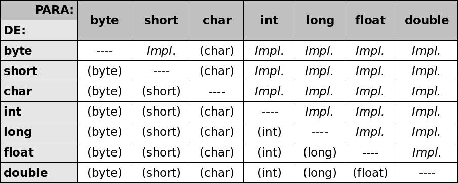
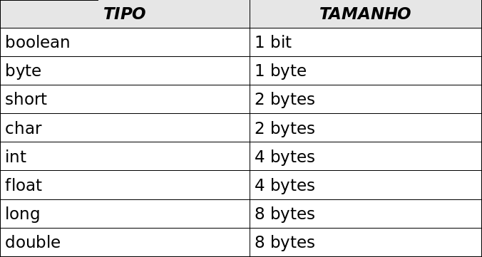
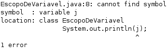

# Variáveis Primitivas e Controle de Fluxo

_"Péssima ideia a de que não se pode mudar." -- Montaigne_

Aprenderemos a trabalhar com os seguintes recursos da linguagem Java:

* Declaração, atribuição de valores, casting e comparação de variáveis;
* Controle de fluxo por meio de `if` e `else`;
* Instruções de laço `for` e `while`, controle de fluxo com break e continue.


<!--@note
* Evite usar aqui termos como classes, objetos e métodos.

* Aprender Java não é fácil. No começo, utilizamos muita coisa (como public, static, class)
a qual ainda não sabemos o que faz, mas, no decorrer do curso, aprenderemos *todas* as palavras-chaves que estamos usando.

* Pedir aos alunos que atentem-se às maiúsculas e minúsculas.

* Forçá-los a usar ConvencoesDeNomenclatura e a identar corretamente o código.

* Boolean não é 0,1 não é 'V', 'F' nem similares.

* Mostrar os tipos de primitivos mais comuns (int, double, char e boolean) e a sintaxe de declaração.
Lembrá-los de escrever sempre o código completo para deixar claro que essas declarações, neste momento,
ficarão dentro do main.

* Fazer algumas charadas de conversão, como por exemplo:
double valor = 3;
int valorInteiro = valor; (isso compila?)

* Importante dizer que o operador de igual (=) copia e cola o valor da variável. Isso será
relevante na hora em que trabalharmos com referências.

* Testando os códigos desenvolvidos acima (Comentar aqui a diferença entre compilação e execução em Java).

* Caso haja alguma pergunta relacionado ao String, basta comentar que o estudaremos em um capítulo mais à frente.

* Sobre casting: sei que posso perder informação, mas estou ciente disso. E se
der algum problema, a culpa é *SUA*.
-->

## Declarando e usando variáveis

**Dentro de um bloco**, podemos declarar variáveis e usá-las. Em Java, toda variável tem um tipo que não
pode ser mudado uma vez declarado:

```
tipoDaVariavel nomeDaVariavel;
```


Por exemplo, é possível ter uma `idade` que guarda um número inteiro:

``` java
int idade;
```

Com isso, você declara a variável `idade`, que passa a existir a partir daquela linha. Ela é do
tipo `int` que guarda um número inteiro. A partir daí, você pode usá-la, primeiramente,
atribuindo valores.

A linha a seguir é a tradução de: **"`idade` deve valer quinze"**.

``` java
idade = 15;
```

> **Comentários em Java**
>
> Com o objetivo de fazer um comentário em Java, você pode usar o `//` para comentar até o final da linha ou, então,
> utilizar o `/* */` para comentar o que estiver entre eles.
>
> ``` java
> 	 /* comentário daqui
> 	até aqui */.
>
> 	// uma linha de comentário sobre a idade.
> 	int idade;
> ```

<!-- Comentário para separar quotes adjacentes. -->


Além de atribuir, você pode utilizar esse valor. O código a seguir declara novamente a variável
`idade` com valor 15 e o imprime na saída padrão por meio da chamada `System.out.println`.

``` java
// declara a idade.
int idade;
idade = 15;
	
// imprime a idade.
System.out.println(idade);
```

 

Por fim, podemos utilizar o valor de uma variável para algum outro propósito, como alterar ou
definir uma segunda variável. O código a seguir cria uma variável chamada `idadeNoAnoQueVem` com
valor de **idade mais um**.

``` java
// calcula a idade no ano seguinte.
int idadeNoAnoQueVem;
idadeNoAnoQueVem = idade + 1;
```

No mesmo momento em que você declara uma variável, também é possível inicializá-la por praticidade:

``` java
int idade = 15;
```


Você pode usar os operadores +, -, / e \* para operar com números, sendo eles responsáveis
pela adição, subtração, divisão e multiplicação, respectivamente. Além desses operadores
básicos, há o operador % (módulo), que é o **resto de uma divisão inteira**.
Veja alguns exemplos:

``` java
int quatro = 2 + 2;
int tres = 5 - 2;
	
int oito = 4 * 2;
int dezesseis = 64 / 4;
	
int um = 5 % 2; // 5 dividido por 2 dá 2, e tem resto 1; 
     		   // o operador % pega o resto da divisão inteira.
```

> **Como rodar esses códigos?**
>
> Você deve colocar esses trechos de código dentro do bloco main que vimos no capítulo anterior.
> Isto é, deve ficar no miolo do programa. Use bastante `System.out.println`, pois, dessa forma,
> poderá ver algum resultado. Caso contrário, ao executar a aplicação, nada aparecerá.
>
> Exemplificando, para imprimir a `idade` e `idadeNoAnoQueVem`, podemos escrever o seguinte programa
> de exemplo:
>
> ``` java
> class TestaIdade {
>
> 	public static void main(String[] args) {
> 		// imprime a idade.
> 		int idade = 20;
> 		System.out.println(idade);
>
> 		// gera uma idade no ano seguinte.
> 		int idadeNoAnoQueVem;
> 		idadeNoAnoQueVem = idade + 1;
>
> 		// imprime a idade.
> 		System.out.println(idadeNoAnoQueVem);
> 	}
> }
> ```

 

<!-- Comentário para separar quotes adjacentes. -->


Representar números inteiros é fácil, mas como guardar valores reais, tais como frações de números
inteiros e outros? Outro tipo de variável muito utilizado é o `double`, que armazena um número
com ponto flutuante (e que também pode armazenar um número inteiro).

``` java
double pi = 3.14;
double x = 5 * 10;
```


O tipo boolean armazena um valor verdadeiro ou falso: nada de números,
palavras ou endereços como em algumas outras linguagens.

``` java
boolean verdade = true;
```

As palavras `true` e `false` são reservadas ao Java. É comum que um `boolean`
seja determinado por meio de uma **expressão booleana**. Isto é, um trecho
de código que retorna um booleano, como o exemplo:

``` java
int idade = 30;
boolean menorDeIdade = idade < 18;
```


O tipo char guarda um, e apenas um, caractere. Este deve estar entre aspas simples. Não se
esqueça dessas duas características de uma variável do tipo char. Por exemplo, ela não pode guardar
um código como `''`, pois o vazio não é um caractere!

``` java
char letra = 'a';
System.out.println(letra);
```

Variáveis do tipo `char` são pouco usadas no dia a dia. Veremos, mais à frente,
o uso das `String`s que usamos constantemente. Porém, estas não são definidas por
um tipo primitivo.

## Tipos primitivos e valores


Esses tipos de variáveis são tipos primitivos do Java: o valor que elas guardam são o real conteúdo
da variável. Quando você utilizar o **operador de atribuição** `=`, o valor será **copiado**.

``` java
int i = 5; // i recebe uma cópia do valor 5;
int j = i; // j recebe uma cópia do valor de i;
i = i + 1; // i vira 6, j continua 5.
```

Aqui, o `i` fica com o valor de 6. Mas, e `j`? Na segunda linha, `j` está valendo 5. Quando
`i` passa a valer 6, será que `j` também muda de valor? Não, pois o valor de um tipo primitivo
sempre é copiado.

Apesar de a linha 2 fazer `j = i`, a partir desse momento, essas variáveis não têm relação nenhuma:
o que acontece com uma não reflete em nada na outra.

<!--@note
Essa explicação, que pode parecer desinteressante aos alunos ao primeiro instante, será muito útil ao
mostrar referências e que elas são passadas por valor. A analogia ajuda bastante.
-->

> **Outros tipos primitivos**
>
> Vimos aqui os tipos primitivos que mais aparecem. O Java tem outros, que são o `byte`, `short`,
> `long` e `float`.
>
> Cada tipo tem características especiais que, para um programador avançado, podem fazer muita
> diferença.

<!-- Comentário para separar quotes adjacentes. -->


## Exercícios: Variáveis e tipos primitivos
1. Na empresa em que trabalhamos, há tabelas com o gasto de cada mês. Para fechar o balanço do
	primeiro trimestre, precisamos somar o gasto total. Sabendo que, em janeiro, foram gastos 15 mil
	reais, em fevereiro, 23 mil reais e, em março, 17 mil reais, faça um programa que calcule e imprima a
	despesa total no trimestre e a média mensal de gastos.

	*Se você estiver fazendo em casa e precisar de ajuda, consulte o capítulo **Resoluções de Exercícios**.*
	
	<!--@answer
	``` java h="9,10"
	class BalancoTrimestral {
		public static void main(String[] args) {
			int gastosJaneiro = 15000;
			int gastosFevereiro = 23000;
			int gastosMarco = 17000;
			int gastosTrimestre = gastosJaneiro + gastosFevereiro + gastosMarco;

			System.out.println("Gasto do trimestre: R$" + gastosTrimestre);
			int mediaPorMes = gastosTrimestre / 3;
			System.out.println("Média mensal: R$" + mediaPorMes);			}
	}
	```
	-->

## Discussão em aula: convenções de código e código legível
<!--@note
Falar das code conventions do Java. Nome de classe em maiúscula, variáveis e métodos
em minuscula. Falar do camel-case, assim como do abre-chaves que fica na linha do bloco.
Pode comparar com C#, por exemplo, em que método é maiúscula e o abre-chaves fica na linha
de baixo.

Falar que é bom para manter padrão e todos se entenderem.

Comentar o exercício do BalancoTrimestral e o porquê de escrever variáveis grandes como
'gastosJaneiro' (muitos alunos abreviam no exercício, fazendo 'janeiro' ou 'jan' ou 'gj').
Falar que se suas variáveis são 'janeiro', 'fevereiro', etc., como saber se o programa calcula
gastos ou ganhos no trimestre? Colocando comentários?

Explicar que evita-se colocar comentários, ao máximo, para fazer código legível que se auto
explique. Martin Fowler diz isso no 'Refactoring', página 87.
-->

Discuta com o instrutor e seus colegas sobre convenções de código Java. Por que existem?
Por que são importantes?

Discuta também as vantagens de se escrever código fácil de ler e se evitar comentários em
excesso (dica: procure por _java code conventions_).

## Casting e promoção

<!--@note
Esse note vale tanto para FJ-11 quanto para FJ-19.

Eu costumo falar que o tipo do dado é uma garagem, e o dado que você está querendo guardar
nesse tipo é um carro. (Faço isso com a ordem crescente do tamanho dos tipos primitivos na lousa)

Então, você estacionará o carro numa garagem, e o carro pode ser maior, menor ou caber
direitinho na garagem. Se o carro é menor ou cabe direitinho na garagem, não tem problema
nenhum, o compilador fica feliz porque ele sabe que, o que você vai fazer, tem que funcionar.

O problema acontece quando você quer guardar um carro muito grande numa garagem pequena.
O compilador percebe que se quiser estacionar um caminhão (long) numa garagem que é para um
fusca (short), boa coisa não acontecerá. Então, ele impede que isso ocorra (falo que o compilador
fica de braços cruzados na frente da garagem impedindo-o de estacionar seu carro lá como se fosse
um segurança). Para conseguir colocar o caminhão na garagem, você precisa avisar o segurança e falar que
tem consciência do que está fazendo. "Hey, segurança, eu sei que eu estou com um caminhão e sei que,
se eu estacionar nessa garagem, eu posso perder os espelhos e arranhar o meu caminhão... mas é isso
que eu quero fazer, então, dá licença, por favor.". Como você foi educado e compilador o deixará.

Perder os espelhos é a deixa para você falar de quando quer colocar um double num long.
-->

Alguns valores são incompatíveis se você tentar fazer uma atribuição direta. Enquanto um número real
costuma ser representado em uma variável do tipo `double`, tentar atribui-lo a uma variável
`int` não funciona, porque é um código que diz: **"i deve valer d"**, mas não se sabe se `d`
realmente é um número inteiro ou não.

``` java
double d = 3.1415;
int i = d; // não compila.
```

A mesma coisa ocorre no seguinte trecho:

``` java
int i = 3.14;
```

O mais interessante é que nem mesmo o seguinte código compila:

``` java
double d = 5; // ok, o double pode conter um número inteiro.
int i = d; // não compila.
```

Apesar de 5 ser um bom valor para um `int`, o compilador não tem como saber qual valor estará dentro
desse `double` no momento da execução. Esse valor pode ter sido digitado pelo usuário, e ninguém garantirá que essa conversão ocorra sem perda de valores.

Já no caso a seguir é o contrário:

``` java
int i = 5;
double d2 = i;
```

O código acima compila sem problemas, uma vez que um `double` pode guardar um número com ou sem ponto
flutuante. Todos os inteiros representados por uma variável do tipo `int` podem ser guardados em
uma variável double, então não existem problemas no código acima.


Às vezes, precisamos que um número quebrado seja arredondado e armazenado em um número inteiro.
Para fazer isso sem que haja o erro de compilação, é preciso ordenar que o número quebrado seja
**moldado (casted)** como um número inteiro. Esse processo recebe o nome de **casting**.

``` java
double d3 = 3.14;
int i = (int) d3;
```

O casting foi feito para moldar a variável `d3` como um `int`. O valor de `i` agora é 3.

O mesmo caso ocorre entre valores `int` e `long`.

``` java
long x = 10000;
int i = x; // não compila, pois pode estar perdendo informação.
```

E se quisermos realmente fazer isso, fazemos o casting:

``` java
long x = 10000;
int i = (int) x;
```

> **Casos não tão comuns de casting e atribuição**
>
> Alguns **castings** aparecem também:
>
> ``` java
> float x = 0.0;
> ```
>
> O código acima não compila, pois todos os literais com ponto flutuante são considerados
> `double` pelo Java. E `float` não pode receber um `double` sem a perda de informação. Para fazê-lo
>  funcionar, podemos escrever:
>
> ``` java
> float x = 0.0f;
> ```
>
> A letra f, que pode ser maiúscula ou minúscula, indica que aquele literal deve ser tratado como
> `float`.
>
> Outro caso que é mais comum:
>
> ``` java
> double d = 5;
> float f = 3;
>
> float x = f + (float) d;
> ```
>
> Você precisa do casting porque o Java faz as contas e vai armazenando sempre no maior tipo que
> apareceu durante as operações, neste caso, o `double`.
>
> E uma observação: no mínimo, o Java armazena o resultado em um `int` na hora de fazer as contas.
>
> Até casting com variáveis do tipo `char` podem ocorrer. O único tipo primitivo que não pode ser
> atribuído a nenhum outro tipo é o `boolean`.

<!-- Comentário para separar quotes adjacentes .-->


> **Castings possíveis**
>
> Abaixo estão relacionados todos os casts possíveis na linguagem Java, mostrando a conversão
> **de** um valor **em** outro. A indicação **Impl.** quer dizer que aquele cast é implícito e
> automático, ou seja, você não precisa indicar o cast explicitamente (lembrando que o tipo boolean
> não pode ser convertido em nenhum outro tipo).
>
> 
>

<!-- Comentário para separar quotes adjacentes -->


> **Tamanho dos tipos**
>
> Na tabela abaixo, estão os tamanhos de cada tipo primitivo do Java.
>
> 

<!-- Comentário para separar quotes adjacentes. -->


## O if e o else

No Java, a sintaxe do `if` é a seguinte:

``` java
if (condicaoBooleana) {
	codigo;
}
```


Uma **condição booleana** é qualquer expressão que retorne `true` ou `false`. Para isso, você
pode usar os operadores `<`, `>`, `<=`, `>=` e outros. Um exemplo:

``` java
int idade = 15;
if (idade < 18) {
	System.out.println("Não pode entrar");
}
```

 

Além disso, você pode usar a cláusula `else` para indicar o comportamento que deve ser executado
no caso da expressão booleana ser falsa:

``` java
int idade = 15;
if (idade < 18) {
	System.out.println("Não pode entrar");
} else {
	System.out.println("Pode entrar");
}
```

 

Você pode concatenar expressões booleanas por meio dos operadores lógicos **"E"** e **"OU"**.
O **"E"** é representado pelo `&&`, e o **"OU"** é representado pelo `||`.

Um exemplo seria verificar se ele tem menos de 18 anos **e** se não é amigo do dono:

``` java
int idade = 15;
boolean amigoDoDono = true;
if (idade < 18 && amigoDoDono == false) {
	System.out.println("Não pode entrar");
}
else {
	System.out.println("Pode entrar");
}
```

 

Esse código poderia ficar ainda mais legível, utilizando-se do operador de negação, o `!`.
Esse operador transforma o resultado de uma expressão booleana de `false` em `true`, e vice-versa.

``` java
int idade = 15;
boolean amigoDoDono = true;
if (idade < 18 && !amigoDoDono) {
	System.out.println("Não pode entrar");
}
else {
	System.out.println("Pode entrar");
}
```

 

Repare na linha 3 que o trecho `amigoDoDono == false`  virou `!amigoDoDono`. **Eles
têm o mesmo valor.**

Para comparar se uma variável tem o **mesmo valor** que outra variável ou que um valor, utilizamos
o operador `==`. Repare que utilizar o operador `=` dentro de um `if` retornará um
erro de compilação, já que o operador `=` é o de atribuição.

``` java
int mes = 1;
if (mes == 1) {
	System.out.println("Você deveria estar de férias");
}
```

 

## O While


O `while` é um comando usado para fazer um **laço (loop)**, isto é, repetir um trecho de código
algumas vezes. A ideia é que esse trecho de código seja repetido enquanto uma determinada condição
permanecer verdadeira.

``` java
int idade = 15;
while (idade < 18) {
	System.out.println(idade);	
	idade = idade + 1;
}
```

 

O trecho dentro do bloco do `while` será executado até o momento em que a condição `idade < 18`
passe a ser falsa. E isso ocorrerá exatamente no instante em que `idade == 18`, o que não o fará
imprimir `18`.

``` java
int i = 0;
while (i < 10) {
	System.out.println(i);	
	i = i + 1;
}
```

 

Já o `while` acima imprime de 0 a 9.

## O For


Outro comando de **loop** extremamente utilizado é o `for`. A ideia é a mesma do `while`:
fazer um trecho de código ser repetido, enquanto uma condição continuar verdadeira. Mas, além
disso, o `for` isola também um espaço para inicialização de variáveis e o modificador dessas
variáveis. Isso faz com que as variáveis relacionadas ao loop fiquem mais legíveis:

``` java
for (inicializacao; condicao; incremento) {
	codigo;
}
```

Um exemplo é:

``` java
for (int i = 0; i < 10; i = i + 1) {
	System.out.println("olá!");
}
```

 

Repare que esse `for` poderia ser trocado por:

``` java
int i = 0;
while (i < 10) {
	System.out.println("olá!");
	i = i + 1;
}
```

 

Porém, o código do `for` indica claramente que a variável `i` serve, em especial, para
controlar a quantidade de laços executados. Quando usar o `for`? Quando usar o `while`?
Depende do gosto e da ocasião.

> **Pós incremento ++**
>
> `i = i + 1` pode realmente ser substituído por `i++` quando isolado. Porém, em alguns
> casos, temos essa instrução envolvida em, por exemplo, uma atribuição:
>
> ``` java
> int i = 5;
> int x = i++;
> ```
>
> Qual é o valor de `x`? O de `i`, após essa linha, é 6.
>
> O operador `++`, quando vem após a variável, retorna o valor antigo e o incrementa
> (pós-incremento), fazendo `x` valer 5.
>
> Se você tivesse usado o `++` antes da variável (pré-incremento), o resultado seria 6:
>
> ``` java
> int i = 5;
> int x = ++i; // aqui x valera 6.
> ```

<!-- Comentário para separar quotes adjacentes. -->


## Controlando loops

Apesar de termos condições booleanas nos nossos laços, em algum momento, podemos decidir
parar o loop por algum motivo especial sem que o resto do laço seja executado.

``` java
for (int i = x; i < y; i++) {
	if (i % 19 == 0) {
		System.out.println("Achei um número divisível por 19 entre x e y");
		break;
	}
}
```

 

O código acima percorrerá os números de x a y e irá parar quando encontrar um número divisível por
19, uma vez que foi utilizada a palavra-chave `break`.


Da mesma maneira, é possível obrigar o loop a executar o próximo laço. Para isso,
usamos a palavra-chave `continue`.

``` java
for (int i = 0; i < 100; i++) {
	if (i > 50 && i < 60) {
		continue;
	}
	System.out.println(i);
}
```

 

O código acima não imprimirá alguns números. (Quais exatamente?)

## Escopo das variáveis

No Java, podemos declarar variáveis a qualquer momento. Porém, dependendo de onde você
as declarou, ela valerá de um determinado ponto a outro.

``` java
// aqui, a variável i não existe.
int i = 5;
// a partir daqui, ela existe.
```


O **escopo da variável** é o nome dado ao trecho de código em que aquela variável existe
e o lugar onde é possível acessá-la.

Quando abrimos um novo bloco com as chaves, as variáveis declaradas ali dentro **só valem
até o fim daquele bloco**.

``` java
// aqui, a variável i não existe.
int i = 5;
// a partir daqui, ela existe.
while (condicao) {
	// o i ainda vale aqui.
	int j = 7;
	// o j passa a existir.
}
// aqui, o j não existe mais, porém o i continua dentro do escopo.
```

No bloco acima, a variável `j` para de existir quando termina o bloco no qual ela foi declarada. Se
você tentar acessar uma variável fora do escopo dela, ocorrerá um erro de compilação.



O mesmo vale para um if:

``` java
if (algumBooleano) {
	int i = 5;
} 
else {
	int i = 10;
}
System.out.println(i); // cuidado!
```

Aqui a variável `i` não existe fora do `if` e do `else`! Se você declarar a variável
antes do `if`, haverá outro erro de compilação: dentro do `if` e do `else`, a
variável está sendo redeclarada. Então, o código para compilar e fazer sentido fica:

``` java
int i;
if (algumBooleano) {
	i = 5;
} 
else {
	i = 10;
}
System.out.println(i);
```

Uma situação parecida pode ocorrer com o `for`:

``` java
for (int i = 0; i < 10; i++) {
	System.out.println("olá!");
}
System.out.println(i); // cuidado!
```

 

Nesse `for`, a variável `i` morre ao seu término, não podendo ser acessada de fora do `for`e
gerando um erro de compilação. Se você realmente quer acessar o contador depois do loop
terminar, precisa de algo como:

``` java
int i;
for (i = 0; i < 10; i++) {
	System.out.println("olá!");
}
System.out.println(i);
```

 

## Um bloco dentro do outro
Um bloco também pode ser declarado dentro de outro. Isto é, um `if` dentro de um `for`,
ou um `for` dentro de um `for`, algo como:

``` java
while (condicao) {
	for (int i = 0; i < 10; i++) {
		// código
	}
}
```

## Para saber mais

* Vimos apenas os comandos mais usados para controle de fluxo. O Java ainda tem o `do..while`
e o `switch`. Pesquise sobre eles e diga quando é interessante usar cada um.

* Algumas vezes, temos vários laços encadeados. Podemos utilizar o `break` para quebrar o laço mais
interno. Mas, se quisermos quebrar um laço mais externo, teremos de encadear diversos ifs, e seu
código ficará uma bagunça. O Java tem um artifício chamado **labeled loops**; pesquise sobre eles.

* O que acontece se você tentar dividir um número inteiro por 0? E por 0.0?

* Existe um caminho entre os tipos primitivos que indica se há a necessidade ou não de casting
entre os tipos. Por exemplo, `int` -> `long` -> `double` (um `int` pode ser tratado como um
`double`, mas não o contrário). Pesquise (ou teste) e posicione os outros tipos primitivos
nesse fluxo.

* Além dos operadores de incremento, existem os de decremento, como `--i` e `i--`. Em adição a esses,
você pode usar instruções do tipo `i += x` e `i -= x`. O que essas instruções fazem? Teste-as.


## Exercícios: fixação de sintaxe

Mais exercícios de fixação de sintaxe. Para quem já conhece um pouco de Java, pode ser muito simples,
mas recomendamos fortemente que você faça os exercícios a fim de se acostumar com erros de compilação,
mensagens do javac, convenção de código, etc.

Apesar de extremamente simples, precisamos praticar a sintaxe que estamos aprendendo. Para cada
exercício, crie um novo arquivo com extensão **.java** e declare aquele estranho cabeçalho, dando nome
a uma classe e com um bloco `main` dentro dele:

``` java
class ExercicioX {
	public static void main(String[] args) {
		// seu exercício vai aqui
	}
}
```

Não copie e cole de um exercício já existente! Aproveite para praticar.
1. Imprima todos os números de 150 a 300.
	<!--@answer
	``` java
		class ImprimeIntervalo {
			public static void main(String[] args) {
				int i = 150;
				while (i<=300){
					System.out.println(i);
					i++;
				}
			}
		}
	```
	ou
	``` java
		class ImprimeIntervalo {
			public static void main(String[] args) {
				for (int i = 150; i<=300; i++){
					System.out.println(i);
				}
			}
		}
	```
	-->
1. Imprima a soma de 1 até 1000.
	<!--@note Mostre também a solução com a soma de progressão aritmética. -->

	<!--@answer
	``` java
		class ImprimeSoma {
			public static void main(String[] args) {
				int soma = 0;
				int i = 1;
				while (i<=1000){
					soma = soma + i;
                    i++;
				}
				System.out.println(i);
			}
		}
	```
	ou
	``` java
		class ImprimeSoma {
			public static void main(String[] args) {
				soma = 0;
				for (int i = 1; i<=1000; i++){
					soma = soma + i;
				}
				System.out.println(i);
			}
		}
	```
	-->
1. Imprima todos os múltiplos de 3, entre 1 e 100.

	<!--@note
	A maioria procura múltiplos olhando para o resto (%). Mostrar um que faz
	incremento de 3 em 3.
	-->

	<!--@answer
	```
		class MultiplosDeTresAteCem {
			public static void main (String[] args) {
				for (int i = 1; i < 100; i++ ){
					if (i % 3 == 0)	{
						System.out.println(i);
					}
				}
			}
		}
	```
	ou, entre outras tantas opções, a mais simples:
	```
		class MultiplosDeTresAteCem {
			public static void main (String[] args) {
				for (int i = 1; i < 100; i += 3 ){
					System.out.println(i);
				}
			}
		}
	```
	-->
1. Imprima os fatoriais de 1 a 10.

	O fatorial de um número n é n \* (n-1) \* (n-2) \* ... \* 1. Lembre-se de utilizar os parênteses.

	O fatorial de 0 é 1

	O fatorial de 1 é (0!) * 1 = 1

	O fatorial de 2 é (1!) * 2 = 2

	O fatorial de 3 é (2!) * 3 = 6

	O fatorial de 4 é (3!) * 4 = 24

	Faça um for que inicie uma variável n (número) como 1, fatorial (resultado)
	como 1 e varia n de 1 até 10:

	``` java
	int fatorial = 1;
	for (int n = 1; n <= 10; n++) {

	}
	```

	<!--@answer
	``` java
		class Fatorial {
			public static void main (String[] args) {
				int fatorial = 1;
				for (int n = 1; n <= 10; n++) {
					fatorial = fatorial * n;
					System.out.println("fat(" + n + ") = " + fatorial);
				}
			}
		}
	```
	-->
1. No código do exercício anterior, aumente a quantidade de números que terão os
	fatoriais impressos até 20, 30 e 40. Em um  determinado momento, além de esse
	cálculo demorar, começará a mostrar respostas completamente erradas.
	Por quê?

	Mude de `int` para `long` a fim de ver alguma mudança.
	<!--@answer
	Isso acontece porque, a partir de 16!, o valor ultrapassa o limite superior do
	tipo `int`. O tipo `long` consegue armazenar o cálculo dos fatoriais
	até 21!. Teste-o!
	-->
1. (Opcional) Imprima os primeiros números da série de Fibonacci até passar de 100.
	A série de Fibonacci é a seguinte: 0, 1, 1, 2, 3, 5, 8, 13, 21, etc.
	Para calculá-la, o primeiro elemento vale 0, o segundo vale 1, e daí por diante.
	O n-ésimo elemento vale o (n-1)-ésimo elemento somado ao (n-2)-ésimo elemento
	(ex: 8 = 5 + 3).

	<!--@answer
	``` java
		class Fibonacci {
			public static void main(String[] args) {
				int anterior = 0;
				int atual = 1;
				while (atual < 100) {
					System.out.println(atual);
					int proximo = anterior + atual;
					anterior = atual;
					atual = proximo;
				}
				System.out.println(atual);
			}
		}
	```
	-->
1. (Opcional) Escreva um programa em que, dada uma variável `x` com algum valor
	inteiro, temos um novo `x` de acordo com a seguinte regra:

	* Se `x` é par, `x = x / 2`;
	* Se `x` é impar, `x = 3 * x + 1`;
	* Imprime `x`;
	* O programa deve parar quando `x` tiver o valor final de 1. Por exemplo,
	para `x = 13`, a saída será:

	40 -> 20 -> 10 -> 5 -> 16 -> 8 -> 4 -> 2 -> 1

	> **Imprimindo sem pular linha**
	>
	> Um detalhe importante é que uma quebra de linha é impressa toda vez que
	> chamamos `println`. Para não pular uma linha, usamos o código a seguir:
	>
	> ``` java
	> 			System.out.print(variavel);
	> ```

	<!-- comentario para separar quotes adjacentes -->

	<!--@answer
	``` java
		class TresNMaisUm {
			public static void main(String[] args) {
				int x = 13;
				System.out.println("Iniciando...\n" + x);
				while (x != 1) {
					if (x % 2 == 0) {
						x = x / 2;
					} else {
						x = 3 * x + 1;
					}
					System.out.println(x);
				}
			}
		}
	```

	Curiosamente, essa é a famosa conjectura de Collatz. Ninguém nunca
	conseguiu demonstrar que sempre vai cair em um desses casos até convergir
	a 1.
	-->
1. (Opcional)  Imprima a seguinte tabela usando `for`s encadeados:
	```
	1
	2 4
	3 6 9
	4 8 12 16
	n n*2 n*3 .... n*n
	```

	<!--@answer
	``` java
		class Triangulo {
			public static void main(String[] args) {
				int numero = 5;
				for (int linha = 1; linha <= numero; linha++) {
					for (int coluna = 1; coluna <= linha; coluna++) {
						System.out.print(linha * coluna + " ");
					}
					System.out.println();
				}
			}
		}
	```
	-->


## Desafios: Fibonacci
1. Faça o exercício da série de Fibonacci usando apenas duas variáveis.

	<!--@answer
	``` java
		class Desafio {
			public static void main(String[] args) {
				int anterior = 0;
				int atual = 1;
				while (atual < 100) {
					System.out.println(atual);
					atual = anterior + atual;
					anterior = atual - anterior;
				}
				System.out.println(atual);
			}
		}
	```
	-->
