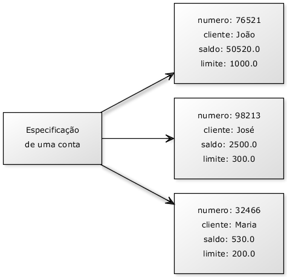
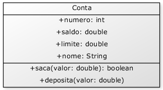
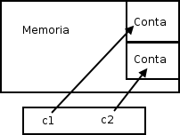
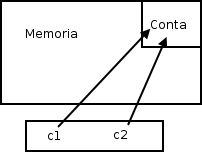
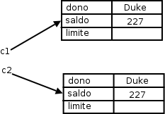
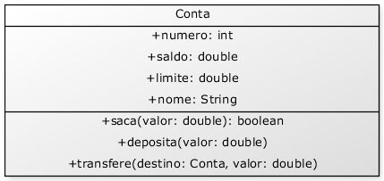
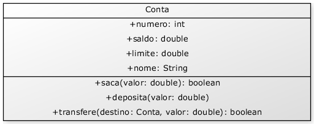
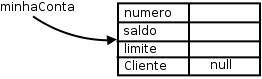

# Orientação a objetos básica
_"Programação orientada a objetos é uma péssima ideia, que só poderia ter nascido na
Califórnia." -- Edsger Dijkstra_

Ao término deste capítulo, você será capaz de:

* dizer o que é e para que serve orientação a objetos;
* conceituar classes, atributos e comportamentos;
* entender o significado de variáveis e objetos na memória.


## Motivação: problemas do paradigma procedural

Orientação a objetos é uma maneira de programar que ajuda na organização e resolve muitos problemas
enfrentados pela programação procedural.

Consideremos o clássico problema da validação de um CPF. Normalmente, temos um formulário, no qual
recebemos essa informação, e depois temos que enviar esses caracteres para uma função que vai
validá-lo, como no pseudocódigo abaixo:

```
cpf = formulario->campo_cpf
valida(cpf)
```

Alguém te obriga a sempre validar esse CPF? Você pode, inúmeras vezes, esquecer de chamar esse
validador. Mais: considere que você tem 50 formulários e precise validar em todos eles o CPF. Se sua
equipe tem 3 programadores trabalhando nesses formulários, quem fica responsável por essa validação?
Todos!

A situação pode piorar: na entrada de um novo desenvolvedor, precisaríamos avisá-lo que sempre
devemos validar o cpf de um formulário. É nesse momento que nascem aqueles guias de programação
para o desenvolvedor que for entrar nesse projeto - às vezes, é um documento enorme. Em outras
palavras, **todo** desenvolvedor precisa ficar sabendo de uma quantidade enorme de informações, que,
na maioria das vezes, não está realmente relacionado à sua parte no sistema, mas ele **precisa**
ler tudo isso, resultando um entrave muito grande!

Outra situação onde ficam claros os problemas da programação procedural, é quando nos encontramos na
necessidade de ler o código que foi escrito por outro desenvolvedor e descobrir como ele funciona
internamente. Um sistema bem encapsulado não deveria gerar essa necessidade. Em um sistema grande,
simplesmente não temos tempo de ler todo o código existente.

Considerando que você não erre nesse ponto e que sua equipe tenha uma comunicação muito boa (perceba que
comunicação excessiva pode ser prejudicial e atrapalhar o andamento), ainda temos outro problema:
imagine que, em todo formulário, você também quer que a idade do cliente seja validada -
o cliente precisa ter mais de 18 anos. Vamos ter de colocar um `if`... mas onde? Espalhado por todo seu
código...  Mesmo que se crie outra função para validar, precisaremos incluir isso nos nossos 50
formulários já existentes. Qual é a chance de esquecermos em um deles? É muito grande.

A responsabilidade de verificar se o cliente tem ou não tem 18 anos ficou espalhada por todo o seu
código. Seria interessante poder concentrar essa responsabilidade em um lugar só, para não ter
chances de esquecer isso.

Melhor ainda seria se conseguíssemos mudar essa validação e os outros programadores nem precisassem
ficar sabendo disso. Em outras palavras, eles criariam formulários e um único programador seria
responsável pela validação: os outros nem sabem da existência desse trecho de código. Impossível?
Não, o paradigma da orientação a objetos facilita tudo isso.

O problema do paradigma procedural é que não existe uma forma simples de criar conexão
forte  entre  dados e funcionalidades. No paradigma orientado a objetos é muito fácil ter
essa conexão através dos recursos da própria linguagem.

> **Quais as vantagens?**
>
> Orientação a objetos vai te ajudar em muito em se organizar e escrever menos, além de concentrar as
> responsabilidades nos pontos certos, flexibilizando sua aplicação, **encapsulando** a lógica de
> negócios.
>
> Outra enorme vantagem, onde você realmente vai economizar montanhas de código, é o **polimorfismo
> das referências**, que veremos em um posterior capítulo.


Nos próximos capítulos, conseguiremos enxergar toda essa vantagem, mas, primeiramente é necessário
conhecer um pouco mais da sintaxe e da criação de tipos e referências em Java.

## Criando um tipo
Considere um programa para um banco, é bem fácil perceber que uma entidade extremamente importante
para o nosso sistema é a conta. Nossa ideia aqui é generalizarmos alguma informação, juntamente com
funcionalidades que toda conta deve ter.

O que toda conta tem e é importante para nós?


- número da conta
- nome do titular da conta
- saldo


O que toda conta faz e é importante para nós? Isto é, o que gostaríamos de "pedir à conta"?


- saca uma quantidade x
- deposita uma quantidade x
- imprime o nome do titular da conta
- devolve o saldo atual
- transfere uma quantidade x para uma outra conta y
- devolve o tipo de conta


Com isso, temos o projeto de uma conta bancária. Podemos pegar esse projeto e acessar seu saldo? Não.
O que temos ainda é o **projeto**. Antes, precisamos **construir** uma conta, para poder acessar o
que ela tem, e pedir a ela que faça algo.




Repare na figura: apesar do papel do lado esquerdo especificar uma Conta, essa especificação é uma
Conta? Nós depositamos e sacamos dinheiro desse papel? Não. Utilizamos a especificação da Conta para
poder criar instâncias que realmente são contas, onde podemos realizar as operações que criamos.

Apesar de declararmos que toda conta tem um saldo, um número e uma agência no pedaço de papel (como
à esquerda na figura), são nas instâncias desse projeto que realmente há espaço para armazenar esses
valores.


Ao projeto da conta, isto é, a definição da conta, damos o nome de **classe**. Ao que podemos
construir a partir desse projeto, as contas de verdade, damos o nome de **objetos**.

A palavra **classe** vem da taxonomia da biologia. Todos os seres vivos de uma mesma **classe**
biológica têm uma série de **atributos** e **comportamentos** em comum, mas não são iguais, podem
variar nos valores desses **atributos** e como realizam esses **comportamentos**.

**Homo Sapiens** define um grupo de seres que possuem características em comum, porém a definição
(a ideia, o conceito) de um **Homo Sapiens** é um ser humano? Não. Tudo está especificado na
**classe** Homo Sapiens, mas se quisermos mandar alguém correr, comer, pular, precisaremos de uma
instância de **Homo Sapiens**, ou então de um **objeto** do tipo **Homo Sapiens**.

Um outro exemplo: uma receita de bolo. A pergunta é certeira: você come uma receita de bolo? Não.
Precisamos **instanciá-la**, criar um **objeto** bolo a partir dessa especificação (a classe) para
utilizá-la. Podemos criar centenas de bolos a partir dessa classe (a receita, no caso), eles podem
ser bem semelhantes, alguns até idênticos, mas são **objetos** diferentes.

Podemos fazer milhares de analogias semelhantes. A planta de uma casa é uma casa? Definitivamente
não. Não podemos morar dentro da planta de uma casa, nem podemos abrir sua porta ou pintar suas
paredes. Precisamos, antes, construir instâncias a partir dessa planta. Essas instâncias, sim,
podemos pintar, decorar ou morar dentro.

Pode parecer óbvio, mas a dificuldade inicial do paradigma da orientação a objetos é justo saber
distinguir o que é classe e o que é objeto. É comum o iniciante utilizar, obviamente de forma errada,
essas duas palavras como sinônimos.

## Uma classe em Java
Vamos começar apenas com o que uma `Conta` tem, e não com o que ela faz (veremos logo em seguida).

Um tipo desses, como o especificado de `Conta` acima, pode ser facilmente traduzido para Java:

``` java
	class Conta {
		int numero;
		String titular;
		double saldo;
	
		// ..
	}
```

> **String**
>
> String é uma classe em Java. Ela guarda uma cadeia de caracteres, uma frase completa. Como estamos
> ainda aprendendo o que é uma classe, entenderemos com detalhes a classe `String` apenas em capítulos
> posteriores.


Por enquanto, declaramos o que toda conta deve ter. Estes são os **atributos** que toda conta,
quando criada, vai ter. Repare que essas variáveis foram declaradas fora de um bloco, diferente do
que fazíamos quando tinha aquele main. Quando uma variável é declarada diretamente dentro do escopo
da classe, é chamada de variável de objeto, ou atributo.

## Criando e usando um objeto
Já temos uma classe em Java que especifica o que todo objeto dessa classe deve ter. Mas como
usá-la? Além dessa classe, ainda teremos o **Programa.java** e a partir dele é que vamos utilizar a
classe `Conta`.


Para criar (construir, instanciar) uma `Conta`, basta usar a palavra chave `new`. Devemos utilizar também
os parênteses, que descobriremos o que fazem exatamente em um capítulo posterior:

``` java
	class Programa {
		public static void main(String[] args) {
			new Conta();	
		}
	}
```

Bem, o código acima cria um objeto do tipo `Conta`, mas como acessar esse objeto que foi criado?
Precisamos ter alguma forma de nos referenciarmos a esse objeto. Precisamos de uma variável:

``` java
	class Programa {
		public static void main(String[] args) {
			Conta minhaConta;
			minhaConta = new Conta();
		}
	}
```

Pode parecer estranho escrevermos duas vezes `Conta`: uma vez na declaração da variável e outra
vez no uso do `new`. Mas há um motivo, que em breve entenderemos.

Através da variável `minhaConta`, podemos acessar o objeto recém criado para alterar seu
`titular`, seu `saldo`, etc:

``` java
	class Programa {
		public static void main(String[] args) {
			Conta minhaConta;
			minhaConta = new Conta();
	
			minhaConta.titular = "Duke";
			minhaConta.saldo = 1000.0;
	
			System.out.println("Saldo atual: " + minhaConta.saldo);
		}
	}
```

 

É importante fixar que o _ponto_ foi utilizado para acessar algo em `minhaConta`. A `minhaConta`
pertence ao Duke, e tem saldo de mil reais.

## Métodos

Dentro da classe, também declararemos o que cada conta faz e como isto é feito - os comportamentos
que cada classe tem, isto é, o que ela faz. Por exemplo, de que maneira que uma Conta saca dinheiro?
Especificaremos isso dentro da própria classe `Conta`, e não em um local desatrelado das
informações da própria Conta. É por isso que essas "funções" são chamadas de **métodos**. Pois é a
maneira de fazer uma operação com um objeto.

Queremos criar um método que **saca** uma determinada **quantidade** e não devolve **nenhuma
informação** para quem acionar esse método:

``` java
class Conta {
	double salario;
	// ... outros atributos ...

	void saca(double quantidade) {
		double novoSaldo = this.saldo - quantidade; 
		this.saldo = novoSaldo;
	}
}
```


A palavra chave `void` diz que, quando você pedir para a conta sacar uma quantia, nenhuma
informação será enviada de volta a quem pediu.


Quando alguém pedir para  sacar, ele também vai dizer quanto quer sacar. Por isso precisamos
declarar o método com algo dentro dos parênteses - o que vai aí dentro é chamado de **argumento** do
método (ou **parâmetro**). Essa variável é uma variável comum, chamada também de temporária ou local,
pois, ao final da execução desse método, ela deixa de existir.


Dentro do método, estamos declarando uma nova variável. Essa variável, assim como o argumento, vai
morrer no fim do método, pois este é seu escopo. No momento que vamos acessar nosso atributo, usamos
a palavra chave `this` para mostrar que esse é um atributo, e não uma simples variável. (veremos
depois que é opcional)

Repare que, nesse caso, a conta poderia estourar um limite fixado pelo banco. Mais para frente,
evitaremos essa situação, e de uma maneira muito elegante.

Da mesma forma, temos o método para depositar alguma quantia:

``` java
class Conta {
	// ... outros atributos e métodos ...

	void deposita(double quantidade) {
		this.saldo += quantidade;
	}
}
```

Observe que não usamos uma variável auxiliar e, além disso, usamos a abreviação `+=` para
deixar o método bem simples. O `+=` soma quantidade ao valor antigo do saldo e guarda no próprio
saldo, o valor resultante.


Para mandar uma mensagem ao objeto e pedir que ele execute um método, também usamos o ponto. O termo
usado para isso é **invocação de método**.

O código a seguir saca dinheiro e depois deposita outra quantia na nossa conta:

``` java
class TestaAlgunsMetodos {
	public static void main(String[] args) {
		// criando a conta
		Conta minhaConta;
		minhaConta = new Conta();

		// alterando os valores de minhaConta
		minhaConta.titular = "Duke";
		minhaConta.saldo = 1000;
	
		// saca 200 reais
		minhaConta.saca(200);

		// deposita 500 reais
		minhaConta.deposita(500);
		System.out.println(minhaConta.saldo);
	}
}
```

 

Uma vez que seu saldo inicial é 1000 reais, se sacarmos 200 reais, depositarmos 500 reais e
imprimirmos o valor do saldo, o que será impresso?

## Métodos com retorno
Um método sempre tem que definir o que retorna, nem que defina que não há retorno, como nos exemplos
anteriores onde estávamos usando o `void`.

Um método pode retornar um valor para o código que o chamou. No caso do nosso método `saca` ,
podemos devolver um valor booleano indicando se a operação foi bem sucedida.

``` java
class Conta {
	// ... outros métodos e atributos ...

	boolean saca(double valor) {
		if (this.saldo < valor) {
			return false;
		}
		else {
			this.saldo = this.saldo - valor;
			return true;
		}
	}
}
```


A declaração do método mudou! O método `saca` não tem `void` na frente. Isto quer dizer que,
quando é acessado, ele devolve algum tipo de informação. No caso, um `boolean`. A palavra chave
`return` indica que o método vai terminar ali, retornando tal informação.



Exemplo de uso:

``` java
	minhaConta.saldo = 1000;
	boolean consegui = minhaConta.saca(2000);
	if (consegui) {
		System.out.println("Consegui sacar");
	} else {
		System.out.println("Não consegui sacar");
	}
```

 

Ou então, posso eliminar a variável temporária, se desejado:

``` java
	minhaConta.saldo = 1000;
	if (minhaConta.saca(2000)) {
		System.out.println("Consegui sacar");
	} else {
		System.out.println("Não consegui sacar");
	}
```

 

Mais adiante, veremos que algumas vezes é mais interessante lançar uma exceção (_exception_) nesses
casos.

Meu programa pode manter na memória não apenas uma conta, como mais de uma:

``` java
class TestaDuasContas {
	public static void main(String[] args) {

		Conta minhaConta;
		minhaConta = new Conta();
		minhaConta.saldo = 1000;

		Conta meuSonho;
		meuSonho = new Conta();
		meuSonho.saldo = 1500000;
	}
}
```

## Objetos são acessados por referências


Quando declaramos uma variável para associar a um objeto, na verdade, essa variável não guarda o
objeto, e sim uma maneira de acessá-lo, chamada de **referência**.

É por esse motivo que, diferente dos _tipos primitivos_ como `int` e `long`, precisamos dar `new`
depois de declarada a variável:

``` java
	public static void main(String[] args) {
		Conta c1;
		c1 = new Conta();
	
		Conta c2;
		c2 = new Conta();
	}
```

O correto aqui, é dizer que `c1` se refere a um objeto. **Não é correto** dizer que `c1` é um
objeto, pois `c1` é uma variável referência, apesar de, depois de um tempo, os programadores Java
falarem "Tenho um **objeto c** do tipo **Conta**", mas apenas para encurtar a frase "Tenho uma
**referência c** a um **objeto** do tipo **Conta**".

Basta lembrar que, em Java, **uma variável nunca é um objeto**. Não há, no Java, uma maneira de
criarmos o que é conhecido como "_objeto pilha_" ou "_objeto local_", pois todo objeto em Java,
sem exceção, é acessado por uma variável referência.

Esse código nos deixa na seguinte situação:

``` java
	Conta c1;
	c1 = new Conta();
	
	Conta c2;
	c2 = new Conta();
```



Internamente, `c1` e `c2` vão guardar um número que identifica em que posição da memória aquela
`Conta` se encontra. Dessa maneira, ao utilizarmos o "." para navegar, o Java vai acessar a
`Conta` que se encontra naquela posição de memória, e não uma outra.

Para quem conhece, é parecido com um ponteiro, porém você não pode manipulá-lo como um número e
nem utilizá-lo para  aritmética, ela é tipada.

Um outro exemplo:

``` java
	class TestaReferencias {
		public static void main(String[] args) {
			Conta c1 = new Conta();
			c1.deposita(100);
	
			Conta c2 = c1;  // linha importante!
			c2.deposita(200);
	
			System.out.println(c1.saldo);
	 		System.out.println(c2.saldo);
		}
	}
```

 

Qual é o resultado do código acima? O que aparece ao rodar?

O que acontece aqui? O operador `=` copia o valor de uma variável. Mas qual é o valor da variável
`c1`? É o objeto? Não. Na verdade, o valor guardado é a referência (**endereço**) de onde o objeto
se encontra na memória principal.

Na memória, o que acontece nesse caso:

``` java
		Conta c1 = new Conta();
		Conta c2 = c1;
```



Quando fizemos `c2 = c1`, `c2` passa a fazer referência para o mesmo objeto que `c1`
referencia nesse instante.

Então, nesse código em específico, quando utilizamos `c1` ou `c2` estamos nos referindo
exatamente ao **mesmo** objeto! Elas são duas referências distintas, porém apontam para o **mesmo**
objeto! Compará-las com "`==`" vai nos retornar `true`, pois o valor que elas carregam é o mesmo!

Outra forma de perceber, é que demos apenas um `new`, então só pode haver um objeto `Conta` na
memória.

**Atenção:** não estamos discutindo aqui a utilidade de fazer uma referência apontar pro mesmo
objeto que outra. Essa utilidade ficará mais clara quando passarmos variáveis do tipo referência
como argumento para métodos.

> **new**
>
> O que exatamente faz o `new`?
>
> O `new` executa uma série de tarefas, que veremos mais adiante.
>
> Mas, para melhor entender as referências no Java, saiba que o `new`, depois de alocar a memória
> para esse objeto, devolve uma "flecha", isto é, um valor de referência. Quando você atribui isso a
> uma variável, essa variável passa a se referir para esse mesmo objeto.


Podemos então ver outra situação:

``` java
	public static void main(String[] args) {
		Conta c1 = new Conta();
		c1.titular = "Duke";
		c1.saldo = 227;
	
		Conta c2 = new Conta();
		c2.titular = "Duke";
		c2.saldo = 227;
	
		if (c1 == c2) {
			System.out.println("Contas iguais");
		}
	}
```

 

O operador `==` compara o conteúdo das variáveis, mas essas variáveis não guardam o objeto, e sim
o endereço em que ele se encontra. Como em cada uma dessas variáveis guardamos duas contas criadas
diferentemente, elas estão em espaços diferentes da memória, o que faz o teste no `if` valer
`false`. As contas podem ser equivalentes no nosso critério de igualdade, porém elas não são o
mesmo objeto. Quando se trata de objetos, pode ficar mais fácil pensar que o `==` compara se os
objetos (referências, na verdade) são o mesmo, e não se são iguais.


Para saber se dois objetos têm o mesmo conteúdo, você precisa comparar atributo por atributo.
Veremos uma solução mais elegante para isso também.

## O método transfere()

E se quisermos ter um método que transfere dinheiro entre duas contas? Podemos ficar tentados a
criar um método que recebe dois parâmetros: `conta1` e `conta2` do tipo `Conta`. Mas cuidado:
assim estamos pensando de maneira procedural.

A ideia é que, quando chamarmos o método `transfere`, já teremos um objeto do tipo `Conta` (o
`this`), portanto o método recebe apenas **um** parâmetro do tipo `Conta`, a Conta destino
(além do `valor`):

``` java
	class Conta {
	
		// atributos e métodos...
	
		void transfere(Conta destino, double valor) {
			this.saldo = this.saldo - valor;
			destino.saldo = destino.saldo + valor;
		}
	}
```



Para deixar o código mais robusto, poderíamos verificar se a conta possui a quantidade a ser
transferida disponível. Para ficar ainda mais interessante, você pode chamar os métodos `deposita`
e `saca` já existentes para fazer essa tarefa:

``` java
	class Conta {
	
		// atributos e métodos...
	
		boolean transfere(Conta destino, double valor) {
			boolean retirou = this.saca(valor);
			if (retirou == false) {
				// não deu pra sacar!
				return false;
			}
			else {
				destino.deposita(valor);
				return true;
			}
		}
	}
```



Quando passamos uma `Conta` como argumento, o que será que acontece na memória? Será que o objeto
é _clonado_?

No Java, a passagem de parâmetro funciona como uma simples atribuição como no uso do "=". Então,
esse parâmetro vai copiar o valor da variável do tipo `Conta` que for passado como argumento. E
qual é o valor de uma variável dessas? Seu valor é um endereço, uma referência, nunca um objeto.
Por isso não há cópia de objetos aqui.

Esse último código poderia ser escrito com uma sintaxe muito mais sucinta. Como?

> **Transfere Para**
>
> Perceba que o nome deste método poderia ser `transferePara` ao invés de só `transfere`. A
> chamada do método fica muito mais natural, é possível ler a frase em português que ela tem um
> sentido:
>
> ```conta1.transferePara(conta2, 50);```
>
> A leitura deste código seria "`Conta1` transfere para `conta2` 50 reais".


## Continuando com atributos


As variáveis do tipo atributo, diferentemente das variáveis temporárias (declaradas dentro de um
método), recebem um valor padrão. No caso numérico, valem `0`, no caso de `boolean`, valem `false`.


Você também pode dar **valores default**, como segue:

``` java
	class Conta {
		int numero = 1234;
		String titular = "Duke";
		double saldo = 1000.0;
	}
```

Nesse caso, quando você criar uma conta, seus atributos já estão "populados" com esses valores
colocados.

Imagine que comecemos a aumentar nossa classe `Conta` e adicionar `nome, sobrenome` e
`cpf` do titular da conta. Começaríamos a ter muitos atributos... e, se você pensar direito,
uma `Conta` não tem `nome`, nem `sobrenome` nem `cpf`, quem tem esses atributos é um
`Cliente`. Então podemos criar uma nova classe e fazer uma composição

Seus atributos também podem ser referências para outras classes. Suponha a seguinte classe
`Cliente`:

``` java
	class Cliente {
		String nome;
		String sobrenome;
		String cpf;
	}
```

``` java
	class Conta {
		int numero;
		double saldo;
		Cliente titular;
		// ..
	}
```

E dentro do `main` da classe de teste:

``` java
	class Teste {
		public static void main(String[] args) {
			Conta minhaConta = new Conta();
			Cliente c = new Cliente();
			minhaConta.titular = c;
			// ...
		}
	}
```

Aqui, simplesmente houve uma atribuição. O valor da variável `c` é copiado para o atributo titular
do objeto ao qual `minhaConta` se refere. Em outras palavras, `minhaConta` tem uma
referência ao mesmo `Cliente` que `c` se refere, e pode ser acessado através de
`minhaConta.titular`.


Você pode realmente navegar sobre toda essa estrutura de informação, sempre usando o ponto:

``` java
	Cliente clienteDaMinhaConta = minhaConta.titular;
	clienteDaMinhaConta.nome = "Duke";
```

Ou ainda, pode fazer isso de uma forma mais direta e até mais elegante:

``` java
	minhaConta.titular.nome = "Duke";
```

Um sistema orientado a objetos é um grande conjunto de classes que vai
se comunicar, delegando responsabilidades para quem for mais apto a realizar
determinada tarefa. A classe `Banco` usa a classe `Conta` que usa a classe `Cliente`,
que usa a classe `Endereco`. Dizemos que esses objetos colaboram, trocando mensagens
entre si. Por isso acabamos tendo muitas classes em nosso sistema,
e elas costumam ter um tamanho relativamente curto.


Mas, e se dentro do meu código eu não desse `new` em `Cliente` e tentasse acessá-lo diretamente?

``` java
	class Teste {
		public static void main(String[] args) {
			Conta minhaConta = new Conta();
			
			minhaConta.titular.nome = "Manoel";
			// ...
		}
	}
```

Quando damos `new` em um objeto, ele o inicializa com seus valores default, 0 para números,
`false` para `boolean` e `null` para referências. `null` é uma palavra chave em java, que
indica uma referência para nenhum objeto.



Se, em algum caso, você tentar acessar um atributo ou método de alguém que está se referenciando
para `null`, você receberá um erro durante a execução (`NullPointerException`, que veremos mais
à frente). Da para perceber, então, que o `new` não traz um efeito cascata, a menos que você dê um
valor default (ou use construtores, que também veremos mais a frente):

``` java
	class Conta {
		int numero;
		double saldo;
		Cliente titular = new Cliente();	// quando chamarem new Conta, 
											//havera um new Cliente para ele.
	}
```


Com esse código, toda nova `Conta` criada já terá um novo `Cliente` associado, sem
necessidade de instanciá-lo logo em seguida da instanciação de uma `Conta`. Qual alternativa você
deve usar? Depende do caso: para toda nova `Conta` você precisa de um novo `Cliente`? É essa
pergunta que deve ser respondida. Nesse nosso caso a resposta é não, mas depende do nosso problema.

**Atenção:** para quem não está acostumado com referências, pode ser bastante confuso pensar sempre
em como os objetos estão na memória para poder tirar as conclusões de o que ocorrerá ao executar
determinado código, por mais simples que ele seja. Com tempo, você adquire a habilidade de
rapidamente saber o efeito de atrelar as referências, sem ter de gastar muito tempo para isso. É
importante, nesse começo, você estar sempre pensando no estado da memória. E realmente lembrar que,
no Java  _"uma variável nunca carrega um objeto, e sim uma referência para ele"_ facilita muito.

## Para saber mais: Uma Fábrica de Carros

Além do `Banco` que estamos criando, vamos ver como ficariam certas classes relacionadas a uma
fábrica de carros. Vamos criar uma classe `Carro`, com certos atributos, que descrevem suas
características, e com certos métodos, que descrevem seu comportamento.

``` java
	class Carro {
		String cor;
		String modelo;
		double velocidadeAtual;
		double velocidadeMaxima;
	
		//liga o carro
		void liga() {
			System.out.println("O carro está ligado");
		}
	
		//acelera uma certa quantidade
		void acelera(double quantidade) {
			double velocidadeNova = this.velocidadeAtual + quantidade; 
			this.velocidadeAtual = velocidadeNova;
		}
	
		//devolve a marcha do carro
		int pegaMarcha() {
			if (this.velocidadeAtual < 0) {
				return -1;
			}
			if (this.velocidadeAtual >= 0 && this.velocidadeAtual < 40) {
				return 1;
			}
			if (this.velocidadeAtual >= 40 && this.velocidadeAtual < 80) {
				return 2;
			}
			return 3;
		}
	}
```

Vamos testar nosso `Carro` em um novo programa:

``` java
	class TestaCarro {
		public static void main(String[] args) {
			Carro meuCarro;
			meuCarro = new Carro();
			meuCarro.cor = "Verde";
			meuCarro.modelo = "Fusca";
			meuCarro.velocidadeAtual = 0;
			meuCarro.velocidadeMaxima = 80;
	
			// liga o carro
			meuCarro.liga();
	
			// acelera o carro
			meuCarro.acelera(20);
			System.out.println(meuCarro.velocidadeAtual);
		}
	}
```

 

Nosso carro pode conter também um `Motor`:

``` java
	class Motor {
		int potencia;
		String tipo;
	}
```
``` java
	class Carro {
		String cor;
		String modelo;
		double velocidadeAtual;
		double velocidadeMaxima;
		Motor motor;
	
		// ..
	}
```

Podemos, criar diversos Carros e mexer com seus atributos e métodos, assim como fizemos no
exemplo do `Banco`.

## Um pouco mais...


* Quando declaramos uma classe, um método ou um atributo, podemos dar o nome que quisermos, seguindo
uma regra. Por exemplo, o nome de um método não pode começar com um número. Pesquise sobre essas
regras.

* Como você pode ter reparado, sempre damos nomes às variáveis com letras minúsculas. É que existem
**convenções de código**, dadas pela Oracle, para facilitar a legibilidade do código entre
programadores. Essa convenção é _muito seguida_. Leia sobre ela pesquisando por  "_java code conventions_".

* É necessário usar a palavra chave `this` quando for acessar um atributo? Para que, então,
utilizá-la?

* Existe um padrão para representar suas
classes em diagramas, que é amplamente utilizado, chamado **UML**. Pesquise sobre ele.


## Exercícios: Orientação a Objetos
O modelo da conta a seguir será utilizado para os exercícios dos próximos capítulos.

O objetivo aqui é criar um sistema para gerenciar as contas de um `Banco`. __Os exercícios desse capítulo são extremamente importantes__.

1. Modele uma conta. A ideia aqui é apenas modelar, isto é, só identifique que informações são importantes. Desenhe no papel tudo o que uma `Conta` tem e tudo o que ela faz.
	Ela deve ter o nome do titular (`String`), o número (`int`), a agência (`String`), o saldo (`double`) e uma data de abertura (`String`). Além disso, ela deve fazer as seguintes ações: saca, para retirar um valor do saldo; deposita, para adicionar um valor ao saldo; calculaRendimento, para devolver o rendimento mensal dessa conta.
	

1. Transforme o modelo acima em uma classe Java. Teste-a, usando uma outra classe que tenha o `main`. Você deve criar a classe da conta com o nome `Conta`, mas pode nomear como quiser a classe de testes, por exemplo pode chamá-la `TestaConta`, contudo, ela
	deve necessariamente possuir o método `main`.

	A classe Conta deve conter, além dos atributos mencionados anteriormente, pelo menos os seguintes métodos:

	* `saca` que recebe um `valor` como parâmetro e retira esse valor do saldo da conta
	* `deposita` que recebe um `valor` como parâmetro e adiciona esse valor ao saldo da conta
	* `calculaRendimento` que não recebe parâmetro algum e devolve o valor do saldo multiplicado por 0.1
	
	Lembre-se de seguir a convenção java, isso é importantíssimo. Isto é, preste
	atenção nas maiúsculas e minúsculas, seguindo o seguinte exemplo:
	`nomeDeAtributo`, `nomeDeMetodo`, `nomeDeVariavel`, `NomeDeClasse`,
	etc...

	> **Todas as classes no mesmo arquivo?**
	>
	> Você até pode colocar todas as classes no mesmo arquivo e apenas compilar
	> esse arquivo. Ele vai gerar um `.class` para cada classe presente nele.
	>
	> Porém, por uma questão de organização, é boa prática criar um arquivo
	> `.java` para cada classe. Em capítulos posteriores, veremos também
	> determinados casos nos quais você será **obrigado** a declarar cada classe
	> em um arquivo separado.
	>
	> Essa separação não é importante nesse momento do aprendizado, mas se quiser
	> ir praticando sem ter que compilar classe por classe, você pode dizer
	> para o `javac` compilar todos os arquivos java de uma vez:
	>
	> ```javac *.java```

	

	
	
	

2. Na classe Conta, crie um método `recuperaDadosParaImpressao()`, que não recebe parâmetro mas devolve o texto com todas as informações da nossa conta para efetuarmos a impressão.

	Dessa maneira, você não precisa ficar copiando e colando um monte de `System.out.println()` para cada mudança e teste que fizer com cada um de seus funcionários, você simplesmente vai fazer:

	``` java
		Conta c1 = new Conta();
		// brincadeiras com c1....
		System.out.println(c1.recuperaDadosParaImpressao());
	```

	Veremos mais a frente o método `toString`, que é uma solução muito mais
	elegante para mostrar a representação de um objeto como `String`, além de
	não jogar tudo pro `System.out` (só se você desejar).

	

1. Na classe de teste dentro do bloco main, construa duas contas com o `new` e compare-os com o `==`. E se eles
	tiverem os mesmos atributos? Para isso você vai precisar criar outra referência:

	``` java
		Conta c1 = new Conta();		
		c1.titular = "Danilo";
		c1.saldo = 100;

		Conta c2 = new Conta();		
		c2.titular = "Danilo";
		c2.saldo = 100;

		if (c1 == c2) {
			System.out.println("iguais");
		} else {
			System.out.println("diferentes");		
		}
	```

	
1. Agora, crie duas referências para a **mesma** conta, compare-os com o `==`.
	Tire suas conclusões. Para criar duas referências pra mesma conta:

	``` java
		Conta c1 = new Conta():
		c1.titular = "Hugo";
		c1.saldo = 100;

		c2 = c1;
	```

	O que acontece com o `if` do exercício anterior?

	

1. (opcional) Em vez de utilizar uma `String` para representar a data, crie uma outra classe, chamada `Data`. Ela possui 3 campos `int`, para dia, mês e ano. Faça com que sua conta passe a usá-la. (é parecido com o último exemplo da explicação, em que a `Conta` passou a ter referência para um `Cliente`).

	``` java
		class Conta {
			Data dataDeAbertura; // qual é o valor default aqui?
			// seus outros atributos e métodos
		}

		class Data {
			int dia;
			int mes;
			int ano;
		}
	```

	Modifique sua classe `TestaConta` para que você crie uma `Data` e
	atribua ela a `Conta`:

	``` java
		Conta c1 = new Conta();
		//...
		Data data = new Data(); // ligação!
		c1.dataDeAbertura = data;
	```

	Faça o desenho do estado da memória quando criarmos um `Conta`.

	
1. (opcional) Modifique seu método `recuperaDadosParaImpressao` para que ele devolva o valor da `dataDeAbertura` daquela `Conta`:

	``` java
	class Conta {

		// seus outros atributos e métodos
		Data dataDeAbertura;

		String recuperaDadosParaImpressao() {
			String dados = "\nTitular: " + this.titular;
			// imprimir aqui os outros atributos...

			dados += "\nDia: " + this.dataDeAbertura.dia;
			dados += "\nMês: " + this.dataDeAbertura.mes;
			dados += "\nAno: " + this.dataDeAbertura.ano;
			return dados;
		}
	}
	```

	Teste-o. O que acontece se chamarmos o método `recuperaDadosParaImpressao` antes de atribuirmos uma data para esta `Conta`?
1. (opcional) O que acontece se você tentar acessar um atributo diretamente na
	classe? Como, por exemplo:

	``` java
		Conta.saldo = 1234;
	```

	Esse código faz sentido? E este:

	``` java
		Conta.calculaRendimento();
	```

	Faz sentido perguntar para o esquema da Conta seu valor anual?
1. (opcional-avançado) Crie um método na classe `Data` que devolva o valor
	formatado da data, isto é, devolva uma String com "dia/mes/ano". Isso para que
	o método `recuperaDadosParaImpressao` da classe `Conta` possa ficar assim:

	``` java
	class Conta {
		// atributos e metodos

		String recuperaDadosParaImpressao() {
			// imprime outros atributos...
			dados += "\nData de abertura: " + this.dataDeAbertura.formatada();
			return dados;
		}
	}
	```

	


## Desafios
1. Um método pode chamar ele mesmo. Chamamos isso de **recursão**. Você pode
	resolver a série de Fibonacci usando um método que chama ele mesmo. O objetivo
	é você criar uma classe, que possa ser usada da seguinte maneira:

	``` java
		Fibonacci fibonacci = new Fibonacci();
		for (int i = 1; i <= 6; i++) {
			int resultado = fibonacci.calculaFibonacci(i);
			System.out.println(resultado);
		}
	```

	Aqui imprimirá a sequência de Fibonacci até a sexta posição, isto é:
	1, 1, 2, 3, 5, 8.

	Este método `calculaFibonacci` não pode ter nenhum laço, só pode chamar ele
	mesmo como método. Pense nele como uma função, que usa a própria função para
	calcular o resultado.
	
1. Por que o modo acima é extremamente mais lento para calcular a série do que o
	modo iterativo (que se usa um laço)?

	
1. Escreva o método recursivo novamente, usando apenas uma linha. Para isso,
	pesquise sobre o **operador condicional ternário**. (ternary operator)
	


## Fixando o conhecimento
O objetivo dos exercícios a seguir é fixar o conceito de classes e objetos, métodos e
atributos. Dada a estrutura de uma classe, basta traduzi-la para a linguagem Java e
fazer uso de um objeto da mesma em um programa simples.

Se você está com dificuldade em alguma parte desse capítulo, aproveite e treine tudo o
que vimos nos pequenos programas abaixo:


* Programa 1
```
			Classe: Pessoa
			Atributos: nome, idade. 
			Método: void fazAniversario()
```
Crie uma pessoa, coloque seu nome e idade iniciais, faça alguns aniversários
(aumentando a idade) e imprima seu nome e sua idade.

* Programa 2
```
			Classe: Porta
			Atributos: aberta, cor, dimensaoX, dimensaoY, dimensaoZ
			Métodos: void abre()
				     void fecha() 
				     void pinta(String s)
				     boolean estaAberta()
```
Crie uma porta, abra e feche a mesma, pinte-a de diversas cores, altere suas
dimensões e use o método `estaAberta` para verificar se ela está aberta.

* Programa 3
```
			Classe: Casa
			Atributos: cor, porta1, porta2, porta3
			Método: void pinta(String s), 
				    int quantasPortasEstaoAbertas()
```
Crie uma casa e pinte-a. Crie três portas e coloque-as na casa; abra e feche
as mesmas como desejar. Utilize o método `quantasPortasEstaoAbertas` para
imprimir o número de portas abertas.
