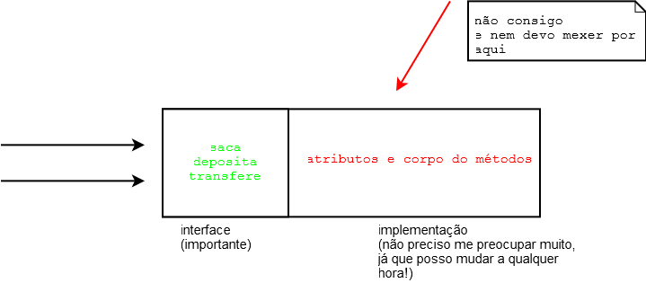

# Modificadores de Acesso e Atributos de Classe

_"A marca do homem imaturo é que ele quer morrer nobremente por uma causa,
enquanto a marca do homem maduro é querer viver modestamente por uma."--J. D. Salinger_

Ao final deste capítulo, você será capaz de:

* Controlar o acesso aos seus métodos, atributos e construtores por meio dos modificadores private
e public;
* Escrever métodos de acesso a atributos do tipo getters e setters;
* Escrever construtores para suas classes;
* Utilizar variáveis e métodos estáticos.


<!--@note
* Só usar o nome ENCAPSULAMENTO no final do capítulo.

* O _private_ deve ser muito associado ao encapsulamento. Encapsular é fundamental e deve ser visto
e revisto aqui, relembrando que o importante é a interface, e não o miolo dos métodos.

* Getters e setters não devem ser criados sem critério algum.

* O _static_ dá um bom trabalho para os alunos entenderem. Enfatize que '_static_' é sinônimo de '_da classe_',

* Exemplo de analogia de '_static_': um atributo '_static_' é quando eu anoto, na receita de
bolo, quantos bolos já fiz.

* Construtor não é método nem método especial.

* Importante comentar que estamos apenas começando a estudar a parte interessante de orientação a objetos.
É indispensável que, ao final da aula,os alunos tenham uma espécie de click em relação às vantagens.

* Comentar que quando não está explícito o modificador, este assume default. Veremos isso no capítulo 12 (pacotes).

Aniche: eu brinco com eles e falo que os seres vivos são encapsulados; todo animal come pela boca. Essa
é a interface. COMO cada sistema digestório atua é problema do ser vivo; está escondido!

Caso seja uma turma integral, os exercícios podem ser feitos após o almoço, mas este teria que
ser dado por volta de 12h30.
-->

<!--@todo exercício do identificador tem que primeiro pedir para criar a variável total com a motivação de totalizar o número de funcionários e depois, em outro exercício, pedir a criação do identificador, porque, senão, as pessoas confundem tudo com o static. -->


## Controlando o acesso
<!--@note
Pergunta: o que restringe, de fato, um saque inválido?

É importante colocar todas as situações assim como estão na apostila. Fazer todos os "TestaEstouro".
Deixar coisas no ar como: "o método saca restringe, de fato, um saque inválido?" e
"mas todo mundo pode sempre alterar o saldo direto?". Deixar claro que, proceduralmente, é impossível
resolver tal problema.

Diga olá ao private. Contar que só a classe consegue alterar o atributo, mais ninguém.
É interessante (mandatório!) lembrar do caso do CPF aqui. Comentar que, no exercício, terão
a comprovação de que acesso direto a um atributo private não compila.
-->

Um dos problemas mais simples que temos no nosso sistema de contas é que o método `saca` permite sacar independentemente de o saldo ser insuficiente. A seguir, você pode lembrar como está a classe `Conta`:

``` java
class Conta {
	String titular;
	int numero;
	double saldo;

	// ..

	void saca(double valor) {
		this.saldo = this.saldo - valor; 
	}
}
```

A classe a seguir mostra como é possível ultrapassar o limite de saque usando o método `saca`:

``` java
class TestaContaEstouro1 {
	public static void main(String[] args) {
		Conta minhaConta = new Conta();
		minhaConta.saldo = 1000.0;
		minhaConta.saca(50000); // saldo é só 1000!!
	}
}
```

Podemos incluir um `if` dentro do nosso método `saca()` para evitar a situação que resultaria em uma conta em estado inconsistente, com seu saldo abaixo de 0. Fizemos isso no capítulo de orientação a objetos básica.

Apesar de melhorar bastante, ainda temos um problema mais grave: ninguém garante que o usuário da classe  utilizará sempre o método para alterar o saldo da conta. O código a seguir faz isso diretamente:

``` java
class TestaContaEstouro2 {
	public static void main(String[] args) {
		Conta minhaConta = new Conta();
		minhaConta.saldo = -200; //saldo está abaixo de 0
	}
}
```

Como evitar isso? Uma ideia simples seria testar se não estamos sacando um valor maior do que o saldo toda vez que formos alterá-lo:

``` java
class TestaContaEstouro3 {

	public static void main(String[] args) {
		// a Conta
		Conta minhaConta = new Conta();
		minhaConta.saldo = 100;

		// quero mudar o saldo para -200
		double novoSaldo = -200;

		// testa se o novoSaldo é válido
		if (novoSaldo < 0) { // 
			System.out.println("Não posso mudar para esse saldo");
		} else {
			minhaConta.saldo = novoSaldo;
		}
	}
}
```

 

Esse código iria se repetir ao longo de toda nossa aplicação e, pior, alguém pode esquecer de fazer essa comparação em algum momento, deixando a conta na situação inconsistente. A melhor forma de resolver isso seria forçar quem usa a classe `Conta` a invocar o método `saca` e não permitir o acesso direto ao atributo. É o mesmo caso da validação de CPF.


Para fazer isso no Java, basta declarar que os atributos não podem ser acessados de fora da classe por meio da palavra-chave `private`:

``` java
class Conta {
	private double saldo;
	// ...
}
```


O `private` é um **modificador de acesso** (também chamado de **modificador de visibilidade**).

Marcando um atributo como privado, fechamos o seu acesso em relação a todas as outras classes e fazemos com que o seguinte código não compile:

``` java
class TestaAcessoDireto {
   public static void main(String[] args) {
	Conta minhaConta = new Conta();
	//Não compila! Você não pode acessar o atributo privado de outra classe.
	minhaConta.saldo = 1000;
   }
}
```

```
	TesteAcessoDireto.java:5 saldo has private access in Conta
									minhaConta.saldo = 1000;
										 	  ^
	1 error
```

Na orientação a objetos, é prática quase que obrigatória proteger seus atributos
com `private` (discutiremos outros modificadores de acesso em outros capítulos).

Cada classe é responsável por controlar seus atributos, portanto ela deve julgar se aquele novo valor é válido ou não. Essa validação não deve ser controlada por quem está usando a classe, e sim por ela mesma, centralizando essa responsabilidade e facilitando futuras mudanças no sistema. Muitas outras vezes, nem mesmo queremos que outras classes saibam da existência de determinado atributo, escondendo-o por completo, já que ele diz respeito ao funcionamento interno do objeto.

Repare: quem invoca o método `saca` não faz a menor ideia de que existe uma verificação para o valor do saque. Para quem for usar essa classe, basta saber o que o método faz e não como exatamente ele o faz (o que um método faz é sempre mais importante do que como ele faz: mudar a implementação é fácil, já mudar a _assinatura_ de um método gerará problemas).

A palavra-chave `private` também pode ser usada a fim de modificar o acesso a um método. Tal funcionalidade é utilizada em diversos cenários, os mais comuns são: quando existe um método que serve apenas para auxiliar a própria classe e quando há código repetido dentro de dois métodos da classe. Sempre devemos expôr o mínimo possível de funcionalidades com o intuito de criar um baixo acoplamento entre as nossas classes.


Da mesma maneira que temos o `private`, temos o modificador `public`, que permite a todos acessarem um determinado atributo ou método :

``` java
class Conta {
	//...
	public void saca(double valor) {
		//posso sacar até saldo
		if (valor > this.saldo){ 
			System.out.println("Não posso sacar um valor maior do que o saldo!");
		} else {
			this.saldo = this.saldo - valor;
		}
	}
}
```

> **E quando não há modificador de acesso?**
>
> Até agora, tínhamos declarado variáveis e métodos sem nenhum modificador como `private` e `public`. Quando isso acontece, o seu método ou atributo fica em um estado de visibilidade intermediário entre o `private` e o `public`, que veremos mais para frente, no capítulo de pacotes.

<!-- Comentário para separar quotes adjacentes. -->


É muito comum e faz todo sentido que seus atributos sejam `private`, e quase todos seus métodos sejam `public` (não é uma regra!). Desta forma, toda conversa de um objeto com outro é feita por troca de mensagens, isto é, acessando seus métodos. Algo muito mais educado que mexer diretamente em um atributo que não é seu.

Melhor ainda! O dia em que precisarmos mudar como é realizado um saque na nossa classe `Conta`, adivinhe o local onde precisaríamos modificar? Apenas no método `saca`, o que faz pleno sentido. Por exemplo, imagine cobrar CPMF de cada saque: basta você modificar ali, e nenhum outro código, fora a classe `Conta`, precisará ser recompilado. Além do mais: as classes as quais usam esse método nem precisam ficar sabendo de tal modificação. Você precisa apenas recompilar aquela classe e substituir aquele arquivo `.class`. Ganhamos muito em esconder o funcionamento do nosso método na hora de fazer manutenção e modificações.

## Encapsulamento
<!--@note
Filosofar um pouco com exemplos práticos de ideias de encapsulamento. Bons exemplos são:

* No carro, você sabe que precisa usar o freio, embreagem e acelerador.
Você sabe como que o acelerador faz o carro andar?

* Em relação ao teclado do computador, você sabe por qual trilha passa energia após digitar uma tecla?

Isso aqui é praticamente uma introdução ao conceito de Interface! É interessante que a definição de interface já esteja na cabeça dos alunos antes mesmo de saberem que há uma palavra-chave totalmente relacionada a isso.

Explicar que o encapsulamento permite nossa classe ser passível de mudanças
(lembrá-los de que os métodos públicos são chamados de interface da classe). Um exemplo o qual ilustra bem isso é utilizar-se de uma classe já existente, por exemplo, Conta, e criar uma classe que trabalhará com ela. Depois, alterar a classe Conta para ficar claro que a classe a qual a utiliza (particularmente, costumo dizer: "eu tenho mil classes iguais àquela.") não sofre consequências com as alterações. Não falar de getters/setters ainda.

* Resolver o problema do CPF colocando o código na lousa.
-->


O que começamos a ver nesse capítulo é a ideia de **encapsular**, isto é, ocultar todos os membros de uma classe (como vimos acima), além de esconder como funcionam as rotinas (no caso, métodos) do nosso sistema.

Encapsular é **fundamental** para seu sistema ser suscetível a mudanças: não precisaremos mudar uma regra de negócio em vários lugares, mas, sim, em apenas um único lugar, já que essa regra está **encapsulada** (veja o caso do método saca).



O conjunto de métodos públicos de uma classe é também chamado de **interface da classe**, pois essa é a única maneira pela qual você se comunica com objetos dessa classe.

> **Programando voltado à interface, e não à implementação**
>
> É sempre bom programar pensando na interface da sua classe, em como seus usuários estarão utilizando-a, e não somente em como ela funcionará.
>
> A implementação em si, o conteúdo dos métodos, não tem tanta importância para o usuário dessa classe, pois ele só precisa saber o que cada método pretende fazer, e não como ele o faz, porque isso pode mudar com o tempo.
>
> Essa frase vem do livro Design Patterns, de Eric Gamma et al., que é cultuado no meio da orientação a objetos.

<!-- Comentário para separar quotes adjacentes. -->


Sempre que acessamos um objeto, utilizamos sua interface. Existem diversas analogias fáceis no mundo real:


* Quando você dirige um carro, o que lhe importa são os pedais e o volante (interface), e não o motor o qual você está usando (implementação). É claro: um motor diferente pode lhe dar melhores resultados, mas **o que ele faz** é o mesmo que um motor menos potente, a diferença está em **como ele faz**. Para trocar um carro a álcool por um a gasolina, você não precisa reaprender a dirigir (trocar a implementação dos métodos não precisa mudar a interface, fazendo com que as outras classes continuem usando-os da mesma maneira).

* Todos os celulares fazem a mesma coisa (interface). Eles têm maneiras (métodos) de discar, ligar, desligar, atender, etc. O que muda é como eles o fazem (implementação). Mas repare que, para efetuar uma ligação, pouco importa se o celular é iPhone ou Android, visto que isso fica encapsulado na implementação (aqui são os circuitos).


Já temos conhecimentos suficientes para resolver aquele problema da validação de CPF:

``` java
class Cliente {
	private String nome;
	private String endereco;
	private String cpf;
	private int idade;

	public void mudaCPF(String cpf) {
		validaCPF(cpf);
		this.cpf = cpf;
	}

	private void validaCPF(String cpf) {
		// série de regras aqui falha caso não seja válida.
	}

	// ..
}
```

Se alguém tentar criar um `Cliente` e não usar o `mudaCPF` para alterar um `CPF` diretamente, receberá um erro de compilação, já que o atributo `CPF` é **privado**. E quando você não precisar verificar o CPF de quem tem mais de 60 anos? Seu método fica o seguinte:

``` java
public void mudaCPF(String cpf) {
	if (this.idade <= 60) {
		validaCPF(cpf);
	}
	this.cpf = cpf;
}
```

O controle sobre o `CPF` está centralizado: ninguém consegue acessá-lo sem passar por aí. A classe `Cliente` é a única responsável pelos seus próprios atributos!

## Getters e setters

O modificador `private` faz com que ninguém consiga modificar e tampouco ler o atributo em questão. Com isso, temos um problema: como fazer para mostrar o `saldo` de uma `Conta`, uma vez que nem mesmo podemos acessá-lo para leitura?

Precisamos, então, arranjar **uma maneira de** fazer esse acesso. Sempre que precisamos arrumar **uma forma de fazer alguma coisa com um objeto**, utilizamos os métodos! Assim, criemos um método, digamos `pegaSaldo`, para realizar essa simples tarefa:

``` java
class Conta {

	private double saldo;

	// outros atributos omitidos
	
	public double pegaSaldo() {
		return this.saldo;
	}
	
	// deposita() e saca() omitidos
}
```

Para acessarmos o saldo de uma conta, podemos fazer:

``` java
class TestaAcessoComPegaSaldo {
   public static void main(String[] args) {
	Conta minhaConta = new Conta();
	minhaConta.deposita(1000);
	System.out.println("Saldo: " + minhaConta.pegaSaldo());
   }
}
```

 

<!--@note
Pergunta: preciso colocar getters/setters para todos os atributos?
Não utilizar o getLimite() e nem o setSaldo(). Alterar o getSaldo() como na apostila para mostrar que getters não fazem necessariamente trabalhos bobos como `return this.x`.
-->

A fim de permitir o acesso aos atributos (já que eles são `private`) de uma maneira controlada, a prática mais comum é criar dois métodos, um que retorna o valor, e outro o qual muda o valor.


A convenção para esses métodos é de colocar a palavra `get` ou `set` antes do nome do atributo. Por exemplo, a nossa conta com `saldo`, `limite` e `titular` fica assim caso desejarmos dar o acesso da leitura e escrita a todos os atributos:

``` java
class Conta {

	private String titular;
	private double saldo;
	
	public double getSaldo() {
		return this.saldo;
	}

	public void setSaldo(double saldo) {
		this.saldo = saldo;
	}

	public String getTitular() {
		return this.titular;
	}

	public void setTitular(String titular) {
		this.titular = titular;
	}
}
```

É uma má prática criar uma classe e, logo em seguida, fazer getters e setters para
todos seus atributos. Você só deve criar um getter ou setter se tiver a real necessidade. Repare que, nesse exemplo, `setSaldo` não deveria ter sido criado, pois queremos que todos usem `deposita()` e `saca()`.

Outro detalhe importante: um método `getX` não, necessariamente, retorna o valor de um atributo que chama `X` do objeto em questão. Isso é interessante para o encapsulamento. Imagine a situação: queremos que o banco sempre mostre, como `saldo`, o valor do limite somado ao saldo (uma prática comum dos bancos que costumam iludir seus clientes). Poderíamos sempre chamar `c.getLimite() +
c.getSaldo()`, mas isso geraria uma situação de replace all quando precisássemos mudar como o saldo é mostrado. Podemos encapsular isso em um método e, por que não, dentro do próprio `getSaldo`? Repare:

``` java
class Conta {

	private String titular;
	private double saldo;
	private double limite; // adicionando um limite a conta

	public double getSaldo() {
		return this.saldo + this.limite;
	}

	// deposita() saca() e transfere() omitidos

	public String getTitular() {
		return this.titular;
	}

	public void setTitular(String titular) {
		this.titular = titular;
	}
}
```

O código acima não possibilita a chamada do método `getLimite()`, posto que ele não existe. E nem deve existir enquanto não houver essa necessidade. O método `getSaldo()` não devolve simplesmente o `saldo`, e sim o que queremos que seja mostrado como se fosse o `saldo`. Utilizar getters e setters não só ajuda você a proteger seus atributos como também possibilita ter de mudar algo em um
só lugar; chamamos isso de encapsulamento, pois esconde a maneira pela qual os objetos guardam seus dados. É uma prática muito importante.

Nossa classe está totalmente pronta? Isto é, existe a chance de ela ficar com saldo menor que 0? Pode parecer que não, mas e se depositarmos um valor negativo na conta? Ficaríamos com menos dinheiro que o permitido embora não esperássemos por isso. A fim de nos proteger disso, basta mudarmos o método `deposita()` para que ele verifique se o valor é necessariamente positivo.

Depois disso, precisaríamos mudar mais algum outro código? A resposta é não, graças ao encapsulamento dos nossos dados.

> **Cuidado com os getters e setters!**
>
> Como já dito, não devemos criar getters e setters sem um motivo explícito. No blog da Caelum, há um artigo que ilustra bem esses casos:
>
> http://blog.caelum.com.br/2006/09/14/nao-aprender-oo-getters-e-setters/

<!-- Comentário para separar quotes adjacentes. -->


## Construtores
<!--@note
* Deixar claro que construtores não são métodos.
* Pergunta: como as classes eram criadas se não tinham construtor?
* Explicar o construtor Default.
* Apenas comentar que, a partir de um construtor, podemos chamar outro construtor.
-->


Quando usamos a palavra-chave `new`, estamos construindo um objeto. Sempre quando o `new` é chamado, ele executa o **construtor da classe**. O construtor da classe é um bloco declarado com o **mesmo nome** que a classe:

``` java
class Conta {
	String titular;
	int numero;
	double saldo;

	// construtor
	Conta() {
		System.out.println("Construindo uma conta.");
	}

	// ..
}
```

Então, quando fizermos:

``` java
Conta c = new Conta();
```

 

A mensagem "construindo uma conta" aparecerá. É como uma rotina de inicialização que é chamada sempre que um novo objeto é criado. Um construtor pode parecer, mas **não é** um método.

> **O construtor default**
>
> Até agora, as nossas classes não tinham nenhum construtor. Então, como é que era possível dar `new` se todo `new` chama um construtor **obrigatoriamente**?
>
> Quando você não declara nenhum construtor na sua classe, o Java cria um para você. Esse construtor é o **construtor default**. Ele não recebe nenhum argumento e o seu corpo é vazio.
>
> A partir do momento que você declara um construtor, o construtor default não é mais fornecido.

<!-- Comentário para separar quotes adjacentes. -->


O interessante é que um construtor pode receber um argumento, inicializando, assim, algum tipo de
informação:

``` java
class Conta {
	String titular;
	int numero;
	double saldo;

	// construtor
	Conta(String titular) {
		this.titular = titular;
	}

	// ..
}
```

Esse construtor recebe o titular da conta. Desta maneira, quando criarmos uma conta, ela já terá um determinado titular.

``` java
String carlos = "Carlos";
Conta c = new Conta(carlos);
System.out.println(c.titular);
```

 

## A necessidade de um construtor

Tudo estava funcionando até agora. Para que utilizamos um construtor?

A ideia é bem simples. Se toda conta precisa de um titular, como obrigar todos os objetos que forem criados a ter um valor desse tipo? É só criar um único construtor que receba essa String!

O construtor se resume a isso! Dar possibilidades ou obrigar o usuário de uma classe a passar argumentos para o objeto durante o seu processo de criação.

Por exemplo, não podemos abrir um arquivo para leitura sem dizer qual é o nome do arquivo que desejamos ler. Portanto, nada mais natural que passar uma `String` representando o nome de um arquivo na hora de criar um objeto do tipo de leitura de arquivo, e que isso seja obrigatório.

Você pode ter mais de um construtor na sua classe, e, no momento do `new`, o construtor apropriado será escolhido.

> **Construtor: um método especial?**
>
> Um construtor __não é__ um método. Algumas pessoas o chamam de um método especial, mas, definitivamente, não o é, uma vez que não tem retorno e só é chamado durante a construção do objeto.

<!-- Comentário para separar quotes adjacentes. -->


> **Chamando outro construtor**
>
> Um construtor só pode rodar durante a construção do objeto, isto é, você nunca conseguirá chamar o construtor em um objeto já construído. Porém, durante a construção de um objeto, você pode fazer com que um construtor chame outro para não ter de ficar copiando e colando:
>
> ``` java
> class Conta {
> 	String titular;
> 	int numero;
> 	double saldo;
>
> 	// construtor
> 	Conta (String titular) {
> 		//	 faz mais uma série de inicializações e configurações
> 		this.titular = titular;
> 	}
>
> 	Conta (int numero, String titular) {
> 		this(titular); // chama o construtor que foi declarado acima
> 		this.numero = numero;
> 	}
>
> 	//..
> }
> ```

<!-- Comentário para separar quotes adjacentes. -->


Existe um outro motivo, o outro lado dos construtores: facilidade. Às vezes, criamos um construtor que recebe diversos argumentos para não obrigar o usuário de uma classe a chamar diversos métodos do tipo `'set'`.

No nosso exemplo do CPF, podemos forçar que a classe `Cliente` receba no mínimo o CPF. Dessa maneira, um `Cliente` já será construído e terá um CPF válido.

> **Java Bean**
>
> Quando criamos uma classe com todos os atributos privados, seus getters, setters e um construtor vazio (padrão), na verdade, estamos criando um Java Bean (mas não confunda com EJB, que é Enterprise Java Beans).
>

<!-- Comentário para separar quotes adjacentes. -->


## Atributos de classe
<!--@note
Uma analogia boa é dizer que quero marcar quantos bolos faço com base em uma receita. Onde marcar?
Ao marcar em atributos normais, é como se eu marcasse no bolo e depois entregasse cada bolo para a pessoa.
Cada bolo ficaria marcado com 1, mas eu não saberia o total.

Então, a ideia é marcar na receita do bolo que é única e centralizada. A receita é a classe, e marcar
nela significa usar static.
-->

Nosso banco também quer controlar a quantidade de contas existentes no sistema. Como poderíamos fazer isso? A ideia mais simples é:

``` java
Conta c = new Conta();
totalDeContas = totalDeContas + 1;
```

Aqui, voltamos em um problema parecido com o da validação de CPF. Estamos espalhando um código por toda aplicação, e quem garante que conseguiremos lembrar de incrementar a variável `totalDeContas` toda vez?

Tentamos, então, passar para a seguinte proposta:

``` java
class Conta {
	private int totalDeContas;
	//...

	Conta() {
		this.totalDeContas = this.totalDeContas + 1;
	}
}
```

Quando criarmos duas contas, qual será o valor do `totalDeContas` de cada uma delas? Será um, pois cada uma tem essa variável. **O atributo é de cada objeto**.


Seria interessante, então, que essa variável fosse **única**, compartilhada por todos os objetos dessa classe. À vista disso, quando mudasse por meio de um objeto, o outro enxergaria o mesmo valor. Para fazer isso em Java, declaramos a variável como `static`.

``` java
private static int totalDeContas;
```

Quando declaramos um atributo como `static`, ele passa a não ser mais um atributo de cada objeto, e sim um **atributo da classe**. A informação fica guardada pela classe e não é mais individual para cada objeto.

Para acessarmos um atributo estático, não usamos a palavra-chave `this`, mas, sim, o nome da classe:

``` java
class Conta {
	private static int totalDeContas;
	//...

	Conta() {
		Conta.totalDeContas = Conta.totalDeContas + 1;
	}
}
```

Já que o atributo é privado, como podemos acessar essa informação a partir de outra classe? Precisamos de um getter para ele!

``` java
class Conta {
	private static int totalDeContas;
	//...

	Conta() {
		Conta.totalDeContas = Conta.totalDeContas + 1;
	}

	public int getTotalDeContas() {
		return Conta.totalDeContas;
	}
}
```

Como fazemos, então, para saber quantas contas foram criadas?

``` java
Conta c = new Conta();
int total = c.getTotalDeContas();
```

Precisamos criar uma conta antes de chamar o método. Isso não é legal, pois gostaríamos de saber quantas contas existem sem precisar ter acesso a um objeto-conta. A ideia aqui é a mesma, transformar esse método que todo objeto-conta tem em um método de toda a classe. Usamos a palavra `static` de novo, mudando o método anterior.

``` java
public static int getTotalDeContas() {
	return Conta.totalDeContas;
}
```

Para acessar esse novo método:

``` java
int total = Conta.getTotalDeContas();
```

Repare que estamos não chamando um método com uma referência a uma `Conta`, e sim usando o nome da classe.

> **Métodos e atributos estáticos**
>
> Métodos e atributos estáticos só podem acessar outros métodos e atributos estáticos da mesma classe, o que faz todo sentido, dado que dentro de um método estático, não temos acesso à referência `this`, pois um método estático é chamado por meio da classe, e não de um objeto.
>
> O `static` realmente apresenta um "cheiro" procedural, porém, em muitas vezes, é necessário.

<!-- Comentário para separar quotes adjacentes. -->


## Um pouco mais...

* Em algumas empresas, o UML é amplamente utilizado. Às vezes, o programador
o recebe já pronto e completo, devendo somente preencher a implementação e
 seguir, à risca, o UML. O que você acha dessa prática? Quais as
vantagens e desvantagens?

* Se uma classe só tem atributos e métodos estáticos, que conclusões podemos
tirar? O que lhe parece um método estático em casos como esses?

* No caso de atributos booleanos, pode-se usar, no lugar do `get`, o sufixo
`is`. Desse modo, caso tivéssemos um atributo booleano `ligado`
em vez de `getLigado`, poderíamos ter `isLigado`.

<!--  Comentário para separar quotes adjacentes. -->
## Exercícios: encapsulamento, construtores e static

<!--@note
No exercício de colocar atributos private, se faltar tempo, sugira somente a variável membro `salario`. Se fizer todos, consumirá bastante tempo.
-->
1. O que é necessário fazer para **garantirmos** que os atributos da classe Conta não sejam acessados de forma direta em outra classe a qual não seja a própria classe Conta?
1. Após deixar os atributos da classe Conta com acesso restrito (privado), tente criar uma `Conta`
	na classe `TestaConta` dentro do `main` e modificar ou ler os atributos da conta criada. O que acontece?

	Crie apenas os getters e setters necessários na sua classe `Conta`. Pense sempre se é preciso criar
	cada um deles.

	Não copie e cole! Aproveite para praticar a sintaxe. Logo, passaremos a usar
	o Eclipse e aí, sim, teremos procedimentos mais simples destinados a esse tipo de
	tarefa.

	Repare que o método `calculaRendimento` parece também um getter. Aliás,
	seria comum alguém nomeá-lo de `getRendimento`. Getters não precisam apenas
	retornar atributos, eles podem trabalhar com esses dados.
1. Altere suas classes que acessam e modificam atributos de uma `Conta` para utilizar os getters e setters recém-criados.
1. Faça com que sua classe `Conta` possa receber, opcionalmente, o nome
	do titular da `Conta` durante a criação do objeto.

	<!--@note
	Aproveite para brincar com o pessoal. Pergunte quantos erros de
	compilação cada um teve, incentivando a quem teve mais!!
	-->

	<!--@answer
	``` java filename="Conta.java"
		public class Conta {
			private String titular;
			private int numero;
			private String agencia;
			private double saldo;
			private Data dataDeAbertura;

			public void saca(double valor) {...}

			public void deposita(double valor) {...}

			public double calculaRendimento() {...}

			public String recuperaDadosParaImpressao() {...}
		}
	```
	-->

	<!--@answer
	``` java filename="Conta.java"
		public class Conta {
			// atributos

			public double getRendimento() {
				return this.saldo * 0.1;
			}

			public String getTitular() {
				return this.titular;
			}

			public void setTitular (String titular) {
				this.titular = titular;
			}

			public int getNumero() {
				return this.numero;
			}

			public void setNumero (int numero) {
				this.numero = numero;
			}

			public String getAgencia() {
				return this.agencia;
			}

			public void setAgencia (String agencia) {
				this.agencia = agencia;
			}

			public double getSaldo() {
				return this.saldo;
			}

			public void setSaldo (double saldo) {
				this.saldo = saldo;
			}

			public Data getDataDeAbertura() {
				return this.dataDeAbertura;
			}

			public void setDataDeAbertura (Data dataDeAbertura) {
				this.dataDeAbertura = dataDeAbertura;
			}
		}
	```
	-->

	<!--@answer
	``` java filename="TestaConta.java"
		class TestaConta {
			public static void main(String[] args) {
				Conta c1 = new Conta("Hugo");
				c1.setNumero(123);
				c1.deposita(50);
				c1.setDataDeAbertura(new Data(1, 7, 2009));

				System.out.println(c1.recuperaDadosParaImpressao());
			}
		}
	```
	-->

	<!--@answer
	``` java filename="TestaConta.java"
		public class Conta {
			// atributos

			public Conta() {}

			public Conta(String titular) {
				this.titular = titular;
			}

			// métodos
		}
	```
	-->

1. (Opcional) Adicione um atributo, na classe `Conta` de tipo `int`, que
	se chama identificador. Este deve ter um valor único para cada
	instância do tipo `Conta`. A primeira `Conta` instanciada tem
	identificador 1, a segunda, 2, e assim por diante. Você deve utilizar os
	recursos aprendidos aqui na resolução desse problema.

	Crie um getter para o identificador. Devemos ter um setter?

	<!--@answer
	``` java h="2,6," filename="TestaConta.java"
		public class Conta {
			private int identificador;
			private static int proximoIdentificador;

			public Conta(String titular) {
				this.titular = titular;
				this.identificador = proximoIdentificador++;
			}

			public int getIdentificador() {
				return this.identificador;
			}

			// restante da classe
		}
	```

	Não faz sentido que o identificador tenha um setter, uma vez que, pela lógica
	da aplicação, o `identificador` é um número único para cada funcionário
	no sistema.
	-->

1. (Opcional) Como garantir que datas como 31/2/2021 não sejam aceitas pela sua
	classe `Data`?
	<!--@answer
	Você pode fazer a autenticação das datas válidas ser chamada já no
	construtor da classe Data ao passarmos o dia, mês e ano. Nesse
	momento, a única forma de indicar a existência de um erro que você aprendeu é
	imprimir uma mensagem no terminal avisando-o. Contudo, mais para a frente,
	veremos uma forma muito mais elegante de tratar esses casos.

	``` java
		public class Data {

			public Data(int dia, int mes, int ano) {
				this.___ = ___;
				if (! isDataViavel(dia, mes, ano)) {
					System.out.println("A data " + formata() + " não existe!");
				}
			}

			private boolean isDataViavel(int dia, int mes, int ano) {
				if (dia <= 0 || mes <= 0) {
					return false;
				}

				int ultimoDiaDoMes = 31; // por padrao são 31 dias
				if (mes == 4 || mes == 6 || mes == 9 || mes == 11 ) {
					ultimoDiaDoMes = 30;
				} else if (mes == 2) {
					if (ano % 4 == 0) {
						ultimoDiaDoMes = 29;
					} else {
						ultimoDiaDoMes = 28;
					}
				}
				if (dia > ultimoDiaDoMes) {
					return false
				}

				return true;
			}
		}
	```
	-->

1. (Opcional) Imagine que tenhamos a classe `PessoaFisica` a qual tem um CPF como atributo.
	Como garantir que alguma pessoa física tenha CPF inválido e
	tampouco seja criada uma `PessoaFisica` sem CPF inicial?
	(Suponha que já exista um algoritmo de validação de CPF:
	este deve passar por um método `valida(String x)...`.)
	<!--@answer
	Você pode fazer a validação ser chamada no construtor e, por ora,
	imprimir a mensagem no console. No capítulo 11, veremos uma forma de
	realmente impedir a criação do objeto caso essa validação não passe.
	-->


## Desafios
1. Por que esse código não compila?

	``` java
		class Teste {
			int x = 37;
			public static void main(String [] args) {
				System.out.println(x);
			}
		}
	```

	<!--@answer
	O `main` é um método estático, isto é: ele não é do objeto, é da classe.
	Já o atributo `x` não tem a palavra `static` e, portanto, é do objeto.

	Para rodar o `main`, não há necessidade ou garantia de que teremos um
	objeto do tipo `Teste`. Então, não há como garantir que o `x` sequer
	existirá.
	-->

1. Imagine que haja uma classe `FabricaDeCarro`, e quero garantir que só exista um
	objeto desse tipo em toda a memória. Não há uma palavra-chave especial para
	isso em Java. Então, teríamos de fazer nossa classe de tal maneira que ela respeitasse
	essa nossa necessidade. Como faríamos isso? (Pesquise: singleton design pattern.)
