# Eclipse IDE
_"Dá-se importância aos antepassados quando já não temos nenhum."--François Chateaubriand_

Neste capítulo, você será apresentado ao Ambiente de Desenvolvimento Eclipse e às suas principais
funcionalidades.

<!--@note

* É fundamental, neste capítulo, que os alunos fiquem boquiabertos em relação
ao Eclipse. Toda e qualquer criatividade para alcançar este objetivo é valida.

* Explicar o que é o Eclipse e destacar que é feito em Java (cabe um comentário
aqui para informar que o Visual Studio é feito em C/C++, em vez de .Net). Contudo, lembrar
que não é instalável e tampouco é portável devido ao SWT.

* Comentar a variedade de IDEs para trabalhar com Java. A lista a seguir tem
algumas sugestões: NetBeans, IntelliJ, WSAD, JDeveloper, JBuilder, JCreator,
Java Studio Creator e Java Web Studio.

* Comentar um pouco as Views e que estas são agrupadas em Perspectivas de
acordo com a necessidade que se tem no momento. Citar o caso em que se vai
debugar ou desenvolver. O que eu preciso quando vou debugar?

* Daqui em diante, seguir a apostila passo a passo, não deixando nenhum aluno
para trás. Fazer cada comando pouco a pouco, todos juntos.

* Explicar como reabrir Views. É muito comum fecharem o Console
(basta um CTRL+3 e digitar o nome da View).

* Mostrar também o Generate getters and setters, e algo muito legal de ser feito
é utilizar o Local Repository do Eclipse. Pedir para deletar os .java e
restaurá-los depois.

* Lembre-os de que veremos, várias vezes, o Eclipse e analisaremos bastante as
teclas de atalho e telas para que eles não se preocupem em absorver tudo de
uma vez.

-->

## O Eclipse

O Eclipse (http://www.eclipse.org) é uma IDE (Integrated Development Environment). Diferente de uma
RAD, na qual o objetivo é desenvolver-se o mais rápido possível por meio do _arrastar-e-soltar do mouse_, e
montanhas de código são geradas em background, uma IDE o auxilia no desenvolvimento, evita se
intrometer e fazer muita mágica.

O Eclipse é a IDE líder de mercado, a qual é formada por um consórcio liderado pela IBM e tem seu código
livre.

Veremos aqui os principais recursos do Eclipse. Você perceberá que ele evita, ao máximo, atrapalhá-lo
e apenas gera trechos de códigos óbvios, sempre ao seu comando. Existem também centenas de plugins
gratuitos para gerar diagramas UML, suporte a servidores de aplicação, visualizadores de banco de
dados e muitos outros.

Baixe o Eclipse do site oficial http://www.eclipse.org. Apesar de ser escrito em Java, a biblioteca
gráfica usada no Eclipse, chamada de SWT, usa componentes nativos do sistema operacional. Por isso, você
deve baixar a versão correspondente ao seu sistema operacional.

Descompacte o arquivo e rode o executável.

> **Outras IDEs**
>
> Uma outra IDE open source famosa é o Netbeans da Oracle. (http://www.netbeans.org).
>
> Além dessas, Oracle, Borland e a própria IBM têm IDEs comerciais e algumas versões mais
> restritas de uso livre.
>
> A empresa JetBrains desenvolve o IntelliJ IDEA, uma IDE paga que tem atraído muitos adeptos.

<!-- Comentário para separar quotes adjacentes. -->


## Apresentando o Eclipse

Clique no ícone do Eclipse no seu desktop.

A primeira pergunta que ele lhe faz é que workspace você usará. Workspace define o diretório em que
as suas configurações pessoais e os seus projetos serão gravados.

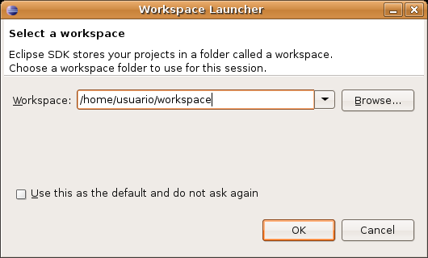

Você pode deixar o diretório pré-definido.

Logo em seguida, uma tela de nome "Welcome" será aberta, na qual você tem diversos links para tutoriais e ajuda.
Clique em Workbench.

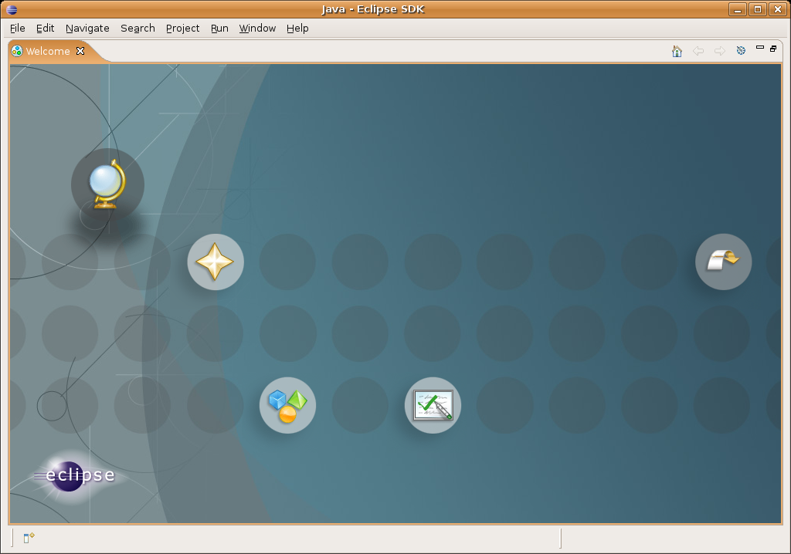

## Views e Perspective

Feche a tela de nome "Welcome" e você verá a imagem abaixo. Nessa tela, destacamos as Views (em linha contínua)
e as Perspectives (em linha pontilhada) do Eclipse.

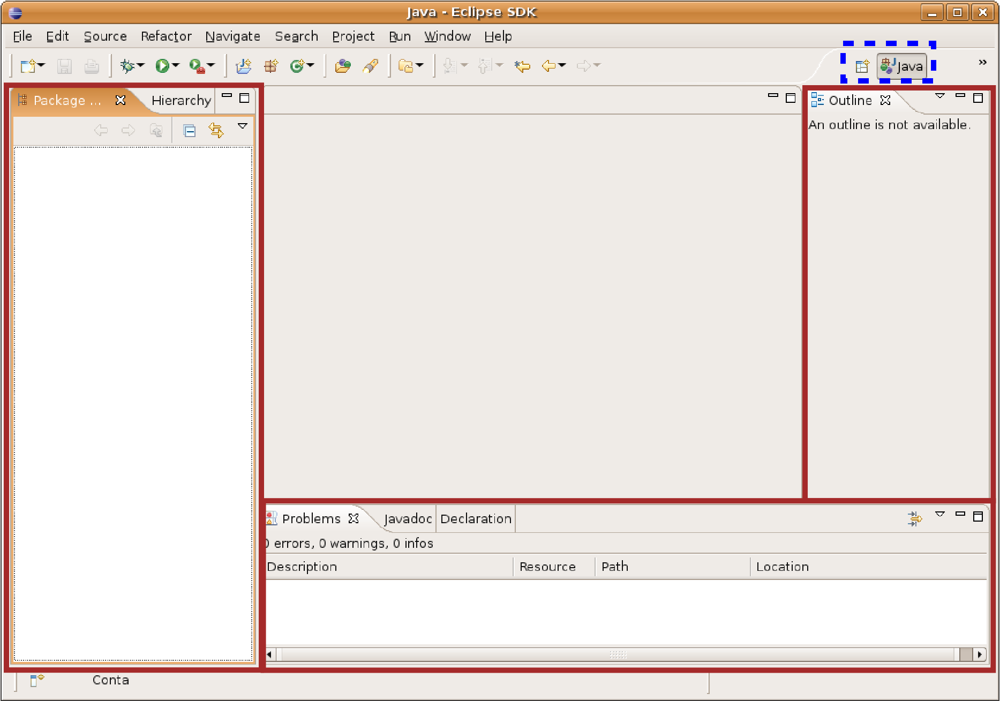

Mude para a perspectiva Resource, clique no ícone ao lado da perspectiva Java, selecione Other e
depois, Resource. Nesse momento, trabalharemos com esta perspectiva antes da de Java, pois ela tem
um conjunto de Views mais simples.

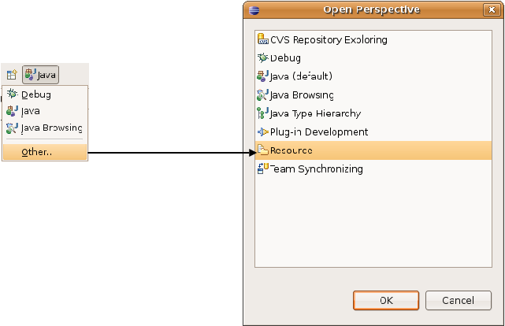

A View Navigator mostra a estrutura de diretório assim como está no sistema de arquivos. A View
Outline mostra um resumo das classes, interfaces e enumerações declaradas no arquivo em Java, atualmente
editado (serve também para outros tipos de arquivos).

No menu **Window -> Show View -> Other**, você pode ver as dezenas de Views que já vêm embutidas no
Eclipse. Acostume-se a sempre procurar novas Views, porque elas podem ajudá-lo em diversas tarefas.

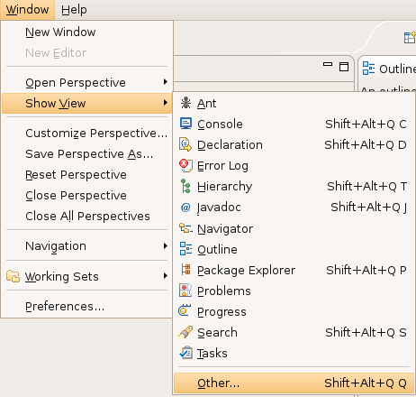

## Criando um projeto novo

Vá em **File -> New -> Project**, seleciona Java Project e clique em Next.

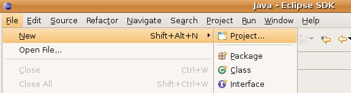

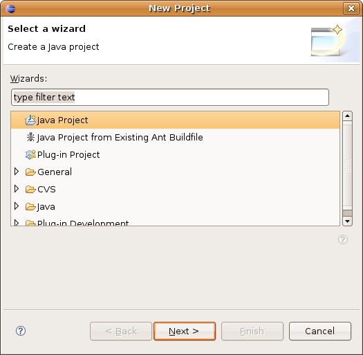

<!--@todo Trocar screenshot para o projeto se chamar fj11-contas. -->

Crie um projeto chamado `fj11-contas`.

Você pode chegar nessa mesma tela ao clicar com o botão direto no espaço da View Navigator e
seguir o mesmo menu. Nela, configure seu projeto conforme a imagem abaixo:

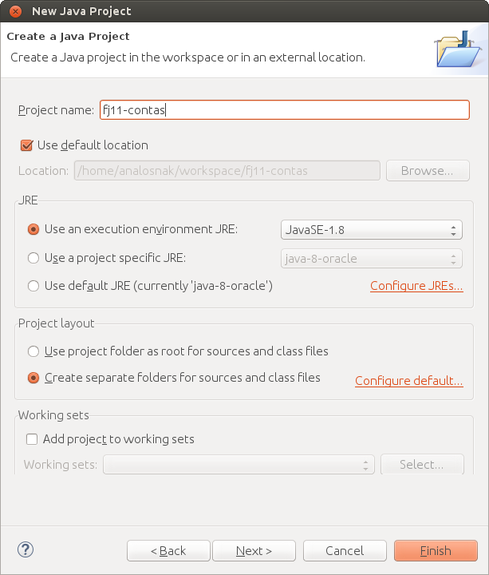

Isto é, marque create separate source and output folders, pois, deste modo, seus arquivos .java e
.class estarão em diretórios diferentes para você trabalhar de uma maneira mais organizada.

Clique em Finish. O Eclipse pedirá a troca da perspectiva para Java. Escolha **No** a fim de
permanecer em Resource. Na View _Navigator_, você verá o novo projeto, além das suas pastas e arquivos:

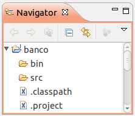

Iniciaremos nosso projeto criando a classe Conta. Para isso, vá em File -> New -> Other -> Class.
Clique em Next e crie a classe seguindo a tela abaixo:

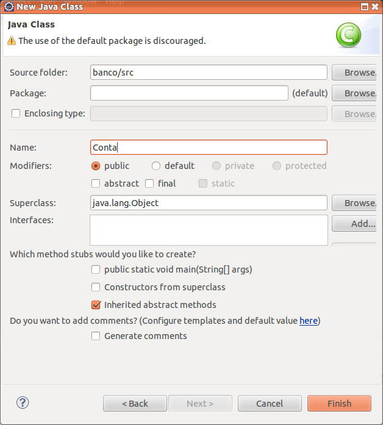

Clique em Finish. O Eclipse tem diversos Wizards, mas o usaremos ao mínimo. O interessante é
usar o _code assist_ e _quickfixes_, disponibilizados pela ferramenta, os quais veremos em seguida. Não se atente
às milhares de opções de cada Wizard, pois a parte mais interessante do Eclipse não é essa.

Escreva o método `deposita` conforme mostrado abaixo e note que o Eclipse reclama de erro em `this.saldo`, pois
este atributo não existe.

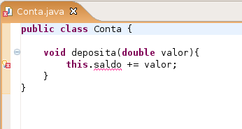

Usaremos o recurso do Eclipse de **quickfix**. Coloque o cursor em cima do erro e aperte Ctrl + 1.

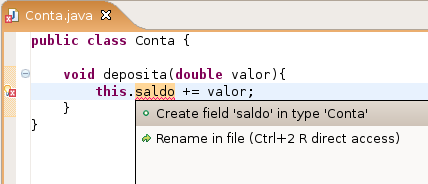

O Eclipse sugerirá possíveis formas de consertar o erro; uma delas é, justamente, criar o campo
`saldo` na classe `Conta`, que é nosso objetivo. Clique nessa opção.

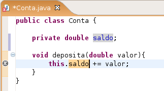

Esse recurso de quickfixes, acessível pelo Ctrl + 1, é uma das grandes facilidades do Eclipse e é
extremamente poderoso. Por meio de seu uso, é possível corrigir boa parte dos erros na hora de programar e,
como fizemos, economizar a digitação de certos códigos repetitivos. No nosso exemplo, não precisamos
criar o campo antes porque o Eclipse faz isso para nós. Ele até acerta a tipagem, dado que o estamos somando a um double. O `private` é colocado por motivos que já estudamos.

Vá ao menu File -> Save para gravar. Ctrl + S tem o mesmo efeito.

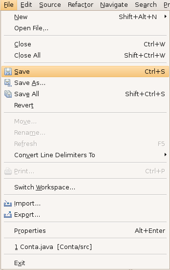

## Criando o main

Crie uma nova classe chamada `Principal`. Colocaremos um método `main` para testar nossa Conta.
Em vez de digitar todo o método `main`, usaremos o **code assist** do Eclipse. Escreva só `main`
e aperte Ctrl + Espaço logo em seguida.

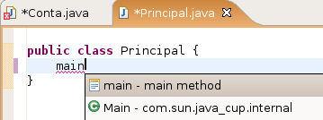

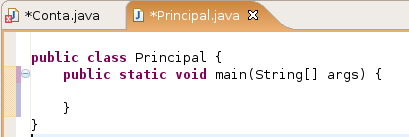

O Eclipse sugerirá a criação do método `main` completo; selecione essa opção. O Ctrl + Espaço é
chamado de **code assist** e, assim como os quickfixes, são de extrema importância. Experimente usar o
code assist em diversos lugares.

Dentro do método `main`, comece a digitar o seguinte código:

``` java
Conta conta = new Conta();
conta.deposita(100.0);
```

Observe que, na hora de invocar o método sobre o objeto do tipo Conta, o Eclipse sugere os métodos possíveis.
Esse recurso é bastante útil, principalmente, quando estivermos programando com classes que não são as
nossas, como da API do Java. O Eclipse aciona tal recurso quando você digita o ponto logo após um
objeto (pode também usar o Ctrl + Espaço para acioná-lo).

Imprimiremos o saldo com `System.out.println`. Mas, mesmo nesse código, o Eclipse nos
ajuda. Escreva `syso` e aperte Ctrl + Espaço que o Eclipse escreverá System.out.println() para você.

Para imprimir, chame o `conta.getSaldo()`:

``` java
System.out.println(conta.getSaldo());
```

Note que o Eclipse acusará erro em `getSaldo()`, porque esse método não existe na classe `Conta`.
Usaremos Ctrl + 1 em cima do erro para corrigir o problema:

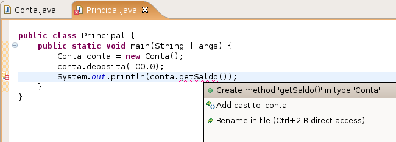

O Eclipse sugere criar um método `getSaldo()` na classe `Conta`. Selecione essa opção, e o método
será inserido automaticamente.

``` java
	public Object getSaldo() {
		// TODO Auto-generated method stub
		return null;
	}
```

Ele gera um método não exatamente como queríamos, pois nem sempre há como o Eclipse ter, de antemão, informações
suficientes para que ele acerte a assinatura do seu método. Modifique o método `getSaldo` como se mostra a seguir:

``` java
	public double getSaldo() {
		return this.saldo;
	}
```

Esses pequenos recursos do Eclipse são de extrema utilidade. Dessa maneira, você pode programar sem
se preocupar com métodos que ainda não existem, visto que, a qualquer momento, ele pode gerar o
esqueleto (a parte da assinatura do método).

## Executando o main

Rodaremos o método `main` dessa nossa classe. No Eclipse, clique com o botão direito no arquivo
`Principal.java` e vá em Run as... Java Application.

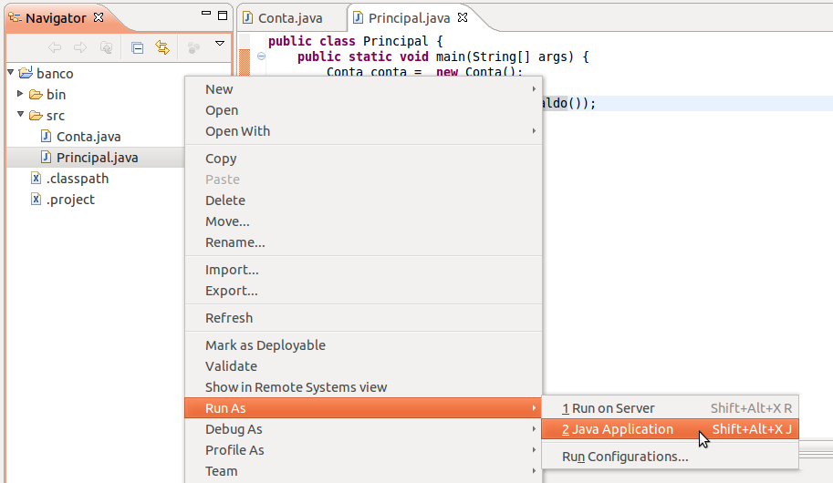

O Eclipse abrirá uma View chamada Console na qual será apresentada a saída do seu programa:

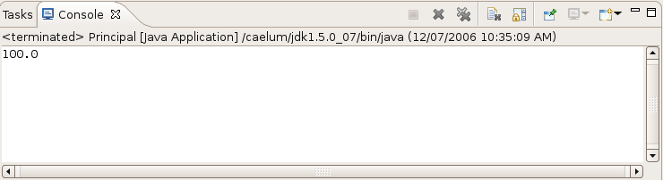

Quando você precisar rodar de novo, basta clicar no ícone verde de play na toolbar, que rodará o
programa anterior. Ao lado desse ícone, há uma setinha na qual são listados os dez últimos executados.

## Pequenos truques

O Eclipse tem muitos atalhos úteis para o programador. Sem dúvida, os três mais importantes de conhecer
e de praticar são:


* **Ctrl + 1** – Aciona o quickfix com sugestões para correção de erros;

* **Ctrl + Espaço** – Completa códigos;

* **Ctrl + 3** – Aciona modo de descoberta de menu. Experimente digitar **Ctrl + 3** e depois, **ggas** e **enter**.
Ou, então, dê **Ctrl + 3** e digite _new class_.


Você pode ler muito mais detalhes sobre esses atalhos no blog da Caelum:
http://blog.caelum.com.br/as-tres-principais-teclas-de-atalho-do-eclipse/

Existem dezenas de outros. Dentre os mais utilizados pelos desenvolvedores da Caelum, escolhemos os seguintes
para comentar:


* **Ctrl + F11** – Roda a última classe que você executou. É o mesmo que clicar no ícone verde que parece um botão de play, localizado na barra de ferramentas.

* **Ctrl + PgUp** e **Ctrl + PgDown** – Navegam nas abas abertas. Úteis quando estiver editando vários arquivos ao mesmo tempo.

* **Ctrl + Shift + F** – Formata o código segundo as convenções do Java.

* **Ctrl + M** – Expande a View atual para a tela toda (mesmo efeito de dar dois cliques no título da View).

* **Ctrl + Shift + L** – Exibe todos os atalhos possíveis.

* **Ctrl + O** – Exibe um outline para rápida navegação.

* **Alt + Shift + X e depois J** – Roda o `main` da classe atual. Péssimo para pressionar! Mais fácil você digitar
**Ctrl + 3** e depois, _Run_!. Exagere, desde já, no uso do **Ctrl + 3**.


Veremos mais atalhos no decorrer do curso, em especial, quando virmos pacotes.

## Exercícios: Eclipse
1. Crie o projeto `fj11-contas`. Você pode usar o atalho _Ctrl + n_ ou, então, ir
	no menu _File_ -> _New_ -> _Project..._ -> _Java Project_.
1. Dentro do projeto `fj11-contas`, crie a classe `Conta`.
	Uma conta deve ter as seguintes informações: `saldo` (double), `titular`
	(String), `numero` (int) e `agencia` (String).
	Na classe `Conta`, crie os métodos `deposita` e
	`saca` como nos capítulos anteriores.
	Crie também uma classe `TesteDaConta` com o `main` e instancie uma conta.
	Desta vez, tente exagerar no uso do _Ctrl + espaço_ e _Ctrl + 1_.

	Por exemplo:

	`publ<ctrl espaco> v<ctrl espaco> deposita(do<ctrl espaço> valor){`

	Repare que até mesmo nomes de variáveis ele cria para você! Acompanhe as dicas
	do instrutor ou instrutora.

	Muitas vezes, ao criarmos um objeto, nem mesmo declaramos a variável:

	``` java
	new Conta();
	```

	Vá nessa linha e dê _Ctrl + 1_. Ele recomendará e declarará a variável
	a você.
1. Imagine que queiramos criar um setter do titular para a classe `Conta`. Dentro
	da classe `Conta`, digite:

	`setTit<ctrl + espaco>`

	Outra forma de criar os getters e os setters para os atributos da classe `Conta`
	é utilizar o atalho _Ctrl + 3_ e, na caixa de seleção, digitar _ggas_, iniciais
	de _Generate Getters and Setters_!

	OBS.: Não crie um setter para o atributo `saldo`!
1. Vá para a classe que tem o `main` e deixe a tecla CONTROL pressionada enquanto você
	passa o mouse sobre o seu código. Repare que tudo virou hyperlink. Clique em
	um método o qual você está invocando na classe `Conta`.

	Você pode conseguir o mesmo efeito de abrir o arquivo no qual o método foi
	declarado de uma maneira ainda mais prática: sem usar o mouse. Quando o cursor
	estiver sobre o que você quer analisar, simplesmente, clique em `F3`.
1. Clique com o botão direito em um arquivo no navigator. Escolha
	**Compare With -> Local History**. O que é esta tela?

	<!--@note
	Comentar o versionamento em equipes, CVS, SVN e Git.
	-->

	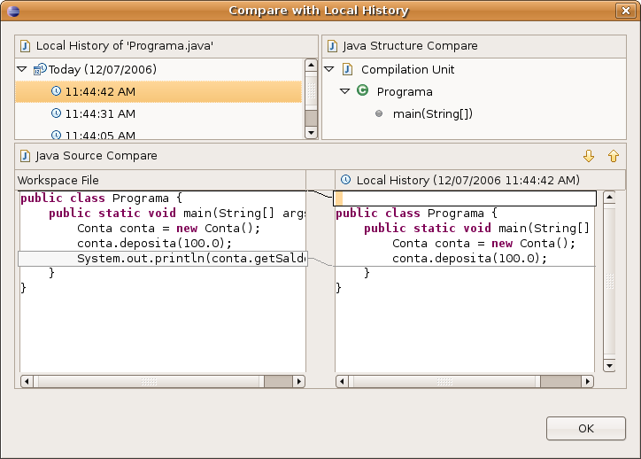
1. Use o _Ctrl + Shift + F_ para formatar o seu código. Dessa maneira, o comando
	arrumará a bagunça de espaçamento e enters do seu código.

	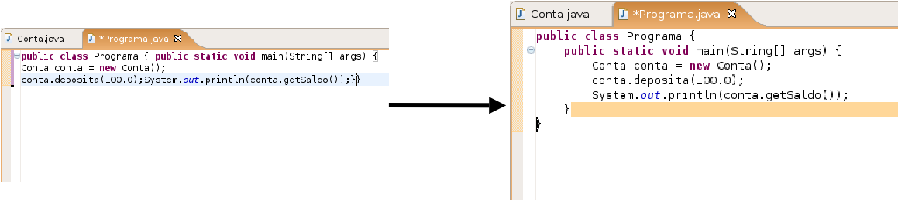
1. (Opcional) O que são os arquivos .project e .classpath? Leia os seus conteúdos.

	<!--@answer
	Ambos são arquivos de configuração do projeto.

	O arquivo `.classpath` tem informações como qual é a pasta de código, qual
	a versão do compilador e o caminho para onde vão os arquivos compilados. E o
	`.project` guarda o nome do projeto no Eclipse, além de dar a informação como qual compilador será usado para gerar os .class desse projeto.

	Note que o primeiro trata das configurações do projeto em si, e o segundo, da relação desse projeto com o Eclipse.
	-->
1. (Opcional) Clique com o botão direito no projeto e depois, em propriedades. É uma das telas mais
	importantes do Eclipse, na qual você pode configurar diversas informações para
	o seu projeto, como compilador, versões, formatador e outros.

	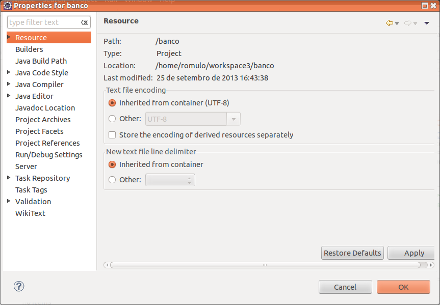

	<!--@answer
	Nesse exercício, aproveite para fazer uma exploração nos seguintes itens,
	muito usados no dia a dia:

	* Java build path;
	* Java code style (e seus submenus);
	* Java compiler;
	* Java editor -> Save actions.

	-->


## Discussão em aula: Refactoring

Existe um menu no Eclipse chamado _Refactor_. Ele tem opções bastante interessantes
para auxiliar na alteração de código a fim de melhorar a organização ou clareza. Por
exemplo, uma de suas funcionalidades é tornar possível a mudança do nome de uma variável,
de um método, ou de uma classe, de forma que a alteração (em um lugar só do sistema)
atualize todas as outras vezes que usava o nome antigo.

Usar bons nomes no seu código é um excelente começo para mantê-lo legível e fácil de dar manutenção! Mas o assunto refatoração não para por aí: quebrar métodos grandes em menores, dividir classes grandes em algumas pequenas e mais concisas e melhorar o
encapsulamento, todas essas são formas de refatoração. E esse menu do Eclipse nos
ajuda a fazer várias delas.

<!--@note
Comente que refatorar sempre é uma ótima atitude para melhorar o design das classes.
Que o Eclipse tem ótimos recursos a fim de ajudar-nos a fazer refatorações.
Fale que há um livro (avançado) sobre isso, do Martin Fowler.

Mostre o menu Refactor do Eclipse e faça um rename em uma variável (alunos babam).
Depois, faça um extract method qualquer ou outro refactoring só para demonstração.
Não fique só no rename!
-->
