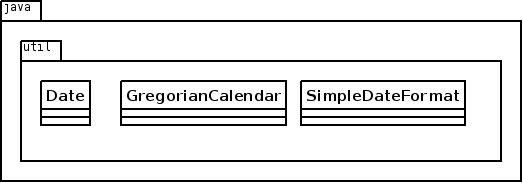
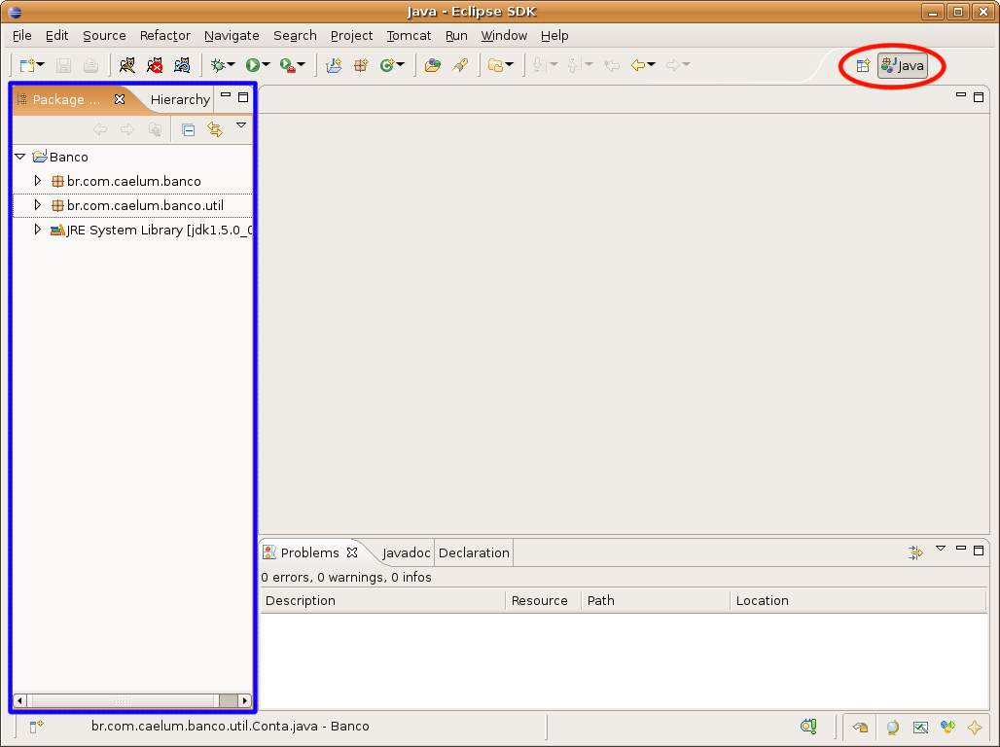
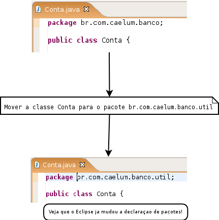

# Pacotes - Organizando suas Classes e Bibliotecas

_"Uma discussão prolongada significa que ambas as partes estão erradas."
-- Voltaire_

Ao final deste capítulo, você será capaz de:

* Separar suas classes em pacotes;
* Preparar arquivos simples para distribuição.


<!--@note
* Motivações: organizar/separar melhor e dar nomes iguais.

* Somos OBRIGADOS a manter a ordem nos arquivos .java, ou seja, primeiro temos package,
depois import e, por último, a declaração da classe.
-->

## Organização

Neste capítulo, aconselhamos que passe a usar o Eclipse. Você já tem conhecimento suficiente
dos erros de compilação do `javac` e agora pode aprender as facilidades que o Eclipse lhe apresenta ao
ajudá-lo, no código, com os chamados quickfixes e quick assists.

Quando um programador utiliza as classes feitas por outro, surge um problema clássico: como escrever
duas classes com o mesmo nome?

Por exemplo: pode ser que a minha classe de `Data` funcione de um certo jeito, e a classe `Data`
de um colega, de outro jeito. Pode ser que a classe de `Data` de uma **biblioteca** funcione ainda
de uma terceira maneira diferente.

Como permitir que tudo isso realmente funcione? Como controlar quem quer usar qual classe de
`Data`?

Pensando um pouco mais, notamos a existência de um outro problema e da própria solução: o sistema
operacional não permite a existência de dois arquivos com o mesmo nome sob o mesmo diretório,
portanto precisamos organizar nossas classes em diretórios diferentes.


Os diretórios estão diretamente relacionados aos chamados **pacotes** e costumam agrupar classes de
funcionalidades similares ou relacionadas.

Por exemplo, no pacote `java.util`, temos as classes `Date`, `SimpleDateFormat` e
`GregorianCalendar`; todas elas trabalham com datas de formas diferentes.



## Diretórios
<!--@note
Uma história que ajuda a introduzir o padrão de nomeação é contar que, na Bósnia, existe uma empresa
chamada Caelum e, coincidentemente, trabalha com Java. Mais coincidência ainda é o fato de que
eles também criaram, assim como nós, a classe Conta.

Pergunta: O que, no mundo inteiro, eu tenho certeza que é único? Existe mais de uma URL
na internet com o mesmo nome?
-->

Se a classe `Cliente` está no pacote `contas`, ela deverá estar no diretório com o mesmo nome:
`contas`. Se ela se localiza no pacote `br.com.caelum.contas`, significa que está no diretório
**`br/com/caelum/contas`**.

A classe `Cliente` que se localiza nesse último diretório mencionado deve ser escrita da seguinte
forma:

``` java
	package br.com.caelum.contas;

	class Cliente {
		// ...
	}
```


Fica fácil notar que a palavra-chave `package` indica qual o pacote/diretório contém essa classe.

Um pacote pode conter nenhum, ou mais subpacotes e/ou classes dentro dele.

> **Padrão da nomenclatura dos pacotes**
>
> O padrão da Sun para dar nome aos pacotes é relativo ao nome da empresa que desenvolveu a classe:
> ```
> br.com.nomedaempresa.nomedoprojeto.subpacote
> br.com.nomedaempresa.nomedoprojeto.subpacote2
> br.com.nomedaempresa.nomedoprojeto.subpacote2.subpacote3
> ```
>
> Os pacotes só têm letras minúsculas, não importa quantas palavras estejam contidas neles. Esse
> padrão existe para evitar ao máximo o conflito de pacotes de empresas diferentes.
>
> As classes do pacote padrão de bibliotecas não seguem essa nomenclatura que foi dada para
> bibliotecas de terceiros.

<!-- Comentário para separar quotes adjacentes. -->


## Import
Para usar uma classe do mesmo pacote, basta fazer referência a ela como foi feito até agora,
simplesmente escrevendo o próprio nome da classe. Se quisermos que a classe `Banco` fique
dentro do pacote `br.com.caelum.contas`, ela deve ser declarada assim:

``` java
	package br.com.caelum.contas;

	class Banco {
		String nome;
	}
```

Para a classe `Cliente` ficar no mesmo pacote, seguimos a mesma fórmula:

``` java
	package br.com.caelum.contas;

	class Cliente {
		String nome;
		String endereco;
	}
```

A novidade chega ao tentar utilizar a classe `Banco` (ou `Cliente`) em uma outra classe que
esteja fora desse pacote, por exemplo, no pacote `br.com.caelum.contas.main`:

``` java
	package br.com.caelum.contas.main;

	class TesteDoBanco {

		public static void main(String[] args) {
		  br.com.caelum.contas.Banco meuBanco = new br.com.caelum.contas.Banco();
		  meuBanco.nome = "Banco do Brasil";
		  System.out.println(meuBanco.nome);
		}

	}
```


Repare que precisamos referenciar a classe `Banco` com todo o nome do pacote na sua frente. Esse é
o conhecido _Fully Qualified Name_ de uma classe. Em outras palavras, é o verdadeiro nome de
uma classe, por isso duas classes com o mesmo nome em pacotes diferentes não entram em conflito.

Mesmo assim, ao tentar compilar a classe anterior, surge um erro reclamando que a classe `Banco`
não está visível.

Acontece que as classes só são visíveis às outras no **mesmo pacote** e, para permitir que a classe
`TesteDoBanco` veja e acesse a classe `Banco` em outro pacote, precisamos alterar esta última e
transformá-la em pública:

``` java
	package br.com.caelum.contas;

	public class Banco {
		String nome;
	}
```

A palavra-chave `public` libera o acesso às classes de outros pacotes. Do mesmo jeito que o
compilador reclamou que a classe não estava visível, ele reclama que o atributo/variável
membro tampouco o está. É fácil deduzir como resolver o problema: utilizando novamente o modificador
`public`:

``` java
	package br.com.caelum.contas;

	public class Banco {
		public String nome;
	}
```

Podemos testar nosso exemplo anterior, lembrando que utilizar atributos como público não
traz encapsulamento, e estão aqui como ilustração.

Voltando ao código do `TesteDoBanco`, é necessário escrever todo o pacote para identificar qual
classe queremos usar? O exemplo que usamos ficou bem complicado de ler:

``` java
	br.com.caelum.contas.Banco meuBanco = new br.com.caelum.contas.Banco();
```


Existe uma maneira mais simples de se referenciar à classe `Banco`: basta **importá-la** do
pacote `br.com.caelum.contas`:

``` java
	package br.com.caelum.contas.main;

	// para podermos referenciar 
	// a Banco diretamente
	import br.com.caelum.contas.Banco; 

	public class TesteDoBanco {

		public static void main(String[] args) {
			Banco meuBanco = new Banco();
			meuBanco.nome = "Banco do Brasil";
		}

	}
```

Isso faz com que não precisemos nos referenciar ao utilizar o _Fully Qualified Name_, podendo
usar `Banco` dentro do nosso código em vez de escrever o longo
`br.com.caelum.contas.Banco`.

> **Package, import, class**
>
> É muito importante manter a ordem! Primeiro, aparece uma (ou nenhuma) vez o `package`, depois pode
> aparecer um ou mais `import`s e, por último, as declarações de classes.

<!--  Comentário para separar quotes adjacentes. -->


> **Import x.y.z.*;**
>
> É possível importar um pacote inteiro (todas as classes do pacote, **exceto os subpacotes**) por meio
> do coringa `*`:
>
> ``` java
> import java.util.*;
> ```
>
> Importar todas as classes de um pacote não implica na perda de performance em tempo de execução, mas
> pode trazer problemas com classes de mesmo nome. Além disso, importar de um em um é considerado boa
> prática, pois facilita a leitura a outros programadores. Uma IDE como o Eclipse já fará isso
> por você, assim como a organização em diretórios.

<!-- Comentário para separar quotes adjacentes. -->


## Acesso aos atributos, construtores e métodos
Os modificadores de acesso existentes em Java são quatro, e, até o momento, já vimos três. Entretanto, só
explicamos dois.


* `public` - Todos podem acessar aquilo que for definido como `public`. Classes, atributos,
construtores e métodos podem ser `public`.

* `protected` - Aquilo que é `protected` pode ser acessado por todas as classes do mesmo pacote
e por todas as classes que o estendam, mesmo que estas não estejam no mesmo pacote.
Somente atributos, construtores e métodos podem ser
`protected`.

* **padrão (sem nenhum modificador)** - Se nenhum modificador for utilizado, todas as classes do
mesmo pacote têm acesso ao atributo, ao construtor, ao método, ou à classe.

* `private` - A única classe capaz de acessar os atributos, construtores e métodos privados é a
própria classe. Classes, como conhecemos, não podem ser `private`, mas atributos, construtores e
métodos, sim.


> **Classes públicas**
>
> Para melhor organizar seu código, o Java não permite mais de uma classe pública por arquivo, e o
> arquivo deve ser `NomeDaClasse.java`.
>
> Uma vez que outros programadores irão utilizar essa classe, quando precisarem olhar o seu código,
> ficará mais fácil encontrá-la sabendo que ela está no arquivo de mesmo nome.
>
> Classes aninhadas podem ser `protected` ou `private`, mas esse é um tópico avançado que não
> será estudado neste momento.

<!-- Comentário para separar quotes adjacentes. -->


## Usando o Eclipse com pacotes
<!--@note
Fazer os exercícios com os alunos, auxiliando-os a fim de dar dinamismo na aula e para que ninguém
fique para trás. Mostrar como o Eclipse deixa transparente a utilização de pacotes e que, aqui, os diretórios foram criados para nós.
-->

Você pode usar a perspectiva Java do Eclipse. A View principal de navegação é o _Package
Explorer_, que agrupa classes pelos pacotes em vez de diretórios (você pode usá-la em conjunto com a
_Navigator_, basta também abri-la pelo _Window/Show View/Package Explorer_).



Antes de movermos nossas classes, declare-as como públicas e coloque-as em seus respectivos arquivos:
um arquivo para cada classe.

Você pode mover uma classe de pacote arrastando-a para o destino desejado. Veja que o Eclipse já
declara os `package`s e `import`s necessários:




No Eclipse, nunca precisamos declarar um `import`, pois ele sempre recomendará isso quando usarmos
o `Ctrl+Espaço` no nome de uma classe.

Você também pode usar o `Ctrl+1` no caso da declaração de pacote ter algum erro.

## Exercícios: pacotes
**Atenção:** utilize os recursos do Eclipse para realizar essas mudanças. Use a `view
package-explorer`, que auxiliará bastante a manipulação dos arquivos e diretórios.
Também utilize os quickfixes quando o Eclipse reclamar dos diversos problemas
de compilação os quais aparecerão. É possível fazer esse exercício inteiro **sem modificar uma linha
de código manualmente**. Aproveite para praticar e descobrir o Eclipse, evitando usá-lo apenas como
um editor de texto.

Por exemplo, com o Eclipse, nunca precisamos nos preocupar com os imports: ao usar
o auto complete, ele já joga o import lá em cima. E se você não fez isso,
ele sugere colocar o `import`.
1. Selecionando o `src` do seu projeto, aperte **Ctrl + N** e escreva `Package` para o seu
	sistema de Contas começar a utilizar pacotes. Na janela de criação de pacotes, escreva o nome
	completo do pacote seguindo a convenção de código da Sun (desde o "br") e o Eclipse tratará
	de fazer a separação das pastas corretamente.
	__Cuidado: para esse curso, os nomes dos pacotes precisam ser os seguintes:__

	* `br.com.caelum.contas.main`: colocar a classe com o método `main` aqui (o Teste).
	* `br.com.caelum.contas.modelo`: colocar a classe `Conta`.

	**Antes de corrigir** qualquer erro de compilação, primeiro, **mova todas as suas classes**
	sem deixar nenhuma no pacote _default_.
1. Se você ainda não tiver separado cada classe em um arquivo, essa é a hora de mudar isso. Coloque
	cada uma em seu respectivo arquivo `.java`. Faça isso independentemente de ela ser pública:
	é uma boa prática.
1. Caso o código não compile prontamente, repare que, pelo menos, algum dos métodos que declaramos é _package-private_
	quando, na verdade, precisamos que ele seja `public`. O mesmo vale para as classes: algumas **precisarão** ser públicas.

	Se houver algum erro de compilação, use o recurso de quickfix do Eclipse aqui: ele mesmo sugerirá que o modificador de acesso
	deve ser público. Para isso, aperte o **Ctrl + 1** em cada um dos erros e escolha o _quickfix_
	mais adequado ao seu problema.
1. (Opcional) Abra a View `Navigator` a fim de ver como ficaram os arquivos no sistema de arquivos
	do seu sistema operacional. Para isso, tecle **Ctrl + 3**, comece a digitar `Navigator` e escolha
	a opção de abrir essa View.
