# Ferramentas: JAR e Javadoc
_"Perder tempo em aprender coisas que não interessam priva-nos de descobrir coisas
interessantes." -- Carlos Drummond de Andrade_

Ao final deste capítulo, você será capaz de:

- Criar o JAR do seu aplicativo;
- Colocar um JAR no build path do seu projeto;
- Ler um Javadoc;
- Criar o Javadoc do seu aplicativo.


<!--@note
* Enfatizar a importância e fazer passo a passo com os alunos usando o Eclipse.

* Mostrar o Javadoc da API do Java SE primeiro. Depois, gerar o Javadoc do projeto sem nenhum
comentário. Logo, colocar os comentários e gerar de novo.

* Comentar rapidamente sobre ant/maven, etc., que ajudam a criar essas coisas.

* Este capítulo pode ser todo feito em conjunto com os alunos, dando ordens: "vamos
todos clicar no projeto com o botão direito, agora em export, agora blá-blá-blá".
-->

## Arquivos, bibliotecas e versões
Assim que um programa fica pronto, é meio complicado enviar dezenas ou centenas de classes para cada
cliente que quer utilizá-lo.

O jeito mais simples de trabalhar com um conjunto de classes é compactá-lo em um arquivo só. O
formato de compactação padrão é o **`ZIP`** com a extensão do arquivo compactado **`JAR`**.

> **O arquivo .jar**
>
> O arquivo **JAR**, ou **J**ava **AR**chive, tem um conjunto de classes (e arquivos de
> configurações) compactado, no estilo de um arquivo **`zip`**. O arquivo **`jar`** pode ser
> criado com qualquer compactador **`zip`** disponível no mercado, inclusive com o programa **`jar`**
> que vem junto com o JDK.

<!-- Comentário para separar quotes adjacentes. -->


Para criar um arquivo JAR do nosso programa de banco,
de nome **`banco.jar`**, basta ir ao diretório em que
estão contidas as classes dos pacotes
`br.com.caelum.util` e `br.com.caelum.banco` e usar o
comando a seguir:

```
jar -cvf banco.jar br/com/caelum/util/*.class br/com/caelum/banco/*.class
```

Com o intuito de usar esse arquivo `banco.jar` para rodar o `TesteDoBanco`, basta rodar o `java` com o
arquivo `jar` como argumento:

```
java -classpath banco.jar br.com.caelum.contas.main.TesteDoBanco
```

Para adicionar mais arquivos **`.jar`** que podem ser bibliotecas ao programa, basta rodar o Java
da seguinte maneira:

```
java -classpath biblioteca1.jar;biblioteca2.jar NomeDaClasse
```

Lembre-se de que o ponto e vírgula utilizado só é válido em ambiente Windows. Em Linux, Mac e outros Unix,
utiliza-se os dois pontos (varia de acordo com o sistema operacional).

Há também um arquivo de manifesto que contém informações do seu JAR como, por exemplo, qual classe
ele rodará quando o JAR for chamado. Mas não se preocupe, pois, com o Eclipse, esse arquivo é
gerado automaticamente.

> **Bibliotecas**
>
> Diversas bibliotecas podem ser controladas de acordo com a versão por estarem sempre compactadas a
> um arquivo `.jar`. Basta verificar o nome da biblioteca (por exemplo `log4j-1.2.13.jar`) para
> descobrir a sua versão.
>
> Então, é possível rodar dois programas ao mesmo tempo, cada um utilizando uma versão da biblioteca
> por meio do parâmetro **`-classpath`** do Java.

<!-- Comentário para separar quotes adjacentes. -->


> **Criando um .jar automaticamente**
>
>
> Existem diversas ferramentas que servem para automatizar o processo de deploy, que consiste em
> compilar, gerar documentação, bibliotecas, etc. As duas mais famosas são o **ANT** e o **MAVEN**,
> ambas são projetos do grupo Apache.
>
> O Eclipse pode gerar facilmente um JAR, porém, se o seu build é complexo e precisa preparar e copiar
> uma série de recursos, as ferramentas indicadas acima têm sofisticadas maneiras de rodar um
> script batch.

<!-- Comentário para separar quotes adjacentes. -->


<!--@todo novo box explicando o Manifest rapidamente. -->

## Gerando o JAR pelo Eclipse

Neste exemplo, geraremos o arquivo JAR do nosso projeto a partir do Eclipse:


* Clique com o botão direito em cima do nome do seu projeto e selecione a opção Export.


* Na tela Export (como mostra a figura abaixo), selecione a opção _JAR file_ e aperte o botão _Next_.
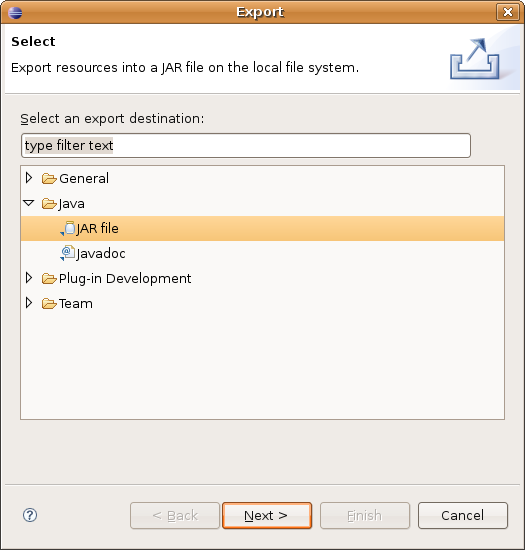

* Na opção JAR file, selecione o local em que você deseja salvar o arquivo JAR e aperte _Next_.
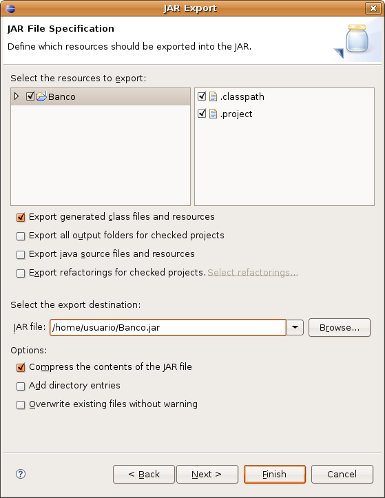

* Na próxima tela, simplesmente clique em _Next_, pois não há nenhuma configuração a ser feita.

* Na tela abaixo, na opção _select the class of the application entry point_, você deve escolher
qual classe será a que rodará automaticamente quando você executar o JAR.
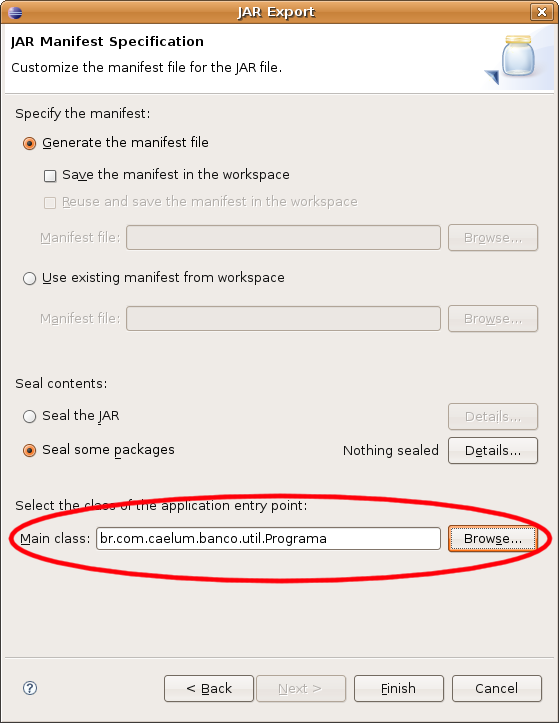

* Entre na linha de comando: `java -jar banco.jar`


É comum dar um nome mais significativo aos JARs, incluindo nome da empresa,
do projeto e versão, como `caelum-banco-1.0.jar`.

## Javadoc

Como saberemos o que cada classe tem no Java? Quais são seus métodos, o que eles fazem?

E, a partir da internet, você pode acessar por meio do link:
http://download.java.net/jdk8/docs/api/index.html


No site da Oracle, você pode (e deve) baixar a documentação das bibliotecas do Java, frequentemente
referida como **Javadoc** ou API (sendo na verdade a documentação da API).

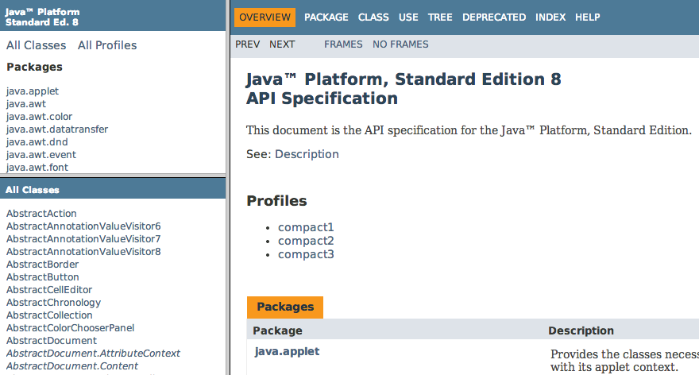

Nessa documentação, no quadro superior esquerdo, você encontra os pacotes e, no inferior esquerdo,
está a listagem das classes e interfaces do respectivo pacote (ou de todos, caso nenhum tenha sido
especificado). Ao clicar em uma classe ou interface, o quadro da direita passa a detalhar todos
atributos e métodos.

Repare que métodos e atributos privados não estão aí. O importante é documentar **o que** sua classe faz,
e não **como** ela o faz: detalhes de implementação, como atributos e métodos privados, não interessam as pessoas
desenvolvedoras que usarão a sua biblioteca (ou, ao menos, não deveriam interessá-las).

Você também consegue gerar esse Javadoc a partir da linha de comando digitando: `javadoc`.

## Gerando o Javadoc
Para gerar o Javadoc a partir do Eclipse, é muito simples. Siga os passos abaixo:


* Na barra de menu, selecione o menu Project e, depois, a opção _Generate Javadoc.._. (disponível apenas se estiver na perspectiva Java, mas você pode acessar o mesmo Wizard pelo export do
projeto).
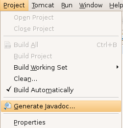

* Em seguida, aparecerão as opções para gerar a documentação do seu sistema. Selecione todas as
classes do seu sistema e deixe as outras opções como estão. Não esqueça de marcar o caminho da opção
_Destination_, pois é lá que estará sua documentação.
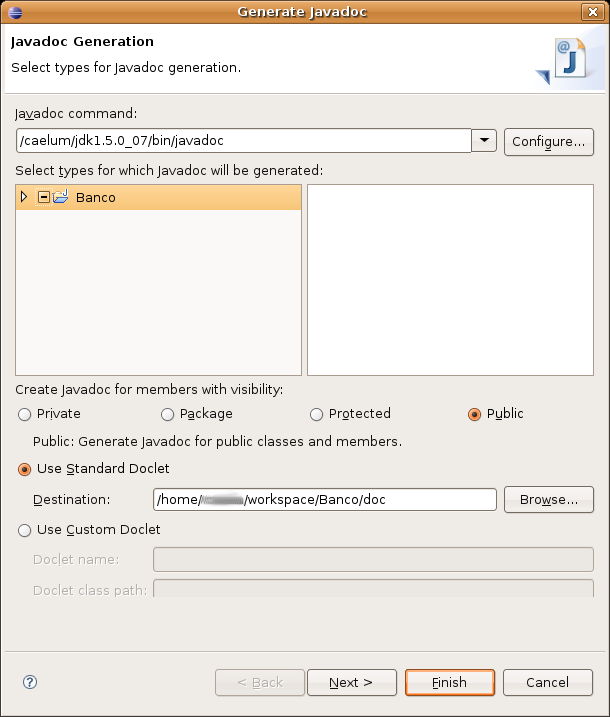

* Abra a documentação por meio do caminho que você marcou e abra o arquivo index.html, o qual chamará
uma página semelhante a essa da figura abaixo.
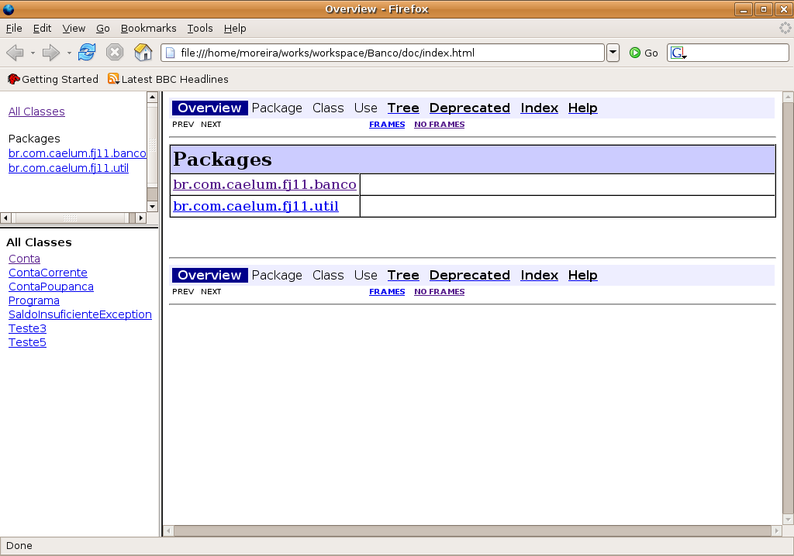

Para colocarmos comentários na documentação, devemos adicionar o texto ao código sob forma de comentário,
abrindo-o com `/**` e fechando-o com `*/` e, nas outras linhas, apenas colocando `*`.
Também podemos definir outras informações nesse texto, como: autor, versão, parâmetros, retorno, etc.
Adicione alguns comentários ao seu projeto como abaixo:

``` java
	/**
	 * Classe responsável por moldar as Contas do Banco
	 *
	 * @author Manoel Santos da Silva
	 */
	
	public class Conta{
		...
	}
```

Ou adicione alguns comentários em algum método seu:
``` java
	/**
	 * Metodo que incrementa o saldo.
	 * @param valor
	 */
	
	public void deposita(double valor) {
		...
	}
```

Veja como ficou:

<!--@todo atualizar essa screenshot -->
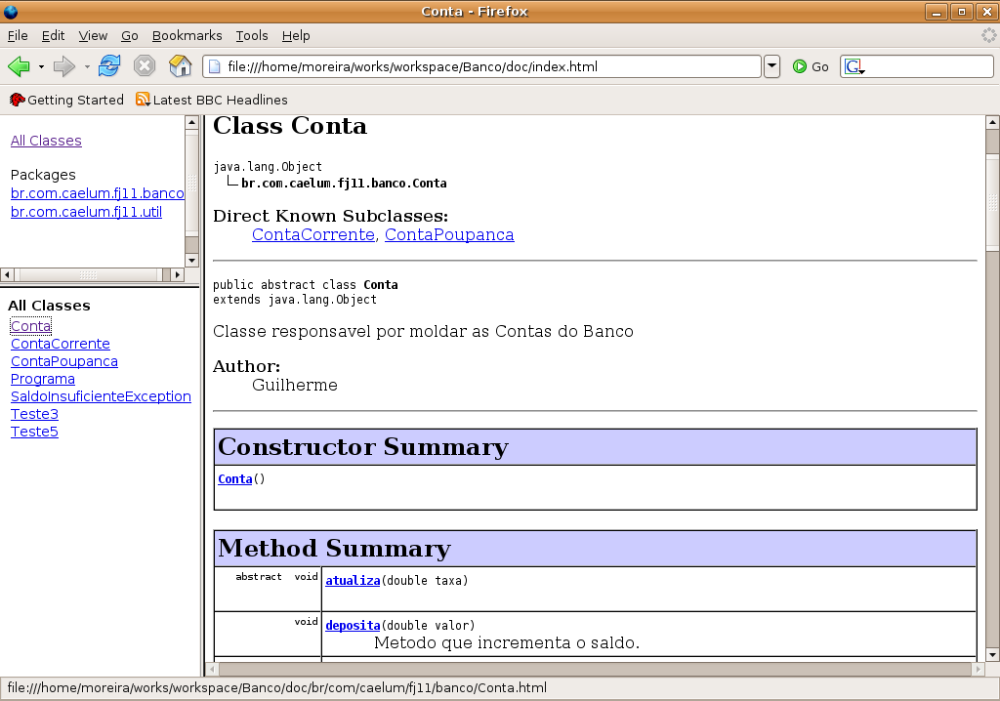


## Exercícios: JAR e Javadoc
1. Gere um JAR do seu sistema com o arquivo de manifesto. Execute-o com `java -jar`:

	```java -jar caelum-banco-1.0.jar```

	Se o Windows ou o Linux foi configurado para trabalhar com a extensão _.jar_, basta você dar
	um duplo clique no arquivo que ele será executado (o arquivo `Manifest` será lido para que
	este descubra qual é a classe com `main` que o Java deve processar).
1. Gere o Javadoc do seu sistema. Para isso, vá ao menu _Project_ e, depois, à opção _Generate
	Javadoc_ se estiver na perspectiva Java. Se não, dê um clique com o botão direito no seu
	projeto, escolha _Export_, depois, _javadoc_ e siga o procedimento descrito na última seção
	deste capítulo.

	Independente da perspectiva que utilizar no Eclipse, você também pode usar o **Ctrl + 3** e
	começar a escrever `Javadoc` até que a opção de exportar o Javadoc apareça.


> **Interface versus implementação novamente!**
>
> Repare que a documentação gerada não mostra o conteúdo dos métodos 
> nem atributos e métodos privados! Isso faz parte da implementação, e o que
> importa para quem usa uma biblioteca é a interface: o que ela faz.

<!-- Comentário para separar quotes adjacentes. -->


## Importando um JAR externo

Já sabemos como documentar nosso projeto e gerar um JAR para distribuí-lo, mas ele ainda não tem uma interface gráfica do usuário. Se quisermos rodar o nosso sistema, temos de executá-lo pelo terminal com os valores _hard-coded_. Seria mais interessante se tivéssemos uma interface mais amigável para que o usuário pudesse interagir com o nosso sistema. Ao mesmo tempo, não queremos nos preocupar nesse momento em criar todas as classes a fim de representar essa interface gráfica, queremos apenas utilizar algo já pronto.

Para isso, importaremos uma biblioteca externa. O próprio Eclipse já nos dá suporte para a importação de JARs. Para fazer isso, basta ir no menu _Project_ -> _Properties_, selecionar a opção _Java Build Path_, depois selecionar a aba _Libraries_ e, finalmente, clicar no botão _Add External Jars..._. Agora é só selecionar o JAR a ser importado e clicar em _Open_. Aperte em Ok novamente para fechar a janela de importação e pronto! Nossa biblioteca já está disponível para ser utilizada.

## Exercícios: Importando um JAR
1. Importemos um JAR que contém a interface gráfica do usuário para o nosso sistema de contas.

	* Vá no menu **Project -> Properties**;
	* Selecione a opção **Java Build Path**;
	* Selecione a aba **Libraries**;

	

	* Clique no botão **Add External Jars...**;
	* Selecione o arquivo **fj11-lib-contas.jar** localizado na pasta dos arquivos dos cursos/11;

	<!--@todo Verificar o caminho depois de ver a infra. -->

	* Clique no botão **Ok** para fechar a janela de importação.
1. Para verificarmos se a importação deu certo, chamaremos uma classe da biblioteca importada para exibir uma janela de boas-vindas.

	Crie uma classe `TestaJar` no pacote `br.com.caelum.contas.main`.

	Crie também o método `main`.
1. Dentro do método criado, invocaremos o método `main` da classe `OlaMundo`, que existe no JAR importado. Seu código deve ficar dessa maneira:

	``` java
 package br.com.caelum.contas.main;

 import br.com.caelum.javafx.api.main.OlaMundo;

 public class TestaJar {

    public static void main(String[] args) {
        OlaMundo.main(args);
    }
 }
	```

	Não esqueça de importar a classe `OlaMundo` do pacote `br.com.caelum.javafx.api.main`. Use o atalho **Ctrl + shift + O**.
1. Execute a sua aplicação e veja se apareceu uma janela de boas-vindas como a seguinte:

	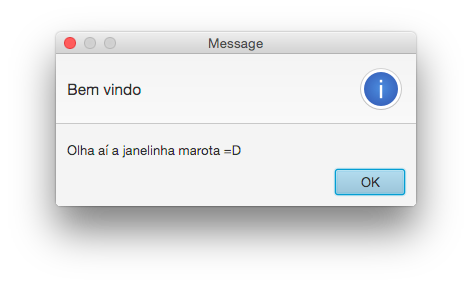


## Manipulando a conta pela interface gráfica

Agora que já importamos o JAR que contém a interface gráfica, daremos uma olhada na
primeira tela do nosso sistema:

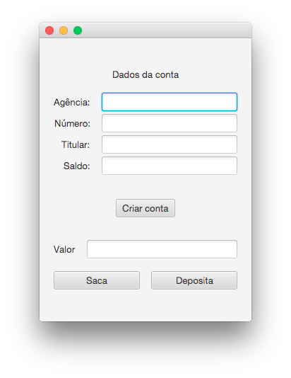

Nessa tela, percebemos que temos botões para as ações de criação de conta, saque
e depósito, os quais devem utilizar a implementação existente em nossa classe `Conta`.

Se quisermos visualizar a tela, podemos criar um `main` que chamará a classe
`TelaDeContas` responsável pela sua exibição:

``` java
package br.com.caelum.contas.main;

import br.com.caelum.javafx.api.main.TelaDeContas;

public class TestaContas {

    public static void main(String[] args) {
        TelaDeContas.main(args);
    }
}
```

Ao executarmos a aplicação, ocorrerá um erro:

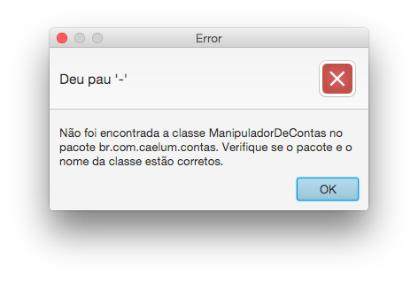

Mas por que esse erro ocorreu? A tela precisa conhecer alguém que saiba
executar as ações de saque e depósito na conta e que consiga buscar os dados da tela
para popular a conta. Como não temos ninguém para fazer isso ainda, ocorreu o erro.

Então, criaremos a classe `ManipuladorDeContas`, que será responsável por fazer esta "ponte" entre a
tela e a classe de `Conta`:

``` java
package br.com.caelum.contas;

public class ManipuladorDeContas {

}
```

Agora, ao executarmos a aplicação, veremos que a tela aparece com sucesso:


E se tentarmos clicar no botão de criação de conta? Também ocorre um erro!

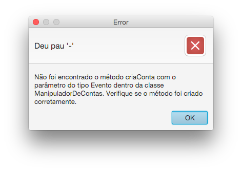

Dessa vez, o erro indica que falta o método `criaConta` dentro da classe
`ManipuladorDeContas`. Vamos, então, criá-lo:

``` java
public class ManipuladorDeContas {

    public void criaConta(){
        Conta conta = new Conta();
        conta.setAgencia("1234");
        conta.setNumero(56789);
        conta.setTitular("Batman");
    }
}
```

Para conseguirmos obter as informações da tela, todos os
métodos que criaremos precisam receber um parâmetro do tipo `Evento`, o qual conterá as
informações digitadas. Apesar de não utilizarmos esse parâmetro, precisamos recebê-lo.

``` java
import br.com.caelum.javafx.api.util.Evento;

public class ManipuladorDeContas {

    public void criaConta(Evento evento){
        Conta conta = new Conta();
        conta.setAgencia("1234");
        conta.setNumero(56789);
        conta.setTitular("Batman");
    }
}
```

Se tentarmos executar a aplicação e clicar no botão **Criar conta**, veremos que não
ocorrerá mais nenhum erro, mas, ao mesmo tempo, os dados da conta não são populados na tela.
Isso acontece pois a variável `conta` é apenas local, ou seja, ela só existe dentro
do método `criaConta`. Além disso, se quiséssemos depositar um valor na conta, em
qual conta depositaríamos? Ela não é visível para nenhum outro método!

Precisamos que essa variável seja um atributo do `ManipuladorDeContas`. Vamos
alterá-la:

``` java
import br.com.caelum.javafx.api.util.Evento;

public class ManipuladorDeContas {

    private Conta conta;

    public void criaConta(Evento evento){
        this.conta = new Conta();
        this.conta.setAgencia("1234");
        this.conta.setNumero(56789);
        this.conta.setTitular("Batman");
    }
}
```

Testando agora, conseguimos ver os dados da conta na tela!

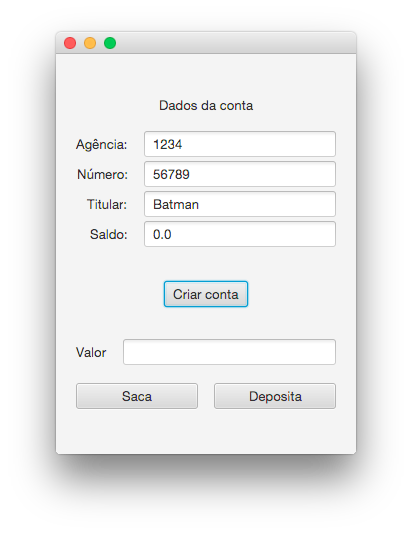

Só falta criarmos os métodos `saca` e `deposita`. Começaremos implementando o
método `deposita`. Nele precisamos do valor digitado pelo usuário na tela, e é para
isso que serve a classe `Evento`. Se quisermos buscar um valor do tipo `double`,
podemos invocar o método `double` passando o nome do campo que queremos recuperar
como parâmetro. Com o valor em mãos, podemos, então, passá-lo ao método desejado.
Nosso método fica:

``` java
import br.com.caelum.javafx.api.util.Evento;

public class ManipuladorDeContas {

    // ...

    public void deposita(Evento evento){
        double valorDigitado = evento.getDouble("valor");
        this.conta.deposita(valorDigitado);
    }
}
```

Podemos fazer a mesma coisa para o método `saca`:

``` java
import br.com.caelum.javafx.api.util.Evento;

public class ManipuladorDeContas {

    // ...

    public void deposita(Evento evento){
        double valorDigitado = evento.getDouble("valor");
        this.conta.deposita(valorDigitado);
    }

    public void saca(Evento evento){
        double valorDigitado = evento.getDouble("valor");
        this.conta.saca(valorDigitado);
    }
}
```

Agora conseguimos rodar a aplicação e, em seguida, clicar nos botões de saque e depósito que o saldo
é atualizado com sucesso!

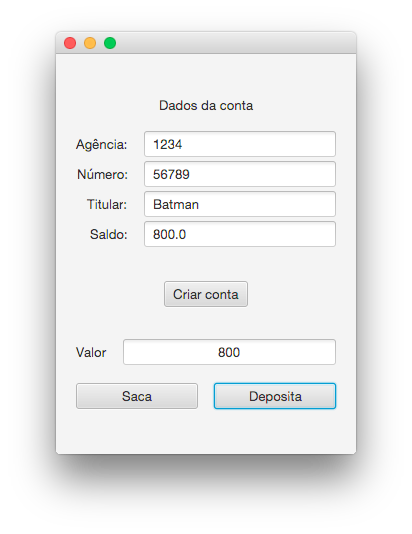

## Exercícios: mostrando os dados da conta na tela
1. Crie a classe `ManipuladorDeContas` dentro do pacote `br.com.caelum.contas`. Repare
	que os pacotes `br.com.caelum.contas.main` e `br.com.caelum.contas.modelo` são
	subpacotes do pacote `br.com.caelum.contas`, portanto o pacote `br.com.caelum.contas`
	já existe. Para criar a classe neste pacote, basta selecioná-lo na janela de criação
	da classe:

	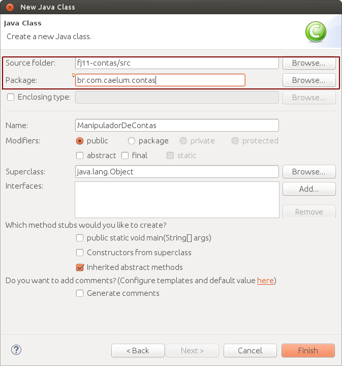

	A classe `ManipuladorDeContas` fará a ligação da `Conta` com a tela, por isso precisaremos
	declarar um atributo do tipo `Conta`.

	<!--@answer
	public class ManipuladorDeContas {

	private Conta conta;
	}
	-->

1. Na classe `ManipuladorDeContas`, crie o método `criaConta` que recebe como parâmetro um objeto do tipo `Evento`.
	Instancie uma conta para o atributo `conta` e coloque os valores de `numero`,
	`agencia` e `titular`. 
1. Com a conta instanciada, agora podemos implementar as funcionalidades de saque e
	depósito. Crie o método `deposita`, que recebe um `Evento`, classe que
	retorna os dados da tela nos tipos que precisamos. Por exemplo, se quisermos o
	valor a depositar, sabemos que ele é do tipo `double` e que o nome do campo na
	tela é `valor` .

	**Dica**: a  classe `Evento` tem o  método `getDouble()`, que retorna o conteúdo desse campo. Então, use `getDouble(“valor”)` quando precisar obter o conteúdo do campo `valor`.

	
1. Crie agora o método `saca`. Ele também deve receber um `Evento` nos mesmos
	moldes do `deposita`.

	<!--@answer
	public void saca(Evento evento){
	double valorDigitado = evento.getDouble("valor");
	this.conta.saca(valorDigitado);
	}
	-->
1. Precisamos agora testar nossa aplicação. Crie a classe `TestaContas` dentro do
	pacote `br.com.caelum.contas` com um `main`. Nela importaremos o `main` da
	classe `TelaDeContas`, que mostrará a tela de nosso sistema. Não se esqueça de
	fazer o import dessa classe!

	**Dica**: para executar a tela da nossa aplicação, o método estático `main` da classe `TelaDeContas` deve ser invocado dentro do método `main` da classe `TestaContas` que você está criando agora.

	Rode a aplicação, crie a conta e tente fazer as operações de saque e depósito. Tudo
	deve funcionar normalmente.
