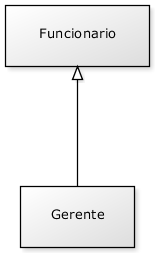
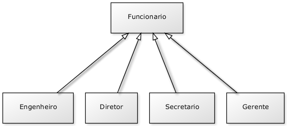
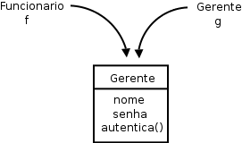
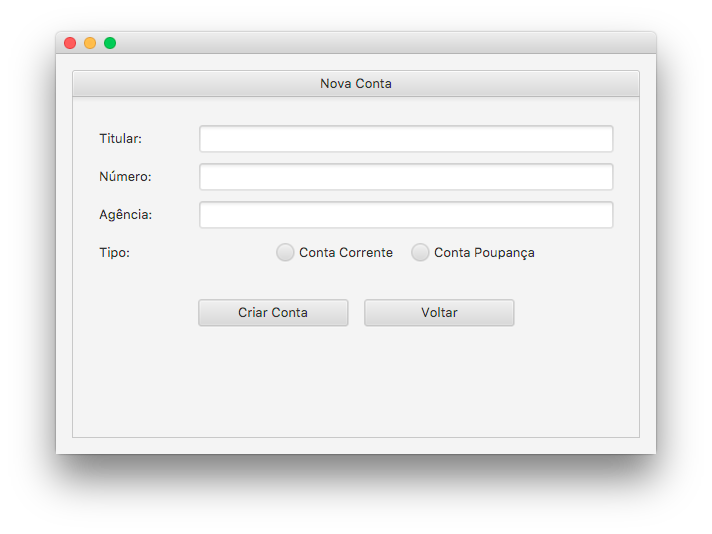

# Herança, reescrita e polimorfismo
_"O homem absurdo é aquele que nunca muda." -- Georges Clemenceau_

Ao término desse capítulo, você será capaz de:

* dizer o que é herança e quando utilizá-la;
* reutilizar código escrito anteriormente;
* criar classes filhas e reescrever métodos;
* usar todo o poder que o polimorfismo dá.


## Repetindo código?
Como toda empresa, nosso Banco possui funcionários. Vamos modelar a classe `Funcionario`:

``` java
	public class Funcionario {
		private String nome;
		private String cpf;
		private double salario;
		 // métodos devem vir aqui
	}
```

Além de um funcionário comum, há também outros cargos, como os gerentes. Os gerentes guardam a mesma
informação que um funcionário comum, mas possuem outras informações, além de ter funcionalidades um
pouco diferentes. Um gerente no nosso banco possui também uma senha numérica que permite o acesso ao
sistema interno do banco, além do número de funcionários que ele gerencia:

``` java
public class Gerente {
	private String nome;
	private String cpf;
	private double salario;
	private int senha;
	private int numeroDeFuncionariosGerenciados;
		
	public boolean autentica(int senha) {
		if (this.senha == senha) {
			System.out.println("Acesso Permitido!");
			return true;
		} else {
			System.out.println("Acesso Negado!");
			return false;
		}
	}
	
	// outros métodos 
}
```

> **Precisamos mesmo de outra classe?**
>
> Poderíamos ter deixado a classe `Funcionario` mais genérica, mantendo nela senha de acesso, e o
> número de funcionários gerenciados. Caso o funcionário não fosse um gerente, deixaríamos estes
> atributos vazios.
>
> Essa é uma possibilidade, porém podemos começar a ter muito atributos opcionais, e a classe
> ficaria estranha. E em relação aos métodos? A classe `Gerente` tem o método `autentica`,
> que não faz sentido existir em um funcionário que não é gerente.


Se tivéssemos um outro tipo de funcionário que tem características diferentes do funcionário comum,
precisaríamos criar uma outra classe e copiar o código novamente!

Além disso, se um dia precisarmos adicionar uma nova informação para todos os funcionários,
precisaremos passar por todas as classes de funcionário e adicionar esse atributo.
O problema acontece novamente por não centralizarmos as informações principais do funcionário em um
único lugar!


Existe um jeito, em Java, de relacionarmos uma classe de tal maneira que uma delas **herda** tudo que
a outra tem. Isto é uma relação de classe mãe e classe filha. No nosso caso, gostaríamos de fazer com
que o `Gerente` tivesse tudo que um `Funcionario` tem, gostaríamos que ela fosse uma **extensão**
de `Funcionario`. Fazemos isto através da palavra chave `extends`.

``` java
	public class Gerente extends Funcionario {
		private int senha;
		private int numeroDeFuncionariosGerenciados;
		
		public boolean autentica(int senha) {
			if (this.senha == senha) {
				System.out.println("Acesso Permitido!");
				return true;
			} else {
				System.out.println("Acesso Negado!");
				return false;
			}
		}
		
		// setter da senha omitido
	}
```

Em todo momento que criarmos um objeto do tipo `Gerente`, este objeto possuirá também os atributos
definidos na classe `Funcionario`, pois um `Gerente` **é um** `Funcionario`:



``` java
	public class TestaGerente {
		public static void main(String[] args) {
			Gerente gerente = new Gerente();
			
			// podemos chamar métodos do Funcionario:
			gerente.setNome("João da Silva");
			
			// e também métodos do Gerente!
			gerente.setSenha(4231);
		}
	}
```

 


Dizemos que a classe `Gerente` **herda** todos os atributos e métodos da classe mãe, no nosso caso,
a `Funcionario`. Para ser mais preciso, ela também herda os atributos e métodos privados, porém não
consegue acessá-los diretamente. Para acessar um membro privado na filha indiretamente, seria necessário
que a mãe expusesse um outro método visível que invocasse esse atributo ou método privado.


> **Super e Sub classe**
>
> A nomenclatura mais encontrada é que `Funcionario` é a **superclasse** de `Gerente`, e
> `Gerente` é a **subclasse** de `Funcionario`. Dizemos também que todo `Gerente` **é um**
> `Funcionário`. Outra forma é dizer que `Funcionario` é classe **mãe** de `Gerente`
> e `Gerente` é classe **filha** de `Funcionario`.


E se precisamos acessar os atributos que herdamos? Não gostaríamos de deixar os atributos de
`Funcionario`, `public`, pois dessa maneira qualquer um poderia alterar os atributos dos objetos
deste tipo. Existe um outro modificador de acesso, o `protected`, que fica entre o `private` e o
`public`. Um atributo `protected` só pode ser acessado (visível) pela própria classe, por suas
subclasses, e pelas classes que se encontram no mesmo pacote.

``` java
	public class Funcionario {
		protected String nome;
		protected String cpf;
		protected double salario;
		// métodos devem vir aqui
	}
```

> **Sempre usar protected?**
>
> Então por que usar `private`? Depois de um tempo programando orientado a objetos, você vai começar a
> sentir que nem sempre é uma boa ideia deixar que a classe filha acesse os atributos da classe mãe,
> pois isso quebra um pouco a ideia de que só aquela classe deveria manipular seus atributos. Essa é
> uma discussão um pouco mais avançada.
>
> Além disso, não só as subclasses, mas também as outras classes que se encontram no mesmo pacote, 
> podem acessar os atributos `protected`. Veja outras alternativas ao `protected` no exercício 
> de discussão em sala de aula juntamente com o instrutor.


Da mesma maneira, podemos ter uma classe `Diretor` que estenda `Gerente` e a classe
`Presidente` pode estender diretamente de `Funcionario`.

Fique claro que essa é uma decisão de negócio. Se Diretor vai estender de Gerente ou não, vai
depender se, para você, Diretor _é um_ Gerente.

Uma classe pode ter várias filhas, mas pode ter apenas uma mãe, é a chamada herança simples do java.



## Reescrita de método


Todo fim de ano, os funcionários do nosso banco recebem uma bonificação. Os funcionários comuns
recebem 10% do valor do salário e os gerentes, 15%.

Vamos ver como fica a classe `Funcionario`:

``` java
	public class Funcionario {
		protected String nome;
		protected String cpf;
		protected double salario;
		
		public double getBonificacao() {
			return this.salario * 0.10;
		}
		// métodos
	}
```

Se deixarmos a classe `Gerente` como ela está, ela vai herdar o método `getBonificacao`.

``` java
	Gerente gerente = new Gerente();
	gerente.setSalario(5000.0);
	System.out.println(gerente.getBonificacao());
```


O resultado aqui será 500. Não queremos essa resposta, pois o gerente deveria ter 750 de bônus nesse caso.
Para consertar isso, uma das opções seria criar
um novo método na classe `Gerente`, chamado, por exemplo, `getBonificacaoDoGerente`. O problema é que
teríamos dois métodos em `Gerente`, confundindo bastante quem for usar essa classe, além de que cada
um da uma resposta diferente.

No Java, quando herdamos um método, podemos alterar seu comportamento. Podemos **reescrever** (reescrever,
sobrescrever, _override_) este método:

``` java
	public class Gerente extends Funcionario {
		int senha;
		int numeroDeFuncionariosGerenciados;

		public double getBonificacao() {
			return this.salario * 0.15;
		}
		// ...
	}
```

Agora o método está correto para o `Gerente`. Refaça o teste e veja que o valor
impresso é o correto (750):

``` java
	Gerente gerente = new Gerente();
	gerente.setSalario(5000.0);
	System.out.println(gerente.getBonificacao());
```

 

> **a anotação @Override**
>
> Há como deixar explícito no seu código que determinado método é a reescrita de um método da sua classe mãe. Fazemos isso colocando `@Override` em cima do método. Isso é chamado **anotação**. Existem diversas anotações e cada uma vai ter um efeito diferente sobre seu código.
>
> ``` java
> 		@Override
> 		public double getBonificacao() {
> 			return this.salario * 0.15;
> 		}
> ```
>
> Repare que, por questões de compatibilidade, isso não é obrigatório. Mas caso um método esteja anotado com @Override, ele necessariamente precisa estar reescrevendo um método da classe mãe.


## Invocando o método reescrito
Depois de reescrito, não podemos mais chamar o método antigo que fora herdado da classe mãe: realmente alteramos
o seu comportamento. Mas podemos invocá-lo no caso de estarmos dentro da classe.

Imagine que para calcular a bonificação de um `Gerente` devemos fazer igual ao cálculo de um
`Funcionario` porém adicionando R$ 1000. Poderíamos fazer assim:

``` java
	public class Gerente extends Funcionario {
		int senha;
		int numeroDeFuncionariosGerenciados;
		
		public double getBonificacao() {
			return this.salario * 0.10 + 1000;
		}
		 // ...
	}
```

Aqui teríamos um problema: o dia que o `getBonificacao` do `Funcionario` mudar, precisaremos mudar o
método do `Gerente` para acompanhar a nova bonificação. Para evitar isso, o
`getBonificacao` do `Gerente` pode chamar o do `Funcionario` utilizando a palavra chave
`super`.

``` java
	public class Gerente extends Funcionario {
		int senha;
		int numeroDeFuncionariosGerenciados;
	
		public double getBonificacao() {
			return super.getBonificacao() + 1000;
		}
		 // ...
	}
```

Essa invocação vai procurar o método com o nome `getBonificacao` de uma super classe de `Gerente`.
No caso ele logo vai encontrar esse método em `Funcionario`.

Essa é uma prática comum, pois muitos casos o método reescrito geralmente faz "algo a mais" que o método da
classe mãe. Chamar ou não o método de cima é uma decisão sua e depende do seu problema. Algumas vezes não
faz sentido invocar o método que reescrevemos.

## Polimorfismo


O que guarda uma variável do tipo `Funcionario`? Uma referência para um `Funcionario`, nunca
o objeto em si.

Na herança, vimos que todo `Gerente` é um `Funcionario`, pois é uma extensão deste. Podemos nos
referir a um `Gerente` como sendo um `Funcionario`. Se alguém precisa falar com um
`Funcionario` do banco, pode falar com um `Gerente`! Porque? Pois `Gerente` **é um**
`Funcionario`. Essa é a semântica da herança.

``` java
	Gerente gerente = new Gerente();
	Funcionario funcionario = gerente; 
	funcionario.setSalario(5000.0);
```




Polimorfismo é a capacidade de um objeto poder ser referenciado de várias formas. (cuidado,
polimorfismo não quer dizer que o objeto fica se transformando, muito pelo contrário, um objeto
nasce de um tipo e morre daquele tipo, o que pode mudar é a maneira como nos referimos a ele).

Até aqui tudo bem, mas e se eu tentar:

``` java
funcionario.getBonificacao();
```

Qual é o retorno desse método? 500 ou 750? No Java, a invocação de método sempre vai ser **decidida em
tempo de execução**. O Java vai procurar o objeto na memória e, aí sim, decidir qual método deve ser
chamado, sempre relacionando com sua classe de verdade, e não com a que estamos usando para
referenciá-lo. Apesar de estarmos nos referenciando a esse `Gerente` como sendo um `Funcionario`,
o método executado é o do `Gerente`. O retorno é 750.

Parece estranho criar um gerente e referenciá-lo como apenas um funcionário. Por que faríamos isso?
Na verdade, a situação que costuma aparecer é a que temos um método que recebe um argumento do tipo
`Funcionario`:


``` java
	class ControleDeBonificacoes {
		private double totalDeBonificacoes = 0;

		public void registra(Funcionario funcionario) {
			this.totalDeBonificacoes += funcionario.getBonificacao();
		}

		public double getTotalDeBonificacoes() {
			return this.totalDeBonificacoes;
		}
	}
```

E, em algum lugar da minha aplicação (ou no `main`, se for apenas para testes):

``` java
	ControleDeBonificacoes controle = new ControleDeBonificacoes();

	Gerente funcionario1 = new Gerente();
	funcionario1.setSalario(5000.0);
	controle.registra(funcionario1);

	Funcionario funcionario2 = new Funcionario();
	funcionario2.setSalario(1000.0);
	controle.registra(funcionario2);

	System.out.println(controle.getTotalDeBonificacoes());
```

 

Repare que conseguimos passar um `Gerente` para um método que recebe um `Funcionario` como
argumento. Pense como numa porta na agência bancária com o seguinte aviso: "Permitida a entrada
apenas de Funcionários". Um gerente pode passar nessa porta? Sim, pois `Gerente` **é um**
`Funcionario`.

Qual será o valor resultante? Não importa que dentro do método registra do `ControleDeBonificacoes`
receba `Funcionario`. Quando ele receber um objeto que realmente é um `Gerente`, o seu método
reescrito será invocado. Reafirmando: **não importa como nos referenciamos a um objeto, o método que
será invocado é sempre o que é dele**.

No dia em que criarmos uma classe `Secretaria`, por exemplo, que é filha de `Funcionario`,
precisaremos mudar a classe de `ControleDeBonificacoes`? Não. Basta a classe `Secretaria`
reescrever os métodos que lhe parecerem necessários. É exatamente esse o poder do polimorfismo,
juntamente com a reescrita de método: diminuir o acoplamento entre as classes, para evitar que
novos códigos resultem em modificações em inúmeros lugares.

Repare que quem criou `ControleDeBonificacoes` pode nunca ter imaginado a criação da classe
`Secretaria` ou `Engenheiro`. Contudo, não será necessário reimplementar esse controle em cada
nova classe: reaproveitamos aquele código.

> **Herança _versus_ acoplamento**
>
> Note que o uso de herança **aumenta** o acoplamento entre as classes, isto é, o quanto uma classe
> depende de outra. A relação entre classe mãe e filha é muito forte e isso acaba fazendo com que o
> programador das classes filhas tenha que conhecer a implementação da classe mãe e vice-versa - fica
> difícil fazer uma mudança pontual no sistema.
>
> Por exemplo, imagine se tivermos que mudar algo na nossa classe `Funcionario`, mas não quiséssemos
> que todos os funcionários sofressem a mesma mudança. Precisaríamos passar por cada uma das filhas de
> `Funcionario` verificando se ela se comporta como deveria ou se devemos sobrescrever o tal
> método modificado.
>
> Esse é um problema da herança, e não do polimorfismo, que resolveremos mais tarde com a ajuda de
> Interfaces.


## Um outro exemplo
Imagine que vamos modelar um sistema para a faculdade que controle as despesas com funcionários e
professores. Nosso funcionário fica assim:

``` java
	public class EmpregadoDaFaculdade {
		private String nome;
		private double salario;
		public double getGastos() {
			return this.salario;
		}
		public String getInfo() {
			return "nome: " + this.nome + " com salário " + this.salario;
		}
		 // métodos de get, set e outros
	}
```

O gasto que temos com o professor não é apenas seu salário. Temos de somar um bônus de 10 reais por
hora/aula. O que fazemos então? Reescrevemos o método. Assim como o `getGastos` é diferente, o
`getInfo` também será, pois temos de mostrar as horas/aula também.

``` java
	public class ProfessorDaFaculdade extends EmpregadoDaFaculdade {
		private int horasDeAula;
		public double getGastos() {
			return this.getSalario() + this.horasDeAula * 10;
		}
		public String getInfo() {
			String informacaoBasica = super.getInfo();
			String informacao = informacaoBasica + " horas de aula: " 
													+ this.horasDeAula;
			return informacao;
		}
		// métodos de get, set e outros que forem necessários
	}
```

A novidade, aqui, é a palavra chave `super`. Apesar do método ter sido reescrito, gostaríamos de
acessar o método da classe mãe, para não ter de copiar e colocar o conteúdo desse método e depois
concatenar com a informação das horas de aula.

Como tiramos proveito do polimorfismo? Imagine que temos uma classe de relatório:

``` java
	public class GeradorDeRelatorio {
		public void adiciona(EmpregadoDaFaculdade f) {
			System.out.println(f.getInfo());
			System.out.println(f.getGastos());
		}
	}
```

Podemos passar para nossa classe qualquer `EmpregadoDaFaculdade`! Vai funcionar tanto para professor,
quanto para funcionário comum.

Um certo dia, muito depois de terminar essa classe de relatório, resolvemos aumentar nosso sistema,
e colocar uma classe nova, que representa o `Reitor`. Como ele também é um
`EmpregadoDaFaculdade`, será que vamos precisar alterar algo na nossa classe de
`Relatorio`? Não. Essa é a ideia! Quem programou a classe `GeradorDeRelatorio` nunca imaginou que
existiria uma classe Reitor e, mesmo assim, o sistema funciona.

``` java
	public class Reitor extends EmpregadoDaFaculdade {
		 // informações extras
		public String getInfo() {
			return super.getInfo() + " e ele é um reitor";
		}
		 // não sobrescrevemos o getGastos!!!
	}
```

## Um pouco mais...

* Se não houvesse herança em Java, como você poderia reaproveitar o código de outra classe?


* Uma discussão muito atual é sobre o abuso no uso da herança. Algumas pessoas usam herança apenas
para reaproveitar o código, quando poderiam ter feito uma **composição**.
Procure sobre herança versus composição.

* Mesmo depois de reescrever um método da classe mãe, a classe filha ainda pode acessar o método
antigo. Isto é feito através da palavra chave `super.método()`. Algo parecido ocorre entre os
construtores das classes, o que?


> **Mais sobre o mau uso da herança**
>
> No blog da Caelum existe um artigo interessante abordando esse tópico:
>
> http://blog.caelum.com.br/2006/10/14/como-nao-aprender-orientacao-a-objetos-heranca/
>
>
> James Gosling, um dos criadores do Java, é um crítico do mau uso da herança.
> Nesta entrevista ele discute a possibilidade de se utilizar apenas interfaces e composição,
> eliminando a necessidade da herança:
>
> http://www.artima.com/intv/gosling3P.html


## Exercícios: Herança e Polimorfismo
1. Vamos ter mais de um tipo de conta no nosso sistema então vamos precisar de uma nova tela para cadastrar os diferentes tipos de conta. Essa tela já está pronta e para utilizá-la só precisamos alterar a classe que estamos chamando no método `main()` no `TestaContas.java`:

	``` java
    package br.com.caelum.contas.main;

    import br.com.caelum.javafx.api.main.SistemaBancario;

    public class TestaContas {

        public static void main(String[] args) {
            SistemaBancario.mostraTela(false);
            // TelaDeContas.main(args);
        }
    }		
	```
1. Ao rodar a classe `TestaContas` agora, teremos a tela abaixo:

	

	Vamos entrar na tela de criação de contas para vermos o que precisamos implementar para que o sistema funcione. Para isso, clique no botão **Nova Conta**. A seguinte tela aparecerá:

	

	Podemos perceber que além das informações que já tínhamos na conta, temos agora o tipo: se queremos uma conta corrente ou uma conta poupança. Vamos então criar as classes correspondentes.

	* Crie a classe `ContaCorrente` no pacote `br.com.caelum.contas.modelo` e faça com que ela seja filha da classe `Conta`
	* Crie a classe `ContaPoupanca` no pacote `br.com.caelum.contas.modelo` e faça com que ela seja filha da classe `Conta`
1. Precisamos pegar os dados da tela para conseguirmos criar a conta correspondente. No
	`ManipuladorDeContas` vamos alterar o método `criaConta`. Atualmente, apenas
	criamos uma nova conta com os dados direto no código.
	Vamos fazer com que agora os dados sejam recuperados da tela para colocarmos na nova
	conta, faremos isso utilizando o objeto `evento`:

	``` java
  public void criaConta(Evento evento) {
      this.conta = new Conta();
      this.conta.setAgencia(evento.getString("agencia"));
      this.conta.setNumero(evento.getInt("numero"));
      this.conta.setTitular(evento.getString("titular"));
  }
	```

	Mas precisamos dizer qual tipo de conta que queremos criar! Devemos então recuperar o tipo da conta escolhido e criar a conta correspondente. Para isso, ao invés de criar um objeto do tipo 'Conta', vamos usar o método `getSelecionadoNoRadio` do objeto `evento` para pegar o tipo, fazer um `if` para verificar esse tipo e só depois criar o objeto do tipo correspondente. Após essas mudanças, o método `criaConta` ficará como abaixo:

	``` java
  public void criaConta(Evento evento) {
      String tipo = evento.getSelecionadoNoRadio("tipo");
      if (tipo.equals("Conta Corrente")) {
          this.conta = new ContaCorrente();
      } else if (tipo.equals("Conta Poupança")) {
          this.conta = new ContaPoupanca();
      }
      this.conta.setAgencia(evento.getString("agencia"));
      this.conta.setNumero(evento.getInt("numero"));
      this.conta.setTitular(evento.getString("titular"));
  }
	```
1. Apesar de já conseguirmos criar os dois tipos de contas, nossa lista não consegue exibir o tipo de cada conta na lista da tela inicial. Para resolver isso, podemos criar um método `getTipo` em cada uma de nossas contas fazendo com que a conta corrente devolva a string "Conta Corrente" e a conta poupança devolva a string "Conta Poupança":

	``` java
	public class ContaCorrente extends Conta {
		public String getTipo() {
			return "Conta Corrente";
		}
	}

	public class ContaPoupanca extends Conta {
		public String getTipo() {
			return "Conta Poupança";
		}
	}
	```
1. Altere os métodos `saca` e `deposita` para buscarem o campo `valorOperacao` ao
	invés de apenas `valor` na classe `ManipuladorDeContas`.

1. Vamos mudar o comportamento da operação de saque de acordo com o tipo de conta que estiver sendo utilizada. Na classe `ManipuladorDeContas` vamos alterar o método `saca` para tirar 10 centavos de cada saque em uma conta corrente:

	``` java
    public void saca(Evento evento) {
        double valor = evento.getDouble("valorOperacao");
        if (this.conta.getTipo().equals("Conta Corrente")){
            this.conta.saca(valor + 0.10);
        } else {
            this.conta.saca(valor);
        }
    }
	```

	Ao tentarmos chamar o método `getTipo`, o Eclipse reclamou que esse método não existe na classe `Conta` apesar de existir nas classes filhas. Como estamos tratando todas as contas genericamente, só conseguimos acessar os métodos da classe mãe. Vamos então colocá-lo na classe `Conta`:

	``` java
    public class Conta {
        public String getTipo() {
        	return "Conta";
        }
    }
	```
1. Agora o código compila mas temos um outro problema. A lógica do nosso saque vazou para a classe `ManipuladorDeContas`. Se algum dia precisarmos alterar o valor da taxa no saque, teríamos que mudar em todos os lugares onde fazemos uso do método `saca`. Esta lógica deveria estar encapsulada dentro do método `saca` de cada conta. Vamos então sobrescrever o método dentro da classe `ContaCorrente`:

	``` java
	public class ContaCorrente extends Conta {
	    @Override
	    public void saca(double valor) {
	        this.saldo -= (valor + 0.10);
	    }

      // restante da classe
	}
	```

	Repare que, para acessar o atributo saldo herdado da classe `Conta`, **você vai precisar mudar o modificador de visibilidade de saldo para `protected`**.

	Agora que a lógica está encapsulada, podemos corrigir o método `saca` da classe `ManipuladorDeContas`:

	``` java
    public void saca(Evento evento) {
        double valor = evento.getDouble("valorOperacao");
        this.conta.saca(valor);
    }
	```

	Perceba que agora tratamos a conta de forma genérica!
1. Rode a classe `TestaContas`, adicione uma conta de cada tipo e veja se o tipo é apresentado corretamente na lista de contas da tela inicial.

	Agora, clique na conta corrente apresentada na lista para abrir a tela de detalhes de contas. Teste as operações de saque e depósito e perceba que a conta apresenta o comportamento de uma conta corrente conforme o esperado.

	E se tentarmos realizar uma transferência da conta corrente para a conta poupança? O que acontece?
1. Vamos começar implementando o método `transfere` na classe `Conta`:

	``` java
    public void transfere(double valor, Conta conta) {
        this.saca(valor);
        conta.deposita(valor);
    }
	```

	Também precisamos implementar o método `transfere` na classe `ManipuladorDeContas` para fazer o vínculo entre a tela e a classe `Conta`:

	``` java
    public void transfere(Evento evento) {
        Conta destino = (Conta) evento.getSelecionadoNoCombo("destino");
        conta.transfere(evento.getDouble("valorTransferencia"), destino);
    }
	```

	Rode de novo a aplicação e teste a operação de transferência.
1. Considere o código abaixo:

	``` java
		Conta c = new Conta();
		ContaCorrente cc = new ContaCorrente();
		ContaPoupanca cp = new ContaPoupanca();
	```

	Se mudarmos esse código para:

	``` java
		Conta c = new Conta();
		Conta cc = new ContaCorrente();
		Conta cp = new ContaPoupanca();
	```

	Compila? Roda? O que muda? Qual é a utilidade disso? Realmente, essa não é
	a maneira mais útil do polimorfismo. Porém existe uma utilidade de declararmos uma variável de um tipo
	menos específico do que o objeto realmente é, como fazemos na classe `ManipuladorDeContas`.

	É **extremamente importante** perceber que não importa como nos referimos a
	um objeto, o método que será invocado é sempre o mesmo! A JVM vai descobrir em
	tempo de execução qual deve ser invocado, dependendo de que tipo é aquele objeto,
	não importando como nos referimos a ele.
1. (Opcional)
	A nossa classe `Conta` devolve a palavra "Conta" no método `getTipo`. Use a palavra chave `super` nos métodos `getTipo` reescritos nas classes filhas,
	para não ter de reescreve a palavra "Conta" ao devolver os tipos "Conta Corrente" e "Conta Poupança".

	
1. (Opcional) Se você precisasse criar uma classe `ContaInvestimento`, e seu
	método `saca` fosse complicadíssimo, você precisaria alterar a classe
	`ManipuladorDeContas`?

	


## Discussões em aula: Alternativas ao atributo protected

Discuta com o instrutor e seus colegas alternativas ao uso do atributo `protected` na
herança. Preciso realmente afrouxar o encapsulamento do atributo por causa da herança?
Como fazer para o atributo continuar `private` na mãe e as filhas conseguirem de
alguma formar trabalhar com ele?


