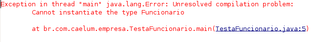
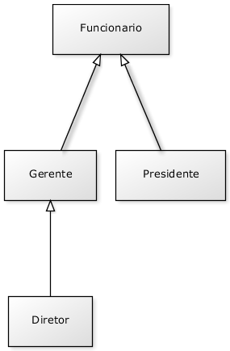
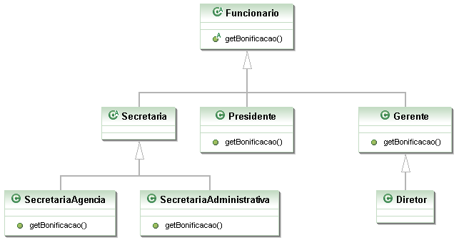

# Classes Abstratas
_"Dá-se importância aos antepassados quando já não temos nenhum."
-- François Chateaubriand_

Ao término desse capítulo, você será capaz de utilizar classes abstratas, quando necessário.


## Repetindo mais código?


Vamos recordar em como pode estar nossa classe `Funcionario`:

``` java
	public class Funcionario {
	
		protected String nome;
		protected String cpf;
		protected double salario;
	
		public double getBonificacao() {
			return this.salario * 1.2;
		}
	
		// outros métodos aqui
	
	}
```

Considere o nosso `ControleDeBonificacao`:

``` java
	public class ControleDeBonificacoes {

		private double totalDeBonificacoes = 0;

			public void registra(Funcionario f) {
				System.out.println("Adicionando bonificação do funcionario: " + f);
				this.totalDeBonificacoes += f.getBonificacao();
			}

			public double getTotalDeBonificacoes() {
				return this.totalDeBonificacoes;
			}
	}
```

Nosso método `registra` recebe qualquer referência do tipo `Funcionario`, isto é, podem ser
objetos do tipo `Funcionario` e qualquer de seus subtipos: `Gerente`, `Diretor` e,
eventualmente, alguma nova subclasse que venha ser escrita, sem prévio conhecimento do autor da
`ControleDeBonificacao`.

Estamos utilizando aqui a classe `Funcionario` para o polimorfismo. Se não fosse ela, teríamos um
grande prejuízo: precisaríamos criar um método `registra` para receber cada um dos tipos de
`Funcionario`, um para `Gerente`, um para `Diretor`, etc. Repare que perder esse poder é muito
pior do que a pequena vantagem que a herança traz em herdar código.

Porém, em alguns sistemas, como é o nosso caso, usamos uma classe com apenas esses intuitos: de
economizar um pouco código e ganhar polimorfismo para criar métodos mais genéricos, que se encaixem
a diversos objetos.

Faz sentido ter uma referência do tipo `Funcionario`? Essa pergunta é diferente de saber se faz sentido
ter um objeto do tipo `Funcionario`: nesse caso, faz sim e é muito útil.

Referenciando `Funcionario` temos o polimorfismo de referência, já que podemos receber qualquer
objeto que seja um `Funcionario`. Porém, dar `new` em `Funcionario` pode não fazer sentido,
isto é, não queremos receber um objeto do tipo `Funcionario`, mas sim que aquela referência seja
ou um `Gerente`, ou um `Diretor`, etc. Algo mais **concreto** que um `Funcionario`.

``` java
	ControleDeBonificacoes cdb = new ControleDeBonificacoes();
	Funcionario f = new Funcionario();
	cdb.adiciona(f); // faz sentido?
```

Vejamos um outro caso em que não faz sentido ter um objeto daquele tipo, apesar da classe existir:
imagine a classe `Pessoa` e duas filhas, `PessoaFisica` e `PessoaJuridica`. Quando puxamos um
relatório de nossos clientes (uma array de `Pessoa` por exemplo), queremos que cada um deles seja
ou uma `PessoaFisica`, ou uma `PessoaJuridica`. A classe `Pessoa`, nesse caso, estaria sendo
usada apenas para ganhar o polimorfismo e herdar algumas coisas: não faz sentido permitir
instanciá-la.

Para resolver esses problemas, temos as classes abstratas.

## Classe abstrata

O que, exatamente, vem a ser a nossa classe `Funcionario`? Nossa empresa tem apenas `Diretores`,
`Gerentes`, `Secretárias`, etc. Ela é uma classe que apenas idealiza um tipo, define apenas um
rascunho.

Para o nosso sistema, é inadmissível que um objeto seja apenas do tipo `Funcionario` (pode existir
um sistema em que faça sentido ter objetos do tipo `Funcionario` ou apenas `Pessoa`, mas, no
nosso caso, não).


Usamos a palavra chave `abstract` para impedir que ela possa ser instanciada. Esse é o efeito
direto de se usar o modificador `abstract` na declaração de uma classe:

``` java
	public abstract class Funcionario {
	
		protected double salario;
	
		public double getBonificacao() {
			return this.salario * 1.2;
		}
	
		// outros atributos e métodos comuns a todos Funcionarios
	
	}
```

E, no meio de um código:

``` java
Funcionario f = new Funcionario(); // não compila!!!
```



O código acima não compila. O problema é instanciar a classe - criar referência, você pode. Se ela
não pode ser instanciada, para que serve? Serve para o polimorfismo e herança dos atributos e
métodos, que são recursos muito poderosos, como já vimos.

Vamos então herdar dessa classe, reescrevendo o método `getBonificacao`:

``` java
	public class Gerente extends Funcionario {
	
		public double getBonificacao() {
			return this.salario * 1.4 + 1000;
		}
	}

```



Mas qual é a real vantagem de uma classe abstrata? Poderíamos ter feito isto com uma herança comum.
Por enquanto, a única diferença é que não podemos instanciar um objeto do tipo `Funcionario`, que
já é de grande valia, dando mais consistência ao sistema.

Fique claro que a nossa decisão de transformar `Funcionario` em uma classe abstrata dependeu do
nosso domínio. Pode ser que, em um sistema com classes similares, faça sentido que uma classe análoga a
`Funcionario` seja concreta.

## Métodos abstratos
Se o método `getBonificacao` não fosse reescrito, ele seria herdado da classe mãe, fazendo com que
devolvesse o salário mais 20%.

Levando em consideração que cada funcionário em nosso sistema tem uma regra totalmente diferente
para ser bonificado, faz algum sentido ter esse método na classe `Funcionario`? Será que existe
uma bonificação padrão para todo tipo de `Funcionario`? Parece que não, cada classe filha terá um
método diferente de bonificação pois, de acordo com nosso sistema, não existe uma regra geral:
queremos que cada pessoa que escreve a classe de um `Funcionario` diferente (subclasses de
`Funcionario`) reescreva o método `getBonificacao` de acordo com as suas regras.


Poderíamos, então, jogar fora esse método da classe `Funcionario`? O problema é que, se ele não
existisse, não poderíamos chamar o método apenas com uma referência a um `Funcionario`, pois
ninguém garante que essa referência aponta para um objeto que possui esse método. Será que então
devemos retornar um código, como um número negativo? Isso não resolve o problema: se esquecermos de
reescrever esse método, teremos dados errados sendo utilizados como bônus.


Existe um recurso em Java que, em uma classe abstrata, podemos escrever que determinado método será
**sempre** escrito pelas classes filhas. Isto é, um **método abstrato**.

Ele indica que todas as classes filhas (concretas, isto é, que não forem abstratas) devem reescrever
esse método ou não compilarão. É como se você herdasse a responsabilidade de ter aquele método.

> **Como declarar um método abstrato**
>
> Às vezes, não fica claro como declarar um método abstrato.
>
> Basta escrever a palavra chave `abstract` na assinatura do mesmo e colocar um ponto e vírgula em
> vez de abre e fecha chaves!


``` java
	public abstract class Funcionario {
	
		public abstract double getBonificacao();
	
		// outros atributos e métodos
	
	}
```

Repare que não colocamos o corpo do método e usamos a palavra chave `abstract` para definir o
mesmo. Por que não colocar corpo algum? Porque esse método nunca vai ser chamado, sempre que alguém
chamar o método `getBonificacao`, vai cair em uma das suas filhas, que realmente escreveram o
método.

Qualquer classe que estender a classe `Funcionario` será obrigada a reescrever este método,
tornando-o "concreto". Se não reescreverem esse método, um erro de compilação ocorrerá.

O método do `ControleDeBonificacao` estava assim:

``` java
	public void registra(Funcionario f) {
		System.out.println("Adicionando bonificação do funcionario: " + f);
		this.totalDeBonificacoes += f.getBonificacao();		
	}
```

Como posso acessar o método `getBonificacao` se ele não existe na classe `Funcionario`?

Já que o método é abstrato, **com certeza** suas subclasses têm esse método, o que garante que essa
invocação de método não vai falhar. Basta pensar que uma referência do tipo `Funcionario` nunca
aponta para um objeto que não tem o método `getBonificacao`, pois não é possível instanciar uma
classe abstrata, apenas as concretas. Um método abstrato obriga a classe em que ele se encontra ser
abstrata, o que garante a coerência do código acima compilar.

## Aumentando o exemplo
E se, no nosso exemplo de empresa, tivéssemos o seguinte diagrama de classes com os seguintes métodos:


Ou seja, tenho a classe abstrata `Funcionario`, com o método abstrato `getBonificacao`; as
classes `Gerente` e `Presidente` estendendo `Funcionario` e implementando o método
`getBonificacao`; e, por fim, a classe `Diretor`, que estende `Gerente`, mas não implementa o
método `getBonificacao`.

Essas classes vão compilar? Vão rodar?

A resposta é sim. E, além de tudo, farão exatamente o que nós queremos, pois, quando `Gerente` e
`Presidente` possuem os métodos perfeitamente implementados, a classe `Diretor`, que não possui
o método implementado, vai usar a implementação herdada de `Gerente`.



E esse diagrama, no qual incluímos uma classe abstrata `Secretaria` sem o método
`getBonificacao`, que é estendida por mais duas classes (`SecretariaAdministrativa`,
`SecretariaAgencia`) que, por sua vez, implementam o método `getBonificacao`, vai compilar? Vai
rodar?

De novo, a resposta é sim, pois `Secretaria` é uma classe abstrata e, por isso, o Java tem certeza
de que ninguém vai conseguir instanciá-la e, muito menos, chamar o método `getBonificacao` dela.
Lembrando que, nesse caso, não precisamos nem ao menos escrever o método abstrato `getBonificacao`
na classe `Secretaria`.

Se eu não reescrever um método abstrato da minha classe mãe, o código não compilará. Mas posso, em
vez disso, declarar a classe como abstrata!

> **java.io**
>
> Classes abstratas não possuem nenhum segredo no aprendizado, mas quem está aprendendo orientação a
> objetos pode ter uma enorme dificuldade para saber quando utilizá-las, o que é muito normal.
>
> Estudaremos o pacote java.io, que usa bastantes classes abstratas, sendo um exemplo real de uso
> desse recurso, que vai melhorar o entendimento delas. (classe InputStream e suas filhas)


## Para saber mais...

* Uma classe que estende uma classe normal também pode ser abstrata! Ela não poderá ser instanciada,
mas sua classe pai sim!

* Uma classe abstrata não precisa necessariamente ter um método abstrato.


## Exercícios: Classes Abstratas
1. Repare que a nossa classe `Conta` é uma excelente candidata para uma classe
	abstrata. Por quê? Que métodos seriam interessantes candidatos a serem abstratos?

	Transforme a classe `Conta` em abstrata:

	``` java
		public abstract class Conta {
			// ...
		}
	```
1. Como a classe `Conta` agora é abstrata, não conseguimos dar `new` nela mais.
	Se não podemos dar `new` em `Conta`, qual é a utilidade de ter um método
	que recebe uma referência a `Conta` como argumento? Aliás, posso ter isso?

	
1. Apenas para entender melhor o `abstract`, comente o método `getTipo()` da
	`ContaPoupanca`, dessa forma ele herdará o método diretamente de `Conta`.

	Transforme o método `getTipo()` da classe `Conta` em abstrato. Repare que,
	ao colocar a palavra chave `abstract` ao lado do método, o Eclipse rapidamente
	vai sugerir que você deve remover o corpo (body) do método com um quick fix.

	Sua classe `Conta` deve ficar parecida com:

	``` java
		public abstract class Conta {
			// atributos e métodos que já existiam

			public abstract String getTipo();
		}
	```

	Qual é o problema com a classe `ContaPoupanca`?

	
1. Descomente o método `getTipo` na classe `ContaPoupanca`, e se necessário altere-o
	para que a classe	possa compilar normalmente.
1. (opcional) Existe outra maneira de a classe `ContaPoupanca` compilar se
	você não reescrever o método abstrato?

	
1. (opcional) Pra que ter o método `getTipo` na classe `Conta` se ele não
	faz nada? O que acontece se simplesmente apagarmos esse método da classe
	`Conta` e deixarmos o método `getTipo` nas filhas?

	
1. (opcional) Posso chamar um método abstrato de dentro de um outro método da
	própria classe abstrata?
	Por exemplo, imagine que exista o seguinte método na classe `Conta`:

	``` java
  public String recuperaDadosParaImpressao() {
      String dados = "Titular: " + this.titular;
      dados += "\nNúmero: " + this.numero;
      dados += "\nAgência: " + this.agencia;
      dados += "\nSaldo: R$" + this.saldo;
      return dados;
  }
	```
	Podemos invocar o `getTipo` dentro deste método? Algo como:

	``` java
      dados += "\nTipo: " + this.getTipo();
	```

	


