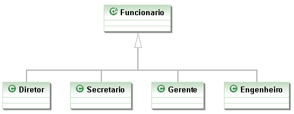
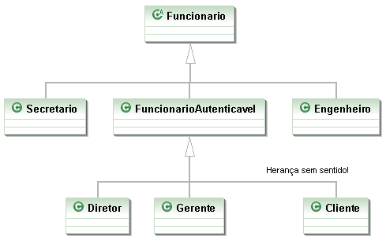
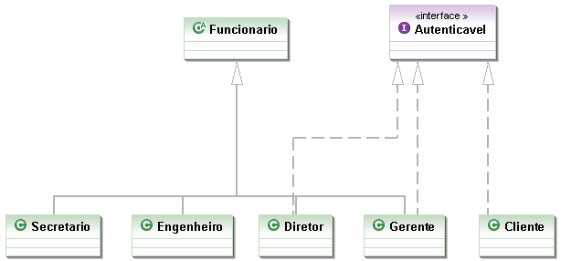
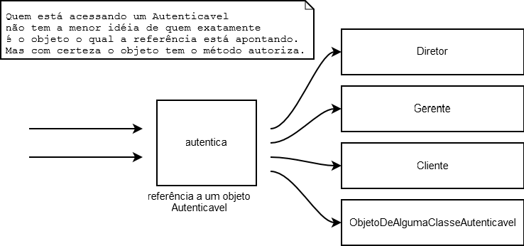
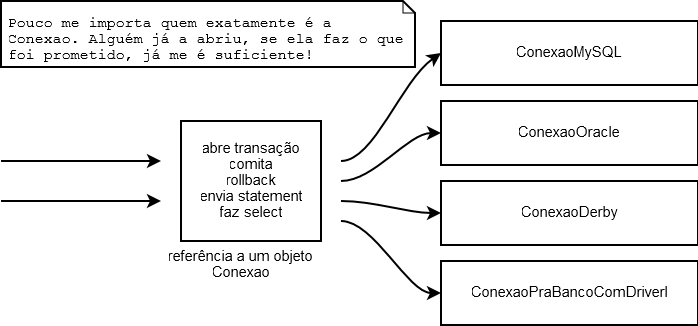

# Interfaces

_"Uma imagem vale mil palavras. Uma interface vale mil imagens." -- Ben Shneiderman_

Ao término desse capítulo, você será capaz de:


* dizer o que é uma interface e as diferenças entre herança e implementação;
* escrever uma interface em Java;
* utilizá-las como um poderoso recurso para diminuir acoplamento entre as classes.


## Aumentando nosso exemplo


Imagine que um Sistema de Controle do Banco pode ser acessado, além de pelos Gerentes, pelos
Diretores do Banco. Então, teríamos uma classe `Diretor`:

``` java
public class Diretor extends Funcionario {

	public boolean autentica(int senha) {
		// verifica aqui se a senha confere com a recebida como parametro
	}

}
```

E a classe `Gerente`:

``` java
public class Gerente extends Funcionario {

	public boolean autentica(int senha) {
		// verifica aqui se a senha confere com a recebida como parametro
		// no caso do gerente verifica também se o departamento dele
		// tem acesso
	}

}
```



Repare que o método de autenticação de cada tipo de `Funcionario` pode variar muito. Mas vamos aos
problemas. Considere o `SistemaInterno` e seu controle: precisamos receber um `Diretor` ou
`Gerente` como argumento, verificar se ele se autentica e colocá-lo dentro do sistema.

``` java
public class SistemaInterno {

	public void login(Funcionario funcionario) {
		// invocar o método autentica?
		// não da! Nem todo Funcionario tem
	}
}
```

O `SistemaInterno` aceita qualquer tipo de `Funcionario`, tendo ele acesso ao sistema ou não, mas
note que nem todo `Funcionario` possui o método `autentica`. Isso nos impede de chamar esse
método com uma referência apenas a `Funcionario` (haveria um erro de compilação). O que fazer
então?

``` java
public class SistemaInterno {

	public void login(Funcionario funcionario) {
		funcionario.autentica(...); // não compila
	}
}
```

Uma possibilidade é criar dois métodos `login` no `SistemaInterno`: um para receber `Diretor` e
outro para receber `Gerente`. Já vimos que essa não é uma boa escolha. Por quê?

``` java
public class SistemaInterno {

	// design problemático
	public void login(Diretor funcionario) {
		funcionario.autentica(...);
	}

	// design problemático
	public void login(Gerente funcionario) {
		funcionario.autentica(...);
	}

}
```

Cada vez que criarmos uma nova classe de `Funcionario` que é _autenticável_, precisaríamos
adicionar um novo método de login no `SistemaInterno`.


> **Métodos com mesmo nome**
>
> Em Java, métodos podem ter o mesmo nome desde que não sejam ambíguos, isto é, que exista uma maneira
> de distinguir no momento da chamada.
>
> Isso se chama **sobrecarga** de método. (**Overloading**. Não confundir com **overriding**, que é um
> conceito muito mais poderoso).


Uma solução mais interessante seria criar uma classe no meio da árvore de herança,
`FuncionarioAutenticavel`:

``` java
public class FuncionarioAutenticavel extends Funcionario {

	public boolean autentica(int senha) {
		// faz autenticacao padrão
	}

	// outros atributos e métodos

}
```

As classes `Diretor` e `Gerente` passariam a estender de `FuncionarioAutenticavel`, e o
`SistemaInterno` receberia referências desse tipo, como a seguir:

``` java
public class SistemaInterno {

	public void login(FuncionarioAutenticavel fa) {

		int senha = //pega senha de um lugar, ou de um scanner de polegar

		// aqui eu posso chamar o autentica!
		// Pois todo FuncionarioAutenticavel tem
		boolean ok = fa.autentica(senha);

	}
}
```


Repare que `FuncionarioAutenticavel` é uma forte candidata a classe abstrata. Mais ainda, o método
`autentica` poderia ser um método abstrato.

O uso de herança resolve esse caso, mas vamos a uma outra situação um pouco mais complexa: precisamos
que todos os clientes também tenham acesso ao `SistemaInterno`. O que fazer? Uma opção é criar
outro método `login` em `SistemaInterno`: mas já descartamos essa anteriormente.

Uma outra, que é comum entre os novatos, é fazer uma herança sem sentido para resolver o problema,
por exemplo, fazer `Cliente extends FuncionarioAutenticavel`. Realmente, resolve o problema, mas
trará diversos outros. `Cliente` definitivamente **não é** `FuncionarioAutenticavel`. Se você
fizer isso, o `Cliente` terá, por exemplo, um método `getBonificacao`, um atributo salario e
outros membros que não fazem o menor sentido para esta classe! Não faça herança quando a relação não
é estritamente "é um".




Como resolver essa situação? Note que conhecer a sintaxe da linguagem não é o suficiente, precisamos
estruturar/desenhar bem a nossa estrutura de classes.

## Interfaces

O que precisamos para resolver nosso problema? Arranjar uma forma de poder referenciar `Diretor`,
`Gerente` e `Cliente` de uma mesma maneira, isto é, achar um fator comum.

Se existisse uma forma na qual essas classes garantissem a existência de um determinado método,
através de um contrato, resolveríamos o problema.

Toda classe define 2 itens:


* o que uma classe faz (as assinaturas dos métodos)
* como uma classe faz essas tarefas (o corpo dos métodos e atributos privados)


Podemos criar um "contrato" que define tudo o que uma classe deve fazer se quiser ter um determinado
status. Imagine:

```
contrato Autenticavel:

		quem quiser ser Autenticavel precisa saber fazer:
			1.autenticar dada uma senha, devolvendo um booleano
```

Quem quiser, pode "assinar" esse contrato, sendo assim obrigado a explicar como será feita essa
autenticação. A vantagem é que, se um `Gerente` assinar esse contrato, podemos nos referenciar a
um `Gerente` como um `Autenticavel`.

Podemos criar esse contrato em Java!

``` java
public interface Autenticavel {

	boolean autentica(int senha);

}
```


Chama-se `interface` pois é a maneira pela qual poderemos conversar com um `Autenticavel`.
Interface é a maneira através da qual conversamos com um objeto.

Lemos a interface da seguinte maneira: _"quem desejar ser autenticável precisa saber autenticar
dado um inteiro e retornando um booleano"_. Ela é um contrato onde quem assina se responsabiliza
por implementar esses métodos (cumprir o contrato).

Uma interface pode definir uma série de métodos, mas nunca conter implementação deles. Ela só expõe
**o que o objeto deve fazer**, e não **como ele faz**, nem **o que ele tem**. **Como ele faz** vai
ser definido em uma **implementação** dessa interface.


E o `Gerente` pode "assinar" o contrato, ou seja, **implementar** a interface. No momento em que
ele implementa essa interface, ele precisa escrever os métodos pedidos pela interface (muito parecido
com o efeito de herdar métodos abstratos, aliás, métodos de uma interface são públicos e abstratos,
sempre). Para implementar usamos a palavra chave `implements` na classe:

``` java
public class Gerente extends Funcionario implements Autenticavel {

	private int senha;

	// outros atributos e métodos

	public boolean autentica(int senha) {
		if(this.senha != senha) {
			return false;
		}
		// pode fazer outras possíveis verificações, como saber se esse
		// departamento do gerente tem acesso ao Sistema

		return true;
	}

}
```



O `implements` pode ser lido da seguinte maneira: "A classe `Gerente` se compromete a ser tratada
como `Autenticavel`, sendo obrigada a ter os métodos necessários, definidos neste contrato".


A partir de agora, podemos tratar um `Gerente` como sendo um `Autenticavel`. Ganhamos mais
polimorfismo! Temos mais uma forma de referenciar a um `Gerente`. Quando crio uma variável do tipo
`Autenticavel`, estou criando uma referência para **qualquer** objeto de uma classe que implemente
`Autenticavel`, direta ou indiretamente:

``` java
Autenticavel a = new Gerente();
// posso aqui chamar o método autentica!
```

Novamente, a utilização mais comum seria receber por argumento, como no nosso `SistemaInterno`:

``` java
public class SistemaInterno {

  public void login(Autenticavel a) {
     int senha = // pega senha de um lugar, ou de um scanner de polegar
     boolean ok =	a.autentica(senha);

     // aqui eu posso chamar o autentica!
     // não necessariamente é um Funcionario!
     // Mais ainda, eu não sei que objeto a
	 // referência "a" está apontando exatamente! Flexibilidade.
  }

}
```

Pronto! E já podemos passar qualquer `Autenticavel` para o `SistemaInterno`. Então precisamos
fazer com que o `Diretor` também implemente essa interface.

``` java
public class Diretor extends Funcionario implements Autenticavel {

	// métodos e atributos, além de obrigatoriamente ter o autentica

}
```



Podemos passar um `Diretor`. No dia em que tivermos mais um funcionário com acesso ao
sistema, basta que ele implemente essa interface, para se encaixar no sistema.

Qualquer `Autenticavel` passado para o `SistemaInterno` está bom para nós. Repare que pouco
importa quem o objeto referenciado realmente é, pois ele tem um método `autentica` que é o
necessário para nosso `SistemaInterno` funcionar corretamente. Aliás, qualquer outra classe que
futuramente implemente essa interface poderá ser passada como argumento aqui.

``` java
Autenticavel diretor = new Diretor();
Autenticavel gerente = new Gerente();
```

Ou, se achamos que o `Fornecedor` precisa ter acesso, basta que ele implemente
`Autenticavel`. Olhe só o tamanho do desacoplamento: quem escreveu o `SistemaInterno` só precisa
saber que ele é `Autenticavel`.

``` java
public class SistemaInterno {

  public void login(Autenticavel a) {
	// não importa se ele é um gerente ou diretor
	// será que é um fornecedor?
	// Eu, o programador do SistemaInterno, não me preocupo
	// Invocarei o método autentica
  }

}
```

Não faz diferença se é um `Diretor`, `Gerente`, `Cliente` ou qualquer classe que venha por aí.
Basta seguir o contrato! Mais ainda, cada `Autenticavel` pode se autenticar de uma maneira
completamente diferente de outro.

Lembre-se: a interface define que todos vão saber se autenticar (o que ele faz), enquanto a
implementação define como exatamente vai ser feito (como ele faz).

A maneira como os objetos se comunicam num sistema orientado a objetos é muito mais importante do que
como eles executam. **O que um objeto faz** é mais importante do que **como ele faz**. Aqueles que
seguem essa regra, terão sistemas mais fáceis de manter e modificar. Como você já percebeu, esta é
uma das ideias principais que queremos passar e, provavelmente, a mais importante de todo esse curso.

> **Mais sobre interfaces: herança e métodos default**
>
> Diferentemente das classes, uma interface pode herdar de mais de uma interface. É como um contrato
> que depende que outros contratos sejam fechados antes deste valer. Você não herda métodos e
> atributos, mas sim responsabilidades.
>
> Um outro recurso em interfaces são os métodos default a partir do Java 8. Você pode sim declarar um método concreto, utilizando a palavra `default` ao lado, e suas implementações não precisam necessariamente reescrevê-lo. Veremos que isso acontece, por exemplo, com o método `List.sort`, durante o capítulo de coleções. É um truque muito utilizado para poder evoluir uma interface sem quebrar compatibilidade com as implementações anteriores.


## Dificuldade no aprendizado de interfaces

Interfaces representam uma barreira no aprendizado do Java: parece que estamos escrevendo um código
que não serve pra nada, já que teremos essa linha (a assinatura do método) escrita nas nossas classes
implementadoras. Essa é uma maneira errada de se pensar. O objetivo do uso de uma interface é deixar
seu código mais flexível e possibilitar a mudança de implementação sem maiores traumas. **Não é
apenas um código de prototipação, um cabeçalho**!

Os mais radicais dizem que toda classe deve ser "interfaceada", isto é, só devemos nos referir a
objetos através de suas interfaces. Se determinada classe não tem uma interface, ela deveria ter.
Os autores deste material acham tal medida radical demais, porém o uso de interfaces em vez de
herança é amplamente aconselhado. Você pode encontrar mais informações sobre o assunto nos livros
_Design Patterns_, _Refactoring_ e _Effective Java_.

No livro Design Patterns, logo no início, os autores citam 2 regras "de ouro". Uma é "evite herança,
prefira composição" e a outra, "programe voltado a interface e não à implementação".

Veremos o uso de interfaces no capítulo de coleções, o que melhora o entendimento do assunto. O
exemplo da interface `Comparable` também é muito esclarecedor, onde enxergamos o reaproveitamento
de código através das interfaces, além do encapsulamento. Para o método `Collections.sort()`, pouco
importa quem vai ser passado como argumento. Para ele, basta que a coleção seja de objetos
comparáveis. Ele pode ordenar `Elefante`, `Conexao` ou `ContaCorrente`, desde que implementem
`Comparable`.

## Exemplo interessante: conexões com o banco de dados

Como fazer com que todas as chamadas para bancos de dados diferentes respeitem a mesma regra? Usando
interfaces!

Imagine uma interface `Conexao` contendo todos os métodos necessários para a comunicação e troca de
dados com um banco de dados. Cada banco de dados fica encarregado de criar a sua implementação para
essa interface.

Quem for usar uma `Conexao` não precisa se importar com qual objeto exatamente está trabalhando, já
que ele vai cumprir o papel que toda `Conexao` deve ter. Não importa se é uma conexão com um Oracle
ou MySQL.



Apesar do `java.sql.Connection` não trabalhar bem assim, a ideia é muito similar, porém as conexões
vêm de uma _factory_ chamada `DriverManager`.

Conexão a banco de dados está fora do escopo desse treinamento, mas é um dos primeiros tópicos
abordados no curso FJ-21, juntamente com DAO.

> **Um pouco mais...**
>
>
> * Posso substituir toda minha herança por interfaces? Qual é a vantagem e a
> desvantagem?
>


## Exercícios: Interfaces
1. Nosso banco precisa tributar dinheiro de alguns bens que nossos clientes possuem.
	Para isso vamos criar uma interface no pacote `br.com.caelum.contas.modelo` do nosso projeto
	 `fj11-contas` já existente:

    • o nome da interface deverá ser `Tributavel`;

    • deve possuir um único método chamado  `getValorImposto()` que não recebe nada e devolve um double.

	Lemos essa interface da seguinte maneira: "todos que quiserem ser _tributável_
	precisam saber retornar _o valor do imposto_, devolvendo um double".

	Alguns bens são tributáveis e outros não, `ContaPoupanca` não é tributável,
	já para `ContaCorrente` você precisa pagar 1% da conta e o `SeguroDeVida`
	tem uma taxa fixa de 42 reais mais 2% do valor do seguro.

	Assim, para atender esta nova necessidade, você deve:
	* *alterar* a classe `ContaCorrente`;
	*  *criar* a classe `SeguroDeVida` . 

	A classe `SeguroDeVida` deverá estar no pacote  `br.com.caelum.contas.modelo` e deve  ter os seguintes atributos encapsulados: `valor` (do tipo double), `titular` (do tipo String) e `numeroApolice` (do tipo int).

	**Dica**: Na classe `SeguroDeVida`, lembre-se de escrever o método  `getTipo`  para que o tipo do `produto` apareça na interface gráfica.

1. Vamos criar a classe `ManipuladorDeSeguroDeVida` dentro do pacote
	`br.com.caelum.contas` para vincular a classe `SeguroDeVida` com a tela de criação
	de seguros. Esta classe deve ter um atributo do tipo `SeguroDeVida`.

	Deve ter também o método `criaSeguro` que não retorna nada e deve receber um parâmetro do tipo
	`Evento` para conseguir obter os dados da tela. Use os seguintes métodos da classe `Evento` para pegar estes dados:

	* `evento.getInt("numeroApolice"));`
	* `evento.getString("titular"));`
	* `evento.getDouble("valor"));`

	**Dica**: use os métodos "setters" da classe `SeguroDeVida` para guardar as informações obtidas. Exemplo:

	```java
	this.seguroDeVida.setNumeroApolice(evento.getInt("numeroApolice"));
	```
	
1. Execute a classe `TestaContas` e tente cadastrar um novo seguro de vida. O seguro
	cadastrado deve aparecer na tabela de seguros de vida.

1. Queremos saber qual o valor total dos impostos de todos os tributáveis.
	Vamos então criar a classe `ManipuladorDeTributaveis` dentro do pacote
	`br.com.caelum.contas`.
	Crie também o método `calculaImpostos` que não retorna nada e recebe um parâmetro do tipo `Evento`. Mais adiante preencheremos o corpo deste método.

	Esta classe também deverá ter o atributo encapsulado  `total` do tipo double.

1. Agora que criamos o tributavel, vamos habilitar a última aba de nosso sistema. Altere
	a classe `TestaContas` para passar o valor `true` na chamada do método
	`mostraTela`.
	
  	Observe que agora que temos o seguro de vida funcionando, a tela de relatório já
	consegue imprimir o valor dos impostos individuais de cada tipo de _Tributavel_.

1. No método `calculaImpostos` da classe `ManipuladorDeTributaveis` precisamos buscar os valores de impostos de cada `Tributavel`,
	somá-los e atribuir ao atributo `total`. Para isto, vamos usar os seguintes métodos da classe  `Evento`:
	* `getTamanhoDaLista` que deve receber o nome da lista desejada, no	caso "listaTributaveis". Este método retorna a quantidade de tributáveis:
	
	``` java
	evento.getTamanhoDaLista("listaTributaveis");
	```

	* `getTributavel` retorna um `Tributavel` de uma
	determinada posição de uma lista, onde precisamos passar o nome da lista e o índice
	do elemento:
	``` java
	evento.getTributavel("listaTributaveis", i);
	```

	 **Dica**: utilize o comando `for` para percorrer a lista inteira, passando por cada posição da mesma.

	 Por fim, o método `calculaImpostos` deverá invocar o método `getValorImposto()` e  acumular o valor do imposto de todos os tributáveis no atributo `total`:

	``` java
	total += t.getValorImposto();
	```

	Repare que, de dentro do `ManipuladorDeTributaveis`, você não pode acessar
	o método `getSaldo`, por exemplo, pois você não tem a garantia de que o
	`Tributavel` que vai ser passado como argumento tem esse método. A única
	certeza que você tem é de que esse objeto tem os métodos declarados na
	interface `Tributavel`.

	É interessante enxergar que as interfaces (como aqui, no caso, `Tributavel`)
	costumam ligar classes muito distintas, unindo-as por uma característica que elas
	tem em comum. No nosso exemplo, `SeguroDeVida` e `ContaCorrente` são
	entidades completamente distintas, porém ambas possuem a característica de serem
	tributáveis.

	Se amanhã o governo começar a tributar até mesmo `PlanoDeCapitalizacao`, basta
	que essa classe implemente a interface `Tributavel`! Repare no grau de
	desacoplamento que temos: a classe `GerenciadorDeImpostoDeRenda` nem imagina
	que vai trabalhar como  `PlanoDeCapitalizacao`. Para ela, o único fato que
	importa é que o objeto respeite o contrato de um tributável, isso é, a interface
	`Tributavel`. Novamente: programe voltado à interface, não à implementação.

	Quais os benefícios de manter o código com baixo acoplamento?

	
1. (opcional) Crie a classe `TestaTributavel` com um método `main` para testar
	o nosso exemplo:

	``` java
	public class TestaTributavel {

		public static void main(String[] args) {
			ContaCorrente cc = new ContaCorrente();
			cc.deposita(100);
			System.out.println(cc.getValorImposto());

			// testando polimorfismo:
			Tributavel t = cc;
			System.out.println(t.getValorImposto());
		}
	}
	```

	Tente chamar o método `getSaldo` através da referência `t`, o que ocorre?
	Por quê?

	A linha em que atribuímos `cc` a um `Tributavel` é apenas para você enxergar
	que é possível fazê-lo. Nesse nosso caso, isso não tem uma utilidade. Essa
	possibilidade foi útil no exercício anterior.

	

	


## Exercícios opcionais
Atenção: caso você faça esse exercício, faça isso num projeto à parte
`conta-interface` já que usaremos a `Conta` como classe em exercícios futuros.
1. (Opcional) Transforme a classe `Conta` em uma interface.

	

	``` java
	public interface Conta {
		public double getSaldo();
		public void deposita(double valor);
		public void saca(double valor);
		public void atualiza(double taxaSelic);
	}
	```

	Adapte `ContaCorrente` e `ContaPoupanca` para essa modificação:

	``` java
	public class ContaCorrente implements Conta {
		// ...
	}
	```

	``` java
	public class ContaPoupanca implements Conta {
		// ...
	}
	```

	Algum código vai ter de ser copiado e colado? Isso é tão ruim?

	
1. (Opcional) Às vezes, é interessante criarmos uma interface que herda de outras
	interfaces: essas, são chamadas subinterfaces. Essas, nada mais são do que um
	agrupamento de obrigações para a classe que a implementar.

	``` java
	public interface ContaTributavel extends Conta, Tributavel {
	}
	```

	Dessa maneira, quem for implementar essa nova interface precisa implementar todos
	os métodos herdados das suas superinterfaces (e talvez ainda novos métodos
	declarados dentro dela):

	``` java
	public class ContaCorrente implements ContaTributavel {
	  // métodos
	}

	Conta c = new ContaCorrente();
	Tributavel t = new ContaCorrente();
	```

	Repare que o código pode parecer estranho, pois a interface não declara método
	algum, só herda os métodos abstratos declarados nas outras interfaces.

	Ao mesmo tempo que uma interface pode herdar de mais de uma outra interface,
	classes só podem possuir uma classe mãe (herança simples).

	


## Discussão: favoreça composição em relação à herança

Discuta com o instrutor e seus colegas, alternativas à herança. Falaremos
de herança versus composição e porquê a herança é muitas vezes considerada
maléfica.

Numa entrevista, James Gosling, "pai do java", fala sobre uma linguagem
puramente de delegação e chega a dizer:

_Rather than subclassing, just use pure interfaces.
It's not so much that class inheritance is particularly bad. It just
has problems._

(Tradução livre: _"Em vez de fazer subclasses, use simplesmente interfaces. Não é que a herança de classes seja particularmente ruim. Ela só tem problemas."_)

http://www.artima.com/intv/gosling3P.html

No blog da Caelum há também um post sobre o assunto:
http://blog.caelum.com.br/2006/10/14/como-nao-aprender-orientacao-a-objetos-heranca/


