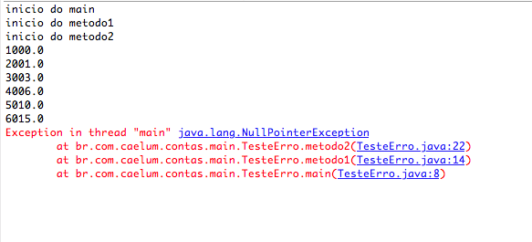
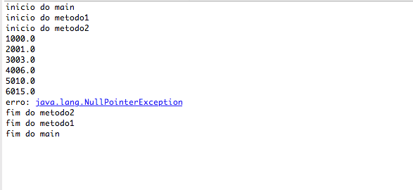
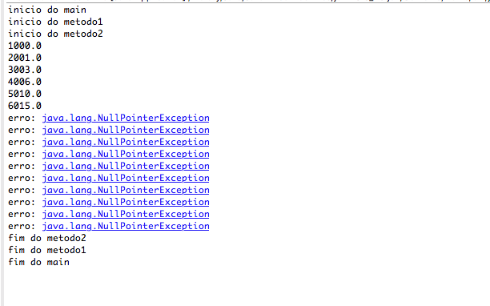
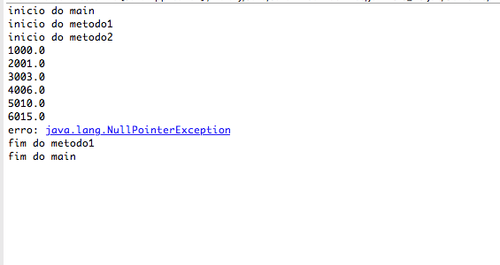
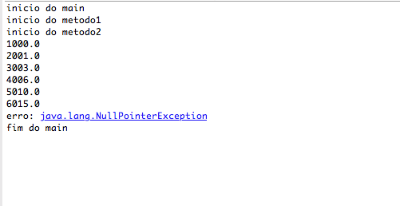
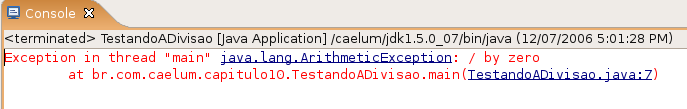
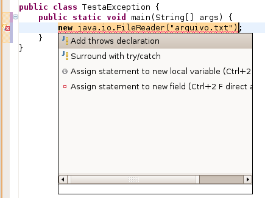
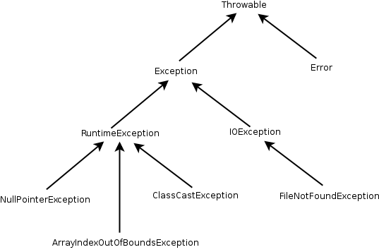

# Exceções e Controle de Erros

_"Quem pensa pouco erra muito."--Leonardo da Vinci_

Ao final deste capítulo, você será capaz de:

* Controlar erros e tomar decisões com base neles;
* Criar novos tipos de erros para melhorar o tratamento deles em sua aplicação ou biblioteca;
* Assegurar que um método funcionou como diz em seu contrato.


## Motivação
<!--@note
* O que significa código de erro -4? E 5? E true/false? Meus problemas têm nomes?
* Onde que aconteceu o problema?
* Por onde eu havia passado até acontecer o problema?
* E se eu esquecer de olhar o retorno do método saca? Alguém me obriga a fazer isso?
-->

Voltando às `Conta`s que criamos no capítulo 6, o que aconteceria ao tentar chamar o método
`saca` com um valor fora do limite? O sistema mostraria uma mensagem de erro, mas quem chamou o
método `saca` não saberá que isso aconteceu.

Como avisar aquele que chamou o método de que este não conseguiu fazer aquilo que deveria?

Em Java, os métodos dizem qual o **contrato** que eles devem seguir. Se, ao tentar sacar, ele não
consegue fazer o que deveria, ele precisa, ao menos, avisar ao usuário que o saque não foi feito.

Veja no exemplo abaixo, estamos forçando uma `Conta` a ter um valor negativo, isto é, a estar em um
estado inconsistente de acordo com a nossa modelagem:

``` java
Conta minhaConta = new Conta();
minhaConta.deposita(100);
minhaConta.setLimite(100);
minhaConta.saca(1000);
//	 o saldo é -900? É 100? É 0? A chamada ao método saca funcionou?
```

Em sistemas de verdade, é muito comum que quem saiba tratar o erro seja aquele que chamou o método, e não
a própria classe! Portanto, nada mais natural do que a classe sinalizar que um erro ocorreu.

A solução mais simples utilizada antigamente é a de marcar o retorno de um método como `boolean` e
retornar `true` se tudo ocorreu da maneira planejada, ou `false`, caso contrário:

``` java
boolean saca(double quantidade) {
	// posso sacar até saldo+limite
	if (quantidade > this.saldo + this.limite) { 
			System.out.println("Não posso sacar fora do limite!");
			return false;
		} else {
			this.saldo = this.saldo - quantidade;
			return true;
		}
	}
```

Um novo exemplo de chamada do método acima:

``` java
Conta minhaConta = new Conta();
minhaConta.deposita(100);
minhaConta.setLimite(100);
if (!minhaConta.saca(1000)) {
	System.out.println("Não saquei");
}
```

Repare que tivemos de lembrar de testar o retorno do método, mas não somos obrigados a
fazer isso. Esquecer de testar o seu retorno teria consequências drásticas: a
máquina de autoatendimento poderia vir a liberar a quantia desejada de dinheiro, mesmo
que o sistema não tivesse conseguido efetuar o método `saca` com sucesso, como no
exemplo a seguir:

``` java
		Conta minhaConta = new Conta();
		minhaConta.deposita(100);
		
		// ...
		double valor = 5000;
		minhaConta.saca(valor); // vai retornar false, mas ninguém verifica!
		caixaEletronico.emite(valor);
```


Mesmo invocando o método e tratando o retorno de maneira correta, o que faríamos se fosse
necessário sinalizar quando o usuário passou um valor negativo como **quantidade**?
Uma solução seria alterar o retorno de `boolean` para `int` e retornar o código do erro que ocorreu.
Isso é considerado uma má prática (conhecida também como uso de _magic numbers_).

Há várias questões: o retorno do método é perdido, o valor devolvido é mágico e só legível perante extensa
documentação, a pessoa programadora não é obrigada a tratar esse retorno e, se por acaso esquecê-lo,
o programa continuará rodando em um estado inconsistente.

Repare o que aconteceria se fosse necessário retornar um outro valor. O exemplo abaixo mostra um caso
no qual, por intermédio do retorno, não será possível descobrir se ocorreu um erro ou não, pois o método
retorna um cliente:

``` java
public Cliente procuraCliente(int id) {
	if (idInvalido) {
		// avisa o método que chamou este que ocorreu um erro
	} else {
		Cliente cliente = new Cliente();
		cliente.setId(id);
		// cliente.setNome("nome do cliente");
		return cliente;
	}
}
```

Por esses e outros motivos, utilizamos um código diferente em Java para tratar aquilo que chamamos de
exceções: os casos nos quais acontece algo que normalmente não iria acontecer. O exemplo do argumento do
saque ou `id` inválido de um cliente é uma **exceção** à regra.

> **Exceção**
>
> Uma exceção representa uma situação que normalmente não ocorre e é algo de estranho ou
> inesperado no sistema.

<!-- Comentário para separar quotes adjacentes. -->


## Exercício para começar com os conceitos

Antes de resolvermos o nosso problema, vejamos como a Java Virtual Machine age
ao se deparar com situações inesperadas, como divisão por zero ou acesso a um índice
da array que não existe.

<!--@note
Antes de eles fazerem esse exercício, você precisa escrevê-lo na lousa (não precisa
por system.out nela) e simular
a pilha a fim de fazê-los perceber que aquilo é o stacktrace. Mesmo para o exercício 2!
Mostre o try catch na lousa antes.

Enfatizar o fato de nossas exceções de execução terem nome e um rastro (o que estava na pilha).
Tomar cuidado para NÃO utilizar o nome ERRO.

Deixar bem claro que esse exercício é para praticar um pouco o conceito e sintaxe
básica, porque ele em si não tem pé nem cabeça.

Use os termos "java LANÇA uma bomba" e verifique se "alguém está se
preocupando com esse tipo de bomba para PEGÁ-LA". Se não estiver, "a bomba continua
a cair na pilha" até chegar no main, lugar onde para.

Use os verbos LANÇAR e PEGAR por causa do throw e catch.

Cuidado com associação do bloco try a uma transação: não há rollback,
pode confundir... Mas é uma boa analogia.
-->
1. Para aprendermos os conceitos básicos das exceptions do Java,
	teste o seguinte código você mesmo:

	``` java
  class TesteErro {
      public static void main(String[] args) {
          System.out.println("inicio do main");
          metodo1();
          System.out.println("fim do main");
      }

      static void metodo1() {
          System.out.println("inicio do metodo1");
          metodo2();
          System.out.println("fim do metodo1");
      }

      static void metodo2() {
          System.out.println("inicio do metodo2");
          ContaCorrente cc = new ContaCorrente();
          for (int i = 0; i <= 15; i++) {	
              cc.deposita(i + 1000);
              System.out.println(cc.getSaldo());
              if (i == 5) {
                  cc = null;
              }
          }
          System.out.println("fim do metodo2");
      }
  }
	```

	Repare o método `main` chamando `metodo1`, e este, por sua vez, chamando o `metodo2`. Cada
	um desses métodos pode ter suas próprias variáveis locais, isto é: o `metodo1` não enxerga as
	variáveis declaradas dentro do `main`, e por aí em diante.

	Como o Java (e muitas das outras linguagens) faz isso? Toda invocação de método é empilhada em
	uma estrutura de dados que isola a área de memória de cada um. Quando um método termina
	(retorna), ele volta para o método que o invocou. Ele descobre isso por meio da **pilha de
	execução** (_stack_): basta remover o marcador que está no topo da pilha:

	

	Porém, o nosso `metodo2` propositadamente tem um enorme problema: está acessando
	uma referência nula quando o índice for igual a `6`!

	Rode o código. Qual é a saída? O que isso representa? O que ela indica?

	

	Essa saída é conhecida como **rastro da pilha** (_stacktrace_) e é importantíssima para o
	programador - tanto que, em qualquer fórum ou lista de discussão, é comum os programadores
	enviarem, juntamente com a descrição do problema, essa stacktrace. Mas por que isso aconteceu?

	O sistema de exceções do Java funciona da seguinte maneira: quando uma exceção é **lançada**
	(_throw_), a JVM entra em estado de alerta e verificará se o método atual toma alguma precaução
	ao **tentar** executar esse trecho de código. Como podemos ver, o `metodo2` não
	toma nenhuma medida diferente do que vimos até agora.

	Como o `metodo2` não está **tratando** desse problema, a JVM para a sua execução anormalmente
	sem esperá-lo terminar e volta um _stackframe_ para baixo, em que será feita nova verificação:
	"o `metodo1` está se precavendo de um problema chamado `NullPointerException`?"
	"Não..." Volta para o `main`, em que também não há proteção. Então, a JVM morre (na verdade, quem
	morre é apenas a `Thread` corrente; se quiser saber mais sobre isso, há um apêndice de Threads e Programação Concorrente no final da apostila).

	Obviamente, aqui estamos forçando esse caso e não faria sentido tomarmos cuidado com ele. É fácil
	arrumar um problema desses: basta verificar antes de chamar os métodos se a variável está com referência nula.

	Porém, só para entender o controle de fluxo de uma `Exception`, colocaremos o código que vai
	**tentar** (_try_) executar o bloco perigoso e, caso o problema seja do tipo
	`NullPointerException`, ele será **pego** (_caught_). Repare que é interessante que
	cada exceção no Java tenha um tipo. Ela pode ter atributos e métodos.
1. Adicione um `try/catch` em volta do `for`, pegando `NullPointerException`.
	O que o código imprime?

	``` java
  try {
      for (int i = 0; i <= 15; i++) {
          cc.deposita(i + 1000);
          System.out.println(cc.getSaldo());
          if (i == 5) {
              cc = null;
          }
      }
  } catch (NullPointerException e) {
      System.out.println("erro: " + e);
  }
	```

	
1. Em vez de fazer o `try` em torno do `for` inteiro, tente apenas com o bloco de dentro do
	`for`:

	``` java
		for (int i = 0; i <= 15; i++) {
			try {
				cc.deposita(i + 1000);
				System.out.println(cc.getSaldo());
				if (i == 5) {
					cc = null;
				}
			} catch (NullPointerException e) {
				System.out.println("erro: " + e);
			}
		}
	```

	Qual é a diferença?

	
1. Retire o `try/catch` e coloque-o em volta da chamada do `metodo2`.

	``` java
		System.out.println("inicio do metodo1");
		try {
			metodo2();
		} catch (NullPointerException e) {
			System.out.println("erro: " + e);
		}
		System.out.println("fim do metodo1");
	```

	
1. Faça a mesma coisa retirando o `try/catch` novamente e colocando-o em volta da chamada do
	`metodo1`. Rode os códigos, o que acontece?

	``` java
		System.out.println("inicio do main");
		try {
			metodo1();
		} catch (NullPointerException e) {
			System.out.println("erro: " + e);
		}
		System.out.println("fim do main");
	```

	

	Repare que, a partir do momento que uma exception foi _catched_ (pega, tratada, handled),
	a execução volta ao normal.


## Exceções de Runtime mais comuns

Que tal tentar dividir um número por zero? Será que a JVM consegue fazer aquilo que nós
definimos como não existente?

``` java
public class TestandoADivisao {
	
	public static void main(String[] args) {
		int i = 5571;
		i = i / 0;
		System.out.println("O resultado  " + i);
	}
}
```

 

Tente executar o programa acima. O que acontece?




Repare: um `NullPointerException` poderia ser
facilmente evitado com um `if` que checaria se a referência é diferente de `null`.

Outro caso em que também ocorre tal tipo de exceção é quando um cast errado é feito (veremos mais
à frente). Em todos os casos, esses problemas provavelmente poderiam ser evitados por quem programa. É
por esse motivo que o Java não obriga a dar o try/catch nessas exceptions, e a essas exceções damos o nome 
 de _unchecked_. Em outras palavras, o compilador não checa se você está tratando essas
exceções.

> **Erros**
>
> Os erros em Java são um tipo de exceção que também pode se tratado. Eles representam problemas na
> máquina virtual e não devem ser tratados em 99% dos casos, já que provavelmente o melhor a se fazer
> é deixar a JVM encerrar (ou apenas a Thread em questão).

<!-- Comentário para separar quotes adjacentes. -->


## Outro tipo de exceção: Checked Exceptions

<!--@note
Aqui você deve usar a mesma lousa que a anterior e fazer com que
o main chame o metodo1, o qual chamará o metodo2, e este, por sua vez, dará new em FileInputStream.
-->

Fica claro com os exemplos de código acima: não é necessário declarar que você está tentando
fazer algo onde um erro possa ocorrer. Os dois exemplos, com ou sem o `try/catch`, compilaram e
rodaram. Em um, o erro terminou o programa, e em outro, foi possível tratá-lo.

Mas não é só esse tipo de exceção que existe em Java. Um outro tipo obriga quem chama
o método ou construtor a tratar essa exceção. Chamamos esse tipo de exceção de _checked_,
pois o compilador checará se ela está sendo devidamente tratada, diferente das anteriores
conhecidas como _unchecked_.

Um exemplo interessante é o de abrir um arquivo para leitura no qual pode ocorrer o erro do arquivo
não existir (veremos como trabalhar com arquivos em outro capítulo, **não** se preocupe com isso agora):

``` java
class Teste {
	public static void metodo() {
		new java.io.FileInputStream("arquivo.txt");
	}
}
```

O código acima não compila, e o compilador avisa que é necessário tratar o `FileNotFoundException`
que pode ocorrer:

<!--@todo trocar por FileInputStream em vez de FileReader -->


Para compilar e fazer o programa funcionar, temos duas maneiras que podemos tratar o problema. A
primeira é tratá-lo com o `try` e `catch` do mesmo jeito que o usamos no exemplo anterior, de referência nula:

``` java
public static void metodo() {
	
	try {
		new java.io.FileInputStream("arquivo.txt");
	} catch (java.io.FileNotFoundException e) {
		System.out.println("Nao foi possível abrir o arquivo para leitura");
	}
	
}
```

 


A segunda maneira de tratar esse erro é delegá-lo a quem chamou o nosso método, isto é, passar
para a frente.

``` java
public static void metodo() throws java.io.FileNotFoundException {
	
	new java.io.FileInputStream("arquivo.txt");

}
```

No Eclipse, é bem simples fazer tanto um `try/catch` como um `throws`:

Tente digitar esse código no Eclipse:

``` java
public class TestaException {
	public static void main(String[] args) {
		new java.io.FileInputStream("arquivo.txt");
	}
}
```

O Eclipse reclamará:

<!--@todo Trocar por FileInputStream em vez de FileReader. -->


E você tem duas opções:


* _Add throws declaration_, que gerará:
``` java
	public class TestaException {
		public static void main(String[] args) throws FileNotFoundException {
			new java.io.FileInputStream("arquivo.txt");
		}
	}
```

* _Surround with try/catch_, que gerará:
``` java
	public class TestaException2 {
		public static void main(String[] args) {
			try {
				new java.io.FileInputStream("arquivo.txt");
			} catch (FileNotFoundException e) {
				// TODO Auto-generated catch block
				e.printStackTrace();
			}
		}
	}
```


No início, existe uma grande tentação de sempre passar o problema para frente a fim de que outros o tratem.
Pode ser que faça sentido dependendo do caso, mas não até o `main`, por exemplo. Acontece que quem
tenta abrir um arquivo sabe como lidar com um problema na leitura. Quem chamou um método no começo
do programa pode não saber ou, pior ainda, tentar abrir cinco arquivos diferentes e não saber em qual
deles houve um problema!

Não há uma regra para decidir em que momento do seu programa você tratará determinada exceção.
Isso dependerá de em que ponto você tem condições de tomar uma decisão em relação àquele erro.
Enquanto não for o momento, você provavelmente preferirá delegar a responsabilidade ao método
que o invocou.

> **Boas práticas no tratamento de exceções**
>
> No blog da Caelum, há um extenso artigo discutindo as boas práticas em relação ao tratamento de exceções.
>
> http://blog.caelum.com.br/2006/10/07/lidando-com-exceptions/

<!-- Comentário para separar quotes adjacentes. -->


## Um pouco da grande família Throwable

Uma pequena parte da família Throwable:



## Mais de um erro

É possível tratar mais de um erro quase que ao mesmo tempo:

* Com o try e catch:
``` java
try {
	objeto.metodoQuePodeLancarIOeSQLException();
} catch (IOException e) {
	// ..
} catch (SQLException e) {
	// ..
}
```

* Com o `throws`:
``` java
public void abre(String arquivo) throws IOException, SQLException {
	// ..
}
```

* Você pode também escolher tratar algumas exceções e declarar as outras no throws:
``` java
public void abre(String arquivo) throws IOException {
	try {
		objeto.metodoQuePodeLancarIOeSQLException();
	} catch (SQLException e) {
		// ..
	}
}
```


É desnecessário declarar no `throws` as exceptions que são _unchecked_, porém é permitido e, às
vezes, facilita a leitura e documentação do seu código.

## Lançando exceções
Lembre-se do método `saca` da nossa classe `Conta`. Ele devolve um `boolean` caso consiga ou
não sacar:

``` java
public boolean saca(double valor) {
	if (this.saldo < valor) {
		return false;
	} else {
		this.saldo-=valor;
		return true;
	}		
}
```

Também podemos lançar uma `Exception`, o que é extremamente útil. Dessa maneira, resolvemos o
problema de alguém esquecer de fazer um `if` no retorno de um método.

A palavra-chave **throw**, que está no imperativo, lança uma `Exception`.
Isso é bem diferente de `throws`, que está no presente do indicativo e só avisa da
possibilidade daquele método lançá-la, obrigando o outro método que vá utilizar-se daquele
a se preocupar com essa exceção em questão.

``` java
public void saca(double valor) {
	if (this.saldo < valor) {
		throw new RuntimeException();
	} else {
		this.saldo-=valor;		
	}		
}
```

No nosso caso, lança uma do tipo _unchecked_. `RuntimeException` é a exception mãe de todas as
exceptions _unchecked_. A desvantagem aqui é que ela é muito genérica; quem receber esse erro não
saberá dizer exatamente qual foi o problema. Podemos então usar uma exception mais específica:

``` java
public void saca(double valor) {
	if (this.saldo < valor) {
		throw new IllegalArgumentException();
	} else {
		this.saldo-=valor;		
	}		
}
```

`IllegalArgumentException` diz um pouco mais: algo foi passado como argumento, e seu método não
gostou. Ela é uma Exception _unchecked_, pois estende de `RuntimeException`, e já faz parte da
biblioteca do Java (`IllegalArgumentException` é a melhor escolha quando um argumento sempre é
inválido, por exemplo, números negativos, referências nulas, etc.).

Para pegar esse erro, não usaremos um `if/else`, e sim um `try/catch`, porque faz mais
sentido, visto que a falta de saldo é uma exceção:

``` java
Conta cc = new ContaCorrente();
cc.deposita(100);

try {
	cc.saca(100);
} catch (IllegalArgumentException e) {
	System.out.println("Saldo Insuficiente");
}
```

Podíamos melhorar ainda mais e passar para o construtor da `IllegalArgumentException` o motivo da
exceção:

``` java
public void saca(double valor) {
	if (this.saldo < valor) {
		throw new IllegalArgumentException("Saldo insuficiente");
	} else {
		this.saldo-=valor;		
	}		
}
```

O método `getMessage()` definido na classe `Throwable` (mãe de todos os tipos de erros e
exceptions) retornará a mensagem que passamos ao construtor da `IllegalArgumentException`.

``` java
try {
	cc.saca(100);
} catch (IllegalArgumentException e) {
	System.out.println(e.getMessage());
}
```

## O que colocar dentro do try?

Imagine que sacaríamos dinheiro de diversas contas:

``` java
Conta cc = new ContaCorrente();
cc.deposita(100);

Conta cp = new ContaPoupanca();
cp.deposita(100);

// sacando das contas:

cc.saca(50);
System.out.println("consegui sacar da corrente!");

cp.saca(50);
System.out.println("consegui sacar da poupança!");
```

Podemos escolher vários lugares para colocar try/catch:

``` java
try {
	cc.saca(50);	
} catch (IllegalArgumentException e) {
	System.out.println(e.getMessage());
}
System.out.println("consegui sacar da corrente!");

try {
	cp.saca(50);
} catch (IllegalArgumentException e) {
	System.out.println(e.getMessage());
}
System.out.println("consegui sacar da poupança!");
```

Essa não parece uma opção boa, pois a mensagem "consegui sacar"
será impressa ainda que o `catch` seja acionado. Sempre que temos
algo que depende da linha de cima para ser correto, devemos
agrupá-lo no `try`:

``` java
try {
	cc.saca(50);	
	System.out.println("consegui sacar da corrente!");
} catch (IllegalArgumentException e) {
	System.out.println(e.getMessage());
}

try {
	cp.saca(50);
	System.out.println("consegui sacar da poupança!");
} catch (IllegalArgumentException e) {
	System.out.println(e.getMessage());
}
```

Mas há ainda uma outra opção: imagine que, para o nosso sistema,
uma falha ao sacar da conta poupança devesse parar o processo
de saques, não chegando nem a tentar sacar da conta-corrente. Para isso, agruparíamos
mais ainda:

``` java
try {
	cc.saca(50);	
	System.out.println("consegui sacar da corrente!");
	cp.saca(50);
	System.out.println("consegui sacar da poupança!");
} catch (IllegalArgumentException e) {
	System.out.println(e.getMessage());
}
```

**O que você colocará dentro do `try` influencia muito
a execução do programa!** Pense direito nas linhas que dependem
umas das outras para a execução correta da sua lógica de negócios.


## Criando seu próprio tipo de exceção

É bem comum criar uma própria classe de exceção com o intuito de controlar melhor o uso de suas exceções. Dessa
maneira, podemos passar valores específicos para ela carregar, e que sejam úteis de alguma forma. Criemos a nossa:

Voltando ao exemplo das `Contas`, façamos a nossa exceção de `SaldoInsuficienteException`:

<!--@todo Não sei se aqui alguém já explicou o super! Precisa revisar! -->

``` java
public class SaldoInsuficienteException extends RuntimeException {	
	
	public SaldoInsuficienteException(String message) {
		super(message);
	}
}
```

Em vez de lançar um `IllegalArgumentException`, lancemos nossa própria exception com
uma mensagem que dirá "Saldo Insuficiente":

``` java
public void saca(double valor) {
	if (this.saldo < valor) {
		throw new SaldoInsuficienteException("Saldo Insuficiente," +  
											"tente um valor menor");
	} else {
		this.saldo-=valor;		
	}		
}
```

E, para testar, crie uma classe que deposite um valor e tente sacar um valor maior:

``` java
public static void main(String[] args) {
	Conta cc = new ContaCorrente();
	cc.deposita(10);		
		
	try {
		cc.saca(100);
	} catch (SaldoInsuficienteException e) {
		System.out.println(e.getMessage());
	}
}
```

Podemos transformar essa `Exception` de _unchecked_ para _checked_, obrigando quem chama esse
método a dar `try-catch` ou `throws`:

``` java
public class SaldoInsuficienteException extends Exception {	
	
	public SaldoInsuficienteException(String message) {
		super(message);
	}
}
```


## Para saber mais: finally


Os blocos `try` e `catch` podem conter uma terceira cláusula chamada `finally`, a qual indica o que
deve ser feito após o término do bloco `try` ou de um `catch` qualquer.

É interessante colocar algo que é imprescindível de ser executado, independente se o que você queria fazer deu
certo ou não. A ocorrência mais comum é o de liberar um recurso no `finally`, como um arquivo ou
conexão com banco de dados, para que possamos ter a certeza de que aquele arquivo (ou conexão) será
fechado, mesmo que algo tenha falhado no decorrer do código.

No exemplo a seguir, o bloco `finally` será sempre executado independentemente de tudo ocorrer bem
ou de acontecer algum problema:

``` java
try {
	// bloco try
} catch (IOException ex) {
	// bloco catch 1
} catch (SQLException sqlex) {
	// bloco catch 2
} finally {
	// bloco que será sempre executado, independente 
	// se houve ou não exception e se ela foi tratada ou não
}
```

Há também, no Java 7, um recurso poderoso conhecido como _try-with-resources_, que permite utilizar
a semântica do finally de uma maneira bem mais simples.

## Exercícios: exceções
1. Na classe `Conta`, modifique o método `deposita(double x)`: ele deve lançar uma exception
	chamada `IllegalArgumentException`, a qual já faz parte da biblioteca do Java, sempre que o valor
	passado como argumento for inválido (por exemplo, quando for negativo).
1. Rode a aplicação, cadastre uma conta e tente depositar um valor negativo.
	O que acontece?

	<!--@answer
	Uma `IllegalArgumentException` é lançada quando tentamos depositar um valor inválido, isto
	é, o próprio método `deposita` se defende de alguém que queira fazer besteira.
	-->
1. Ao lançar a `IllegalArgumentException`, passe via construtor uma mensagem a ser exibida. Lembre-se de
	que a `String` recebida como parâmetro é acessível via o método `getMessage()` herdado
	por todas as `Exceptions`.
	
	Rode a aplicação novamente e veja que agora a mensagem aparece na tela.
1. Faça o mesmo para o método `saca` da classe `ContaCorrente`, afinal o cliente
	também não pode sacar um valor negativo!
1. Validemos também que o cliente não pode sacar um valor maior
	do que o saldo disponível em conta.
	Faça sua própria `Exception`, `SaldoInsuficienteException`. Para isso, você precisa criar uma
	classe com esse nome que seja filha de `RuntimeException`.

	No método `saca` da classe `ContaCorrente`, utilize essa nova  `Exception`.
	
	**Atenção:** nem sempre é interessante criarmos um novo tipo de exception! Depende do caso.
	Nesse aqui, seria melhor ainda utilizarmos `IllegalArgumentException`. A boa prática diz que
	devemos preferir usar as já existentes do Java sempre que possível.
1. (Opcional) Coloque um construtor na classe `SaldoInsuficienteException` que receba
	o valor	que ele tentou sacar (isto é, ele receberá um `double valor`).

	Quando estendemos uma classe, não herdamos seus construtores, mas podemos acessá-los por meio
	da palavra-chave `super` de dentro de um construtor. As exceções do Java têm uma série
	de construtores úteis para poder populá-las já com uma mensagem de erro. Então, criemos
	um construtor em `SaldoInsuficienteException` que delegue para o construtor de sua mãe. Este
	guardará essa mensagem para poder mostrá-la quando o método `getMessage` for invocado:

	<!--@note
	Durante esse exercício, é bom uma explicaçãozinha na lousa a respeito desse recurso.
	Vale a pena dar a motivação explicando por que construtores não são herdados (se fossem
	herdados, você poderia construir um objeto do tipo filho passando menos informações
	que as realmente necessárias por ela, já que a classe pai não precisava dela, por exemplo).

	Também é bom explicar que isso é bem usual, e talvez falar do menu source, generate
	constructor using fields (ou Control 3 + gcuf).
	-->

	``` java
	public class SaldoInsuficienteException extends RuntimeException {

		public SaldoInsuficienteException(double valor) {
			super("Saldo insuficiente para sacar o valor de: " + valor);
		}
	}
	```

	Dessa maneira, na hora de dar o `throw new SaldoInsuficienteException`, você precisará passar
	esse valor como argumento:

	``` java
	if (this.saldo < valor) {
		throw new SaldoInsuficienteException(valor);
	}
	```

	**Atenção:** você pode se aproveitar do Eclipse para isso: comece já passando o `valor` como
	argumento ao construtor da exception, e o Eclipse reclamará que não existe tal construtor.
	O quickfix (`ctrl + 1`) sugerirá que ele seja construido, poupando-lhe tempo!

	E agora? Como fica o método `saca` da classe `ContaCorrente`?

	<!--@answer
	``` java
	@Override
	public void saca(double valor) {
		if (valor < 0) {
			throw new IllegalArgumentException("Valor menor do que 0");
		}
		if (this.saldo < valor) {
			throw new SaldoInsuficienteException(valor);
		}
		this.saldo -= (valor + 0.10);
	}
	```
	-->
1. (Opcional) Declare a classe `SaldoInsuficienteException` como filha direta de `Exception` em
	vez de `RuntimeException`. Ela passa a ser **checked**. O que isso resulta?

	Você precisará avisar que o seu método `saca()` `throws SaldoInsuficienteException`,
	pois ela é uma _checked_ exception. Além disso, quem chama esse método necessitará tomar uma
	decisão entre `try-catch` ou `throws`. Faça uso do quickfix do Eclipse novamente!

	Depois, retorne a exception para _unchecked_, isto é, para ser filha de `RuntimeException`,
	pois iremos utilizá-la assim em exercícios de capítulos posteriores.

	<!--@answer
	A mudança na classe `SaldoInsuficienteException` é apenas na classe mãe:

	``` java
		public class SaldoInsuficienteException extends Exception {
			//...	
		}
	```

	E, por conta disso, o método `saca` da classe `ContaCorrente` precisa avisar que pode,
	eventualmente, lançar essa exceção:

	``` java filename="ContaCorrente.java"
    public void saca(double valor) throws SaldoInsuficienteException {
        if (valor < 0) {
            throw new IllegalArgumentException();
        }
        if (this.saldo < valor) {
            throw new SaldoInsuficienteException(valor);
        }
        this.saldo -= (valor + 0.10);
    }
	```
	-->


## Desafios
1. O que acontece se acabar a memória da Java Virtual Machine?

	<!--@answer
	O que acontece é um `java.lang.OutOfMemoryError`, o qual **é um** `Error` em vez de uma
	`Exception`. http://docs.oracle.com/javase/7/docs/api/java/lang/OutOfMemoryError.html

	O código para fazer esse erro é:

	``` java
		public class TestaError {
			public static void main(String[] args) {
				String[] ss = new String[Integer.MAX_VALUE];
			}
		}
	```
	-->


## Discussão em aula: catch e throws com Exception

Existe uma péssima prática de programação em Java que é a de escrever o `catch` e o `throws`
com `Exception`.

Há códigos que sempre usam `Exception`, porque isso cuida de todos os possíveis erros. O maior
problema disso é generalizar o erro. Se alguém joga algo do tipo `Exception` para quem o chamou,
quem recebe não sabe qual o tipo específico de erro que ocorreu e não saberá como tratá-lo.

Sim, há casos nos quais o tratamento de mais de uma exception pode ser feito de uma mesma maneira. Por
exemplo, se queremos terminar a aplicação tanto no caso de `IOException` quanto em `SQLException`.
Se fizermos `catch(Exception e)` para pegar esses dois casos, teremos um problema: a aplicação
irá parar mesmo que outra exceção seja lançada. A solução correta seria ter dois catches, mas aí
teríamos código repetido. A fim de evitar o código repetido, podemos usar o multi-catch do Java 7,
o qual permite um mesmo catch cuidar de mais de uma exceção por meio da sintaxe
`catch(IOException | SQLException e) { ... } `.

<!--@note
É uma discussão rápida, nada de novo. Se quiser, peça para o pessoal
entrar no link do post do kung sobre exceptions, o qual está em algumas páginas atrás.
-->
