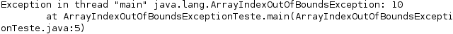
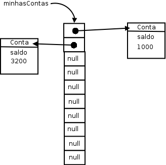
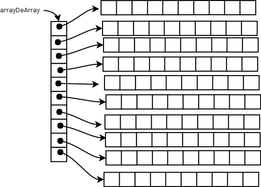
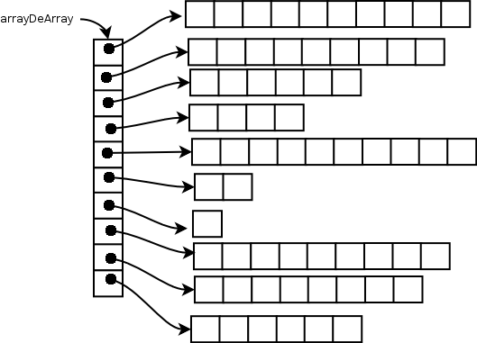

# Um pouco de arrays

_"O homem esquecerá antes a morte do pai que a perda da propriedade"--Maquiavel_

Ao término desse capítulo, você será capaz de:

* declarar e instanciar arrays;
* popular e percorrer arrays.


## O problema
Dentro de um bloco, podemos declarar diversas variáveis e usá-las:

``` java
double saldoDaConta1 = conta1.getSaldo();
double saldoDaConta2 = conta2.getSaldo();
double saldoDaConta3 = conta3.getSaldo();
double saldoDaConta4 = conta4.getSaldo();
```

Isso pode se tornar um problema quando precisamos mudar a quantidade de variáveis a serem declaradas
de acordo com um parâmetro. Esse parâmetro pode variar, como por exemplo, a quantidade de número contidos
num bilhete de loteria. Um jogo simples possui 6 números, mas podemos comprar um bilhete mais caro, com 7
números ou mais.


Para facilitar esse tipo de caso podemos declarar um **vetor (array)** de doubles:

``` java
double[] saldosDasContas;
```

O `double[]` é um tipo. Uma array é sempre um objeto, portanto, a variável
`saldosDasContas` é uma referência.
Vamos precisar criar um objeto para poder usar a array. Como criamos o objeto-array?

``` java
saldosDasContas= new double[10];
```

O que fizemos foi criar uma array de double de 10 posições e atribuir o endereço no qual ela
foi criada. Podemos ainda acessar as posições do array:

``` java
saldosDasContas[5] = conta5.getSaldo();
```

O código acima altera a sexta posição do array. No Java, os índices do array vão de 0 a n-1, onde
n é o tamanho dado no momento em que você criou o array. Se você tentar acessar uma posição fora
desse alcance, um erro ocorrerá durante a execução.



> **Arrays - um problema no aprendizado de muitas linguagens**
>
> Aprender a usar arrays pode ser um problema em qualquer linguagem. Isso porque envolve uma série de
> conceitos, sintaxe e outros. No Java, muitas vezes utilizamos outros recursos em vez de arrays, em
> especial os pacotes de coleções do Java, que veremos no capítulo 15. Portanto, fique tranquilo caso
> não consiga digerir toda sintaxe das arrays num primeiro momento.


No caso do bilhete de loteria, podemos utilizar o mesmo recurso. Mais ainda, a quantidade de números
do nosso bilhete pode ser definido por uma variável. Considere que `n` indica quantos números nosso
bilhete terá,  podemos então fazer:

``` java
int[] numerosDoBilhete = new int[n];
```

E assim podemos acessar e modificar os inteiros com índice de `0` a `n-1`.

## Arrays de referências


É comum ouvirmos "array de objetos". Porém quando criamos uma array de alguma classe, ela possui
referências. O objeto, como sempre, está na memória principal e, na sua array, só ficam guardadas as
**referências** (endereços).

``` java
ContaCorrente[] minhasContas;
minhasContas = new ContaCorrente[10];
```

Quantas contas foram criadas aqui? Na verdade, **nenhuma**. Foram criados 10 espaços que você pode
utilizar para guardar uma referência a uma ContaCorrente. Por enquanto, eles se referenciam para lugar
nenhum (`null`). Se você tentar:

``` java
System.out.println(minhasContas[0].getSaldo());
```

Um erro durante a execução ocorrerá! Pois, na primeira posição da array, não há uma referência para
uma conta, nem para lugar nenhum. Você deve **popular** sua array antes.

``` java
ContaCorrente contaNova = new ContaCorrente();
contaNova.deposita(1000.0);
minhasContas[0] = contaNova;
```

Ou você pode fazer isso diretamente:

``` java
minhasContas[1] = new ContaCorrente();
minhasContas[1].deposita(3200.0);
```



Uma array de tipos primitivos guarda valores, um array de objetos guarda referências.

Mas e se agora quisermos guardar tanto **Conta Corrente** quanto **Conta Poupança**? Um
array de **Conta Corrente** só consegue guardar objetos do mesmo tipo. Se quisermos
guardar os dois tipos de conta, devemos criar um array de **Conta**!

``` java
Conta[] minhasContas = new Conta[10];
minhasContas[0] = new ContaCorrente();
minhasContas[1] = new ContaPoupanca();
```

Perceba que não estamos criando um objeto do tipo `Conta`, que é abstrata, estamos
criando 10 espaços que guardam referências para qualquer tipo de conta.

## Percorrendo uma array

Percorrer um array é muito simples quando fomos nós que a criamos:

``` java
public static void main(String[] args) {
	int[] idades = new int[10];
	for (int i = 0; i < 10; i++) {
		idades[i] = i * 10;
	}
	for (int i = 0; i < 10; i++) {
		System.out.println(idades[i]);
	}
}
```

 

Porém, em muitos casos, recebemos uma array como argumento em um método:

``` java
public void imprimeArray(int[] array) {
	// não compila!!
	for (int i = 0; i < ????; i++) {
		System.out.println(array[i]);
	}
}
```

Até onde o `for` deve ir? Toda array em Java tem um atributo que se chama `length`, e você pode
acessá-lo para saber o tamanho do array ao qual você está se referenciando naquele momento:

``` java
public void imprimeArray(int[] array) {
	for (int i = 0; i < array.length; i++) {
		System.out.println(array[i]);
	}
}
```

> **Arrays não podem mudar de tamanho**
>
> A partir do momento que uma array foi criada, ela **não pode** mudar de tamanho.
>
> Se você precisar de mais espaço, será necessário criar uma nova array e, antes de se referir  ela,
> copie os elementos da array velha.


## Percorrendo uma array no Java 5.0

O Java 5.0 traz uma nova sintaxe para percorremos arrays (e coleções, que veremos mais a frente).

No caso de você não ter necessidade de manter uma variável com o índice que indica a posição do
elemento no vetor (que é uma grande parte dos casos), podemos usar o **enhanced-for**.

``` java
public class AlgumaClasse{
	public static void main(String[] args) {
		int[] idades = new int[10];
		for (int i = 0; i < 10; i++) {
			idades[i] = i * 10;
		}
		
		// imprimindo toda a array
		for (int x : idades) {
			System.out.println(x);
		}
	}
}
```

 

Não precisamos mais do `length` para percorrer matrizes cujo tamanho não conhecemos:

``` java
public class AlgumaClasse {
	public void imprimeArray(int[] array) {
		for (int x : array) {
			System.out.println(x);
		}
	}
}
```

O mesmo é válido para arrays de referências. Esse `for` nada mais é que um truque de compilação
para facilitar essa tarefa de percorrer arrays e torná-la mais legível.

## Exercícios: Arrays

Para consolidarmos os conceitos sobre arrays, vamos fazer alguns exercícios que não interferem em nosso projeto.

1. Crie uma classe `TestaArrays` e no método `main` crie um array de contas de tamanho 10. Em seguida, faça um laço para criar 10 contas com saldos distintos e colocá-las no array. Por exemplo, você pode utilizar o índice do laço e multiplicá-lo por 100 para gerar o saldo de cada conta:

  ``` java
    Conta[] contas = new Conta[10];

    for (int i = 0; i < contas.length; i++) {
      Conta conta = new ContaCorrente();
      conta.deposita(i * 100.0);
      // escreva o código para guardar a conta na posição i do array
    }
  ```

  
1. Ainda na classe `TestaArrays`, faça um outro laço para calcular e imprimir a média dos saldos de todas as contas do array.
  
  
1. (opcional) Crie uma classe ```TestaSplit``` que reescreva uma frase com as palavras na ordem invertida. _"Socorram-me, subi no ônibus em Marrocos"_ deve retornar _"Marrocos em ônibus no subi Socorram-me,"_. Utilize o método `split` da
  `String` para te auxiliar. Esse método divide uma `String` de acordo com o separador especificado e devolve as partes em um array de `String`, por exemplo:

  ``` java
    String frase = "Uma mensagem qualquer";
    String[] palavras = frase.split(" ");

    // Agora só basta percorrer o array na ordem inversa imprimindo as palavras
  ```

  
1. (opcional) Crie uma classe `Banco` dentro do pacote `br.com.caelum.contas.modelo`
	O `Banco` deve ter um nome e um número (obrigatoriamente) e uma referência a uma
	array de `Conta` de tamanho 10, além de outros atributos que você julgar necessário.

	``` java
  public class Banco {
      private String nome;
      private int numero;
      private Conta[] contas;

      // outros atributos que você achar necessário

      public Banco(String nome, int numero) {
          this.nome = nome;
          this.numero = numero;
          this.contas = new ContaCorrente[10];
      }

      // getters para nome e número, não colocar os setters pois já recebemos no
      // construtor
  }
	```
1. (opcional) A classe `Banco` deve ter um método `adiciona`, que recebe uma referência a
	`Conta` como argumento e guarda essa conta.

	Você deve inserir a `Conta` em uma posição da array que esteja livre.
	Existem várias maneiras para você fazer isso: guardar um contador para indicar
	qual a próxima posição vazia ou procurar por uma posição vazia toda vez. O que
	seria mais interessante?

	Se quiser verificar qual a primeira posição vazia (nula) e adicionar nela, poderia
	ser feito algo como:

	``` java
  public void adiciona(Conta c) {
      for(int i = 0; i < this.contas.length; i++){
          // verificar se a posição está vazia
          // adicionar no array
      }
  }
	```

	É importante reparar que o método adiciona não recebe titular, agencia, saldo, etc. Essa
	seria uma maneira nem um pouco estruturada, muito menos orientada a objetos de se
	trabalhar. Você antes cria uma `Conta` e já passa a referência dela, que
	dentro do objeto possui titular, saldo, etc.

	
1. (opcional) Crie uma classe `TestaBanco` que possuirá um método `main`. Dentro dele crie
	algumas instâncias de `Conta` e passe para o banco pelo método
	`adiciona`.
	``` java
  Banco banco = new Banco("CaelumBank", 999);
  //	 ....
	```

	Crie algumas contas e passe como argumento para o `adiciona` do banco:

	``` java
  ContaCorrente c1 = new ContaCorrente();
  c1.setTitular("Batman");
  c1.setNumero(1);
  c1.setAgencia(1000);
  c1.deposita(100000);
  banco.adiciona(c1);

  ContaPoupanca c2 = new ContaPoupanca();
  c2.setTitular("Coringa");
  c2.setNumero(2);
  c2.setAgencia(1000);
  c2.deposita(890000);
  banco.adiciona(c2);
	```

	Você pode criar essas contas dentro de um loop e dar a cada um deles valores
	diferentes de depósitos:

	``` java
  for (int i = 0; i < 5; i++) {
      ContaCorrente conta = new ContaCorrente();
      conta.setTitular("Titular " + i);
      conta.setNumero(i);
      conta.setAgencia(1000);
      conta.deposita(i * 1000);
      banco.adiciona(conta);
  }
	```

	Repare que temos de instanciar `ContaCorrente` dentro do laço. Se a instanciação
	de `ContaCorrente` ficasse acima do laço, estaríamos adicionado cinco vezes a
	**mesma** instância de `ContaCorrente` neste `Banco` e apenas mudando seu
	depósito a cada iteração, que nesse caso não é o efeito desejado.

	Opcional: o método `adiciona` pode gerar uma mensagem de erro indicando quando
	o array já está cheio.

	
1. (opcional) Percorra o atributo `contas` da sua instância de `Banco` e imprima os
	dados de todas as suas contas. Para fazer isso, você pode criar um método
	chamado `mostraContas` dentro da classe `Banco`:

	``` java
  public void mostraContas() {
      for (int i = 0; i < this.contas.length; i++) {
          System.out.println("Conta na posição " + i);
          // preencher para mostrar outras informacoes da conta
      }
  }
	```

	Cuidado ao preencher esse método: alguns índices do seu array podem não conter
	referência para uma `Conta` construída, isto é, ainda se referirem para
	`null`. Se preferir, use o `for` novo do java 5.0.

	Aí, através do seu `main`, depois de adicionar algumas contas, basta fazer:

	``` java
	banco.mostraContas();
	```

	
1. (opcional) Em vez de mostrar apenas o salário de cada funcionário, você pode
	usar o método `toString()` de cada `Conta` do seu array.
	
1. (opcional) Crie um método para verificar se uma determinada `Conta` se
	encontra ou não como conta deste banco:

	``` java
  public boolean contem(Conta conta) {
      // ...
  }
	```

	Você vai precisar fazer um `for` em seu array e verificar se a conta
	passada como argumento se encontra dentro do array. Evite ao máximo usar números
	hard-coded, isto é, use o `.length`.
	
1. (opcional) Caso o array já esteja cheio no momento de adicionar uma outra conta, crie um array
	novo com uma capacidade maior e copie os valores do array atual. Isto é, vamos fazer
	a realocação dos elementos do array já que java não tem isso: um array nasce e morre
	com o mesmo length.

	> **Usando o this para passar argumento**
	>
	> Dentro de um método, você pode usar a palavra `this` para referenciar a si
	> mesmo e pode passar essa referência como argumento.

	

	


## Um pouco mais...

* Arrays podem ter mais de uma dimensão. Isto é, em vez de termos uma array de
10 contas, podemos ter uma array de 10 por 10 contas e você pode acessar a conta
na posição da coluna x e linha y. Na verdade, uma array bidimensional em Java é
uma array de arrays. Pesquise sobre isso.



* Uma array bidimensional não precisa ser retangular, isto é, cada linha pode ter um número
diferente de colunas. Como? Porque?



* O que acontece se criarmos uma array de 0 elementos? e -1?

* O método `main` recebe uma **array de Strings** como argumento. Essa array é passada pelo usuário
quando ele invoca o programa:

```$ java Teste argumento1 outro maisoutro```

E nossa classe:

``` java
public class Teste {
	public static void main (String[] args) {
		for(String argumento: args) {
			System.out.println(argumento);
		}
	}
}
```

Isso imprimirá:
```
argumento1
outro
maisoutro
```


## Desafios Opcionais
1. Nos primeiros capítulos, você deve ter reparado que a versão recursiva para o
	problema de Fibonacci é lenta porque toda hora estamos recalculando valores.
	Faça com que a versão recursiva seja tão boa quanto a versão iterativa.
	(Dica: use arrays para isso)

	
1. O objetivo deste exercício é fixar os conceitos vistos. Se você está com
	dificuldade em alguma parte desse capítulo, aproveite e treine tudo o que vimos
	até agora no pequeno programa abaixo:

	* Programa:

	Classe: Casa
	Atributos: cor, totalDePortas, portas[]
	Métodos: void pinta(String s),
	int quantasPortasEstaoAbertas(),
	void adicionaPorta(Porta p),
	int totalDePortas()

	Crie uma casa, pinte-a. Crie três portas e coloque-as na casa através do método
	`adicionaPorta`, abra e feche-as como desejar. Utilize o método
	`quantasPortasEstaoAbertas` para imprimir o número de portas abertas e o método
	`totalDePortas` para imprimir o total de portas em sua casa.
