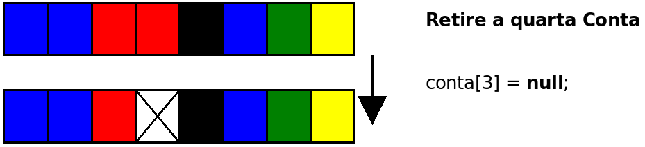
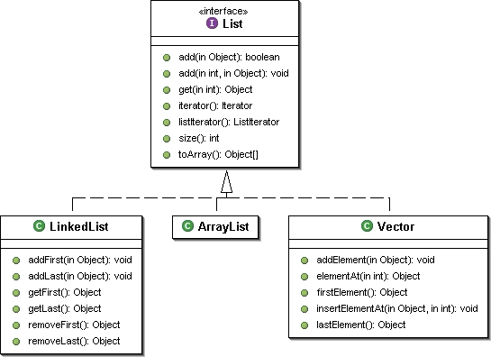
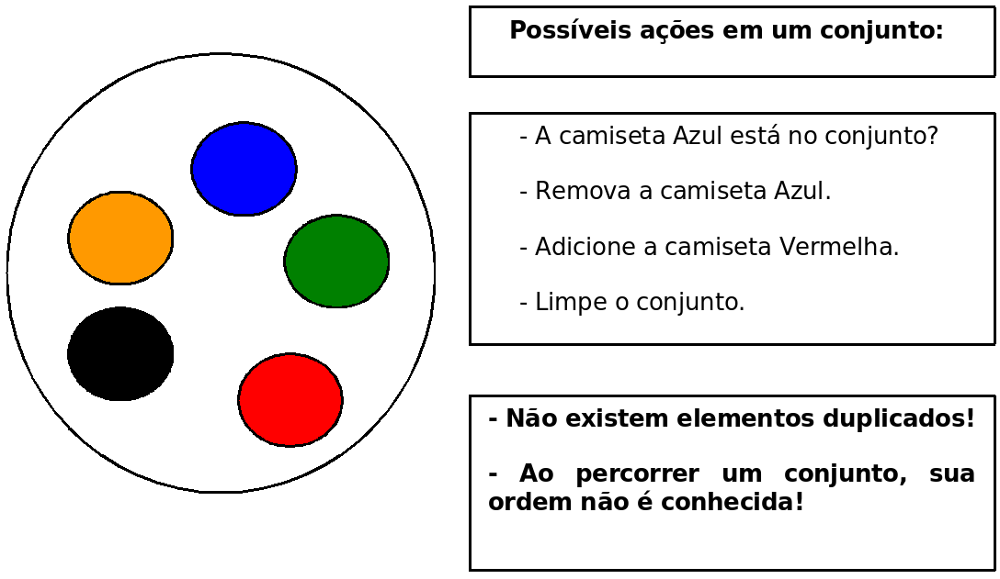
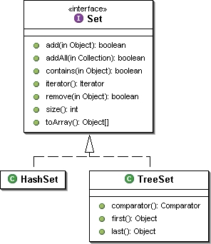
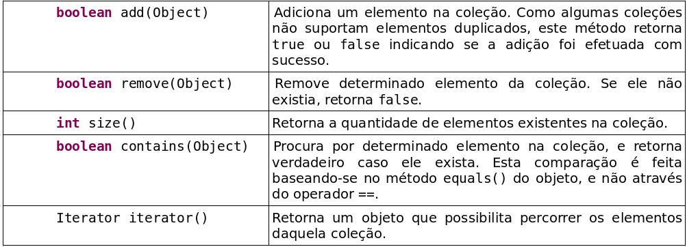
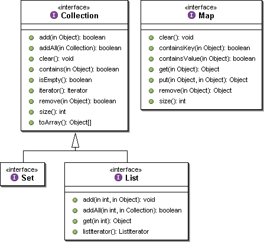
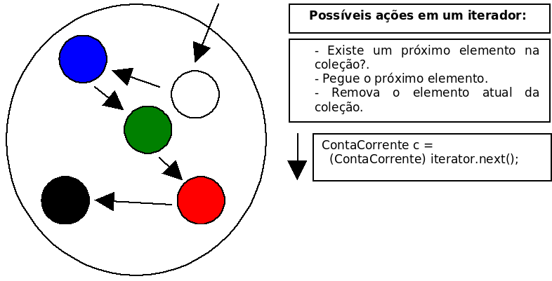
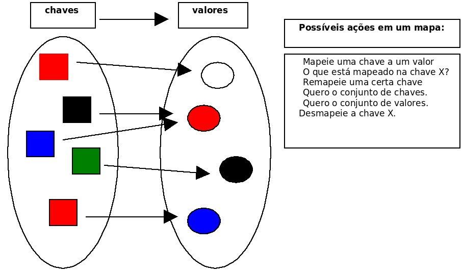
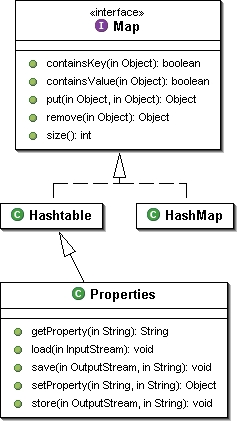

# Collections framework
_"A amizade é um contrato segundo o qual nos comprometemos a prestar
pequenos favores para que no-los retribuam com grandes."
-- Baron de la Brede et de Montesquieu_

Ao término desse capítulo, você será capaz de:

* utilizar arrays, lists, sets ou maps dependendo da necessidade do programa;
* iterar e ordenar listas e coleções;
* usar mapas para inserção e busca de objetos.


## Arrays são trabalhosos, utilizar estrutura de dados
Como vimos no capítulo de arrays, manipulá-las é bastante trabalhoso. Essa dificuldade
aparece em diversos momentos:


* não podemos redimensionar um array em Java;
* é impossível buscar diretamente por um determinado elemento cujo índice não se sabe;
* não conseguimos saber quantas posições do array já foram populadas sem criar, para isso,
métodos auxiliares.




Na figura acima, você pode ver um array que antes estava sendo completamente utilizado e que, depois,
teve um de seus elementos removidos.

Supondo que os dados armazenados representem contas, o que acontece quando precisarmos inserir uma
nova conta no banco? Precisaremos procurar por um espaço vazio? Guardaremos em alguma estrutura de
dados externa, as posições vazias? E se não houver espaço vazio? Teríamos de criar um array maior
e copiar os dados do antigo para ele?

Há mais questões: como posso saber quantas posições estão sendo usadas no array? Vou precisar sempre
percorrer o array inteiro para conseguir essa informação?

Além dessas dificuldades que os arrays apresentavam, faltava um conjunto robusto de classes para
suprir a necessidade de estruturas de dados básicas, como listas ligadas e tabelas de espalhamento.


Com esses e outros objetivos em mente, o comitê responsável pelo Java criou um conjunto de classes e interfaces conhecido como  **Collections Framework**, que reside no pacote `java.util` desde o Java2 1.2.

> **Collections**
>
> A **API** de **Collections** é robusta e possui diversas classes que representam estruturas de dados
> avançadas.
>
> Por exemplo, não é necessário reinventar a roda e criar uma lista ligada, mas sim utilizar aquela que
> o Java disponibiliza.


## Listas: java.util.List
Um primeiro recurso que a API de `Collections` traz são **listas**. Uma lista é uma coleção que
permite elementos duplicados e mantém uma ordenação específica entre os elementos.

Em outras palavras, você tem a garantia de que, quando percorrer a lista, os elementos serão
encontrados em uma ordem pré-determinada, definida na hora da inserção dos mesmos. Ela resolve todos os
problemas que levantamos em relação ao array (busca, remoção, tamanho
"infinito",...). Esse código já está pronto!

A API de `Collections` traz a interface `java.util.List`, que especifica o que uma classe deve
ser capaz de fazer para ser uma lista. Há diversas implementações disponíveis, cada uma com uma forma
diferente de representar uma lista.

A implementação mais utilizada da interface `List` é a `ArrayList`, que trabalha com um array
interno para gerar uma lista. Portanto, ela é mais rápida na pesquisa do que sua concorrente, a
`LinkedList`, que é mais rápida na inserção e remoção de itens nas pontas.

> **ArrayList não é um array!**
>
> É comum confundirem uma `ArrayList` com um array, porém ela não é um array. O que ocorre é que,
> internamente, ela usa um array como estrutura para armazenar os dados, porém este atributo está
> propriamente encapsulado e você não tem como acessá-lo. Repare, também, que você não pode usar
> `[]` com uma `ArrayList`, nem acessar atributo `length`. Não há relação!


Para criar um `ArrayList`, basta chamar o construtor:

``` java
	ArrayList lista = new ArrayList();
```


É sempre possível abstrair a lista a partir da interface `List`:

``` java
	List lista = new ArrayList();
```


Para criar uma lista de nomes (`String`), podemos fazer:

``` java
	List lista = new ArrayList();
	lista.add("Manoel");
	lista.add("Joaquim");
	lista.add("Maria");
```

A interface `List` possui dois métodos `add`, um que recebe o objeto a ser inserido e o coloca
no final da lista, e um segundo que permite adicionar o elemento em qualquer posição da mesma.
Note que, em momento algum, dizemos qual é o tamanho da lista; podemos acrescentar quantos elementos
quisermos, que a lista cresce conforme for necessário.

Toda lista (na verdade, toda `Collection`) trabalha do modo mais genérico possível. Isto é, não há
uma `ArrayList` específica para `Strings`, outra para Números, outra para Datas etc. Todos os
métodos trabalham com `Object`.


Assim, é possível criar, por exemplo, uma lista de Contas Correntes:

``` java
	ContaCorrente c1 = new ContaCorrente();
	c1.deposita(100);

	ContaCorrente c2 = new ContaCorrente();
	c2.deposita(200);

	ContaCorrente c3 = new ContaCorrente();
	c3.deposita(300);

	List contas = new ArrayList();
	contas.add(c1);
	contas.add(c3);
	contas.add(c2);
```

Para saber quantos elementos há na lista, usamos o método `size()`:

``` java
	System.out.println(contas.size());
```

Há ainda um método `get(int)` que recebe como argumento o índice do elemento que se quer
recuperar. Através dele, podemos fazer um `for` para iterar na lista de contas:

``` java
	for (int i = 0; i < contas.size(); i++) {
		contas.get(i); // código não muito útil....
	}
```

Mas como fazer para imprimir o saldo dessas contas? Podemos acessar o `getSaldo()` diretamente
após fazer `contas.get(i)`? Não podemos; lembre-se que toda lista trabalha sempre com `Object`.
Assim, a referência devolvida pelo `get(i)` é do tipo `Object`, sendo necessário o cast para
`ContaCorrente` se quisermos acessar o `getSaldo()`:


``` java
	for (int i = 0; i < contas.size(); i++) {
		ContaCorrente cc = (ContaCorrente) contas.get(i);
		System.out.println(cc.getSaldo());
	}
	// note que a ordem dos elementos não é alterada
```

Há ainda outros métodos, como `remove()` que recebe um objeto que se deseja remover da lista; e
`contains()`, que recebe um objeto como argumento e devolve `true` ou `false`, indicando se o
elemento está ou não na lista.


A interface `List` e algumas classes que a implementam podem ser vistas no diagrama a
seguir:



> **Acesso aleatório e percorrendo listas com get**
>
> Algumas listas, como a `ArrayList`, têm acesso aleatório aos seus elementos: a busca por um
> elemento em uma determinada posição é feita de maneira imediata, sem que a lista inteira seja
> percorrida (que chamamos de acesso sequencial).
>
> Neste caso, o acesso através do método `get(int)` é muito rápido. Caso contrário,
> percorrer uma lista usando um `for` como esse que acabamos de ver, pode ser desastroso. Ao
> percorrermos uma lista, devemos usar **sempre** um `Iterator` ou `enhanced for`, como veremos.


Uma lista é uma excelente alternativa a um array comum, já que temos todos os benefícios de arrays,
sem a necessidade de tomar cuidado com remoções, falta de espaço etc.

A outra implementação muito usada, a `LinkedList`, fornece métodos adicionais para obter e remover
o primeiro e último elemento da lista. Ela também tem o funcionamento interno diferente,
o que pode impactar performance, como veremos durante os exercícios no final do capítulo.

> **Vector**
>
> Outra implementação é a tradicional classe `Vector`, presente desde o Java 1.0, que foi adaptada
> para uso com o framework de Collections, com a inclusão de novos métodos.
>
> Ela deve ser escolhida com cuidado, pois lida de uma maneira diferente com processos correndo em
> paralelo e terá um custo adicional em relação a `ArrayList` quando não houver acesso simultâneo aos dados.


## Listas no Java 5 e Java 7 com Generics
Em qualquer lista, é possível colocar qualquer `Object`. Com isso, é possível misturar objetos:

``` java
	ContaCorrente cc = new ContaCorrente();
	
	List lista = new ArrayList();
	lista.add("Uma string");
	lista.add(cc);
	...
```

Mas e depois, na hora de recuperar esses objetos? Como o método `get` devolve um `Object`,
precisamos fazer o cast. Mas com uma lista com vários objetos de tipos diferentes, isso pode não ser
tão simples...

Geralmente, não nos interessa uma lista com vários tipos de objetos misturados; no dia-a-dia, usamos
listas como aquela de contas correntes. No Java 5.0, podemos usar o recurso de Generics para
restringir as listas a um determinado tipo de objetos (e não qualquer `Object`):

``` java
	List<ContaCorrente> contas = new ArrayList<ContaCorrente>();
	contas.add(c1);
	contas.add(c3);
	contas.add(c2);
```

Repare no uso de um parâmetro ao lado de `List` e `ArrayList`: ele indica que nossa lista foi
criada para trabalhar exclusivamente com objetos do tipo `ContaCorrente`. Isso nos traz uma
segurança em tempo de compilação:

``` java
	contas.add("uma string"); // isso não compila mais!!
```

O uso de Generics também elimina a necessidade de casting, já que, seguramente, todos os objetos
inseridos na lista serão do tipo `ContaCorrente`:

``` java
	for(int i = 0; i < contas.size(); i++) {
		ContaCorrente cc = contas.get(i); // sem casting!
		System.out.println(cc.getSaldo());
	}
```

A partir do Java 7, se você instancia um tipo genérico na mesma linha de sua declaração, não
é necessário passar os tipos novamente, basta usar `new ArrayList<>()`. É conhecido como
_operador diamante_:

``` java
	List<ContaCorrente> contas = new ArrayList<>();
```

## A importância das interfaces nas coleções


Vale ressaltar a importância do uso da interface `List`: quando desenvolvemos,
procuramos sempre nos referir a ela, e não às implementações específicas. Por exemplo,
se temos um método que vai buscar uma série de contas no banco de dados, poderíamos
fazer assim:

``` java
class Agencia {
	public ArrayList<Conta> buscaTodasContas() {
		ArrayList<Conta> contas = new ArrayList<>();

		// para cada conta do banco de dados, contas.add
		
		return contas;
	}
}
```

Porém, para que precisamos retornar a referência específica a uma `ArrayList`?
Para que ser tão específico? Dessa maneira, o dia que optarmos por devolver
uma `LinkedList` em vez de `ArrayList`, as pessoas que estão usando o método
`buscaTodasContas` poderão ter problemas, pois estavam fazendo referência
a uma `ArrayList`. O ideal é sempre trabalhar com a interface mais genérica possível:

``` java
class Agencia {

	// modificação apenas no retorno:
	public List<Conta> buscaTodasContas() {
		ArrayList<Conta> contas = new ArrayList<>();

		// para cada conta do banco de dados, contas.add
		
		return contas;
	}
}
```

É o mesmo caso de preferir referenciar aos objetos com `InputStream` como fizemos
no capítulo passado.


Assim como no retorno, é boa prática trabalhar com a interface em
todos os lugares possíveis: métodos que precisam receber uma lista
de objetos têm `List` como parâmetro em vez de uma
implementação em específico como `ArrayList`, deixando o método
mais flexível:

``` java
class Agencia {

	public void atualizaContas(List<Conta> contas) {
		// ...
	}
}
```


Também declaramos atributos como `List`
em vez de nos comprometer como uma ou outra implementação. Dessa
forma obtemos um **baixo acoplamento**: podemos trocar a implementação,
já que estamos programando para a interface! Por exemplo:

``` java
class Empresa {

	private List<Funcionario> empregados = new ArrayList<>();

	// ...
}
```

## Ordenação: Collections.sort

Vimos anteriormente que as listas são percorridas de maneira pré-determinada de
acordo com a inclusão dos itens. Mas, muitas vezes, queremos percorrer a nossa
lista de maneira ordenada.

A classe `Collections` traz um método estático `sort` que recebe um `List`
como argumento e o ordena por ordem crescente. Por exemplo:

``` java
   List<String> lista = new ArrayList<>();
   lista.add("Sérgio");
   lista.add("Paulo");
   lista.add("Guilherme");

   // repare que o toString de ArrayList foi sobrescrito:
   System.out.println(lista); 

   Collections.sort(lista);

   System.out.println(lista);
```

 

Ao testar o exemplo acima, você observará que, primeiro, a lista é impressa na
ordem de inserção e, depois de invocar o `sort`, ela é impressa em ordem alfabética.

Mas toda lista em Java pode ser de qualquer tipo de objeto, por exemplo,
`ContaCorrente`. E se quisermos ordenar uma lista de `ContaCorrente`? Em que
ordem a classe `Collections` ordenará? Pelo saldo? Pelo nome do correntista?

``` java
	ContaCorrente c1 = new ContaCorrente();
	c1.deposita(500);

	ContaCorrente c2 = new ContaCorrente();
	c2.deposita(200);

	ContaCorrente c3 = new ContaCorrente();
	c3.deposita(150);

	List<ContaCorrente> contas = new ArrayList<>();
	contas.add(c1);
	contas.add(c3);
	contas.add(c2);

	Collections.sort(contas); // qual seria o critério para esta ordenação?
```

Sempre que falamos em ordenação, precisamos pensar em um **critério de ordenação**,
uma forma de determinar qual elemento vem antes de qual. É necessário instruir
o `sort` sobre como **comparar** nossas `ContaCorrente` a fim de determinar
uma ordem na lista. Para isto, o método `sort` necessita que todos seus objetos
da lista sejam **comparáveis** e possuam um método que se compara com outra
`ContaCorrente`. Como é que o método `sort` terá a garantia de que a sua
classe possui esse método? Isso será feito, novamente, através de um contrato,
de uma interface!


Vamos fazer com que os elementos da nossa coleção implementem a interface
`java.lang.Comparable`, que define o método `int compareTo(Object)`. Este
método deve retornar **zero**, se o objeto comparado for **igual** a este objeto,
um número **negativo**, se este objeto for **menor** que o objeto dado, e um
número **positivo**, se este objeto for **maior** que o objeto dado.

Para ordenar as `ContaCorrente`s por saldo, basta implementar o `Comparable`:

``` java
    public class ContaCorrente extends Conta 
    						implements Comparable<ContaCorrente> {

	    // ... todo o código anterior fica aqui

	    public int compareTo(ContaCorrente outra) {
	      if (this.saldo < outra.saldo) {
	        return -1;
	      }

	      if (this.saldo > outra.saldo) {
	        return 1;
	      }

	      return 0;
	    }
    }
```

Com o código anterior, nossa classe tornou-se "**comparável**": dados dois objetos da classe,
conseguimos dizer se um objeto é maior, menor ou igual ao outro, segundo algum critério por nós
definido. No nosso caso, a comparação será feita baseando-se no saldo da conta.

Repare que o critério de ordenação é totalmente aberto, definido pelo programador. Se quisermos
ordenar por outro atributo (ou até por uma combinação de atributos), basta modificar a implementação
do método `compareTo` na classe.

Quando chamarmos o método `sort` de `Collections`, ele saberá como fazer a ordenação
da lista; ele usará o critério que definimos no método `compareTo`.

> **Outra implementação...**
>
> O que acha da implementação abaixo?
>
> ``` java
> 		public int compareTo(Conta outra) {
> 			return Integer.compare(this.getNumero(), outra.getNumero());
> 		}
> ```


Mas, e o exemplo anterior, com uma lista de Strings? Por que a ordenação funcionou, naquele caso, sem
precisarmos fazer nada? Simples: quem escreveu a classe `String` (lembre que ela é uma classe
como qualquer outra) implementou a interface `Comparable` e o método `compareTo` para `String`s,
fazendo comparação em ordem alfabética. (Consulte a documentação da classe `String` e veja o método
`compareTo` lá). O mesmo acontece com outras classes como `Integer`, `BigDecimal`, `Date`,
entre outras.


> **Outros métodos da classe Collections**
>
> A classe `Collections` traz uma grande quantidade de métodos estáticos úteis na manipulação de coleções.
>
>
> * `binarySearch(List, Object)`: Realiza uma busca binária por determinado elemento na lista ordenada
> e retorna sua posição ou um número negativo, caso não encontrado.
>
> * `max(Collection)`: Retorna o maior elemento da coleção.
>
> * `min(Collection)`: Retorna o menor elemento da coleção.
>
> * `reverse(List)`: Inverte a lista.
>
> * ...e muitos outros. Consulte a documentação para ver outros métodos.
>
>
>
> No Java 8 muitas dessas funcionalidades da `Collections` podem ser feitas através dos chamados `Streams`, que fica um pouco fora do escopo de um curso inicial de Java.
>
> Existe uma classe análoga, a `java.util.Arrays`, que faz operações similares com arrays.
>
> É importante conhecê-las para evitar escrever código já existente.


## Exercícios: Ordenação

Vamos ordenar o campo de **destino** da tela de detalhes da conta para que as contas
apareçam em ordem alfabética de titular.

1. Faça sua classe `Conta` implementar a interface
	`Comparable<Conta>`. Utilize o critério de ordenar pelo titular da conta.

	``` java
  public class Conta implements Comparable<Conta> {
      ...
  }
	```

	Deixe o seu método `compareTo` parecido com este:

	``` java
  public class Conta implements Comparable<Conta> {

      // ... todo o código anterior fica aqui

      public int compareTo(Conta outraConta) {
			    return this.titular.compareTo(outraConta.titular);
      }
  }
	```
1. Queremos que as contas apareçam no campo de destino ordenadas pelo titular. Vamos
	então criar o método `ordenaLista` na classe `ManipuladorDeContas`.
	Use o `Collections.sort()` para ordenar a lista recuperada do `Evento`:

	``` java
  public class ManipuladorDeContas {

      // outros métodos

      public void ordenaLista(Evento evento) {
          List<Conta> contas = evento.getLista("destino");
          Collections.sort(contas);
      }
  }
	```

	Rode a aplicação, adicione algumas contas e verifique se as contas aparecem ordenadas
	pelo nome do titular, **no campo destino**, na parte da transferência. Para
	ver a ordenação é necessário acessar os detalhes de uma conta.

	**Atenção especial**: repare que escrevemos um método `compareTo` em nossa
	classe e nosso código **nunca** o invoca!! Isto é muito comum. Reescrevemos
	(ou implementamos) um método e quem o invocará será um outro conjunto de classes
	(nesse caso, quem está chamando o `compareTo` é o `Collections.sort`, que o
	usa como base para o algoritmo de ordenação). Isso cria um sistema extremamente
	coeso e, ao mesmo tempo, com baixo acoplamento: a classe `Collections` nunca
	imaginou que ordenaria objetos do tipo `Conta`, mas já que
	eles são `Comparable`, o seu método `sort` está satisfeito.
1. O que teria acontecido se a classe `Conta` não implementasse
	`Comparable<Conta>` mas tivesse o método `compareTo`?

	Faça um teste: remova temporariamente a sentença
	`implements Comparable<Conta>`, não remova o método `compareTo` e
	veja o que acontece. Basta ter o método, sem assinar a interface?
	
1. Como posso inverter a ordem de uma lista? Como posso embaralhar
	todos os elementos de uma lista? Como posso rotacionar os elementos
	de uma lista?

	Investigue a documentação da classe `Collections` dentro do
	pacote `java.util`.
	
1. (opcional) Crie uma nova classe `TestaLista` que cria uma `ArrayList` e
	insere novas contas com saldos aleatórios usando um laço (`for`).
	Adivinhe o nome da classe para colocar saldos aleatórios? `Random`. Do pacote
	`java.util`. Consulte sua documentação para usá-la (utilize o método
	`nextInt()` passando o número máximo a ser sorteado).
	
1. Modifique a classe `TestaLista` para utilizar uma `LinkedList` em vez de 
	`ArrayList`:

	``` java
		List<Conta> contas = new LinkedList<Conta>();
	```

	Precisamos alterar mais algum código para
	que essa substituição funcione? Rode o programa. Alguma diferença?

	
	
1. (opcional) Imprima a referência para essa lista. O `toString` de uma
	`ArrayList`/`LinkedList` é reescrito?

	``` java
		System.out.println(contas);
	```
	


## Conjunto: java.util.Set

Um conjunto (`Set`) funciona de forma análoga aos conjuntos da matemática, ele é uma coleção que
não permite elementos duplicados.

Outra característica fundamental dele é o fato de que a ordem em que os elementos são armazenados
pode não ser a ordem na qual eles foram inseridos no conjunto. A interface não define como deve
ser este comportamento. Tal ordem varia de implementação para implementação.




Um conjunto é representado pela interface `Set` e tem como suas principais implementações as
classes `HashSet`, `LinkedHashSet` e `TreeSet`.

O código a seguir cria um conjunto e adiciona diversos elementos, e alguns repetidos:

``` java
	Set<String> cargos = new HashSet<>();
	
	cargos.add("Gerente");
	cargos.add("Diretor");
	cargos.add("Presidente");
	cargos.add("Secretária");
	cargos.add("Funcionário");
	cargos.add("Diretor"); // repetido!

	// imprime na tela todos os elementos
	System.out.println(cargos);
```

 

Aqui, o segundo `Diretor` não será adicionado e o método `add` lhe retornará `false`.

O uso de um `Set` pode parecer desvantajoso, já que ele não armazena a ordem, e não
aceita elementos repetidos. Não há métodos que trabalham com índices, como o `get(int)` que
as listas possuem. A grande vantagem do `Set` é que existem implementações, como a `HashSet`,
que possui uma performance incomparável com as `List`s quando usado para pesquisa (método
`contains` por exemplo). Veremos essa enorme diferença durante os exercícios.

> **Ordem de um Set**
>
> Seria possível usar uma outra implementação de conjuntos, como um `TreeSet`, que insere os
> elementos de tal forma que, quando forem percorridos, eles apareçam em uma ordem definida pelo
> método de comparação entre seus elementos. Esse método é definido pela interface
> `java.lang.Comparable`. Ou, ainda, pode se passar um `Comparator` para seu construtor.
>
> Já o `LinkedHashSet` mantém a ordem de inserção dos elementos.


Antes do Java 5, não podíamos utilizar generics, e usávamos o `Set` de forma que ele
trabalhava com `Object`, havendo necessidade de castings.

## Principais interfaces: java.util.Collection
As coleções têm como base a interface `Collection`, que define métodos para adicionar e remover um
elemento, e verificar se ele está na coleção, entre outras operações, como mostra a tabela a seguir:



Uma coleção pode implementar diretamente a interface `Collection`, porém normalmente se usa uma das
duas subinterfaces mais famosas: justamente `Set` e `List`.
	
A interface `Set`, como previamente vista, define um conjunto de elementos únicos enquanto a interface `List`
permite elementos duplicados, além de manter a ordem a qual eles foram adicionados.

A busca em um `Set` pode ser mais rápida do que em um objeto do tipo `List`, pois diversas
implementações utilizam-se de tabelas de espalhamento (_hash tables_), realizando a busca para tempo
linear (**O(1)**).


A interface `Map` faz parte do framework, mas não estende `Collection`. (veremos `Map` mais
adiante).



No Java 5, temos outra interface filha de `Collection`: a `Queue`, que define métodos de entrada
e de saída e cujo critério será definido pela sua implementação (por exemplo LIFO, FIFO ou ainda um
heap onde cada elemento possui sua chave de prioridade).

## Percorrendo coleções no Java 5
Como percorrer os elementos de uma coleção? Se for uma lista, podemos sempre utilizar um laço
`for`, invocando o método `get` para cada elemento. Mas e se a coleção não permitir indexação?

Por exemplo, um `Set` não possui um método para pegar o primeiro, o segundo ou o quinto elemento
do conjunto, já que um conjunto não possui o conceito de "ordem"


Podemos usar o **enhanced-for** (o "foreach") do Java 5 para percorrer qualquer `Collection` sem
nos preocupar com isso. Internamente o compilador vai fazer com que seja usado o `Iterator` da `Collection`
dada para percorrer a coleção. Repare:

``` java
	Set<String> conjunto = new HashSet<>();
	
	conjunto.add("java");
	conjunto.add("vraptor");
	conjunto.add("scala");

	for (String palavra : conjunto) {
		System.out.println(palavra);
	}
```

 

Em que ordem os elementos serão acessados?

Numa lista, os elementos aparecerão de acordo com o índice em que foram inseridos, isto é, de acordo
com o que foi pré-determinado. Em um conjunto, a ordem depende da implementação da interface `Set`:
você muitas vezes não vai saber ao certo em que ordem os objetos serão percorridos.


Por que o `Set` é, então, tão importante e usado?

Para perceber se um item já existe em uma lista, é muito mais rápido usar algumas implementações de `Set`
do que um `List`, e os `TreeSets` já vêm ordenados de acordo com as características que desejarmos!
Sempre considere usar um `Set` se não houver a necessidade de guardar os elementos em determinada
ordem e buscá-los através de um índice.

No eclipse, você pode escrever `foreach` e dar **ctrl+espaço**, que ele vai gerar
o esqueleto desse enhanced for! Muito útil!

## Para saber mais: Iterando sobre coleções com java.util.Iterator
Antes do Java 5 introduzir o novo enhanced-for, iterações em coleções eram feitas com o `Iterator`.
Toda coleção fornece acesso a um _iterator_, um objeto que implementa a interface `Iterator`, que
conhece internamente a coleção e dá acesso a todos os seus elementos, como a figura abaixo mostra.



Ainda hoje (depois do Java 5) podemos usar o `Iterator`,
mas o mais comum é usar o enhanced-for. E, na verdade, o enhanced-for é apenas um açúcar sintático que
usa iterator por trás dos panos.


Primeiro criamos um `Iterator` que entra na coleção. A cada chamada do método `next`,
o `Iterator` retorna o próximo objeto do conjunto. Um `iterator` pode ser obtido com
o método `iterator()` de `Collection`, por exemplo numa lista de `String`:

``` java
	Iterator<String> i = lista.iterator();
```

A interface `Iterator` possui dois métodos principais: `hasNext()` (com retorno booleano), indica
se ainda existe um elemento a ser percorrido; `next()`, retorna o próximo objeto.

Voltando ao exemplo do conjunto de strings, vamos percorrer o conjunto:

``` java
	Set<String> conjunto = new HashSet<>();
	conjunto.add("item 1");
	conjunto.add("item 2");
	conjunto.add("item 3");

	// retorna o iterator
	Iterator<String> i = conjunto.iterator();
	while (i.hasNext()) {
		// recebe a palavra
		String palavra = i.next();
		System.out.println(palavra);
	}	
```

 

O `while` anterior só termina quando todos os elementos do conjunto forem percorridos, isto é,
quando o método `hasNext` mencionar que não existem mais itens.

> **ListIterator**
>
> Uma lista fornece, além de acesso a um `Iterator`, um `ListIterator`, que oferece recursos
> adicionais, específicos para listas.
>
> Usando o `ListIterator`, você pode, por exemplo, adicionar um elemento na lista ou voltar para o
> elemento que foi "iterado" anteriormente.


> **Usar Iterator em vez do enhanced-for?**
>
> O `Iterator` pode sim ainda ser útil. Além de iterar na coleção como faz o
> enhanced-for, o `Iterator` consegue remover elementos da coleção durante a iteração de uma forma
> elegante, através do método `remove`.


## Mapas - java.util.Map
Muitas vezes queremos buscar rapidamente um objeto dado alguma informação sobre ele. Um exemplo
seria, dada a placa do carro, obter todos os dados do carro. Poderíamos utilizar uma lista para
isso e percorrer todos os seus elementos, mas isso pode ser péssimo para a performance, mesmo
para listas não muito grandes. Aqui entra o mapa.

Um mapa é composto por um conjunto de associações entre um objeto chave a um objeto valor.
É equivalente ao conceito de dicionário, usado em várias linguagens. Algumas linguagens, como
Perl ou PHP, possuem um suporte mais direto a mapas, onde são conhecidos como matrizes/arrays
associativas.


`java.util.Map` é um mapa, pois é possível usá-lo para mapear uma chave a um valor, por exemplo:
mapeie à chave "empresa" o valor "Caelum", ou então mapeie à chave "rua" ao valor "Vergueiro".
Semelhante a associações de palavras que podemos fazer em um dicionário.



O método `put(Object, Object)` da interface `Map` recebe a chave e o valor de uma nova
associação. Para saber o que está associado a um determinado objeto-chave, passa-se esse objeto no
método `get(Object)`. Sem dúvida essas são as duas operações principais e mais frequentes realizadas
sobre um mapa.

Observe o exemplo: criamos duas contas correntes e as colocamos em um mapa associando-as aos seus donos.

``` java
    ContaCorrente c1 = new ContaCorrente();
    c1.deposita(10000);

    ContaCorrente c2 = new ContaCorrente();
    c2.deposita(3000);

    // cria o mapa
    Map<String, ContaCorrente> mapaDeContas = new HashMap<>();

    // adiciona duas chaves e seus respectivos valores
    mapaDeContas.put("diretor", c1);
    mapaDeContas.put("gerente", c2);

    // qual a conta do diretor? (sem casting!)
    ContaCorrente contaDoDiretor = mapaDeContas.get("diretor");
    System.out.println(contaDoDiretor.getSaldo());
```

Um mapa é muito usado para "indexar" objetos de acordo com determinado critério,
para podermos buscar esse objetos rapidamente. Um mapa costuma aparecer
juntamente com outras coleções, para poder realizar essas buscas!

Ele, assim como as coleções, trabalha diretamente com `Objects` (tanto na chave quanto no
valor), o que tornaria necessário o casting no momento que recuperar elementos. Usando
os generics, como fizemos aqui, não precisamos mais do casting.


Suas principais implementações são o `HashMap`, o `TreeMap` e o `Hashtable`.

Apesar do mapa fazer parte do framework, ele não estende a interface `Collection`, por ter um
comportamento bem diferente. Porém, as coleções internas de um mapa (a de chaves e a de valores, ver
Figura 7) são acessíveis por métodos definidos na interface `Map`.



O método `keySet()` retorna um `Set` com as chaves daquele mapa e o método `values()` retorna
a `Collection` com todos os valores que foram associados a alguma das chaves.

## Para saber mais: Properties


Um mapa importante é a tradicional classe `Properties`, que mapeia strings e é muito utilizada para
a configuração de aplicações.

A `Properties` possui, também, métodos para ler e gravar o mapeamento com base em um arquivo texto,
facilitando muito a sua persistência.

``` java
	Properties config = new Properties();
	  
	config.setProperty("database.login", "scott");
	config.setProperty("database.password", "tiger");
	config.setProperty("database.url","jdbc:mysql:/localhost/teste");

	// muitas linhas depois...

	String login = config.getProperty("database.login");
	String password = config.getProperty("database.password");
	String url = config.getProperty("database.url");
	DriverManager.getConnection(url, login, password);
```

Repare que não houve a necessidade do casting para `String` no momento de recuperar os objetos
associados. Isto porque a classe `Properties` foi desenhada com o propósito de trabalhar com a
associação entre `Strings`.

## Para saber mais: Equals e HashCode
Muitas das coleções do java guardam os objetos dentro de tabelas de hash. Essas tabelas são
utilizadas para que a pesquisa de um objeto seja feita de maneira rápida.

Como funciona? Cada objeto é "classificado" pelo seu `hashCode` e, com isso, conseguimos espalhar
cada objeto agrupando-os pelo `hashCode`. Quando buscamos determinado objeto, só vamos procurar
entre os elementos que estão no grupo daquele `hashCode`. Dentro desse grupo, vamos testando o
objeto procurado com o candidato usando `equals()`.

Para que isso funcione direito, o método `hashCode` de cada objeto deve retornar o mesmo valor para
dois objetos, se eles são considerados `equals`. Em outras palavras:

`a.equals(b)` implica `a.hashCode() == b.hashCode()`

Implementar `hashCode` de tal maneira que ele retorne valores diferentes para dois objetos
considerados `equals` quebra o contrato de `Object` e resultará em collections que usam
espalhamento (como `HashSet`, `HashMap` e `Hashtable`), não achando objetos iguais dentro de
uma mesma coleção.

> **Equals e hashCode no Eclipse**
>
> O Eclipse é capaz de gerar uma implementação correta de equals e hashcode baseado nos atributos
> que você queira comparar. Basta ir no menu Source e depois em Generate hashcode() and equals().


## Para saber mais: Boas práticas
As coleções do Java oferecem grande flexibilidade ao usuário. A perda de performance em relação à
utilização de arrays é irrelevante, mas deve-se tomar algumas precauções:


* Grande parte das coleções usam, internamente, um array para armazenar os seus dados. Quando
esse array não é mais suficiente, é criada um maior e o conteúdo da antiga é copiado. Este processo
pode acontecer muitas vezes, no caso de você ter uma coleção que cresce muito. Você deve, então,
criar uma coleção já com uma capacidade grande, para evitar o excesso de redimensionamento.

* Evite usar coleções que guardam os elementos pela sua ordem de comparação quando não há
necessidade. Um `TreeSet` gasta computacionalmente **`O(log(n))`** para inserir (ele utiliza uma
árvore rubro-negra como implementação), enquanto o `HashSet` gasta apenas **`O(1)`**.

* Não itere sobre uma `List` utilizando um `for` de `0` até `list.size()` e usando
`get(int)` para receber os objetos. Enquanto isso parece atraente, algumas implementações da
`List` não são de acesso aleatório como a `LinkedList`, fazendo esse código ter uma péssima
performance computacional. (use `Iterator`)


## Exercícios: Collections


1. Crie um código que insira 30 mil números numa `ArrayList` e pesquise-os.
	Vamos usar um método de `System` para cronometrar o tempo gasto:

	``` java
	public class TestaPerformance {

		public static void main(String[] args) {
			System.out.println("Iniciando...");
			Collection<Integer> teste = new ArrayList<>();
			long inicio = System.currentTimeMillis();

			int total = 30000;

			for (int i = 0; i < total; i++) {
				teste.add(i);
			}

			for (int i = 0; i < total; i++) {
				teste.contains(i);
			}

			long fim = System.currentTimeMillis();
			long tempo = fim - inicio;
			System.out.println("Tempo gasto: " + tempo);
		}
	}
	```

	Troque a `ArrayList` por um `HashSet` e verifique o tempo que vai demorar:

	``` java
		Collection<Integer> teste = new HashSet<>();
	```

	O que é lento? A inserção de 30 mil elementos ou as 30 mil buscas? Descubra
	computando o tempo gasto em cada `for` separadamente.

	A diferença é mais que gritante. Se você passar de 30 mil para um número maior,
	como 50 ou 100 mil, verá que isso inviabiliza por completo o uso de uma `List`,
	no caso em que queremos utilizá-la essencialmente em pesquisas.

	
1. (conceitual, importante) Repare que, se você declarar a coleção e der `new`
	assim:

	``` java
		Collection<Integer> teste = new ArrayList<>();
	```

	em vez de:

	``` java
		ArrayList<Integer> teste = new ArrayList<>();
	```

	É garantido que vai ter de alterar só essa linha para substituir a implementação
	por `HashSet`. Estamos aqui usando o polimorfismo para nos proteger que
	mudanças de implementação venham nos obrigar a alterar muito código. Mais uma
	vez: _programe voltado a interface, e não à implementação_!

	Esse é um **excelente** exemplo de bom uso de interfaces, afinal, de que importa
	como a coleção funciona? O que queremos é uma coleção qualquer, isso é suficiente
	para os nossos propósitos! Nosso código está com **baixo acoplamento**
	em relação a estrutura de dados utilizada: podemos trocá-la facilmente.

	Esse é um código extremamente elegante e flexível. Com o tempo você vai reparar
	que as pessoas tentam programar sempre se referindo a essas interfaces menos
	específicas, na medida do possível: métodos costumam receber e devolver
	`Collection`s, `List`s e `Set`s em vez de referenciar diretamente uma
	implementação. É o mesmo que ocorre com o uso de `InputStream` e
	`OutputStream`: eles são o suficiente, não há porque forçar o uso de algo mais
	específico.

	Obviamente, algumas vezes não conseguimos trabalhar dessa forma e precisamos usar
	uma interface mais específica ou mesmo nos referir ao objeto pela sua
	implementação para poder chamar alguns métodos. Por exemplo, `TreeSet` tem mais
	métodos que os definidos em `Set`, assim como `LinkedList` em relação à
	`List`.

	Dê um exemplo de um caso em que não poderíamos nos referir a uma coleção de
	elementos como `Collection`, mas necessariamente por interfaces mais
	específicas como `List` ou `Set`.

	
1. Faça testes com o `Map`, como visto nesse capítulo:

	``` java
	public class TestaMapa {

		public static void main(String[] args) {
			Conta c1 = new ContaCorrente();
			c1.deposita(10000);

			Conta c2 = new ContaCorrente();
			c2.deposita(3000);

			// cria o mapa
			Map mapaDeContas = new HashMap();

			// adiciona duas chaves e seus valores
			mapaDeContas.put("diretor", c1);
			mapaDeContas.put("gerente", c2);

			// qual a conta do diretor?
			Conta contaDoDiretor = (Conta) mapaDeContas.get("diretor");
			System.out.println(contaDoDiretor.getSaldo());
		}
	}
	```

	Depois, altere o código para usar o _generics_ e não haver a necessidade do
	casting, além da garantia de que nosso mapa estará seguro em relação a tipagem
	usada.

	Você pode utilizar o _quickfix_ do Eclipse para que ele conserte isso para
	você: na linha em que você está chamando o `put`, use o `ctrl + 1`. Depois de
	mais um quickfix (descubra!) seu código deve ficar como segue:

	``` java
	// cria o mapa
	Map<String, Conta> mapaDeContas = new HashMap<>();
	```

	Que opção do `ctrl + 1` você escolheu para que ele adicionasse o _generics_
	para você?

	
1. (opcional) Assim como no exercício 1, crie uma comparação entre `ArrayList` e
	`LinkedList`, para ver qual é a mais rápida para se adicionar elementos na
	primeira posição (`list.add(0, elemento)`), como por exemplo:

	``` java
	public class TestaPerformanceDeAdicionarNaPrimeiraPosicao {
		public static void main(String[] args) {
			System.out.println("Iniciando...");
			long inicio = System.currentTimeMillis();

			// trocar depois por ArrayList				
			List<Integer> teste = new LinkedList<>();

			for (int i = 0; i < 30000; i++) {
				teste.add(0, i);
			}

			long fim = System.currentTimeMillis();
			double tempo = (fim - inicio) / 1000.0;
			System.out.println("Tempo gasto: " + tempo);
		}
	}
	```

	Seguindo o mesmo raciocínio, você pode ver qual é a mais rápida para se percorrer
	usando o `get(indice)` (sabemos que o correto seria utilizar o _enhanced for_
	ou o `Iterator`). Para isso, insira 30 mil elementos e depois percorra-os
	usando cada implementação de `List`.

	Perceba que aqui o nosso intuito não é que você aprenda qual é o mais rápido,
	o importante é perceber que podemos tirar proveito do polimorfismo para nos
	comprometer apenas com a interface. Depois, quando necessário, podemos
	trocar e escolher uma implementação mais adequada as nossas necessidades.

	Qual das duas listas foi mais rápida para adicionar elementos à primeira posição?

	
1. (opcional) Crie a classe `Banco` (caso não tenha sido criada anteriormente) no
	pacote `br.com.caelum.contas.modelo` que possui uma `List` de `Conta` chamada
	`contas`. Repare que numa lista de `Conta`, você pode colocar tanto
	`ContaCorrente` quanto `ContaPoupanca` por causa do polimorfismo.

	Crie um método `void adiciona(Conta c)`, um método `Conta pega(int x)` e
	outro `int pegaQuantidadeDeContas()`. Basta usar a sua lista e delegar essas
	chamadas para os métodos e coleções que estudamos.

	Como ficou a classe `Banco`?
	
1. (opcional) No `Banco`, crie um método `Conta buscaPorTitular(String nome)`
	que procura por uma `Conta` cujo `titular` seja `equals` ao `nomeDoTitular` dado.

	Você pode implementar esse método com um `for` na sua lista de `Conta`,
	porém não tem uma performance eficiente.

	Adicionando um atributo privado do tipo `Map<String, Conta>` terá um
	impacto significativo. Toda vez que o método `adiciona(Conta c)` for
	invocado, você deve invocar `.put(c.getTitular(), c)` no seu mapa.
	Dessa maneira, quando alguém invocar o método
	`Conta buscaPorTitular(String nomeDoTitular)`,
	basta você fazer o `get` no seu mapa, passando `nomeDoTitular` como argumento!

	Note, apenas, que isso é só um exercício! Dessa forma você não poderá ter dois
	clientes com o mesmo nome nesse banco, o que sabemos que não é legal.

	Como ficaria sua classe `Banco` com esse `Map`?
	
1. (opcional, avançado) Crie o método `hashCode` para a sua conta, de forma que
	ele respeite o `equals` de que duas contas são `equals` quando tem o mesmo
	número e agência. Felizmente para nós, o próprio Eclipse já vem com um criador de
	`equals` e `hashCode` que os faz de forma consistente.

	Na classe `Conta`, use o `ctrl + 3` e comece a escrever _hashCode_ para
	achar a opção de gerá-los. Então, selecione os atributos `numero` e `agencia` e mande
	gerar o `hashCode` e o `equals`.

	Como ficou o código gerado?
	
1. (opcional, avançado) Crie uma classe de teste e verifique se sua classe `Conta`
	funciona agora corretamente em um `HashSet`, isto é, que ela não guarda contas
	com número e agência repetidos. Depois, remova o método `hashCode`. Continua
	funcionando?

	Dominar o uso e o funcionamento do `hashCode` é fundamental para o bom
	programador.
	


## Desafios
1. Gere todos os números entre 1 e 1000 e ordene em ordem decrescente utilizando
	um `TreeSet`. Como ficou seu código?
	
1. Gere todos os números entre 1 e 1000 e ordene em ordem decrescente utilizando um
	`ArrayList`. Como ficou seu código?
	


## Para saber mais: Comparators, classes anônimas, Java 8 e o lambda


E se precisarmos ordernar uma lista com outro critério de comparação? Se precisarmos alterar a própria classe e mudar seu método `compareTo`, teremos apenas uma forma de comparação por vez. Precisamos de mais!

É possível definir outros critérios de ordenação usando  a interface do `java.util` chamada `Comparator`. Existe um método `sort` em `Collections` que recebe, além da `List`, um `Comparator` definindo um critério de ordenação específico. É possível ter vários `Comparator`s com critérios diferentes  para usar quando for necessário.

Vamos criar um `Comparator` que serve para ordernar `Strings` de acordo com seu tamanho.

``` java
class ComparadorPorTamanho implements Comparator<String> {
	public int compare(String s1, String s2) {
		if(s1.length() < s2.length())
			return -1;
		if(s2.length() < s1.length())
			return 1;
		return 0;
	}
}
```


Repare que, diferente de `Comparable`, o método aqui se chama `compare` e recebe dois argumentos, já que quem o implementa não é o próprio objeto.

Podemos deixá-lo mais curto, tomando proveito do método estático auxiliar `Integer.compare` que compara dois inteiros:

``` java
class ComparadorPorTamanho implements Comparator<String> {
	public int compare(String s1, String s2) {
		return Integer.compare(s1.length(), s2.length());
	}
}
```

Depois, dentro do nosso código, teríamos uma chamada a `Collections.sort` passando o comparador também:

``` java
   List<String> lista = new ArrayList<>();
   lista.add("Sérgio");
   lista.add("Paulo");
   lista.add("Guilherme");

   // invocando o sort passando o comparador
   ComparadorPorTamanho comparador = new ComparadorPorTamanho();
   Collections.sort(lista, comparador);

   System.out.println(lista);
```

Como a variável temporária `comparador` é utilizada apenas aí, é comum escrevermos diretamente `Collections.sort(lista, new ComparadorPorTamanho())`.

### Escrevendo um Comparator com classe anônima

Repare que a classe `ComparadorPorTamanho` é bem pequena. É comum haver a necessidade de criar vários critérios de comparação, e muitas vezes eles são utilizados apenas num único ponto do nosso programa.

Há uma forma de escrever essa classe e instanciá-la numa única instrução. Você faz isso dando `new` em `Comparator`. Mas como, se dissemos que uma interface não pode ser instanciada? Realmente `new Comparator()` não compila. Mas vai compilar se você abrir chaves e implementar tudo o que é necessário. Veja o código:


``` java
   List<String> lista = new ArrayList<>();
   lista.add("Sérgio");
   lista.add("Paulo");
   lista.add("Guilherme");


   Comparator<String> comparador = new Comparator<String>() {
      public int compare(String s1, String s2) {
         return Integer.compare(s1.length(), s2.length());
      }
   };
   Collections.sort(lista, comparador);

   System.out.println(lista);
```

A sintaxe é realmente esdrúxula! Numa única linha nós definimos uma classe e a instanciamos! Uma classe que nem mesmo nome tem. Por esse motivo o recurso é chamado de classe anônima. Ele aparece com certa frequência, em especial para não precisar implementar interfaces que o código dos métodos seriam muito curtos e não-reutilizáveis.

Há ainda como diminuir ainda mais o código, evitando a criação da variável temporária `comparador` e instanciando a interface dentro da invocação para o `sort`:


``` java
   List<String> lista = new ArrayList<>();
   lista.add("Sérgio");
   lista.add("Paulo");
   lista.add("Guilherme");

   Collections.sort(lista, new Comparator<String>() {
      public int compare(String s1, String s2) {
         return Integer.compare(s1.length(), s2.length());
      }
   });

   System.out.println(lista);
```


### Escrevendo um Comparator com lambda no Java 8

Você pode fazer o download do Java 8 aqui:

https://jdk8.java.net/download.html

O Eclipse já possui atualizações para compatibilidade com a nova versão, mas ele pode ser relativamente instável. Você pode utilizar a linha de comando, como fizemos no começo do curso, para esses testes, caso ache necessário.

A partir dessa nova versão do Java há uma forma mais simples de obter esse mesmo `Comparator`. Repare:

``` java
Collections.sort(lista, (s1, s2) -> Integer.compare(s1.length(), s2.length()));
```

O código `(s1, s2) -> Integer.compare(s1.length(), l2.length())` gerará uma instância de `Comparator` que o `compare` devolve `Integer.compare(s1.length, l2.length)`. Até mesmo o `return` não é necessário, já que só temos uma instrução após o `->`. Esse é o recurso de lambda do Java 8.

Uma outra novidade do Java 8 é a possibilidade de declarar métodos concretos dentro de uma interface, os chamados _default methods_. Até o Java 7 não existia `sort` em listas. Colocar um novo método abstrato em uma interface pode ter consequências drásticas: todo mundo que a implementava para de compilar! Mas colocar um método default não tem esse mesmo impacto devastador, já que as classes que implementama interface 'herdam' esse método. Então você pode fazer:

``` java
lista.sort((s1, s2) -> Integer.compare(s1.length(), s2.length()));
```


Há outros métodos nas coleções que utilizam do lambda para serem mais sucintos.

Um deles é o `forEach`. Você pode fazer `lista.forEach(s -> System.out.println(s))`.

O `removeIf` é outro deles. Por exemplo, podemos escrever `lista.removeIf(c -> c.getSaldo() < 0)`. O `removeIf` recebe como argumento um objeto que implemente a interface `Predicate`, que possui apenas um método, que recebe um element e devolve `boolean`. Por possuir apenas um método abstrato também chamamos essa interface é uma interface funcional. O mesmo ocorre ao invocar o `forEach`, que recebe um argumento que implementa a interface funcional `Consumer`.

### Mais? Method references, streams e collectors

Trabalhar com lambdas no Java 8 vai muito além. Há diversos detalhes e recursos que não veremos nesse primeiro curso. Caso tenha curiosidade e queira saber mais, veja no blog:

http://blog.caelum.com.br/o-minimo-que-voce-deve-saber-de-java-8/


