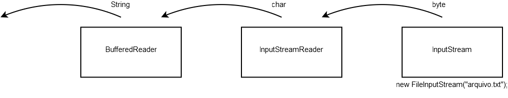
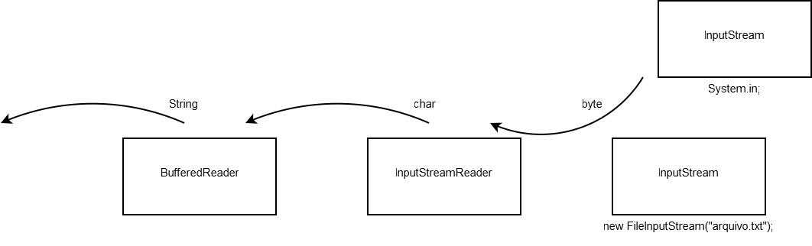
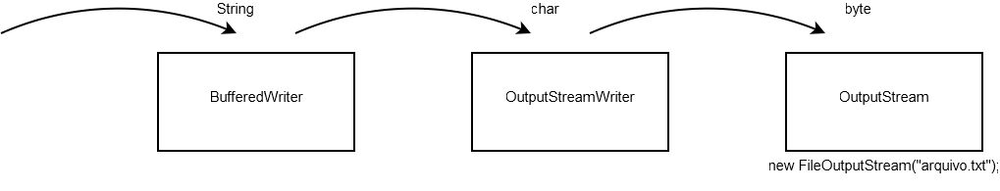

# Pacote java.io
_"A benevolência é sobretudo um vício do orgulho, e não uma virtude da alma."
-- Doantien Alphonse François (Marquês de Sade)_

Ao final deste capítulo, você será capaz de:

* Usar as classes wrappers (como `Integer`) e boxing;
* Ler e escrever bytes, caracteres e Strings de/para a entrada e saída padrão;
* Ler e escrever bytes, caracteres e Strings de/para arquivos;
* Utilizar buffers para agilizar a leitura e escrita por meio de fluxos;
* Usar Scanner e PrintStream.


## Conhecendo uma API
Conheceremos as APIs do Java. O `java.io` e `java.util` têm as classes que
você mais comumente usará, não importando se seu aplicativo é desktop, web, ou mesmo para
celulares.

Apesar de ser importante conhecer nomes e métodos das classes mais utilizadas, o interessante aqui é
você enxergar que todos os conceitos previamente estudados são aplicados a toda hora nas classes
da biblioteca padrão.

Não se preocupe em decorar nomes. Atenha-se em entender como essas classes estão relacionadas e
como elas estão tirando proveito do uso de interfaces, polimorfismo, classes abstratas e
encapsulamento. Lembre-se de estar com a documentação (Javadoc) aberta durante o contato com esses
pacotes.

Veremos também Threads e sockets, em capítulos posteriores, que ajudarão a condensar nosso
conhecimento, tendo em vista que, no exercício de sockets, utilizaremos todos conceitos aprendidos
juntamente com as várias APIs.

## Orientação a objetos no java.io


Assim como todo o resto das bibliotecas em Java, a parte de controle de entrada e saída de dados
(conhecido como **io**) é orientada a objetos e usa os principais conceitos mostrados até agora:
interfaces, classes abstratas e polimorfismo.


A ideia atrás do polimorfismo no pacote `java.io` é de utilizar fluxos de entrada (`InputStream`)
e saída (`OutputStream`) para toda e qualquer operação, seja ela relativa a um **arquivo**, seja relativa a um campo
**blob** do banco de dados, a
uma conexão remota via **sockets**, ou até mesmo à **entrada** e **saída padrão** de um programa
(normalmente o teclado e o console).

As classes abstratas `InputStream` e `OutputStream` definem, respectivamente, o comportamento
padrão dos fluxos em Java: em um fluxo de entrada, é possível ler bytes e, no fluxo de saída,
escrever bytes.

A grande vantagem dessa abstração pode ser mostrada em um método qualquer que utiliza um
`OutputStream` recebido como argumento com o objetivo de escrever em um fluxo de saída. A qual lugar o método está
escrevendo? Não se sabe e não importa: quando o sistema precisar escrever em um arquivo ou em uma
socket, basta chamar o mesmo método, uma vez que ele aceita qualquer filha de `OutputStream`!

## InputStream, InputStreamReader e BufferedReader


Com o escopo de ler um `byte` de um arquivo, usaremos o leitor de arquivo `FileInputStream`.
Para um `FileInputStream` conseguir ler um byte, ele precisa saber de qual lugar ele deverá ler.
Essa informação é tão importante que quem escreveu essa classe obriga você a passar o nome
do arquivo pelo construtor: sem isso, o objeto não pode ser construído.

``` java
	class TestaEntrada {
		public static void main(String[] args) throws IOException {
			InputStream is = new FileInputStream("arquivo.txt");
			int b = is.read();
		}
	}
```


A classe `InputStream` é abstrata, e `FileInputStream`, uma de suas filhas concretas.
`FileInputStream` procurará o arquivo no diretório em que a JVM fora invocada
(no caso do Eclipse, será a partir de dentro do diretório do projeto). Alternativamente,
você pode usar um caminho absoluto.

Quando trabalhamos com `java.io`, diversos métodos lançam `IOException`, que é uma exception do
tipo checked - o que nos obriga a tratá-la ou declará-la. Nos exemplos aqui, estamos declarando `IOException`
por meio da cláusula `throws` do `main` apenas para facilitar o exemplo. Caso a exception ocorra, a JVM
irá parar, mostrando a stacktrace. Essa não é uma boa prática em uma aplicação real: trate suas exceptions
a fim de sua aplicação poder abortar elegantemente.

`InputStream` tem diversas outras filhas, como `ObjectInputStream`, `AudioInputStream`,
`ByteArrayInputStream`, entre outras.


Para recuperar um caractere, precisamos traduzir os bytes com o encoding dado ao respectivo
código unicode, isso pode usar um ou mais bytes. Escrever esse decodificador é muito complicado, quem faz
isso por você é a classe `InputStreamReader`.

``` java
	class TestaEntrada {
		public static void main(String[] args) throws IOException {
			InputStream is = new FileInputStream("arquivo.txt");
			InputStreamReader isr = new InputStreamReader(is);
			int c = isr.read();
		}
	}
```


O construtor de `InputStreamReader` pode receber o encoding a ser utilizado como parâmetro, se
desejado, tal como `UTF-8` ou `ISO-8859-1`.

> **Encodings**
>
> Devido à grande quantidade de aplicativos internacionalizados de hoje em dia, é imprescindível
> que um bom programador entenda bem o que são os character encodings e o Unicode. O blog
> da Caelum tem um bom artigo a respeito disso:
>
> http://blog.caelum.com.br/2006/10/22/entendendo-unicode-e-os-character-encodings/


`InputStreamReader` é filha da classe abstrata `Reader`, que tem diversas outras filhas - são classes
que manipulam chars.

Apesar de a classe abstrata `Reader` já ajudar no trabalho de manipulação de caracteres, ainda seria difícil pegar
uma `String`. A classe `BufferedReader` é um `Reader` que recebe outro `Reader` pelo construtor e
concatena os diversos chars para formar uma `String` por intermédio do método `readLine`:

``` java
	class TestaEntrada {
		public static void main(String[] args) throws IOException {
			InputStream is = new FileInputStream("arquivo.txt");
			InputStreamReader isr = new InputStreamReader(is);
			BufferedReader br = new BufferedReader(isr);
			String s = br.readLine();
		}
	}
```

Como o próprio nome diz, essa classe lê do `Reader` por pedaços (usando o buffer) para evitar realizar
muitas chamadas ao sistema operacional. Você pode até configurar o tamanho do buffer pelo construtor.

É essa a composição de classes que está acontecendo:




Esse padrão de composição é bastante utilizado e conhecido. É o **Decorator Pattern**.

Aqui, lemos apenas a primeira linha do arquivo. O método `readLine` devolve a linha que foi lida e
muda o cursor para a próxima linha. Caso ele chegue ao fim do `Reader` (no nosso caso, final do
arquivo), ele vai devolver `null`. Então, com um simples laço, podemos ler o arquivo por inteiro:

``` java
	class TestaEntrada {
		public static void main(String[] args) throws IOException {
			InputStream is = new FileInputStream("arquivo.txt");
			InputStreamReader isr = new InputStreamReader(is);
			BufferedReader br = new BufferedReader(isr);

			String s = br.readLine(); // primeira linha
			
			while (s != null) {
				System.out.println(s);
				s = br.readLine();
			}
			
			br.close();
		}
	}
```

## Lendo Strings do teclado
Com um passe de mágica, passamos a ler do teclado em vez de um arquivo, utilizando o `System.in`,
que é uma referência a um `InputStream`, o qual, por sua vez, lê da entrada padrão.


``` java
	class TestaEntrada {
		public static void main(String[] args) throws IOException {
			InputStream is = System.in;
			InputStreamReader isr = new InputStreamReader(is);
			BufferedReader br = new BufferedReader(isr);
			String s = br.readLine();
			
			while (s != null) {
				System.out.println(s);
				s = br.readLine();
			}
		}
	}
```


Somente modificamos a quem a variável `is` está se referindo. Podemos receber argumentos do tipo
`InputStream` e ter esse tipo de abstração: não importa exatamente de qual lugar estamos lendo esse
punhado de bytes, desde que recebamos a informação a qual estamos querendo. Como na figura:



Repare que a ponta da direita poderia ser qualquer `InputStream`, seja `ObjectInputStream`, seja
`AudioInputStream`, `ByteArrayInputStream`, ou a nossa `FileInputStream`. Polimorfismo! Ou
você mesmo pode criar uma filha de `InputStream` se desejar.

Por esse motivo, é muito comum métodos receberem e retornarem `InputStream` em vez de suas filhas
específicas. Com isso, elas desacoplam as informações e escondem a implementação, facilitando a
mudança e manutenção do código. Note: tudo isso vai ao encontro de tudo o que aprendemos durante os
capítulos que apresentaram as classes abstratas, as interfaces, o polimorfismo e o encapsulamento.

## A analogia para a escrita: OutputStream

Como você pode imaginar, escrever em um arquivo é o mesmo processo:




``` java
	class TestaSaida {
		public static void main(String[] args) throws IOException {
			OutputStream os = new FileOutputStream("saida.txt");
			OutputStreamWriter osw = new OutputStreamWriter(os);
			BufferedWriter bw = new BufferedWriter(osw);
	
			bw.write("caelum");
			
			bw.close();
		}
	}
```

Lembre-se de dar _refresh_ (clique com o botão direito no nome do projeto, refresh) no seu projeto do Eclipse para que o arquivo criado apareça. O
`FileOutputStream` pode receber um booleano como segundo parâmetro a fim de indicar se você quer
reescrever o arquivo ou manter o que já estava escrito (`append`).

O método `write` do `BufferedWriter` não insere o(s) caractere(s) de quebra de linha. Para isso,
você pode chamar o método `newLine`.

> **Fechando o arquivo com o finally e o try-with-resources**
>
> É importante sempre fechar o arquivo. Você pode fazê-lo chamando diretamente o método `close`
> do `FileInputStream`/`OutputStream`, ou ainda chamando o `close` do `BufferedReader`/`Writer`.
> Nesse último caso, o `close` será cascateado para os objetos os quais o `BufferedReader`/`Writer`
> utiliza a fim de realizar a leitura/escrita, além de ele fazer o **flush** dos buffers no caso da escrita.
>
> É comum e fundamental que o `close` esteja dentro de um bloco
> `finally`. Se um arquivo for esquecido aberto, e a referência a ele for perdida, pode ser que
> ele seja fechado
> pelo _garbage collector_ (que veremos mais à frente) por causa do `finalize`. Mas não é bom você
> se prender a isso. Se esquecer de fechar o arquivo, no caso de um programa minúsculo como esse,
> o programa terminará antes que o tal do garbage collector o ajude, resultando em um arquivo não
> escrito (os bytes ficaram no buffer do `BufferedWriter`). Problemas similares podem acontecer com
> leitores que não forem fechados.
>
> No Java 7, há a estrutura _try-with-resources_, que já fará o `finally` cuidar dos recursos
> declarados dentro do `try()`, invocando `close`. Para isso, os recursos devem implementar a
> interface `java.lang.AutoCloseable`, que é o caso dos Readers, Writers e Streams estudados aqui:
>
> ``` java
> try (BufferedReader br = new BufferedReader(new File("arquivo.txt"))) {
>   // com exceção ou não, o close() do br será invocado
> }
> ```


## Uma maneira mais fácil: Scanner e PrintStream

A partir do Java 5, temos a classe `java.util.Scanner`, que facilita bastante o trabalho de ler de um
`InputStream`. Além disso, a classe `PrintStream` tem um construtor o qual já recebe o
nome de um arquivo como argumento. Dessa forma, a leitura do teclado com saída para um arquivo ficou
muito simples:

``` java
		Scanner s = new Scanner(System.in);
		PrintStream ps = new PrintStream("arquivo.txt");
		while (s.hasNextLine()) {
			ps.println(s.nextLine());
		}
```

Nenhum dos métodos lança `IOException`: `PrintStream` lança `FileNotFoundException` se você
o construir passando uma `String`. Essa exceção é filha de `IOException` e indica que o arquivo
não foi encontrado. O `Scanner` considerará que chegou ao fim se uma `IOException` for lançada,
mas o `PrintStream` simplesmente engole exceptions desse tipo. Ambos têm métodos para você
verificar se algum problema ocorreu.

A classe `Scanner` é do pacote `java.util`. Ela tem métodos muito úteis a fim de trabalhar com
Strings, em especial, diversos métodos já preparados para pegar números e palavras antes formatadas
por meio de expressões regulares. Fica fácil parsear um arquivo com qualquer formato dado.

> **System.out**
>
> Como vimos no capítulo passado, o atributo `out` da classe
> `System` é do tipo `PrintStream` (é, portanto, um `OutputStream`).
>


> **EOF**
>
> Quando rodar sua aplicação, para encerrar a entrada de dados do teclado, é
> necessário enviarmos um sinal de fim de stream. É o famoso **EOF**, isto é,
> _end of file_.
>
> No Linux/Mac/Solaris/Unix, você o faz com o `ctrl + D`. No Windows, use
> o `ctrl + Z`.


## Um pouco mais...

* Existem duas classes chamadas `java.io.FileReader` e `java.io.FileWriter`. Elas são atalhos
para a leitura e escrita de arquivos.

* O `do { .. } while(condicao);` é uma alternativa para se construir um laço. Pesquise-o e utilize-o
no código a fim de ler um arquivo, ele ficará mais sucinto (você não precisará ler a primeira linha fora
do laço).


## Integer e classes wrappers (box)

Anteriormente, vimos que conseguimos ler e escrever dados em um arquivo no Java utilizando a classe `Scanner`. Por padrão, quando fazemos essas operações, estamos trabalhando sempre com os dados em forma de `String`. Mas e se precisássemos ler ou escrever números inteiros em um arquivo? Como faríamos para transformar esses números em `String`, e vice-versa?

Cuidado! Usamos aqui o termo transformar, porém o que ocorre não é uma transformação entre os tipos, e sim uma forma de conseguirmos um `String` dado um `int`, e vice-versa. O jeito mais simples de transformar um número em `String` é concatená-lo da seguinte maneira:

``` java
	int i = 100;
	String s = "" + i;
	System.out.println(s);

	double d = 1.2;
	String s2 = "" + d;
	System.out.println(s2);
```

 

Para formatar o número de uma maneira diferente, com vírgula e número de casas decimais, devemos
utilizar outras classes de ajuda (`NumberFormat`, `Formatter`).

A fim de transformar uma `String` em número, utilizamos as classes de ajuda para os tipos primitivos
correspondentes. Por exemplo, com o intuito de transformar a `String s` em um número inteiro, utilizamos o
método estático da classe `Integer`:

``` java
	String s = "101";
	int i = Integer.parseInt(s);
```

As classes `Double`, `Short`, `Long`, `Float`, etc. contêm o mesmo tipo de método, como
`parseDouble` e `parseFloat`, que retornam um `double` e `float` respectivamente.


Essas classes também são muito utilizadas para fazer o **wrapping** (embrulho) de tipos primitivos
como objetos, pois referências e tipos primitivos são incompatíveis. Imagine que precisemos passar
como argumento um inteiro para o nosso guardador de objetos. Um inteiro não é um `Object`, como o
faríamos?

``` java
	int i = 5;
	Integer x = new Integer(i);
	guardador.adiciona(x);
```

E, dado um `Integer`, poderíamos pegar o `int` que está dentro dele (desembrulhá-lo):

``` java
	int i = 5;
	Integer x = new Integer(i);
	int numeroDeVolta = x.intValue();
```

## Autoboxing no Java 5.0

Esse processo de wrapping e unwrapping é entediante. Do Java 5.0 em diante, há um recurso chamado de
**autoboxing**, que faz isso sozinho para você, custando legibilidade:

``` java
	Integer x = 5;
	int y = x;
```

No Java 1.4, esse código é inválido. No Java 5.0 em diante, ele compila perfeitamente. É importante ressaltar: isso não quer dizer que tipos primitivos e referências sejam do mesmo tipo, isso é
simplesmente um açúcar sintático (_syntax sugar_) para facilitar a codificação.

Você pode fazer todos os tipos de operações matemáticas com os wrappers, porém corre o risco
de tomar um `NullPointerException`.

Você pode fazer o autoboxing diretamente para `Object` também, possibilitando passar um tipo
primitivo a um método que receber `Object` como argumento:

``` java
	Object o = 5;
```


## Para saber mais: java.lang.Math

Na classe `Math`, existe uma série de métodos estáticos que fazem operações com números, por
exemplo, arredondar(`round`), tirar o valor absoluto (`abs`), tirar a raiz(`sqrt`), calcular o
seno(`sin`) e outros.

``` java
	double d = 4.6;
	long i = Math.round(d);

	int x = -4;
	int y = Math.abs(x);
```

Consulte a documentação para ver a grande quantidade de métodos diferentes.

No Java 5.0, podemos tirar proveito do `import static` aqui:
``` java
	import static java.lang.Math.*;
```

Isso elimina a necessidade de usar o nome da classe sob o custo de legibilidade:
``` java
	double d = 4.6;
	long i = round(d);
	int x = -4;
	int y = abs(x);
```

## Exercícios: Java I/O

Salvaremos as contas cadastradas em um arquivo para não precisar ficar adicionando-as
a todo momento.
1. Na classe `ManipuladorDeContas`, crie o método `salvaDados` que recebe um
	`Evento` do qual obteremos a lista de contas.

	**Dica**: a classe `Evento` tem o método `getLista("listaContas")`, que irá ajudá-lo nesse item.

1. Para não colocarmos todo o código de gerenciamento de arquivos dentro da classe
	`ManipuladorDeContas`, criaremos uma nova classe cuja responsabilidade será lidar
	com a escrita/leitura de arquivos. 
	
	Crie a classe `RepositorioDeContas` dentro do
	pacote `br.com.caelum.contas` e declare o método `salva`, que deverá
	receber a lista de contas a serem guardadas. Nesse método, você deve percorrer a lista
	de contas e salvá-las, separando as informações de `tipo`, `numero`, `agencia`,
	`titular` e `saldo` com vírgulas.
	
	**Dica**: você precisará da classe java.io.PrintStream para fazer esse item.

	O compilador reclamará que você não está tratando algumas exceções (como
	`java.io.FileNotFoundException`). Utilize o devido `try`/`catch` e relance a
	exceção como `RuntimeException`. Utilize o _quickfix_ do Eclipse para facilitar
	(**Ctrl + 1**).

	Vale lembrar que deixar todas as exceptions passarem despercebidas não é uma boa
	prática! Você pode usá-la aqui, pois estamos focando apenas no aprendizado da
	utilização do `java.io`.

	Quando trabalhamos com recursos os quais falam com a parte externa da nossa aplicação,
	é preciso que avisemos quando acabarmos de usá-los. Por isso, é
	**importantíssimo** lembrar de fechar os canais com o exterior que abrimos utilizando
	o método `close`!
1. Voltando à classe `ManipuladorDeContas`, completemos o método `salvaDados`
	para que utilize a nossa nova classe `RepositorioDeContas` criada:

	* No corpo do método, crie uma lista de contas e atribua a ela o retorno do método `getLista` da classe `Evento`:
	
	```Java
	List<Conta> contas = evento.getLista("listaContas");
	```

	**Dica**: aqui você precisará invocar o método `salva` da classe `RepositorioDeContas`.

	Rode sua aplicação, cadastre algumas contas e veja se aparece um arquivo chamado
	`contas.txt` dentro do diretório `src` de seu projeto. Talvez seja necessário dar
	um F5 nele para que o arquivo apareça.
1. (Opcional e difícil) Façamos com que, além de salvar os dados em um arquivo, nossa aplicação
	também consiga carregar as informações das contas com o intuito de já exibi-las na tela. Para o funcionamento da aplicação, é necessário que a nossa classe `ManipuladorDeContas` tenha um
	método chamado `carregaDados`, o qual devolva uma `List<Conta>`. Façamos o mesmo
	que anteriormente e encapsulemos a lógica de carregamento dentro da classe
	`RepositorioDeContas`:

	``` java
	public List<Conta> carregaDados() {
		RepositorioDeContas repositorio = new RepositorioDeContas();
		return repositorio.carrega();
	}
	```

	Faça o código referente ao método `carrega`, que devolve uma `List` dentro da classe
	`RepositorioDeContas` utilizando a classe `Scanner`. Para obter os valores de
	cada atributo, você pode utilizar o método `split` da `String`. Lembre-se de que os
	atributos das contas são carregados na seguinte ordem: `tipo`, `numero`,
	`agencia`, `titular` e `saldo`. Exemplo:

	``` java
	String linha = scanner.nextLine();
	String[] valores = linha.split(",");
	String tipo = valores[0];
	```

	Além disso, a conta deve ser instanciada de acordo com o conteúdo do `tipo` obtido. Também fique atento, pois os dados lidos virão sempre lidos em forma de `String`, e, para alguns atributos, será necessário transformar o dado nos tipos primitivos correspondentes. Por exemplo:

	``` java
	String numeroTexto = valores[1];
	int numero = Integer.parseInt(numeroTexto);
	```

	
1. (Opcional) A classe `Scanner` é muito poderosa! Consulte seu Javadoc
	para saber sobre o `delimiter` e os outros métodos `next`.
1. (Opcional) Crie uma classe `TestaInteger`, e façamos comparações com Integers dentro do
	`main`:

	``` java
	Integer x1 = new Integer(10);
	Integer x2 = new Integer(10);

	if (x1 == x2) {
		System.out.println("igual");
	} else {
		System.out.println("diferente");
	}
	```

	

	E se testarmos com o `equals`? O que podemos concluir?

	
1. (Opcional) Um `double` não está sendo suficiente para guardar a quantidade de casas
	necessárias em uma aplicação. Preciso guardar um número decimal muito grande.
	O que poderia usar?

	O `double` também tem problemas de precisão ao fazer contas por causa de
	arredondamentos da aritmética de ponto flutuante definido pela IEEE 754:

	http://en.wikipedia.org/wiki/IEEE_754

	Ele não deve ser usado se você precisa realmente de muita precisão (casos que
	envolvam dinheiro, por exemplo).

	**Consulte a documentação**, tente adivinhar onde você pode encontrar um tipo
	que o ajudaria a resolver esses casos e veja como é intuitivo. Qual é a
	classe que resolveria esses problemas?

	Lembre-se: no Java, há muito já pronto. Seja na biblioteca padrão, seja em
	bibliotecas _open source_, que você pode encontrar pela internet.

	


## Discussão em aula: Design Patterns e o Template Method

Aplicar bem os conceitos de orientação a objetos é sempre uma grande dúvida. Sempre queremos
encapsular direito, favorecer a flexibilidade, desacoplar classes, escrever código elegante
e de fácil manutenção. E ouvimos falar que a orientação a objetos ajuda em tudo isso.

Mas onde usar herança de forma saudável? Como usar interfaces? Em que o polimorfismo me ajuda?
Como encapsular direito? Classes abstratas são usadas em quais situações?

Muitos anos atrás, grandes nomes do mundo da orientação a objetos perceberam que
criar bons designs orientados a objetos era um enorme desafio para muitas pessoas. Perceberam
que vários problemas de OO apareciam recorrentemente em diversos projetos e as pessoas
já tinham certas soluções para esses problemas clássicos (nem sempre muito elegantes).

O que fizeram foi criar **soluções padrões para problemas comuns** na orientação a objetos
e chamaram isso de **Design Patterns**, ou Padrões de Projeto. O conceito vinha da arquitetura,
na qual era muito comum ter esse tipo de solução. E, em 1994, ganhou grande popularidade na
computação com o livro _Design Patterns: Elements of Reusable Object-Oriented Software_,
um catálogo com várias dessas soluções escrito por Erich Gamma, Ralph Johnson, Richard Helm e
John Vlissides (a Gangue dos Quatro, GoF).

_Design Patterns_ tornou-se referência absoluta no bom uso da orientação a objetos. Outros
padrões surgiram depois em outras literaturas igualmente consagradas. O conhecimento dessas
técnicas é imprescindível para o bom programador.

**Discuta com o instrutor como os Design Patterns ajudam a resolver problemas de modelagem em sistemas
orientados a objetos. Veja como os Padrões de Projetos são aplicados em muitos lugares do próprio Java.**

O instrutor comentará do `Template Method` e mostrará o código fonte do método read() da classe
`java.io.InputStream`:

``` java
   public int read(byte b[], int off, int len) throws IOException {
       if (b == null) {
          throw new NullPointerException();
       } else if (off < 0 || len < 0 || len > b.length - off) {
          throw new IndexOutOfBoundsException();
       } else if (len == 0) {
          return 0;
       }
 
       int c = read();
       if (c == -1) {
          return -1;
       }
    
       b[off] = (byte) c;
 
       int i = 1;
       try {
          for (; i < len ; i++) {
             c = read();
             if (c == -1) {
                break;
             }
             b[off + i] = (byte)c;
          }
       } catch (IOException ee) {
       }
       return i;
    }
```

**Discuta, em aula, como esse método aplica conceitos importantes da orientação a objetos e
promove flexibilidade e extensibilidade.**


