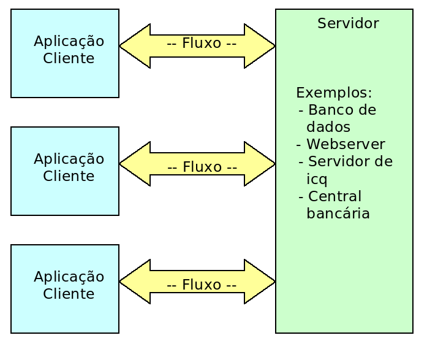
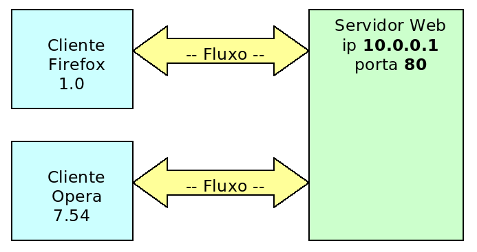
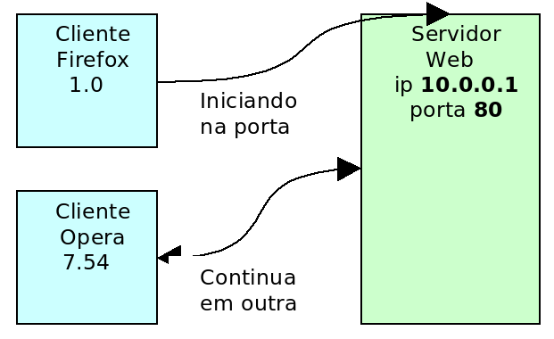
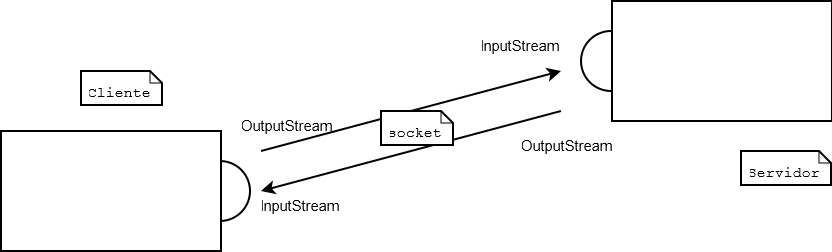

# Apêndice - Sockets
_"Olho por olho, e o mundo acabará cego."--Mohandas Gandhi_

Conectando-se a máquinas remotas.


## Motivação: uma API que usa os conceitos aprendidos

Neste capítulo, você vai conhecer a API de **Sockets** do java pelo pacote `java.net`.

Mais útil que conhecer a API, é você perceber que estamos usando, aqui, todos os conceitos e
bibliotecas aprendidas durante os outros capítulos. Repare, também, que é relativamente simples
aprender a utilizar uma API, agora que temos todos os conceitos necessários para tal.

Lembre-se de fazer esse apêndice com o javadoc aberto ao seu lado.

## Protocolo


Da necessidade de dois computadores se comunicarem, surgiram diversos protocolos que permitissem tal
troca de informação: o protocolo que vamos usar aqui é o **TCP** (_Transmission Control Protocol_).

Através do **TCP**, é possível criar um fluxo entre dois computadores - como é mostrado no diagrama
abaixo:



É possível conectar mais de um cliente ao mesmo servidor, como é o caso de diversos banco de dados,
servidores Web, etc.

Ao escrever um programa em Java que se comunique com outra aplicação, não é necessário se preocupar
com um nível tão baixo quanto o protocolo. As classes que trabalham com eles já foram
disponibilizadas para serem usadas por nós no pacote `java.net`.

A vantagem de se usar TCP, em vez de criar nosso próprio protocolo de bytes, é que o TCP vai garantir
a entrega dos pacotes que transferirmos e criar um protocolo base para isto é algo bem complicado.

## Porta

Acabamos de mencionar que diversos computadores podem se conectar a um só, mas, na realidade, é muito
comum encontrar máquinas clientes com uma só conexão física. Então, como é possível se conectar a
dois pontos? Como é possível ser conectado por diversos pontos?

Todas as aplicações que estão enviando e recebendo dados fazem isso através da mesma conexão física,
mas o computador consegue discernir, durante a chegada de novos dados, quais informações pertencem a
qual aplicação. Mas como?




Assim como existe o **IP** para identificar uma máquina, a **porta** é a solução para identificar
diversas aplicações em uma máquina. Esta porta é um número de 2 bytes, **varia de 0 a 65535**. Se
todas as portas de uma máquina estiverem ocupadas, não é possível se conectar a ela enquanto nenhuma
for liberada.

Ao configurar um servidor para rodar na porta 80 (padrão http), é possível se conectar a esse
servidor através dessa porta que, junto com o ip, vai formar o endereço da aplicação. Por exemplo, o
servidor web da _caelum.com.br_ pode ser representado por: _caelum.com.br:80_

## Socket
Mas se um cliente se conecta a um programa rodando na porta 80 de um servidor, enquanto ele não se
desconectar dessa porta, será impossível que outra pessoa se conecte?

Acontece que, ao efetuar e aceitar a conexão, o servidor redireciona o cliente de uma porta para
outra, liberando novamente sua porta inicial e permitindo que outros clientes se conectem novamente.



Em Java, isso deve ser feito através de threads e o processo de aceitar a conexão deve ser rodado o
mais rápido possível.

## Servidor

Iniciando um modelo de servidor de chat, o serviço do computador que funciona como base deve,
primeiro, abrir uma porta e ficar ouvindo até alguém tentar se conectar.

``` java
import java.net.*;

public class Servidor {
	public static void main(String[] args) throws IOException {

		ServerSocket servidor = new ServerSocket(12345);
		System.out.println("Porta 12345 aberta!");
	    // a continuação do servidor deve ser escrita aqui

	}
}
```

Se o objeto for realmente criado, significa que a porta 12345 estava fechada e foi aberta. Se outro
programa possui o controle desta porta neste instante, é normal que o nosso exemplo não funcione,
pois ele não consegue utilizar uma porta que já está em uso.


Após abrir a porta, precisamos esperar por um cliente através do método `accept` da
`ServerSocket`. Assim que um cliente se conectar, o programa continuará, por isso dizemos que esse método é
_blocante_, segura a thread até que algo o notifique.

``` java
Socket cliente = servidor.accept();
System.out.println("Nova conexão com o cliente " + 
	cliente.getInetAddress().getHostAddress()
); // imprime o ip do cliente
```

Por fim, basta ler todas as informações que o cliente nos enviar:

``` java
Scanner scanner = new Scanner(cliente.getInputStream());

while (scanner.hasNextLine()) {
	System.out.println(scanner.nextLine());
}
```

Fechamos as conexões, começando pelo fluxo:

``` java
in.close();
cliente.close();
servidor.close();
```

O resultado é a classe a seguir:

``` java
public class Servidor {
	public static void main(String[] args) throws IOException {
		ServerSocket servidor = new ServerSocket(12345);
		System.out.println("Porta 12345 aberta!");
		
		Socket cliente = servidor.accept();
		System.out.println("Nova conexão com o cliente " + 	
			cliente.getInetAddress().getHostAddress()
		);
		
		Scanner s = new Scanner(cliente.getInputStream());
		while (s.hasNextLine()) {
			System.out.println(s.nextLine());
		}
		
		s.close();
		servidor.close();
		cliente.close();
	}
}
```

## Cliente

A nossa tarefa é criar um programa cliente que envie mensagens para o servidor... o cliente é
ainda mais simples do que o servidor.

O código a seguir é a parte principal e tenta se conectar a um servidor no IP 127.0.0.1 (máquina
local) e porta 12345:

``` java
	Socket cliente = new Socket("127.0.0.1",12345);
	System.out.println("O cliente se conectou ao servidor!");			
```

Queremos ler os dados do cliente, da entrada padrão (teclado):

``` java
	Scanner teclado = new Scanner(System.in);
	while (teclado.hasNextLine()) {
		// lê a linha e faz algo com ela
	}
```


Basta ler as linhas que o usuário digitar através do buffer de entrada (`in`), e jogá-las no
buffer de saída:

``` java
PrintStream saida = new PrintStream(cliente.getOutputStream());
Scanner teclado = new Scanner(System.in);
while (teclado.hasNextLine()) {
	saida.println(teclado.nextLine());
}
saida.close();
teclado.close();
```

Repare que usamos os conceito de `java.io` aqui novamente, para leitura do teclado e envio
de mensagens para o servidor. Para as classes `Scanner` e `PrintStream`, tanto faz de onde
que se lê ou escreve os dados: o importante é que esse stream seja um `InputStream` / `OutputStream`.
É o poder das interfaces, do polimorfismo, aparecendo novamente.

Nosso programa final:

``` java
public class Cliente {
	public static void main(String[] args) 
					throws UnknownHostException, IOException {
		Socket cliente = new Socket("127.0.0.1", 12345);
		System.out.println("O cliente se conectou ao servidor!");
		
		Scanner teclado = new Scanner(System.in);
		PrintStream saida = new PrintStream(cliente.getOutputStream());
		
		while (teclado.hasNextLine()) {
			saida.println(teclado.nextLine());
		}
		
		saida.close();
		teclado.close();
		cliente.close();
	}
}
```


Para testar o sistema, precisamos rodar primeiro o servidor e, logo depois, o cliente. Tudo o que for
digitado no cliente será enviado para o servidor.


> **Multithreading**
>
> Para que o servidor seja capaz de trabalhar com dois clientes ao mesmo tempo é necessário criar uma
> thread logo após executar o método `accept`.
>
> A thread criada será responsável pelo tratamento dessa conexão, enquanto o laço do servidor
> disponibilizará a porta para uma nova conexão:
>
> ``` java
> while (true) {
>
> 	Socket cliente = servidor.accept();
>
> 	// cria um objeto que vai tratar a conexão
> 	TratamentoClass tratamento = new TratamentoClass(cliente);
>
> 	// cria a thread em cima deste objeto
> 	Thread t = new Thread(tratamento);
>
> 	// inicia a thread
> 	t.start();
>
> }
> ```
>


## Imagem geral



A socket do cliente tem um `InputStream`, que recebe do `OutputStream` do servidor, e tem um
`OutputStream`, que transfere tudo para o `InputStream` do servidor. Muito parecido com um
telefone!

Repare que cliente e servidor são rótulos que indicam um estado. Um micro (ou melhor, uma JVM) pode
ser servidor num caso, mas pode ser cliente em outro caso.

## Exercícios: Sockets
1. Crie um projeto `sockets`.

	Vamos fazer um pequeno sistema em que tudo que é digitado no micro cliente
	acaba aparecendo no micro servidor. Isto é, apenas uma comunicação unidirecional.

	Crie a classe `Servidor` como vimos nesse capítulo. Abuse dos recursos do Eclipse
	para não ter de escrever muito!

	``` java
		package br.com.caelum.chat;

		import java.io.IOException;
		import java.net.ServerSocket;
		import java.net.Socket;
		import java.util.Scanner;

		public class Servidor {
			public static void main(String[] args) throws IOException {
				ServerSocket servidor = new ServerSocket(12345);
				System.out.println("Porta 12345 aberta!");

				Socket cliente = servidor.accept();
				System.out.println("Nova conexão com o cliente " + 	
					cliente.getInetAddress().getHostAddress());

				Scanner entrada = new Scanner(cliente.getInputStream());
				while (entrada.hasNextLine()) {
					System.out.println(entrada.nextLine());
				}

				entrada.close();
				servidor.close();
			}
		}
	```
1. Crie a classe `Cliente` como vista anteriormente:

	``` java
		package br.com.caelum.chat;

		import java.io.IOException;
		import java.io.PrintStream;
		import java.net.Socket;
		import java.net.UnknownHostException;
		import java.util.Scanner;

		public class Cliente {
			public static void main(String[] args) 
							throws UnknownHostException, IOException {
				Socket cliente = new Socket("127.0.0.1", 12345);
				System.out.println("O cliente se conectou ao servidor!");

				Scanner teclado = new Scanner(System.in);
				PrintStream saida = new PrintStream(cliente.getOutputStream());

				while (teclado.hasNextLine()) {
					saida.println(teclado.nextLine());
				}

				saida.close();
				teclado.close();
			}
		}
	```

	Utilize dos quick fixes e control espaço para os `import`s e o `throws`.
1. 
	Rode a classe `Servidor`: repare no console do Eclipse que o programa fica esperando.
	Rode a classe `Cliente`: a conexão deve ser feita e o Eclipse deve mostrar os dois
	consoles para você (existe um pequeno ícone na view de Console para você
	alternar entre eles).

	Digite mensagens no cliente e veja se elas aparecem corretamente no servidor.

	
	
1. Teste seu programa com um colega do curso, usando comunicação remota entre as duas máquinas.
	Combinem entre si quem vai rodar o cliente e quem vai rodar o servidor. Quem for rodar o cliente
	deve editar o IP na classe para indicar o endereço da outra máquina (verifique também se estão
	acessando a mesma porta).

	> **Descobrindo o ip da máquina**
	>
	> No Windows, abra o console e digite _ipconfig_ para saber qual é o seu IP. No Linux (ou no BSD, Mac, Solaris),
	> vá no console e digite _ifconfig_.

	
1. (opcional) E se você quisesse, em vez de enviar tudo o que o cliente digitou,
	transferir um arquivo texto do micro do cliente para servidor? Seria difícil?

	Abuse do polimorfismo! Faça o cliente ler de um arquivo chamado `arquivo.txt` (crie-o!)
	e faça com que o servidor grave tudo que recebe num arquivo que chama `recebido.txt`.

	


## Desafio: Múltiplos Clientes
Quando o servidor aceita um cliente com a chamada ao `accept`, ele poderia chamar novamente este método
para aceitar um novo cliente. E, se queremos aceitar vários clientes, simultâneos, basta chamar o `accept`
várias vezes e tratar cada cliente em sua própria `Thread` (senão o método `accept`
não será invocado novamente!).

Um esboço de solução para a classe `Servidor`:

``` java
	ServerSocket servidor = new ServerSocket(12345);
	
	// servidor fica eternamente aceitando clientes...
	while (true) {
		Socket cliente = servidor.accept();
		// dispara uma Thread que trata esse cliente e já espera o próximo
	}
```

[TODO: seria legal essa solução parcial para apenas essa parte!]

## Desafio: broadcast das mensagens
Agora que vários clientes podem mandar mensagens, gostaríamos que os clientes recebessem
as mensagens enviadas pelas outras pessoas. Ao invés do servidor simplesmente escrever as
mensagens no console, ele deve mandar cada mensagem para todos os clientes conectados.

Precisamos manter uma lista de clientes conectados e, quando chegar uma mensagem (de qualquer
cliente), percorremos essa lista e mandamos para todos.

Use um `List` para guardar os `PrintStream`s dos clientes. Logo depois que o servidor
aceitar um cliente novo, crie um `PrintStream` usando o `OutputStream` dele e adicione na lista.
E, quando receber uma mensagem nova, envia para todos na lista.

Um esboço:

Adicionando na lista:
``` java
	while (true) {
		Socket cliente = servidor.accept();
		this.lista.add(new PrintStream(cliente.getOutputStream()));
		
		// dispara uma Thread que trata esse cliente e já espera o próximo
	}
```

Método que distribui as mensagens:

``` java
	void distribuiMensagem(String msg) {
		for (PrintStream cliente : lista) {
			cliente.println(msg);
		}
	}
```

Mas nosso cliente também recebe mensagens. Então precisamos fazer com que o Cliente,
além de ler mensagens do teclado e enviar para o servidor, simultaneamente também possa
receber mensagens de outros clientes enviadas pelo servidor.

Ou seja, precisamos de uma segunda Thread na classe `Cliente` que fica recebendo mensagens do
`InputStream` do servidor e imprimindo no console.

Um esboço:

``` java
	Scanner servidor = new Scanner(cliente.getInputStream());
	while (servidor.hasNextLine()) {
		System.out.println(servidor.nextLine());
	}	
```

Lembre que você precisará de no mínimo 2 threads para o cliente e 2 para o servidor. Então provavelmente
você vai ter que escrever 4 classes.

Melhorias possíveis:


* Faça com o a primeira linha enviada pelo cliente seja sempre o nick dele. E quando o servidor
enviar a mensagem, faça ele enviar o nick de cada cliente antes da mensagem.

* E quando um cliente desconectar? Como retirá-lo da lista?

* É difícil fazer o envio de arquivos pelo nosso sistema de chats? Sabendo que a leitura de um arquivo
é feita pelo `FileInputStream`, seria difícil mandar esse `InputStream` pelo `OutputStream` da conexão de rede?


## Solução do sistema de chat

Uma solução para o sistema de chat cliente-servidor com múltiplos clientes proposto nos desafios acima.
Repare que a solução não está nem um pouco elegante: o `main` já faz tudo, além de não tratarmos as
exceptions. O código visa apenas mostrar o uso de uma API. É uma péssima prática colocar toda a
funcionalidade do seu programa no `main` e também de jogar exceções para trás.

Nesta listagem, faltam os devidos **imports**.

Primeiro, as duas classes para o cliente. Repare que a única mudança grande é a classe nova, Recebedor:

``` java
public class Cliente {
	public static void main(String[] args) 
				throws UnknownHostException, IOException {
		// dispara cliente
		new Cliente("127.0.0.1", 12345).executa();
	}
	
	private String host;
	private int porta;
	
	public Cliente (String host, int porta) {
		this.host = host;
		this.porta = porta;
	}
	
	public void executa() throws UnknownHostException, IOException {
		Socket cliente = new Socket(this.host, this.porta);
		System.out.println("O cliente se conectou ao servidor!");

		// thread para receber mensagens do servidor
		Recebedor r = new Recebedor(cliente.getInputStream());
		new Thread(r).start();
		
		// lê msgs do teclado e manda pro servidor
		Scanner teclado = new Scanner(System.in);
		PrintStream saida = new PrintStream(cliente.getOutputStream());
		while (teclado.hasNextLine()) {
			saida.println(teclado.nextLine());
		}
		
		saida.close();
		teclado.close();
		cliente.close();		
	}
}
```
``` java
public class Recebedor implements Runnable {

	private InputStream servidor;

	public Recebedor(InputStream servidor) {
		this.servidor = servidor;
	}

	public void run() {
		// recebe msgs do servidor e imprime na tela
		Scanner s = new Scanner(this.servidor);
		while (s.hasNextLine()) {
			System.out.println(s.nextLine());
		}
	}
}
```

Já o Servidor sofreu bastante modificações. A classe `TrataCliente` é a responsável por cuidar de
cada cliente conectado no sistema:

``` java
public class Servidor {

	public static void main(String[] args) throws IOException {
		// inicia o servidor
		new Servidor(12345).executa();
	}
	
	private int porta;
	private List<PrintStream> clientes;
	
	public Servidor (int porta) {
		this.porta = porta;
		this.clientes = new ArrayList<PrintStream>();
	}
	
	public void executa () throws IOException {
		ServerSocket servidor = new ServerSocket(this.porta);
		System.out.println("Porta 12345 aberta!");
		
		while (true) {
			// aceita um cliente
			Socket cliente = servidor.accept();
			System.out.println("Nova conexão com o cliente " + 	
				cliente.getInetAddress().getHostAddress()
			);
			
			// adiciona saida do cliente à lista
			PrintStream ps = new PrintStream(cliente.getOutputStream());
			this.clientes.add(ps);
			
			// cria tratador de cliente numa nova thread
			TrataCliente tc = 
					new TrataCliente(cliente.getInputStream(), this);
			new Thread(tc).start();
		}

	}

	public void distribuiMensagem(String msg) {
		// envia msg para todo mundo
		for (PrintStream cliente : this.clientes) {
			cliente.println(msg);
		}
	}
}
```
``` java
public class TrataCliente implements Runnable {

	private InputStream cliente;
	private Servidor servidor;

	public TrataCliente(InputStream cliente, Servidor servidor) {
		this.cliente = cliente;
		this.servidor = servidor;
	}

	public void run() {
		// quando chegar uma msg, distribui pra todos
		Scanner s = new Scanner(this.cliente);
		while (s.hasNextLine()) {
			servidor.distribuiMensagem(s.nextLine());
		}
		s.close();
	}
}
```
