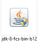
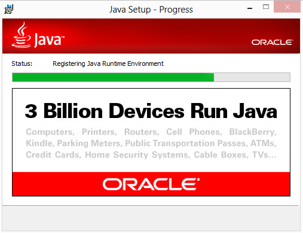
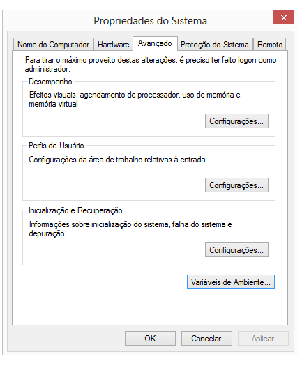
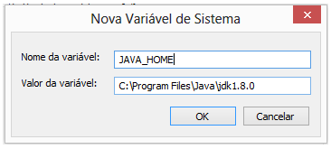
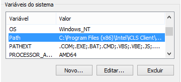
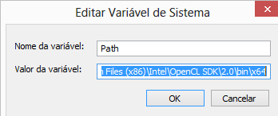
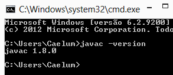

# Apêndice - Instalação do Java
_"Quem pouco pensa, engana-se muito." -- Leonardo da Vinci_

Como vimos antes, a VM é apenas uma especificação e devemos baixar uma implementação.
Há muitas empresas que implementam uma VM, como a própria Oracle, a IBM, a Apache e outros.

A da Oracle é a mais usada e possui versões para Windows, Linux e Solaris. Você pode
baixar o SDK acessando:

http://www.oracle.com/technetwork/java/

Nesta página da Oracle, você deve escolher o Java SE, dentro dos top downloads. Depois, escolha
o JDK e seu sistema operacional.

## Instalando no Ubuntu e em outros Linux
Cada distribuição Linux tem sua própria forma de instalação. Algumas já trazem o Java
junto, outras possibilitam que você instale pelos repositórios oficiais e em alguns
casos você precisa baixar direto da Oracle e configurar tudo manualmente.

No Ubuntu, a distribuição usada na Caelum, a instalação é bastante simples. Basta ir
no terminal e digitar:

```
sudo add-apt-repository ppa:webupd8team/java
sudo apt-get update
sudo apt-get install oracle-java8-installer
```

Caso prefira utilizar o openjdk, a distribuição opensource, basta fazer

```
sudo apt-get install openjdk-7-jdk
```

Por enquanto ele possui apenas a versão 7. No linux fedora, você faria com `su -c "yum install java-1.7.0-openjdk"`.

Se você já tiver outras versões instaladas no seu Ubuntu, pode utilizar
`sudo update-alternatives --config java ` para escolher entre elas.

Uma instalação mais braçal, sem usar repositório , pode ser feita baixando
o instalador no próprio site da Oracle. É um `tar.gz` que possui um `.bin` que
deve ser executado. Depois, é necessário apontar `JAVA_HOME` para esse diretório
e adicionar `JAVA_HOME/bin` no seu `PATH`.

## No Mac OS X
O Mac OS X já traz o Java instalado junto com o sistema operacional até a versão 10.6.
As versões mais novas, do Lion em diante, o instalador do Mac vai perguntar se você deseja baixá-lo
quando for rodar sua primeira aplicação Java, como o Eclipse.

A versão para o Java 8 pode ser baixada no mesmo site:

http://www.oracle.com/technetwork/java/


## Instalação do JDK em ambiente Windows
Para instalar o JDK no Windows, primeiro baixe-o no site da Oracle. É um simples
arquivo executável que contém o Wizard de instalação:

http://www.oracle.com/technetwork/java/


### Instalação

* Dê um clique duplo no arquivo `jdk-<versão>-windows-i586-p.exe` e espere até ele
entrar no wizard de instalação.



* Aceite os próximos dois passos clicando em _Next_.
Após um tempo, o instalador pedirá para escolher em que diretório instalar o SDK. Pode
ser onde ele já oferece como padrão. Anote qual foi o diretório escolhido, vamos utilizar
esse caminho mais adiante. A cópia de arquivos iniciará:



* O instalador instalará também o JavaFX 2. Após isso, você será direcionado à uma página
onde você pode, opcionalmente, criar uma conta na Oracle para registrar sua instalação.


### Configurando o ambiente
Precisamos configurar algumas variáveis de ambiente após a instalação, para que o compilador seja
acessível via linha de comando. Caso você vá utilizar diretamente o Eclipse, provavelmente não
será necessário realizar esses passos.


* Clique com o botão direito em cima do ícone _Computador_ e selecione a opção _Propriedades_.

* Escolha a aba "Configurações Avançadas de Sistema" e depois clique no botão "Variáveis de Ambiente"


* Nesta tela, você verá, na parte de cima, as variáveis de ambiente do usuário corrente e,
embaixo, as variáveis de ambiente do computador (servem para todos os usuários). Clique no botão
_Novo..._ da parte de baixo.

* Em _Nome da Variável_ digite `JAVA_HOME` e, em valor da variável, digite o caminho que você
utilizou na instalação do Java. Provavelmente será algo como: `C:\Program Files\Java\jdk1.8.0_03`:



Clique em _Ok_.

* Não vamos criar outra variável, mas sim _alterar_. Para isso, procure a variável PATH, ou
Path (dá no mesmo), e clique no botão de baixo "Editar".


* Não altere o nome da variável! Deixe como está e adicione no final do valor
`;%JAVA_HOME%\bin`, não esqueça do ponto-e-vírgula - assim, você está adicionando mais um
caminho à sua variável Path.


* Abra o prompt, indo em _Iniciar_, _Executar_ e digite `cmd`.

* No console, digite `javac -version`. O comando deve mostrar a versão do Java
Compiler e algumas opções.



Você pode seguir para a instalação do Eclipse, conforme visto no seu capítulo, ou utilizar um
editor de texto simples como o bloco de notas para os primeiros capítulos de apostila.

Qualquer dúvida, não hesite de postá-la no Grupo de Usuários Java:

http://www.guj.com.br.
